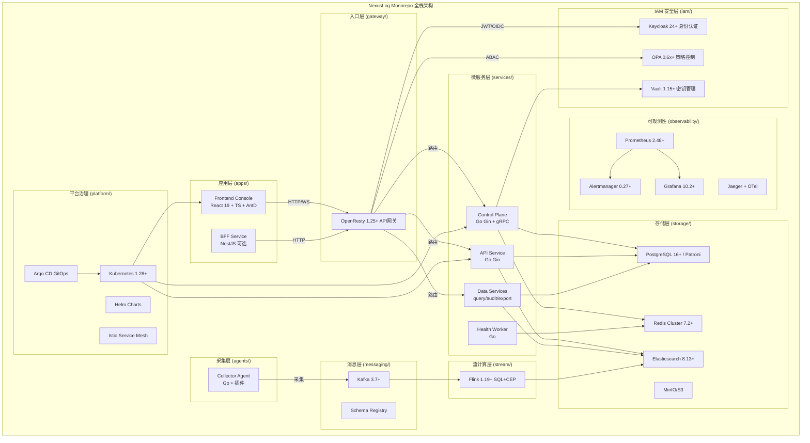

# 设计文档：NexusLog 前端迁移与 Monorepo 全栈项目搭建

## 概述

本设计描述将 `logscale-pro-recreated` 前端项目迁移到 `NexusLog` Monorepo 全栈项目的技术方案。核心工作包括：

1. 搭建 NexusLog 业务域+平台域分层的 Monorepo 目录结构
2. 前端技术栈替换：Tailwind CSS→Ant Design 5.x、Recharts→ECharts 5.x、Context API→Zustand 4.x（保持 React 19）
3. 迁移 15 个路由模块（50+ 页面）、通用组件、工具函数、Hooks 和类型系统
4. 搭建多个 Go 微服务骨架（control-plane、health-worker、data-services、api-service）
5. 搭建 API 网关、IAM、消息传输、存储、可观测性、平台治理等域的配置结构
6. 包管理工具使用 pnpm

迁移策略采用"自底向上"方式：先搭建基础设施（Monorepo 结构、配置、类型），再迁移底层模块（工具函数、状态管理、通用组件），最后迁移上层页面。

## 架构

### Monorepo 项目结构

```
NexusLog/
├── README.md
├── LICENSE
├── CHANGELOG.md
├── .gitignore
├── .editorconfig
├── Makefile                     # 统一构建/测试命令入口
├── go.work                      # Go 多模块工作区
├── package.json                 # pnpm workspace 配置
├── docs/                        # 项目文档
│   ├── architecture/            # 架构文档（系统上下文、逻辑架构、部署架构、数据流、安全架构）
│   ├── adr/                     # 架构决策记录
│   ├── runbooks/                # 运维手册
│   ├── oncall/
│   ├── security/
│   └── sla-slo/
├── configs/                     # 公共配置（环境隔离）
│   ├── common/
│   ├── dev/
│   ├── staging/
│   └── prod/
├── apps/                        # 应用层
│   ├── frontend-console/        # 前端控制台（React 19 + TS + AntD + ECharts + Zustand）
│   │   ├── src/
│   │   │   ├── components/      # 组件
│   │   │   │   ├── charts/      # ECharts 图表组件
│   │   │   │   ├── common/      # 通用组件（基于 Ant Design 封装）
│   │   │   │   ├── layout/      # 布局组件（Layout, Sidebar, Header）
│   │   │   │   └── auth/        # 认证组件
│   │   │   ├── pages/           # 页面（按模块分目录）
│   │   │   ├── stores/          # Zustand Store
│   │   │   ├── hooks/           # 自定义 Hooks
│   │   │   ├── services/        # API 服务层
│   │   │   ├── types/           # TypeScript 类型定义
│   │   │   ├── utils/           # 工具函数
│   │   │   ├── constants/       # 常量定义
│   │   │   ├── config/          # 运行时配置
│   │   │   ├── App.tsx
│   │   │   └── main.tsx
│   │   ├── public/
│   │   │   └── config/
│   │   │       └── app-config.json
│   │   ├── tests/
│   │   ├── index.html
│   │   ├── vite.config.ts
│   │   ├── tsconfig.json
│   │   ├── package.json
│   │   └── Dockerfile
│   └── bff-service/             # BFF 层（NestJS，可选）
│       ├── src/
│       ├── test/
│       ├── package.json
│       └── Dockerfile
├── gateway/                     # API 网关
│   └── openresty/
│       ├── nginx.conf
│       ├── conf.d/
│       ├── lua/
│       ├── tenants/
│       ├── policies/
│       ├── tests/
│       └── Dockerfile
├── iam/                         # 身份认证与授权
│   ├── keycloak/
│   │   ├── realms/
│   │   ├── clients/
│   │   ├── roles/
│   │   └── mappers/
│   ├── opa/
│   │   ├── policies/
│   │   ├── bundles/
│   │   └── tests/
│   └── vault/
│       ├── policies/
│       ├── auth/
│       └── engines/
├── services/                    # 微服务层
│   ├── control-plane/           # 控制面服务（Go Gin + gRPC）
│   │   ├── cmd/api/
│   │   ├── internal/
│   │   │   ├── app/
│   │   │   ├── domain/
│   │   │   ├── service/
│   │   │   ├── repository/
│   │   │   └── transport/
│   │   │       ├── http/
│   │   │       └── grpc/
│   │   ├── api/
│   │   │   ├── openapi/
│   │   │   └── proto/
│   │   ├── configs/
│   │   ├── tests/
│   │   └── Dockerfile
│   ├── health-worker/           # 健康检测服务
│   │   ├── cmd/worker/
│   │   ├── internal/
│   │   │   ├── checker/
│   │   │   ├── scheduler/
│   │   │   └── reporter/
│   │   ├── configs/
│   │   ├── tests/
│   │   └── Dockerfile
│   ├── data-services/           # 数据服务集合
│   │   ├── query-api/
│   │   ├── audit-api/
│   │   ├── export-api/
│   │   ├── shared/
│   │   └── Dockerfile
│   └── api-service/             # API 服务
│       ├── cmd/api/
│       ├── internal/
│       ├── api/openapi/
│       ├── configs/
│       └── Dockerfile
├── agents/                      # 采集代理
│   └── collector-agent/
│       ├── cmd/agent/
│       ├── internal/
│       │   ├── collector/
│       │   ├── pipeline/
│       │   ├── checkpoint/
│       │   └── retry/
│       ├── plugins/
│       │   ├── grpc/
│       │   └── wasm/
│       ├── configs/
│       ├── tests/
│       └── Dockerfile
├── stream/                      # 流计算
│   └── flink/
│       ├── jobs/
│       │   ├── sql/
│       │   └── cep/
│       ├── udf/
│       ├── libs/
│       ├── savepoints/
│       ├── configs/
│       └── tests/
├── messaging/                   # 消息传输
│   ├── kafka/
│   │   ├── topics/
│   │   ├── quotas/
│   │   └── broker-config/
│   ├── schema-registry/
│   │   ├── config/
│   │   └── compatibility-rules/
│   └── dlq-retry/
│       ├── retry-policies/
│       └── consumer-config/
├── contracts/                   # 契约定义
│   └── schema-contracts/
│       ├── avro/
│       ├── protobuf/
│       ├── jsonschema/
│       ├── compatibility/
│       └── tests/
├── storage/                     # 存储配置
│   ├── elasticsearch/
│   │   ├── index-templates/
│   │   ├── ilm-policies/
│   │   ├── ingest-pipelines/
│   │   └── snapshots/
│   ├── postgresql/
│   │   ├── migrations/
│   │   ├── seeds/
│   │   ├── rls-policies/
│   │   ├── patroni/
│   │   ├── etcd/
│   │   └── pgbouncer/
│   ├── redis/
│   │   ├── cluster-config/
│   │   └── lua-scripts/
│   ├── minio/
│   │   ├── buckets/
│   │   └── lifecycle/
│   └── glacier/
│       └── archive-policies/
├── observability/               # 可观测性
│   ├── prometheus/
│   │   ├── prometheus.yml
│   │   ├── rules/
│   │   └── targets/
│   ├── alertmanager/
│   │   ├── alertmanager.yml
│   │   └── templates/
│   ├── grafana/
│   │   ├── dashboards/
│   │   └── datasources/
│   ├── jaeger/
│   │   └── config/
│   ├── otel-collector/
│   │   └── config/
│   └── loki/
│       └── config/
├── ml/                          # 机器学习（可选）
│   ├── training/
│   ├── inference/
│   ├── models/
│   ├── mlflow/
│   └── nlp/
│       ├── prompts/
│       └── rules/
├── edge/                        # 边缘计算（可选）
│   ├── mqtt/
│   ├── sqlite/
│   └── boltdb/
├── platform/                    # 平台治理
│   ├── kubernetes/
│   │   ├── base/
│   │   ├── namespaces/
│   │   ├── rbac/
│   │   ├── network-policies/
│   │   └── storageclasses/
│   ├── helm/
│   │   ├── nexuslog-gateway/
│   │   ├── nexuslog-control-plane/
│   │   ├── nexuslog-data-plane/
│   │   ├── nexuslog-storage/
│   │   └── nexuslog-observability/
│   ├── gitops/
│   │   ├── argocd/
│   │   │   ├── projects/
│   │   │   └── applicationsets/
│   │   ├── apps/
│   │   │   ├── ingress-system/
│   │   │   ├── iam-system/
│   │   │   ├── control-plane/
│   │   │   ├── data-plane/
│   │   │   ├── storage-system/
│   │   │   └── observability/
│   │   └── clusters/
│   │       ├── dev/
│   │       ├── staging/
│   │       └── prod/
│   ├── ci/
│   │   ├── templates/
│   │   └── scripts/
│   ├── security/
│   │   ├── trivy/
│   │   ├── sast/
│   │   └── image-sign/
│   └── istio/
│       ├── gateways/
│       ├── virtualservices/
│       └── destinationrules/
├── infra/                       # 基础设施即代码
│   ├── terraform/
│   │   ├── modules/
│   │   └── envs/
│   │       ├── dev/
│   │       ├── staging/
│   │       └── prod/
│   └── ansible/
│       ├── inventories/
│       └── roles/
├── scripts/                     # 脚本工具
│   ├── bootstrap.sh
│   ├── lint.sh
│   ├── test.sh
│   ├── build.sh
│   ├── release.sh
│   └── rollback.sh
├── tests/                       # 集成/E2E/性能/混沌测试
│   ├── e2e/
│   ├── integration/
│   ├── performance/
│   └── chaos/
└── .github/
    └── workflows/               # CI/CD 流水线
```

### 目录设计原则

1. **敏感信息不入仓**：密钥、token、证书走 Vault/K8s Secret
2. **契约先行**：`contracts/schema-contracts` 变更必须 CI 校验兼容性
3. **平台与业务分离**：`platform/` 只放交付与治理，不放业务逻辑代码
4. **环境隔离一致**：dev/staging/prod 目录结构完全一致，减少发布偏差
5. **统一入口**：所有构建/测试命令尽量汇聚到根级 Makefile

### 架构图



## 组件与接口

### 1. Zustand Store 设计（替代 Context API）

源项目使用 6 个 Context Provider 嵌套管理全局状态，迁移到 Zustand 后每个 Store 独立，无需 Provider 嵌套。

#### useAuthStore

```typescript
// apps/frontend-console/src/stores/useAuthStore.ts
interface AuthState {
  user: User | null;
  token: string | null;
  isAuthenticated: boolean;
  isLoading: boolean;
  error: string | null;
}

interface AuthActions {
  login: (credentials: LoginCredentials) => Promise<void>;
  logout: () => void;
  refreshToken: () => Promise<void>;
  updateUser: (updates: Partial<User>) => void;
  clearError: () => void;
}

type AuthStore = AuthState & AuthActions;
```

#### useThemeStore

```typescript
// apps/frontend-console/src/stores/useThemeStore.ts
interface ThemeState {
  themeMode: ThemeMode;        // 'dark' | 'light' | 'auto' | 'high-contrast'
  density: DensityMode;        // 'comfortable' | 'compact' | 'spacious'
  isDark: boolean;             // 计算属性
  antdTheme: ThemeConfig;      // Ant Design 主题配置对象
}

interface ThemeActions {
  setThemeMode: (mode: ThemeMode) => void;
  setDensity: (density: DensityMode) => void;
}
```

关键设计决策：`antdTheme` 是一个派生属性，根据 `themeMode` 自动计算生成 Ant Design 的 `ThemeConfig` 对象，传递给 `ConfigProvider`。

#### useNotificationStore

```typescript
// apps/frontend-console/src/stores/useNotificationStore.ts
interface NotificationState {
  notifications: Notification[];
  unreadCount: number;
}

interface NotificationActions {
  addNotification: (params: CreateNotificationParams) => string;
  removeNotification: (id: string) => void;
  markAsRead: (id: string) => void;
  markAllAsRead: () => void;
  clearAll: () => void;
}
```

通知的 Toast 展示改用 Ant Design 的 `message` 和 `notification` API，不再需要自定义 Toast 组件。

### 2. ECharts 图表组件设计（替代 Recharts）

#### BaseChart 通用包装组件

```typescript
// apps/frontend-console/src/components/charts/BaseChart.tsx
interface BaseChartProps {
  option: EChartsOption;       // ECharts 配置项
  height?: number | string;
  loading?: boolean;
  theme?: 'dark' | 'light';
  onEvents?: Record<string, (params: any) => void>;
  style?: React.CSSProperties;
}
```

BaseChart 负责：
- 创建和管理 ECharts 实例（useRef + useEffect）
- 监听容器 resize 事件，调用 `chart.resize()`
- 响应主题切换，重新初始化实例
- 组件卸载时调用 `chart.dispose()` 释放资源

#### 迁移映射

| 源组件 (Recharts) | 目标组件 (ECharts) | 说明 |
|---|---|---|
| TimeSeriesChart | TimeSeriesChart | 使用 ECharts line/area series |
| BarChart | BarChart | 使用 ECharts bar series |
| PieChart | PieChart | 使用 ECharts pie series |
| ChartWrapper | ChartCard | 使用 Ant Design Card 包装 |

### 3. 布局组件设计（Ant Design Layout）

```typescript
// apps/frontend-console/src/components/layout/AppLayout.tsx
// 使用 Ant Design 的 Layout, Sider, Header, Content 组件

const AppLayout: React.FC<{ children: React.ReactNode }> = ({ children }) => {
  // 侧边栏状态使用 Zustand 或 local state
  // Sider: collapsible, breakpoint="md" 实现响应式
  // Menu: items 从 constants/menu.ts 生成，支持多级菜单
  // Header: 包含面包屑、用户信息、主题切换
  // Content: 主内容区域，包含 Suspense 懒加载
};
```

### 4. 认证组件设计

```typescript
// apps/frontend-console/src/components/auth/ProtectedRoute.tsx
// 从 useAuthStore 获取认证状态，未认证重定向到 /login

// apps/frontend-console/src/components/auth/LoginForm.tsx
// 使用 Ant Design Form 组件替代自定义表单
```

### 5. 通用组件迁移映射

| 源组件 | 目标实现 | Ant Design 组件 |
|---|---|---|
| DataTable | 基于 Ant Design Table 封装 | Table, Input.Search |
| Modal | 直接使用 Ant Design Modal | Modal |
| ErrorBoundary | 保留 + Ant Design Result | Result |
| LoadingScreen | Ant Design Spin | Spin |
| StatCard | Ant Design Card + Statistic | Card, Statistic |
| FormField | Ant Design Form.Item | Form, Input, Select |
| Drawer | 直接使用 Ant Design Drawer | Drawer |
| SearchBar | Ant Design Input.Search | Input.Search |

### 6. 后端微服务骨架设计

#### Control Plane 服务

```
services/control-plane/
├── cmd/api/
│   └── main.go              # Gin + gRPC 入口，含 /api/v1/health 健康检查
├── internal/
│   ├── app/                  # 应用初始化和依赖注入
│   ├── domain/               # 领域模型
│   ├── service/              # 业务逻辑层
│   ├── repository/           # 数据访问层
│   └── transport/
│       ├── http/             # HTTP 路由和处理器
│       └── grpc/             # gRPC 服务定义
├── api/
│   ├── openapi/              # OpenAPI 规范文件
│   └── proto/                # Protobuf 定义文件
├── configs/
│   └── config.yaml           # 配置模板（含 change_level 标注）
├── tests/
└── Dockerfile
```

#### 配置模板设计（含 change_level 标注）

```yaml
# services/control-plane/configs/config.yaml
server:
  http_port: 8080
  grpc_port: 9090
  change_level: normal
  hot_reload: true

components:
  elasticsearch:
    change_level: cab
    hot_reload: true
    restart_params: [cluster.routing, discovery]
  
  kafka:
    change_level: cab
    hot_reload: partial
  
  postgresql:
    change_level: cab
    hot_reload: partial
  
  redis:
    change_level: cab
    hot_reload: partial
  
  health_worker:
    change_level: none
    hot_reload: true
  
  prometheus:
    change_level: none
    hot_reload: true
  
  grafana:
    change_level: none
    hot_reload: true
```

### 7. API 网关设计

```nginx
# gateway/openresty/nginx.conf
worker_processes auto;

http {
    # 基础反向代理配置
    upstream control_plane {
        server control-plane:8080;
    }
    
    upstream api_service {
        server api-service:8080;
    }
    
    upstream frontend {
        server frontend-console:80;
    }
    
    server {
        listen 80;
        
        # 前端静态资源
        location / {
            proxy_pass http://frontend;
        }
        
        # API 路由
        location /api/v1/ {
            access_by_lua_file lua/auth_check.lua;
            proxy_pass http://api_service;
        }
        
        # 控制面 API
        location /api/control/ {
            access_by_lua_file lua/auth_check.lua;
            proxy_pass http://control_plane;
        }
    }
}
```

## 数据模型

### 类型系统迁移策略

源项目的类型定义（`types/` 目录）大部分可以直接复用，需要调整的部分：

1. **React 类型兼容**：使用 `@types/react` 19.x，保留 React 19 的类型特性（如 `use()` hook）
2. **组件 Props 适配**：部分组件 Props 需要适配 Ant Design 的接口（如 Table 的 `columns` 类型）
3. **主题类型扩展**：新增 `antdTheme: ThemeConfig` 类型，用于 Ant Design 主题配置

### 核心类型保留

以下类型模块直接迁移，无需修改：
- `types/common.ts` - 通用类型
- `types/user.ts` - 用户和认证类型
- `types/log.ts` - 日志类型
- `types/alert.ts` - 告警类型
- `types/dashboard.ts` - 仪表板类型
- `types/api.ts` - API 类型
- `types/notification.ts` - 通知类型
- `types/navigation.ts` - 导航类型

### 需要修改的类型

```typescript
// apps/frontend-console/src/types/theme.ts - 新增 Ant Design 主题配置类型
import type { ThemeConfig } from 'antd';

export interface ThemeContextValue {
  theme: Theme;
  themeMode: ThemeMode;
  setThemeMode: (mode: ThemeMode) => void;
  density: DensityMode;
  setDensity: (density: DensityMode) => void;
  isDark: boolean;
  antdTheme: ThemeConfig;  // 新增
}
```

```typescript
// apps/frontend-console/src/types/components.ts - 调整组件 Props 适配 Ant Design
import type { TableProps as AntTableProps } from 'antd';

// TableColumn 类型适配 Ant Design ColumnType
export interface TableColumn<T = any> {
  title: string;
  dataIndex: string;
  key: string;
  sorter?: boolean | ((a: T, b: T) => number);
  render?: (value: any, record: T) => React.ReactNode;
}
```

### 运行时配置数据模型

```typescript
// apps/frontend-console/src/config/appConfig.ts
interface AppConfig {
  apiBaseUrl: string;
  wsBaseUrl: string;
  features: {
    enableOfflineMode: boolean;
    enableNotifications: boolean;
    maxLogRetention: number;
  };
  ui: {
    defaultTheme: ThemeMode;
    defaultDensity: DensityMode;
    defaultPageSize: number;
  };
}
```

## 变更管理体系设计

### 三级审批体系

所有组件配置变更遵循 `change_level` 字段分级：

| 级别 | 字段值 | 审批人 | 时间窗口 | 发布前要求 | 发布后要求 |
|------|--------|--------|----------|------------|------------|
| 无需审批 | `none` | 值班负责人备案 | 工作时段 | 自测+监控检查 | 15分钟观察 |
| 常规审批 | `normal` | 技术负责人/模块Owner | 常规窗口 | 测试通过、回滚脚本、变更单 | 30分钟观察+记录 |
| 高危变更 | `cab` | CAB委员会（研发+运维+安全+业务） | 固定发布窗口 | 压测/演练报告、灰度方案、回滚预案、业务确认 | 60分钟护航+复盘 |

### CAB 硬规则（满足任一条直接判定 CAB）

1. 涉及认证鉴权链路（IdP、JWT校验、OPA策略默认拒绝逻辑）
2. 涉及数据存储引擎或集群拓扑（ES/Kafka/PG/Redis 主从、分片、副本）
3. 涉及网络入口与流量总闸（网关、Service Mesh 全局策略、全局限流）
4. 涉及密钥、证书、加密算法、KMS/Vault策略
5. 涉及不可逆数据变更（删库删索引、Schema不兼容变更）
6. 涉及跨区域/跨机房主链路切换
7. 无法在 5 分钟内可验证回滚

### 风险评分矩阵

总分 = 影响范围 + 业务关键性 + 变更复杂度 + 可回滚性 + 可观测性（各 0-3 分）

- 0-5 分：无需审批
- 6-10 分：常规审批
- ≥11 分：高危变更（CAB）

### 回滚 SLA

- T+5分钟：完成回滚决策并触发止血动作
- T+15分钟：核心服务恢复（错误率回落、可用性恢复）
- T+30分钟：根因初判 + 影响面确认 + 对内通报
- T+24小时：提交复盘报告（含改进项）

## 正确性属性

*正确性属性是系统在所有有效执行中应保持为真的特征或行为——本质上是关于系统应该做什么的形式化陈述。属性作为人类可读规范和机器可验证正确性保证之间的桥梁。*

### Property 1: 环境目录结构一致性

*For any* 环境目录（dev、staging、prod），其子目录结构应该完全一致——即 dev/ 下存在的每个子目录和文件，在 staging/ 和 prod/ 下也应该存在相同的路径。

**Validates: Requirements 1.6**

### Property 2: 路由模块完整性和嵌套结构

*For any* 预定义的路由模块名称（15 个模块中的任意一个），路由配置中应该包含该模块的路由定义，且该模块应该包含 index 路由和至少一个子路由。

**Validates: Requirements 3.1, 3.2**

### Property 3: 非首页路由懒加载

*For any* 非首页（非 Dashboard）路由组件，该组件应该通过 React.lazy 进行懒加载包装，即路由定义中的 component 应该是一个 lazy 导入。

**Validates: Requirements 3.3**

### Property 4: 公开路由与受保护路由分类

*For any* 路由定义，如果该路由属于认证相关页面（登录、注册、忘记密码），则该路由应该标记为公开路由；否则应该被 ProtectedRoute 组件包裹。

**Validates: Requirements 3.5**

### Property 5: 菜单高亮与路由匹配

*For any* 有效的路由路径，侧边栏菜单中应该有且仅有一个菜单项处于高亮（selected）状态，且该菜单项的路径应该与当前路由路径匹配。

**Validates: Requirements 4.5**

### Property 6: 主题切换一致性

*For any* 主题模式（dark/light），切换主题后，Ant Design ConfigProvider 的 theme.algorithm 和 ECharts 图表实例的主题配置应该同步更新为对应模式的配色方案。

**Validates: Requirements 5.3, 6.5**

### Property 7: 侧边栏折叠状态切换

*For any* 侧边栏初始状态（折叠或展开），触发折叠切换操作后，侧边栏状态应该变为相反状态。连续两次切换应该恢复到初始状态（round-trip 属性）。

**Validates: Requirements 4.3**

### Property 8: 图表 resize 响应

*For any* 包含 ECharts 实例的图表组件，当容器尺寸发生变化时，ECharts 实例的 resize 方法应该被调用，且图表应该适配新的容器尺寸。

**Validates: Requirements 6.3**

### Property 9: useAuthStore 状态管理

*For any* 有效的用户凭证，调用 login 后 isAuthenticated 应该为 true 且 user 不为 null；调用 logout 后 isAuthenticated 应该为 false 且 user 和 token 应该为 null。login 后 logout 应该恢复到初始状态（round-trip 属性）。

**Validates: Requirements 7.1**

### Property 10: useThemeStore 状态管理

*For any* 有效的主题模式值（dark/light/auto/high-contrast），调用 setThemeMode 后，themeMode 应该等于设置的值，isDark 应该根据模式正确计算，antdTheme 应该包含对应的 theme.algorithm 配置。

**Validates: Requirements 7.2**

### Property 11: useNotificationStore 状态管理

*For any* 通知操作序列（添加、删除、标记已读），notifications 列表长度和 unreadCount 应该保持一致——unreadCount 应该等于 notifications 中 read 为 false 的数量。

**Validates: Requirements 7.3**

### Property 12: DataTable 排序正确性

*For any* 数据集和排序列，DataTable 排序后的数据应该满足：对于相邻的两行，前一行的排序列值应该小于等于（升序）或大于等于（降序）后一行的排序列值。排序操作不应改变数据集的大小（不变量属性）。

**Validates: Requirements 8.1**

### Property 13: ErrorBoundary 错误捕获

*For any* 子组件抛出的 JavaScript 错误，ErrorBoundary 应该捕获该错误并渲染错误信息界面，而不是导致整个应用崩溃。错误信息界面应该包含错误描述。

**Validates: Requirements 8.3**

### Property 14: StatCard 数据展示完整性

*For any* 有效的 KPI 数据（包含标题和数值），StatCard 渲染结果应该包含该标题文本和数值文本。

**Validates: Requirements 8.5**

### Property 15: Hooks 无 Context API 依赖

*For any* 迁移后的 Hook 文件，文件内容不应该包含 `useContext` 调用或从 React 导入 `useContext`。所有状态获取应该通过 Zustand Store 的 hook 完成。

**Validates: Requirements 11.3**

### Property 16: 配置热更新 round-trip

*For any* 有效的 AppConfig 对象，将其序列化写入 `app-config.json` 后，通过配置加载模块读取应该得到等价的 AppConfig 对象。

**Validates: Requirements 22.3**

## 错误处理

### 前端错误处理

1. **全局 ErrorBoundary**：在应用根组件包裹 ErrorBoundary，捕获未处理的渲染错误，使用 Ant Design Result 组件展示友好的错误页面
2. **API 错误处理**：HTTP 客户端统一拦截 4xx/5xx 响应，使用 Ant Design message 组件展示错误提示
3. **路由错误**：未匹配路由回退到 Dashboard 首页
4. **懒加载错误**：Suspense fallback 展示 LoadingScreen，加载失败时 ErrorBoundary 捕获
5. **状态管理错误**：Zustand Store 中的异步操作使用 try-catch，错误状态存储在 Store 的 error 字段中

### 后端错误处理（骨架）

1. **健康检查**：`/api/v1/health` 端点返回服务状态
2. **中间件错误恢复**：Gin 的 Recovery 中间件捕获 panic
3. **统一错误响应格式**：JSON 格式包含 code、message、details 字段

### 配置错误处理

1. **配置文件缺失**：使用默认配置值
2. **配置格式错误**：记录错误日志，使用上一次有效配置
3. **环境变量缺失**：在启动时检查必要环境变量，缺失时输出明确错误信息

## 测试策略

### 测试框架

- **单元测试**：Vitest（前端）
- **属性测试**：fast-check（前端）
- **Go 测试**：标准 testing 包 + testify（后端）

### 双重测试方法

本项目采用单元测试和属性测试互补的策略：

- **单元测试**：验证具体示例、边界情况和错误条件
- **属性测试**：验证跨所有输入的通用属性

### 属性测试配置

- 每个属性测试最少运行 100 次迭代
- 每个属性测试必须引用设计文档中的属性编号
- 标签格式：**Feature: frontend-migration, Property {number}: {property_text}**
- 每个正确性属性由一个独立的属性测试实现
- 使用 fast-check 库生成随机测试数据

### 测试覆盖重点

| 测试类型 | 覆盖范围 | 工具 |
|----------|----------|------|
| 属性测试 | Zustand Store 状态管理、DataTable 排序、主题切换、配置 round-trip | fast-check |
| 单元测试 | 组件渲染、路由配置、工具函数、Hooks | Vitest |
| 类型检查 | TypeScript 编译 | tsc --noEmit |
| 构建验证 | Vite 生产构建 | vite build |
