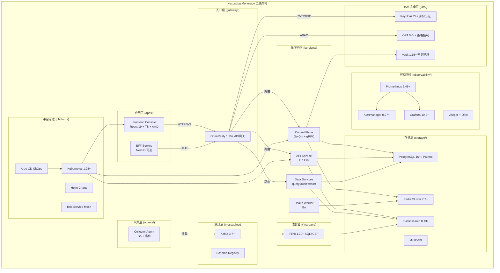

# 设计文档：NexusLog 项目总体规划

## 概述

本设计文档描述 NexusLog 全栈日志管理系统的总体架构和分阶段交付方案。NexusLog 采用业务域+平台域分层的 Monorepo 架构，按 MVP → P1 → P2 三阶段递进交付。

本文档为项目级总体设计，各域的详细实现方案由对应的子 Spec 承载：
- 前端迁移与 Monorepo 搭建：`.kiro/specs/frontend-migration/`（覆盖需求 1-7）

## 系统架构

### 整体分层架构

```
┌─────────────────────────────────────────────────────────────────┐
│                        用户层 (Users)                            │
│  浏览器 / CLI / 边缘节点 / 第三方系统                              │
└──────────────────────────┬──────────────────────────────────────┘
                           │
┌──────────────────────────▼──────────────────────────────────────┐
│                    入口层 (Gateway)                               │
│  OpenResty (Nginx+Lua) — JWT校验 / 限流 / 路由 / 日志            │
│  [P1] Istio Sidecar — mTLS / 流量管理                           │
└──────────────────────────┬──────────────────────────────────────┘
                           │
┌──────────────────────────▼──────────────────────────────────────┐
│                    应用层 (Apps)                                  │
│  ┌─────────────────┐  ┌──────────────┐                          │
│  │ Frontend Console│  │ BFF Service  │ (可选, NestJS)            │
│  │ React19+AntD    │  │ Node 20 LTS  │                          │
│  └─────────────────┘  └──────────────┘                          │
└──────────────────────────┬──────────────────────────────────────┘
                           │
┌──────────────────────────▼──────────────────────────────────────┐
│                    服务层 (Services)                              │
│  ┌──────────────┐ ┌──────────────┐ ┌────────────┐ ┌──────────┐ │
│  │ Control Plane│ │ API Service  │ │Data Services│ │Health    │ │
│  │ Go Gin+gRPC  │ │ Go Gin       │ │query/audit/ │ │Worker    │ │
│  │              │ │              │ │export       │ │Go        │ │
│  └──────────────┘ └──────────────┘ └────────────┘ └──────────┘ │
└──────────────────────────┬──────────────────────────────────────┘
                           │
┌──────────────────────────▼──────────────────────────────────────┐
│                    安全层 (IAM)                                   │
│  Keycloak (认证) + OPA (授权) + Vault (密钥)                     │
└──────────────────────────┬──────────────────────────────────────┘
                           │
┌──────────────────────────▼──────────────────────────────────────┐
│                    数据层 (Data Pipeline)                         │
│  ┌──────────┐  ┌──────────┐  ┌──────────────────────────┐      │
│  │Collector │→ │  Kafka   │→ │ Flink (SQL+CEP)          │      │
│  │Agent     │  │+ Schema  │  │ 实时聚合 / 告警匹配       │      │
│  └──────────┘  │Registry  │  └──────────────────────────┘      │
│                └──────────┘                                     │
└──────────────────────────┬──────────────────────────────────────┘
                           │
┌──────────────────────────▼──────────────────────────────────────┐
│                    存储层 (Storage)                               │
│  ┌──────────────┐ ┌──────────────┐ ┌────────┐ ┌──────────────┐ │
│  │Elasticsearch │ │ PostgreSQL   │ │ Redis  │ │ MinIO/S3     │ │
│  │(热/温/冷)    │ │+Patroni+etcd │ │Cluster │ │ (冷存储)     │ │
│  └──────────────┘ └──────────────┘ └────────┘ └──────────────┘ │
└──────────────────────────┬──────────────────────────────────────┘
                           │
┌──────────────────────────▼──────────────────────────────────────┐
│                    可观测性层 (Observability)                     │
│  Prometheus + Alertmanager + Grafana + Jaeger + OTel + Loki     │
└──────────────────────────┬──────────────────────────────────────┘
                           │
┌──────────────────────────▼──────────────────────────────────────┐
│                    平台层 (Platform)                              │
│  Kubernetes + Helm + Argo CD + [P2] Istio                       │
│  Terraform + Ansible (IaC)                                      │
└─────────────────────────────────────────────────────────────────┘
```

### Monorepo 项目结构

```
NexusLog/
├── README.md
├── LICENSE
├── CHANGELOG.md
├── .gitignore
├── .editorconfig
├── Makefile                     # 统一构建/测试命令入口
├── go.work                      # Go 多模块工作区
├── package.json                 # pnpm workspace 配置
├── docs/                        # 项目文档
│   ├── architecture/            # 架构文档（系统上下文、逻辑架构、部署架构、数据流、安全架构）
│   ├── adr/                     # 架构决策记录
│   ├── runbooks/                # 运维手册
│   ├── oncall/
│   ├── security/
│   └── sla-slo/
├── configs/                     # 公共配置（环境隔离）
│   ├── common/
│   ├── dev/
│   ├── staging/
│   └── prod/
├── apps/                        # 应用层
│   ├── frontend-console/        # 前端控制台（React 19 + TS + AntD + ECharts + Zustand）
│   │   ├── src/
│   │   │   ├── components/      # 组件
│   │   │   │   ├── charts/      # ECharts 图表组件
│   │   │   │   ├── common/      # 通用组件（基于 Ant Design 封装）
│   │   │   │   ├── layout/      # 布局组件（Layout, Sidebar, Header）
│   │   │   │   └── auth/        # 认证组件
│   │   │   ├── pages/           # 页面（按模块分目录）
│   │   │   ├── stores/          # Zustand Store
│   │   │   ├── hooks/           # 自定义 Hooks
│   │   │   ├── services/        # API 服务层
│   │   │   ├── types/           # TypeScript 类型定义
│   │   │   ├── utils/           # 工具函数
│   │   │   ├── constants/       # 常量定义
│   │   │   ├── config/          # 运行时配置
│   │   │   ├── App.tsx
│   │   │   └── main.tsx
│   │   ├── public/
│   │   │   └── config/
│   │   │       └── app-config.json
│   │   ├── tests/
│   │   ├── index.html
│   │   ├── vite.config.ts
│   │   ├── tsconfig.json
│   │   ├── package.json
│   │   └── Dockerfile
│   └── bff-service/             # BFF 层（NestJS，可选）
│       ├── src/
│       ├── test/
│       ├── package.json
│       └── Dockerfile
├── gateway/                     # API 网关
│   └── openresty/
│       ├── nginx.conf
│       ├── conf.d/
│       ├── lua/
│       ├── tenants/
│       ├── policies/
│       ├── tests/
│       └── Dockerfile
├── iam/                         # 身份认证与授权
│   ├── keycloak/
│   │   ├── realms/
│   │   ├── clients/
│   │   ├── roles/
│   │   └── mappers/
│   ├── opa/
│   │   ├── policies/
│   │   ├── bundles/
│   │   └── tests/
│   └── vault/
│       ├── policies/
│       ├── auth/
│       └── engines/
├── services/                    # 微服务层
│   ├── control-plane/           # 控制面服务（Go Gin + gRPC）
│   │   ├── cmd/api/
│   │   ├── internal/
│   │   │   ├── app/
│   │   │   ├── domain/
│   │   │   ├── service/
│   │   │   ├── repository/
│   │   │   └── transport/
│   │   │       ├── http/
│   │   │       └── grpc/
│   │   ├── api/
│   │   │   ├── openapi/
│   │   │   └── proto/
│   │   ├── configs/
│   │   ├── tests/
│   │   └── Dockerfile
│   ├── health-worker/           # 健康检测服务
│   │   ├── cmd/worker/
│   │   ├── internal/
│   │   │   ├── checker/
│   │   │   ├── scheduler/
│   │   │   └── reporter/
│   │   ├── configs/
│   │   ├── tests/
│   │   └── Dockerfile
│   ├── data-services/           # 数据服务集合
│   │   ├── query-api/
│   │   ├── audit-api/
│   │   ├── export-api/
│   │   ├── shared/
│   │   └── Dockerfile
│   └── api-service/             # API 服务
│       ├── cmd/api/
│       ├── internal/
│       ├── api/openapi/
│       ├── configs/
│       └── Dockerfile
├── agents/                      # 采集代理
│   └── collector-agent/
│       ├── cmd/agent/
│       ├── internal/
│       │   ├── collector/
│       │   ├── pipeline/
│       │   ├── checkpoint/
│       │   └── retry/
│       ├── plugins/
│       │   ├── grpc/
│       │   └── wasm/
│       ├── configs/
│       ├── tests/
│       └── Dockerfile
├── stream/                      # 流计算
│   └── flink/
│       ├── jobs/
│       │   ├── sql/
│       │   └── cep/
│       ├── udf/
│       ├── libs/
│       ├── savepoints/
│       ├── configs/
│       └── tests/
├── messaging/                   # 消息传输
│   ├── kafka/
│   │   ├── topics/
│   │   ├── quotas/
│   │   └── broker-config/
│   ├── schema-registry/
│   │   ├── config/
│   │   └── compatibility-rules/
│   └── dlq-retry/
│       ├── retry-policies/
│       └── consumer-config/
├── contracts/                   # 契约定义
│   └── schema-contracts/
│       ├── avro/
│       ├── protobuf/
│       ├── jsonschema/
│       ├── compatibility/
│       └── tests/
├── storage/                     # 存储配置
│   ├── elasticsearch/
│   │   ├── index-templates/
│   │   ├── ilm-policies/
│   │   ├── ingest-pipelines/
│   │   └── snapshots/
│   ├── postgresql/
│   │   ├── migrations/
│   │   ├── seeds/
│   │   ├── rls-policies/
│   │   ├── patroni/
│   │   ├── etcd/
│   │   └── pgbouncer/
│   ├── redis/
│   │   ├── cluster-config/
│   │   └── lua-scripts/
│   ├── minio/
│   │   ├── buckets/
│   │   └── lifecycle/
│   └── glacier/
│       └── archive-policies/
├── observability/               # 可观测性
│   ├── prometheus/
│   │   ├── prometheus.yml
│   │   ├── rules/
│   │   └── targets/
│   ├── alertmanager/
│   │   ├── alertmanager.yml
│   │   └── templates/
│   ├── grafana/
│   │   ├── dashboards/
│   │   └── datasources/
│   ├── jaeger/
│   │   └── config/
│   ├── otel-collector/
│   │   └── config/
│   └── loki/
│       └── config/
├── ml/                          # 机器学习（可选）
│   ├── training/
│   ├── inference/
│   ├── models/
│   ├── mlflow/
│   └── nlp/
│       ├── prompts/
│       └── rules/
├── edge/                        # 边缘计算（可选）
│   ├── mqtt/
│   ├── sqlite/
│   └── boltdb/
├── platform/                    # 平台治理
│   ├── kubernetes/
│   │   ├── base/
│   │   ├── namespaces/
│   │   ├── rbac/
│   │   ├── network-policies/
│   │   └── storageclasses/
│   ├── helm/
│   │   ├── nexuslog-gateway/
│   │   ├── nexuslog-control-plane/
│   │   ├── nexuslog-data-plane/
│   │   ├── nexuslog-storage/
│   │   └── nexuslog-observability/
│   ├── gitops/
│   │   ├── argocd/
│   │   │   ├── projects/
│   │   │   └── applicationsets/
│   │   ├── apps/
│   │   │   ├── ingress-system/
│   │   │   ├── iam-system/
│   │   │   ├── control-plane/
│   │   │   ├── data-plane/
│   │   │   ├── storage-system/
│   │   │   └── observability/
│   │   └── clusters/
│   │       ├── dev/
│   │       ├── staging/
│   │       └── prod/
│   ├── ci/
│   │   ├── templates/
│   │   └── scripts/
│   ├── security/
│   │   ├── trivy/
│   │   ├── sast/
│   │   └── image-sign/
│   └── istio/
│       ├── gateways/
│       ├── virtualservices/
│       └── destinationrules/
├── infra/                       # 基础设施即代码
│   ├── terraform/
│   │   ├── modules/
│   │   └── envs/
│   │       ├── dev/
│   │       ├── staging/
│   │       └── prod/
│   └── ansible/
│       ├── inventories/
│       └── roles/
├── scripts/                     # 脚本工具
│   ├── bootstrap.sh
│   ├── lint.sh
│   ├── test.sh
│   ├── build.sh
│   ├── release.sh
│   └── rollback.sh
├── tests/                       # 集成/E2E/性能/混沌测试
│   ├── e2e/
│   ├── integration/
│   ├── performance/
│   └── chaos/
└── .github/
    └── workflows/               # CI/CD 流水线
```

### 目录设计原则

1. **敏感信息不入仓**：密钥、token、证书走 Vault/K8s Secret
2. **契约先行**：`contracts/schema-contracts` 变更必须 CI 校验兼容性
3. **平台与业务分离**：`platform/` 只放交付与治理，不放业务逻辑代码
4. **环境隔离一致**：dev/staging/prod 目录结构完全一致，减少发布偏差
5. **统一入口**：所有构建/测试命令尽量汇聚到根级 Makefile

### 架构图



## 阶段交付设计

### MVP 阶段设计要点

MVP 阶段聚焦于 Monorepo 骨架搭建和前端迁移，目标是建立可运行的开发环境。

| 交付域 | 设计决策 | 关键技术 |
|--------|----------|----------|
| Monorepo 骨架 | 业务域+平台域分层，go.work + pnpm workspace 双工作区 | Go 1.22+, pnpm, Makefile |
| 前端控制台 | 从 Source_Project 迁移，技术栈替换 | React 19, AntD 5.x, ECharts 5.x, Zustand 4.x |
| 后端骨架 | 4 个 Go 微服务标准目录结构 | Go Gin, gRPC |
| 部署 | Docker + 基础 K8s 清单 | Docker, Kubernetes 1.28+ |
| CI/CD | GitHub Actions 基础流水线 | GitHub Actions |
| 文档 | 架构文档模板 + ADR + 变更管理规范 | Markdown |
| 配置 | 运行时配置热更新机制 | file watcher, app-config.json |

前端迁移的详细设计参见 `.kiro/specs/frontend-migration/design.md`，包含：
- 组件迁移映射表（Tailwind → AntD、Recharts → ECharts、Context → Zustand）
- 路由迁移方案（15 模块 50+ 页面）
- 状态管理架构（Zustand Store 设计）
- 构建优化策略（代码分割、vendor chunk）

### P1 阶段设计要点

P1 阶段补齐生产环境所需的全部基础设施，实现完整的 GitOps 发布流程。

| 交付域 | 设计决策 | 关键技术 |
|--------|----------|----------|
| API 网关 | OpenResty 统一入口，Lua 脚本实现认证/限流/日志 | OpenResty 1.25+ |
| IAM | Keycloak SSO + OPA RBAC + Vault 密钥管理 | Keycloak 24+, OPA, Vault |
| 采集代理 | 插件化架构，gRPC + WASM 扩展 | Go, gRPC, WASM |
| 消息传输 | Kafka + Schema Registry + DLQ | Kafka 3.7+, Avro/Protobuf |
| 流计算 | Flink SQL 聚合 + CEP 模式检测 | Flink 1.19+ |
| 存储 | ES(热温冷) + PG(Patroni HA) + Redis + MinIO | ES 8.13+, PG 16+ |
| 可观测性 | Prometheus + Alertmanager + Grafana + Jaeger + Loki | 全栈可观测 |
| 变更管理 | 三级审批 + 风险评分矩阵 + 回滚 SLA | 流程规范 |
| 测试 | 单元 + 集成 + E2E + 安全扫描 | Vitest, Go test, Playwright |
| IaC | Terraform 模块 + Ansible 角色 | Terraform, Ansible |
| GitOps | Argo CD + Helm Charts | Argo CD, Helm 3.13+ |
| BFF | 可选 NestJS 聚合层 | NestJS, Node 20 LTS |

### P2 阶段设计要点

P2 阶段引入高级能力，增强系统智能化和可靠性。

| 交付域 | 设计决策 | 关键技术 |
|--------|----------|----------|
| ML/NLP | 异常检测 + 日志分类 + 自然语言查询 | Python, sklearn, PyTorch, ONNX, MLflow |
| 边缘计算 | 边缘代理 + 本地存储 + 断点续传 | Go, MQTT 5.0, SQLite/BoltDB |
| 服务网格 | Istio mTLS + 流量管理 + 金丝雀发布 | Istio |
| 性能测试 | k6/Locust 负载测试 + Chaos Mesh 混沌测试 | k6, Chaos Mesh |
| 安全扫描 | SAST + DAST + 依赖扫描 + 镜像扫描 | Trivy, Snyk |
| 文档完善 | 全量架构文档 + 运维手册 + 文档站点 | MkDocs/Docusaurus |

## 数据流设计

### 日志数据流（P1 完整链路）

```
日志源 → Collector Agent → Kafka → Flink (实时处理)
                                      ├→ Elasticsearch (热存储/检索)
                                      ├→ PostgreSQL (元数据/审计)
                                      ├→ Redis (缓存/实时聚合)
                                      └→ MinIO (冷存储/归档)
```

### 用户请求流（P1 完整链路）

```
浏览器 → OpenResty Gateway → [JWT校验] → [OPA授权]
           ├→ Frontend Console (静态资源)
           ├→ BFF Service (可选) → 后端服务集群
           └→ 后端服务集群
                ├→ Control Plane (配置/管理)
                ├→ API Service (业务 API)
                ├→ Data Services (查询/审计/导出)
                └→ Health Worker (健康检测)
```

## 变更管理设计

### 三级审批体系

| 级别 | 标识 | 审批流程 | 适用场景 |
|------|------|----------|----------|
| 无需审批 | `none` | 自动发布 | 前端配置热更、Grafana Dashboard、Prometheus 规则 |
| 常规审批 | `normal` | 团队 Lead 审批 | 服务镜像滚动、采集规则变更、缓存 TTL 调整 |
| 高危变更 | `cab` | CAB 委员会审批 | 认证链路、存储拓扑、入口流量、密钥证书、不可逆数据操作 |

### 风险评分矩阵

| 维度 | 0 分 | 1 分 | 2 分 | 3 分 |
|------|------|------|------|------|
| 影响范围 | 单组件 | 单域 | 跨域 | 全局 |
| 业务关键性 | 非关键 | 低 | 中 | 高 |
| 复杂度 | 简单 | 一般 | 复杂 | 极复杂 |
| 可回滚性 | 秒级回滚 | 分钟级 | 需维护窗口 | 不可回滚 |
| 可观测性 | 全量监控 | 部分监控 | 有限监控 | 无监控 |

评分规则：总分 ≤5 → none，6-10 → normal，≥11 → cab

### 回滚 SLA

| 时间节点 | 要求 |
|----------|------|
| T+5 分钟 | 回滚决策 |
| T+15 分钟 | 核心恢复 |
| T+30 分钟 | 根因初判 |
| T+24 小时 | 复盘报告 |

## 正确性属性

### CP-1: Monorepo 结构完整性
所有必需的顶层目录（apps、services、gateway、iam、agents、stream、messaging、contracts、storage、observability、platform、infra、configs、docs、scripts、tests）必须存在且包含预期的子目录结构。
- 验证需求: 1.1

### CP-2: Go 工作区一致性
`go.work` 文件中引用的所有 Go 模块路径必须对应实际存在的目录，且每个目录包含有效的 `go.mod` 文件。
- 验证需求: 1.2

### CP-3: pnpm Workspace 一致性
`package.json` 中 pnpm workspace 配置引用的所有包路径必须对应实际存在的目录，且每个目录包含有效的 `package.json`。
- 验证需求: 1.4

### CP-4: 环境配置对称性
`configs/dev/`、`configs/staging/`、`configs/prod/` 三个环境目录的文件结构必须完全一致（文件名和目录层级相同，内容可不同）。
- 验证需求: 1.5

### CP-5: 前端技术栈替换完整性
Frontend_Console 的 `package.json` 必须包含 antd、echarts、zustand 依赖，且不包含 tailwindcss、recharts 依赖。
- 验证需求: 2.1

### CP-6: Go 服务目录规范性
每个 Go 微服务目录必须包含 `cmd/`、`internal/`、`configs/`、`tests/`、`Dockerfile` 的标准结构。
- 验证需求: 3.1, 3.2, 3.4

### CP-7: Dockerfile 存在性
每个可部署服务（frontend-console、control-plane、health-worker、data-services、api-service）必须包含 Dockerfile。
- 验证需求: 4.1, 4.4

### CP-8: CI 流水线覆盖性
GitHub Actions 工作流必须覆盖前端构建测试、后端构建测试、镜像构建推送三条流水线。
- 验证需求: 5.1, 5.2, 5.3

### CP-9: 变更级别标注完整性
所有组件配置模板必须包含 `change_level` 字段，且取值为 `none`、`normal`、`cab` 之一。
- 验证需求: 7.4, 14.5

### CP-10: Schema 契约兼容性
`contracts/schema-contracts/` 下的 Schema 定义必须通过兼容性校验（向后兼容）。
- 验证需求: 11.6

## 测试策略

### 前端测试

| 测试类型 | 工具 | 覆盖范围 |
|----------|------|----------|
| 单元测试 | Vitest | 组件、Hooks、工具函数、Store |
| 属性测试 | fast-check | 数据转换、状态管理、路由映射 |
| E2E 测试 | Playwright | 关键用户流程 |

### 后端测试

| 测试类型 | 工具 | 覆盖范围 |
|----------|------|----------|
| 单元测试 | Go testing + testify | Handler、Service、Repository |
| 集成测试 | Go testing + testcontainers | 数据库、缓存、消息队列 |
| 属性测试 | Go rapid | 数据模型、序列化、配置校验 |

### 跨服务测试

| 测试类型 | 工具 | 覆盖范围 |
|----------|------|----------|
| 集成测试 | docker-compose + 测试脚本 | 服务间通信、数据流 |
| E2E 测试 | Playwright | 全链路用户场景 |
| 性能测试 | k6 / Locust | API 响应时间、吞吐量 |
| 混沌测试 | Chaos Mesh | 故障注入、恢复验证 |
