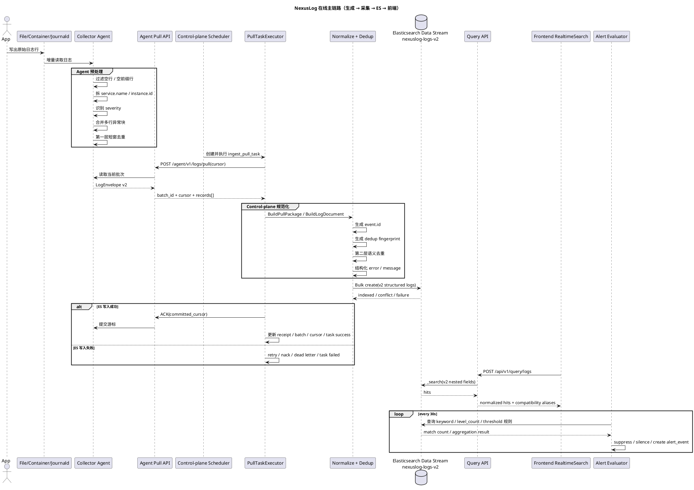
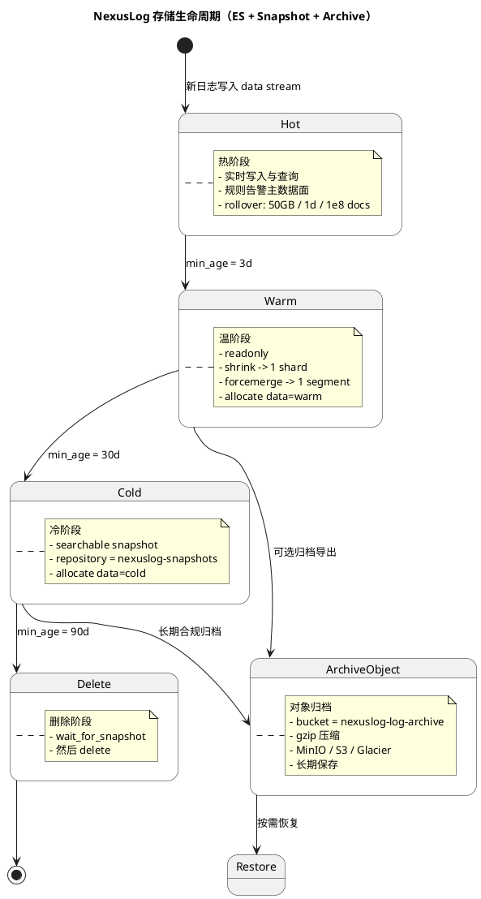

# NexusLog 日志全链路架构与存储生命周期（生成 → 采集 → ES → 前端 → 温/冷/归档）

## 1. 文档目的

本文档用于明确 NexusLog 当前日志链路的端到端形态，覆盖：

- 日志从业务系统生成到 Agent 采集的入口
- Agent 到 Control-plane 到 Elasticsearch 的在线主链路
- Query API 与前端实时检索页的消费链路
- 日志进入温存储、冷存储、快照与对象归档的生命周期路径
- 聚合、去重、告警、静默、聚类等能力分别应放在链路的哪个阶段

> 本文结论以 2026-03-07 当前仓库实现与配置为准。  
> 若与代码实现冲突，以代码为准。

---

## 2. 全链路总览

| 阶段 | 输入 | 核心处理 | 输出 | 当前状态 |
|---|---|---|---|---|
| 0. 日志生成 | 应用日志、容器 stdout/stderr、系统文件 | 业务系统写出原始日志行 | 原始文本日志 | 已存在 |
| 1. Agent 采集 | 文件、容器、系统日志源 | 增量读取、打点时间戳、附带基础 metadata | 原始采集批次 | 已实现 |
| 2. Agent 预处理 | 原始采集批次 | 去空行、去空前缀、服务名前缀拆分、级别识别、多行合并、短窗去重 | `LogEnvelope v2.records[]` | 已实现 |
| 3. Pull API 传输 | `records[]` | 按批次对外暴露拉取接口、维护游标 | `batch_id`、`cursor.next`、`cursor.has_more`、`records[]` | 已实现 |
| 4. Control-plane 执行 | Agent Pull 响应 | 创建任务、记录批次、ACK/NACK、游标推进 | `PullTask` / `PullPackage` / `PullBatch` | 已实现 |
| 5. Control-plane 归一化 | Agent v2 records | 生成 `event.id`、构建结构化文档、语义去重、错误字段提取 | `LogDocument` / ES bulk payload | 已实现 |
| 6. ES 热存储 | 结构化 ES 文档 | 写入 `nexuslog-logs-v2` data stream，支撑实时检索 | 热数据文档 | 已实现 |
| 7. 查询与展示 | ES 热/温/冷可检索数据 | Query API 按 v2 字段检索，前端标准化展示 | 列表、详情抽屉、趋势视图 | 已实现 |
| 8. 生命周期迁移 | ES 索引 / 快照 / 对象存储 | 热→温→冷→删除；快照；对象归档 | warm/cold/searchable snapshot/archive object | 配置已存在 |
| 9. 告警与分析 | ES 文档与聚合结果 | 规则评估、抑制、静默、事故升级、后续聚类分析 | alert events / incidents / analysis | 部分已实现 |

---

## 3. 在线主链路 UML（时序图）

---

## 4. 存储生命周期 UML（热 → 温 → 冷 → 归档）

---

## 5. 聚合、去重、告警应该放在哪一层

### 5.1 放置原则

| 能力 | 推荐放置层 | 原因 | 当前状态 |
|---|---|---|---|
| 空行过滤 | Agent | 越早丢弃越省带宽与存储 | 已实现 |
| 服务名前缀拆分 | Agent | 最接近原始文本上下文，解析最稳定 | 已实现 |
| 多行异常块合并 | Agent | stack trace 必须在进入平台前合成单事件 | 已实现 |
| 完全相同短窗去重 | Agent | 减少重复传输与写入压力 | 已实现 |
| 语义去重 | Control-plane 入 ES 前 | 需要统一 fingerprint 与 `event.id` 口径 | 已实现 |
| `message/error` 结构化 | Control-plane 入 ES 前 | 便于 ES 检索和前端详情展示 | 已实现（轻量） |
| 规则告警 | ES 落库后独立 evaluator | 需要基于可检索结果做窗口判断与统计 | 已实现 |
| 告警抑制 / 静默 | 告警引擎层 | 避免相同告警持续风暴 | 已实现 |
| 事故自动升级 | 告警成立后 | critical 告警才应升级为 incident | 已实现 |
| 趋势统计 / 时间聚合 | Query / Analysis 层 | 属于读侧视图，不应污染写入链路 | 已实现（基础） |
| 相似日志聚类 | Analysis 层 | 属于分析能力，不属于采集链路 | 规划中 |
| 前端折叠展示 | 前端 + 聚类分析层 | 应消费聚类结果，而不是反向改写原始日志 | 规划中 |

### 5.2 当前链路中已经存在的聚合/告警触发点

| 触发点 | 时机 | 当前行为 | 代码 / 配置位置 |
|---|---|---|---|
| Agent 多行合并 | 日志进入 Pull 批次前 | 合并 Java stack trace / npm error block | `agents/collector-agent/internal/pullapi/normalize.go` |
| Agent 第一层去重 | Pull 批次生成前 | 短窗去重并保留 `dedup.*` | `agents/collector-agent/internal/pullapi` |
| Control-plane 第二层语义去重 | ES bulk 前 | 按 fingerprint 聚合，复用事件 ID | `services/control-plane/internal/ingest/es_sink.go` |
| Redis 共享语义去重 | 多实例场景可选 | 基于 Redis Hash + Lua 原子聚合 | `services/control-plane/internal/ingest/redis_semantic_dedup.go` |
| 拉取延迟告警 | 每个 pull task 结束时 | 统计 p50/p95/p99，超阈值告警 | `services/control-plane/internal/ingest/latency_monitor.go` |
| 日志规则告警 | 定时评估周期 | keyword / level_count / threshold 规则 | `services/control-plane/internal/alert/evaluator.go` |
| 告警静默 | 告警命中后 | 静默期跳过通知但保留记录 | `services/control-plane/internal/alert/evaluator.go` |
| critical 自动建 incident | alert_event 创建后 | 关键告警自动升级为事故 | `services/control-plane/internal/alert` |

---

## 6. 温存储、冷存储、快照、对象归档的建议分工

### 6.1 ES 生命周期（在线可检索数据）

| 阶段 | 时间阈值 | 动作 | 目标 |
|---|---|---|---|
| Hot | `0ms` 起 | 实时写入、实时检索、rollover | 低延迟读写 |
| Warm | `3d` | readonly、shrink、forcemerge、allocate warm | 降低成本，保留查询能力 |
| Cold | `30d` | searchable snapshot、allocate cold | 低频查询、最小化本地存储 |
| Delete | `90d` | `wait_for_snapshot` 后 delete | 清理 ES 在线存储 |

### 6.2 快照与对象归档（长期保留数据）

| 层级 | 介质 | 当前配置 | 典型用途 |
|---|---|---|---|
| ES Snapshot | `nexuslog-es-snapshots` | 每日 `02:00`，保留 `30d` | 索引级备份与恢复 |
| Searchable Snapshot | ES + snapshot repository | 冷阶段自动使用 | 低成本但仍可检索 |
| Object Archive | `nexuslog-log-archive` | `gzip` + `GLACIER/DEEP_ARCHIVE` | 长期审计与合规保存 |
| MinIO Lifecycle | bucket lifecycle | 归档桶 `90d` 转冷、`365d` 删除 | 降低对象存储成本 |

### 6.3 推荐的长期保留策略

| 数据类型 | 主查询窗口 | 温存储 | 冷存储 | 归档 |
|---|---|---|---|---|
| 应用日志 | 近 `3d` | `3d ~ 30d` | `30d ~ 90d` searchable snapshot | `90d+` 对象归档 |
| 审计日志 | 近 `7d` | `7d ~ 30d` | `30d+` searchable snapshot | `7y+` 深度归档 |
| 告警 / 事故 | 近 `30d` | 可保留在线检索 | 视合规要求决定 | 建议单独快照策略 |

> 注意：当前 ES 删除阈值与对象归档触发时间都接近 `90d`。如果要确保“先归档后删除”，建议把对象归档触发提前到 `60d ~ 85d`，或者增加明确的归档成功标记后再允许删除。

---

## 7. 当前实现与规划边界

### 7.1 已完成主链路

- `agent → control-plane → ES v2 → query-api → 前端实时检索页` 已跑通
- 前端实时检索页已显示真实日志，不再以旧测试数据作为主来源
- Query API 已按 v2 字段查询并返回兼容前端的标准化结果
- ES 已按 `nexuslog-logs-v2` data stream 存储结构化日志

### 7.2 已有但偏平台配置的能力

- ES ILM 策略文件已存在
- ES snapshot 策略文件已存在
- 对象归档策略与 MinIO 生命周期配置已存在

### 7.3 尚未完成或明确后置的能力

- `service.name` 对 file source 的富化仍需增强
- 多实例 Control-plane 共享语义去重仍建议收敛到 Redis 实现
- 聚类分析与前端折叠展示明确后置，不放在当前主链路
- 对象归档是否在当前环境自动执行，仍取决于部署时是否真正安装并启用对应策略

---

## 8. 关键代码与配置锚点

### 8.1 在线链路

- Agent Pull 路由：`agents/collector-agent/internal/pullapi/service.go`
- Agent 日志清洗与合并：`agents/collector-agent/internal/pullapi/normalize.go`
- Pull 任务执行器：`services/control-plane/internal/ingest/executor.go`
- Agent Pull → PullPackage 映射：`services/control-plane/internal/ingest/agent_pull_mapper.go`
- `event.id` / `fingerprint` / `LogDocument`：`services/control-plane/internal/ingest/field_model.go`
- ES bulk 写入：`services/control-plane/internal/ingest/es_sink.go`
- Redis 语义去重：`services/control-plane/internal/ingest/redis_semantic_dedup.go`
- Query API 查询：`services/data-services/query-api/internal/repository/repository.go`
- Query API 结果归一化：`services/data-services/query-api/internal/service/service.go`
- 前端实时检索页：`apps/frontend-console/src/pages/search/RealtimeSearch.tsx`
- 前端 query 适配层：`apps/frontend-console/src/api/query.ts`

### 8.2 生命周期与归档

- ES data stream 模板：`storage/elasticsearch/index-templates/nexuslog-logs-v2.json`
- ES 通用模板：`storage/elasticsearch/templates/nexuslog-logs-v2.json`
- ES ILM：`storage/elasticsearch/ilm/nexuslog-logs-ilm.json`
- ES Snapshot 策略：`storage/elasticsearch/snapshots/snapshot-policy.json`
- 对象归档策略：`storage/glacier/archive-policies/archive-policy.yaml`
- MinIO 生命周期：`storage/minio/lifecycle/lifecycle-rules.yaml`

### 8.3 告警与事件联动

- 日志规则评估：`services/control-plane/internal/alert/evaluator.go`
- incident 自动创建：`services/control-plane/internal/alert/incident_creator.go`
- 拉取延迟监控：`services/control-plane/internal/ingest/latency_monitor.go`

---

## 9. 变更记录

| 日期 | 版本 | 变更内容 |
|---|---|---|
| 2026-03-07 | v1.0 | 初始版本。新增日志端到端链路、在线主链路 UML、存储生命周期 UML、聚合/告警放置原则、温冷归档说明与关键代码锚点 |
