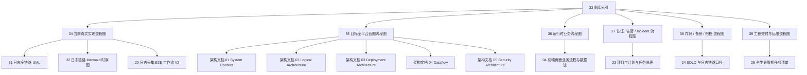
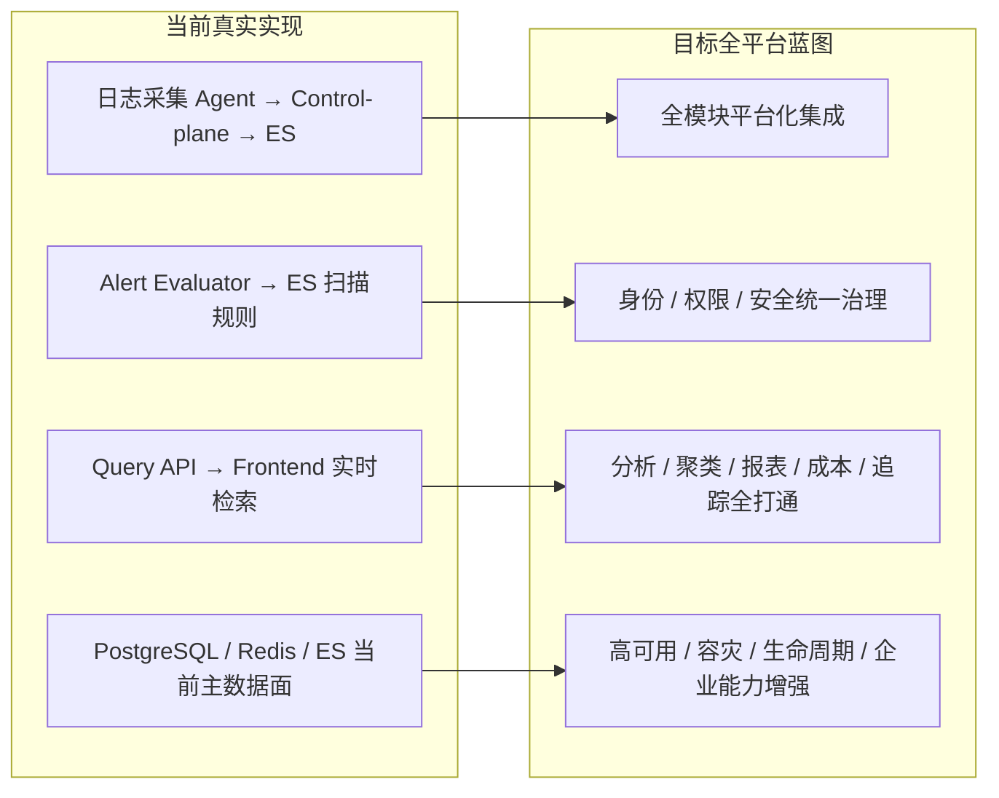

# NexusLog 项目流程图库索引（双口径：当前真实实现 + 目标全平台蓝图）

## 文档目的

本文档是 NexusLog 流程图库的总入口，用于统一说明：

- 哪些流程图描述的是**当前真实实现**
- 哪些流程图描述的是**目标全平台蓝图**
- 哪些流程图属于**专题业务 / 工程 / 运维视角**
- 应该按什么顺序阅读整套 Mermaid 图库

> 适用范围：`docs/NexusLog/10-process/33 ~ 39` 全部流程图库文档。
> 术语基线：若新图与旧架构文档冲突，以“图中口径说明 + 当前实现文档 + 当前代码事实”为准。

---

## 双口径说明

### 1. 当前真实实现

当前真实实现口径只描述当前仓库、当前链路、当前文档和当前运行态可以证实的事实，重点关注：

- 当前日志链路如何真实运行
- 当前服务如何交互
- 当前数据如何存储与查询
- 当前哪些模块已可用 / 部分可用 / 尚在规划

### 2. 目标全平台蓝图

目标蓝图口径描述 NexusLog 的未来完整平台形态，重点关注：

- 全模块协同后的目标架构
- 计划中的平台能力与组件分层
- 长期演进中的身份、可观测、集成、分析、生命周期与企业能力

> 目标蓝图不代表当前已经全部实现。所有“目标态 / 规划态”内容都必须与“当前真实实现”显式区分。

---

## 图库导航表

| 文档 | 口径 | 主要内容 | 推荐阅读时机 |
|---|---|---|---|
| `33-project-workflow-diagram-index.md` | 双口径 | 图库入口、导航图、阅读建议 | 第 1 份 |
| `34-current-real-implementation-flowcharts.md` | 当前真实实现 | 当前真实主链路、当前服务关系、当前数据主路径 | 第 2 份 |
| `35-target-platform-blueprint-flowcharts.md` | 目标蓝图 | 平台总蓝图、系统上下文、逻辑架构、部署拓扑 | 第 3 份 |
| `36-runtime-business-flowcharts.md` | 以当前实现为主，局部含规划 | 采集接入、入库、查询、分析、导出等业务流程 | 按业务查阅 |
| `37-auth-alert-incident-flowcharts.md` | 当前实现 + 目标扩展 | 登录、鉴权、告警、通知、Incident 生命周期 | 按安全/告警查阅 |
| `38-storage-backup-archive-flowcharts.md` | 当前配置 + 目标治理 | 热温冷、快照、恢复、归档、保留策略 | 按存储/运维查阅 |
| `39-engineering-delivery-ops-flowcharts.md` | 当前工程流程 | SDLC、任务交付、去 Mock、发布回滚、E2E 排障 | 按交付/运维查阅 |
| `31-log-end-to-end-lifecycle-and-uml.md` | 日志链路总览 | PlantUML 版日志全链路与生命周期 | 补充参考 |
| `32-log-sequence-diagram-mermaid.md` | 日志链路时序 | Mermaid 版日志主链路时序图 | 补充参考 |

---

## 图类型说明

| 图类型 | Mermaid 语法 | 适用场景 |
|---|---|---|
| 全局流程图 | `flowchart TD` / `flowchart LR` | 展示模块关系、阶段流转、决策路径 |
| 时序图 | `sequenceDiagram` | 展示请求交互、调用顺序、成功/失败分支 |
| 状态图 | `stateDiagram-v2` | 展示 Incident / Job / 生命周期状态机 |

---

## 总览导航图



**Markdown 版（类图片样式）**

```text
┌────────────────────────────────────────────────────────────────────┐
│                   项目流程图库导航总览（类图片样式）              │
├────────────────────────────────────────────────────────────────────┤
│ 33 图库索引                                                       │
│   ├─ 34 当前真实实现流程图                                        │
│   │    ├─ 31 日志全链路 UML                                       │
│   │    ├─ 32 日志链路 Mermaid 时序图                              │
│   │    └─ 20 日志采集 E2E 工作流 V2                               │
│   ├─ 35 目标全平台蓝图流程图                                      │
│   │    ├─ 架构文档 01~05                                           │
│   ├─ 36 运行时业务流程图                                          │
│   │    └─ 04 前端页面业务流程与数据流                              │
│   ├─ 37 认证 / 告警 / Incident 流程图                             │
│   │    └─ 23 项目主计划与任务总表                                  │
│   ├─ 38 存储 / 备份 / 归档 流程图                                 │
│   │    └─ 24 SDLC 与日志链路口径                                  │
│   └─ 39 工程交付与运维流程图                                      │
│        └─ 25 全生命周期任务清单                                   │
└────────────────────────────────────────────────────────────────────┘
```

> 阅读建议：先读 `34` 看当前真实系统怎么跑，再读 `35` 看目标全平台长什么样，最后按专题进入 `36~39`。

---

## 双口径关系图



**Markdown 版（类图片样式）**

```text
┌────────────────────────────────────┐    ┌────────────────────────────────────┐
│ 当前真实实现                         │    │ 目标全平台蓝图                       │
├────────────────────────────────────┤    ├────────────────────────────────────┤
│ Agent → Control-plane → ES         │──→ │ 全模块平台化集成                     │
│ Query API → Frontend 实时检索      │──→ │ 分析 / 聚类 / 报表 / 追踪打通        │
│ Alert Evaluator → ES 规则扫描      │──→ │ 身份 / 权限 / 安全统一治理           │
│ PostgreSQL / Redis / ES 数据面     │──→ │ 高可用 / 容灾 / 生命周期增强         │
└────────────────────────────────────┘    └────────────────────────────────────┘

说明：当前真实实现是可运行子集；目标蓝图是在此基础上的扩展平台。
```

> 关系说明：当前真实实现是目标蓝图的可运行子集，目标蓝图是在当前基线之上继续扩展的平台形态。

---

## 当前实现与目标蓝图的区别说明

| 维度 | 当前真实实现 | 目标蓝图 |
|---|---|---|
| 依据 | 当前代码、当前运行链路、当前已落地文档 | 架构文档、规格文档、总体规划、全生命周期任务规划 |
| 组件选择 | 只保留可证实组件 | 可包含未来规划组件 |
| 表达目标 | 还原事实 | 描绘未来 |
| 风险 | 容易遗漏远期能力 | 容易把规划误认为现状 |
| 控制方式 | 严禁把 Kafka/Flink/Keycloak 误画成当前主链路 | 必须显式标注目标态 / 规划态 |

---

## 阅读建议

### 路径一：想快速看懂当前系统

1. `34-current-real-implementation-flowcharts.md`
2. `32-log-sequence-diagram-mermaid.md`
3. `36-runtime-business-flowcharts.md`
4. `38-storage-backup-archive-flowcharts.md`

### 路径二：想看未来全平台设计

1. `35-target-platform-blueprint-flowcharts.md`
2. `37-auth-alert-incident-flowcharts.md`
3. `38-storage-backup-archive-flowcharts.md`
4. `39-engineering-delivery-ops-flowcharts.md`

### 路径三：想按专题查

- 采集 / 查询 / 导出：看 `36`
- 认证 / 告警 / Incident：看 `37`
- 存储 / 备份 / 归档：看 `38`
- 开发 / 测试 / 发布 / 排障：看 `39`

---

## 变更记录

| 日期 | 版本 | 变更内容 |
|---|---|---|
| 2026-03-07 | v1.1 | 在每个 Mermaid 图下补充纯 Markdown / ASCII 的类图片样式图，便于在不支持 Mermaid 的环境中阅读 |
| 2026-03-07 | v1.0 | 初始版本。新增流程图库索引文档，定义双口径说明、导航表、总览导航图和阅读建议 |
