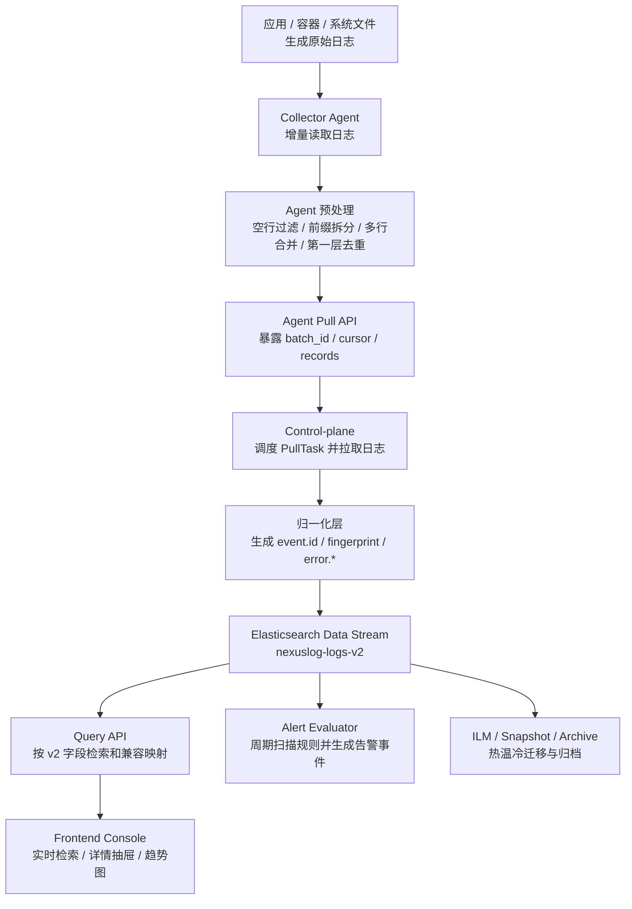
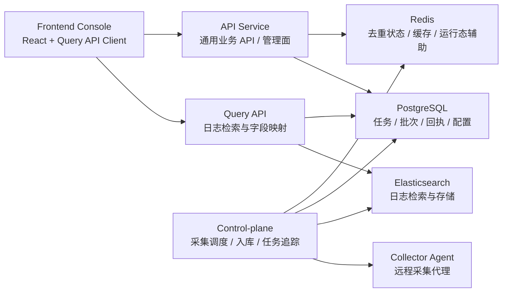
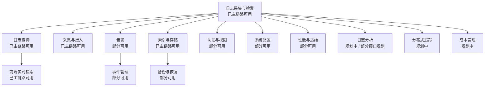

# NexusLog 当前真实实现流程图（事实基线）

## 文档目的

本文档用于用 Mermaid 流程图还原 NexusLog **当前真实实现**下的系统主流程。  
该文档只描述当前代码、当前文档与当前运行态能证实的链路，不把旧架构或远期规划误当成现状。

> 事实基线来源：
>
> - `docs/NexusLog/10-process/20-log-ingest-e2e-workflow-v2.md`
> - `docs/NexusLog/10-process/24-sdlc-development-process.md`
> - `docs/NexusLog/10-process/31-log-end-to-end-lifecycle-and-uml.md`
> - `docs/NexusLog/10-process/32-log-sequence-diagram-mermaid.md`
> - 当前仓库中的 `collector-agent` / `control-plane` / `query-api` / `frontend-console` 实现

---

## 口径说明

- **适用口径**：当前真实实现
- **禁止误用**：不得把 Kafka、Flink、Keycloak 等远期或旧文档口径组件画成当前主链路核心组件
- **若需提及规划态组件**：只能作为备注出现，并明确标注 `规划态` 或 `历史口径`

---

## 1. 当前真实实现总流程图

> 本图描述当前系统里“日志从生成到前端展示，再到告警与生命周期”的主路径。



**Markdown 版（类图片样式）**

```text
┌────────────────────────────────────────────────────────────────────┐
│                  当前真实实现总流程（事实基线）                    │
├────────────────────────────────────────────────────────────────────┤
│ 应用 / 容器 / 系统文件                                             │
│   ↓ 原始日志                                                       │
│ Collector Agent                                                    │
│   ↓ 预处理：空行过滤 / 前缀拆分 / 多行合并 / 第一层去重            │
│ Pull API                                                           │
│   ↓                                                                │
│ Control-plane                                                      │
│   ↓ 调度 PullTask / 归一化 / event.id / fingerprint               │
│ Elasticsearch Data Stream                                          │
│   ├─ Query API → Frontend Console                                 │
│   ├─ Alert Evaluator                                               │
│   └─ ILM / Snapshot / Archive                                      │
└────────────────────────────────────────────────────────────────────┘
```

**说明**：

- 这是当前最核心的日志主链路
- 当前“前端日志检索页 → Query API → ES v2”的链路已跑通
- 告警评估与生命周期管理依赖 ES 文档结果继续向下游扩展

---

## 2. 当前后端运行主链路图

> 本图描述当前后端组件的主交互面，强调当前真实运行主干。



**Markdown 版（类图片样式）**

```text
┌────────────────────────────────────────────────────────────────────┐
│                    当前后端运行主链路（类图片样式）               │
├────────────────────────────────────────────────────────────────────┤
│ Frontend Console                                                   │
│   ├─→ Query API → ES / PostgreSQL                                 │
│   └─→ API Service → PostgreSQL / Redis                            │
│                                                                    │
│ Control-plane                                                      │
│   ├─→ Collector Agent                                              │
│   ├─→ Elasticsearch                                                │
│   ├─→ PostgreSQL                                                   │
│   └─→ Redis                                                        │
│                                                                    │
│ 当前可确认主干组件：UI / Query API / API Service / CP / Agent /   │
│ ES / PostgreSQL / Redis                                            │
└────────────────────────────────────────────────────────────────────┘
```

**说明**：

- 当前真实主干能确认存在：`Frontend Console`、`Query API`、`API Service`、`Control-plane`、`Collector Agent`、`Elasticsearch`、`PostgreSQL`、`Redis`
- 网关、统一 IAM、消息总线、流计算等全平台能力不在这张“当前事实图”里作为主路径出现

---

## 3. 当前数据主路径图

> 本图聚焦“数据类型流向”，而不是服务调用时序。

```mermaid
flowchart TD
    subgraph LOG["日志数据主路径"]
        L1["原始日志"] --> L2["Agent 结构化 records"]
        L2 --> L3["归一化 LogDocument"]
        L3 --> L4["ES v2 文档"]
        L4 --> L5["查询 hits + fields"]
        L5 --> L6["前端列表 / 详情"]
    end

    subgraph META["元数据主路径"]
        M1["Source 配置"] --> M2["PullTask / PullBatch / PullPackage"]
        M2 --> M3["Receipt / Cursor / Dead Letter"]
        M3 --> M4["PostgreSQL 持久化"]
    end

    subgraph ALERT["告警事件主路径"]
        A1["ES 日志文档"] --> A2["Alert Evaluator"]
        A2 --> A3["alert_event"]
        A3 --> A4["通知 / Incident / UI"]
    end
```



**Markdown 版（类图片样式）**

```text
┌────────────────────────────── LOG ────────────────────────────────┐
│ 原始日志 → Agent records → LogDocument → ES v2 文档 → hits+fields │
│ → 前端列表 / 详情                                                  │
└────────────────────────────────────────────────────────────────────┘

┌───────────────────────────── META ────────────────────────────────┐
│ Source 配置 → PullTask / PullBatch / PullPackage → Receipt /      │
│ Cursor / Dead Letter → PostgreSQL 持久化                          │
└────────────────────────────────────────────────────────────────────┘

┌──────────────────────────── ALERT ─────────────────────────────────┐
│ ES 日志文档 → Alert Evaluator → alert_event → 通知 / Incident / UI │
└────────────────────────────────────────────────────────────────────┘
```

**说明**：

- 日志数据主路径以 ES 为核心数据面
- 元数据与任务追踪主路径以 PostgreSQL 为核心持久化面
- 告警事件主路径以 ES 查询结果为输入、以事件记录为输出

---

## 4. 当前项目模块运行关系图

> 本图不是未来产品全景，而是“当前仓库里和当前主链路关系最强的模块图”。



**Markdown 版（类图片样式）**

```text
┌────────────────────────────────────────────────────────────────────┐
│                   当前模块运行关系（类图片样式）                  │
├────────────────────────────────────────────────────────────────────┤
│ 核心：日志采集与检索（已主链路可用）                              │
│   ├─ 日志查询（已主链路可用） → 前端实时检索（已主链路可用）      │
│   ├─ 采集与接入（已主链路可用）                                    │
│   ├─ 告警（部分可用） → 事件管理（部分可用）                       │
│   ├─ 索引与存储（已主链路可用） → 备份与恢复（部分可用）           │
│   ├─ 认证与权限（部分可用）                                        │
│   ├─ 系统配置（部分可用）                                          │
│   ├─ 性能与运维（部分可用）                                        │
│   ├─ 日志分析（规划中 / 部分接口规划）                             │
│   ├─ 分布式追踪（规划中）                                          │
│   └─ 成本管理（规划中）                                            │
└────────────────────────────────────────────────────────────────────┘
```

**说明**：

- “已主链路可用”指当前可以支撑真实主流程
- “部分可用”指已有接口、数据结构或部分实现，但尚未形成所有页面 / 流程闭环
- “规划中”指主要出现在规格、架构或任务规划文档中

---

## 当前真实实现中的明确边界

### 当前文档里明确不作为当前主链路出现的组件

- Kafka
- Flink
- Keycloak
- OPA
- Schema Registry
- Jaeger
- 其他仅在目标架构中出现但未被当前主链路证实的组件

### 这些组件应该如何处理

- 若后续出现在目标蓝图图中，必须标注为：`目标态`、`规划态` 或 `历史口径`
- 不得在“当前事实基线”图中与 Query API / Control-plane / ES 混在一起表示为已落地主路径

---

## 参考资料

- `docs/NexusLog/10-process/20-log-ingest-e2e-workflow-v2.md`
- `docs/NexusLog/10-process/24-sdlc-development-process.md`
- `docs/NexusLog/10-process/31-log-end-to-end-lifecycle-and-uml.md`
- `docs/NexusLog/10-process/32-log-sequence-diagram-mermaid.md`
- `docs/NexusLog/10-process/04-frontend-pages-functional-workflow-dataflow.md`

---

## 变更记录

| 日期 | 版本 | 变更内容 |
|---|---|---|
| 2026-03-07 | v1.1 | 在每个 Mermaid 图下补充纯 Markdown / ASCII 的类图片样式图，便于在不支持 Mermaid 的环境中阅读 |
| 2026-03-07 | v1.0 | 初始版本。新增当前真实实现总流程图、当前后端运行主链路图、当前数据主路径图、当前项目模块运行关系图 |
