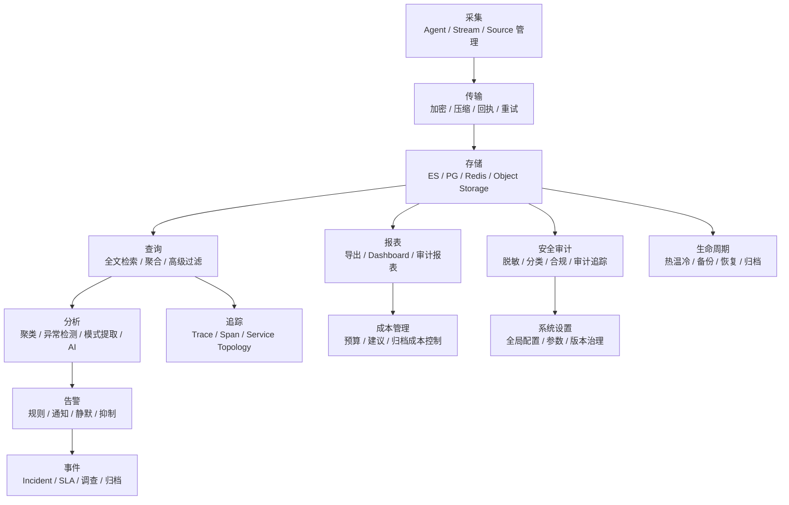
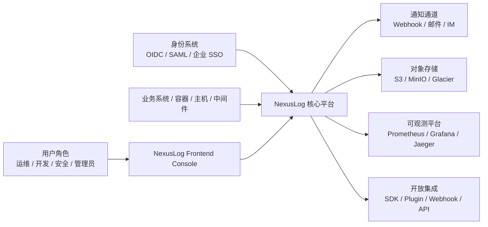
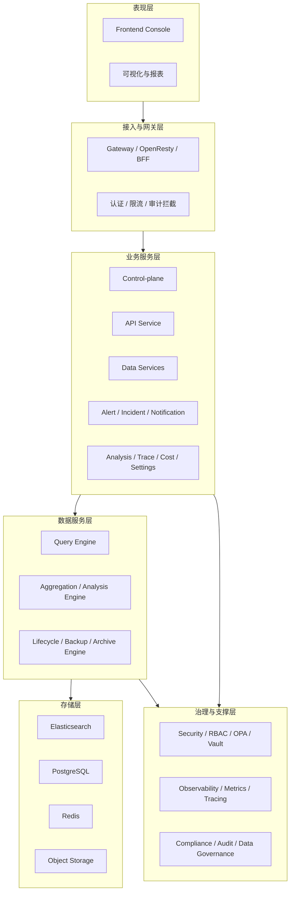
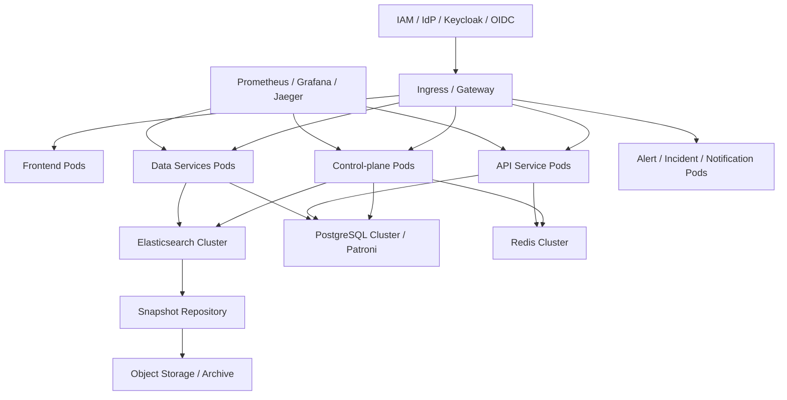

# NexusLog 目标全平台蓝图流程图（目标态）

## 文档目的

本文档用于从产品与平台规划视角，给出 NexusLog 的**目标全平台蓝图**。  
它不描述当前代码已经完全落地的事实，而描述 NexusLog 面向完整平台化建设时的目标流程与架构。

> 蓝图基线来源：
>
> - `docs/01-architecture/core/01-system-context.md`
> - `docs/01-architecture/core/02-logical-architecture.md`
> - `docs/01-architecture/core/03-deployment-architecture.md`
> - `docs/01-architecture/core/04-dataflow.md`
> - `docs/01-architecture/core/05-security-architecture.md`
> - `.kiro/specs/docs/designs/api-design.md`
> - `docs/NexusLog/10-process/23-project-master-plan-and-task-registry.md`
> - `docs/NexusLog/10-process/25-full-lifecycle-task-registry.md`

---

## 口径说明

- **适用口径**：目标全平台蓝图
- **重要提醒**：本文件中的图不代表当前代码已全部实现
- **阅读方式**：本文件用来回答“平台最终想长成什么样”，而不是“当前已经能怎么跑”

---

## 1. 目标全平台总流程图

> 本图按产品能力域展示目标平台的全链路闭环。



**Markdown 版（类图片样式）**

```text
┌────────────────────────────────────────────────────────────────────┐
│                  目标全平台能力闭环（目标态）                     │
├────────────────────────────────────────────────────────────────────┤
│ 采集 → 传输 → 存储 → 查询 → 分析 → 告警 → Incident                │
│                ├─→ 报表 / Dashboard / 审计报表                    │
│                ├─→ 安全审计 / 脱敏 / 分类 / 合规                   │
│                ├─→ Trace / Span / Service Topology                 │
│                └─→ 生命周期 / 备份 / 恢复 / 归档                   │
│ 报表进一步衔接成本管理；安全能力进一步衔接系统设置与治理。         │
└────────────────────────────────────────────────────────────────────┘
```

**说明**：

- 该图汇总了规格文档中的核心能力域
- 它强调的是“平台级能力闭环”，不是当前具体服务部署事实

---

## 2. 目标系统上下文图

> 本图描述目标态下 NexusLog 与外部实体的交互关系。



**Markdown 版（类图片样式）**

```text
┌────────────────────────────────────────────────────────────────────┐
│                     目标系统上下文（目标态）                      │
├────────────────────────────────────────────────────────────────────┤
│ 用户角色（运维 / 开发 / 安全 / 管理员） → Frontend Console        │
│ 身份系统（OIDC / SAML / 企业 SSO） → NexusLog 核心平台            │
│ 业务系统 / 容器 / 主机 / 中间件 → NexusLog 核心平台               │
│ NexusLog 核心平台 → 通知通道 / 对象存储 / 可观测平台 / 开放集成    │
│ Frontend Console → NexusLog 核心平台                              │
└────────────────────────────────────────────────────────────────────┘
```

**说明**：

- 外部身份、通知、对象存储、可观测、开放平台都属于目标全平台能力
- 这不是当前实现确认图，而是目标上下文视角

---

## 3. 目标逻辑架构图

> 本图将目标平台拆成层次化逻辑结构，便于长期演进和分工。



**Markdown 版（类图片样式）**

```text
┌──────────────────────────── 表现层 ────────────────────────────────┐
│ Frontend Console / 可视化与报表                                    │
└────────────────────────────────────────────────────────────────────┘
                ↓
┌──────────────────────── 接入与网关层 ──────────────────────────────┐
│ Gateway / OpenResty / BFF / 认证 / 限流 / 审计拦截                │
└────────────────────────────────────────────────────────────────────┘
                ↓
┌────────────────────────── 业务服务层 ──────────────────────────────┐
│ Control-plane / API Service / Data Services / Alert / Incident    │
│ Analysis / Trace / Cost / Settings                                │
└────────────────────────────────────────────────────────────────────┘
                ↓
┌────────────────────────── 数据服务层 ──────────────────────────────┐
│ Query Engine / Aggregation Engine / Lifecycle Engine              │
└────────────────────────────────────────────────────────────────────┘
                ↓
┌──────────────────────────── 存储层 ────────────────────────────────┐
│ Elasticsearch / PostgreSQL / Redis / Object Storage               │
└────────────────────────────────────────────────────────────────────┘
                ↘
                 ┌──────────────────── 治理与支撑层 ─────────────────┐
                 │ Security / RBAC / OPA / Vault                     │
                 │ Observability / Metrics / Tracing                 │
                 │ Compliance / Audit / Data Governance              │
                 └───────────────────────────────────────────────────┘
```

**说明**：

- 这是目标态的逻辑分层
- 即使某些层级目前已有零散实现，也不等于整层能力已经完成收口

---

## 4. 目标部署拓扑图

> 本图描述目标部署形态，适合作为中长期基础设施蓝图。



**Markdown 版（类图片样式）**

```text
┌────────────────────────────────────────────────────────────────────┐
│                    目标部署拓扑（目标态）                         │
├────────────────────────────────────────────────────────────────────┤
│ Ingress / Gateway                                                 │
│   ├─ Frontend Pods                                                │
│   ├─ Control-plane Pods                                           │
│   ├─ API Service Pods                                             │
│   ├─ Data Services Pods                                           │
│   └─ Alert / Incident / Notification Pods                         │
│                                                                    │
│ Control-plane → Elasticsearch Cluster / PostgreSQL Cluster / Redis│
│ API Service  → PostgreSQL / Redis                                 │
│ Data Services → Elasticsearch / PostgreSQL                        │
│ Elasticsearch → Snapshot Repository → Object Storage / Archive    │
│ IAM / IdP / OIDC → Ingress                                        │
│ Prometheus / Grafana / Jaeger → CP / API / DS                     │
└────────────────────────────────────────────────────────────────────┘
```

**说明**：

- 这是目标态部署拓扑，而不是当前开发环境的最小运行事实
- 该拓扑允许网关、IAM、观察性、归档仓库都被纳入统一平台

---

## 目标态与当前实现的差异提示

| 维度 | 当前真实实现 | 目标蓝图 |
|---|---|---|
| 日志主链路 | Agent → CP → ES → Query API → UI | 保留并扩展为完整平台 |
| 安全体系 | 当前有部分认证/权限实现 | 目标统一到 IAM / OIDC / OPA / Vault |
| 数据流组件 | 当前主链路不依赖 Kafka/Flink | 目标架构允许更复杂的流式与分层处理 |
| 部署形态 | 当前偏开发环境和主链路验证 | 目标态是完整集群化 / 企业化部署 |
| 模块覆盖 | 当前主链路优先 | 目标覆盖 25 个模块能力域 |

---

## 参考资料

- `docs/01-architecture/core/01-system-context.md`
- `docs/01-architecture/core/02-logical-architecture.md`
- `docs/01-architecture/core/03-deployment-architecture.md`
- `docs/01-architecture/core/04-dataflow.md`
- `docs/01-architecture/core/05-security-architecture.md`
- `.kiro/specs/docs/designs/api-design.md`
- `docs/NexusLog/10-process/23-project-master-plan-and-task-registry.md`
- `docs/NexusLog/10-process/25-full-lifecycle-task-registry.md`

---

## 变更记录

| 日期 | 版本 | 变更内容 |
|---|---|---|
| 2026-03-07 | v1.1 | 在每个 Mermaid 图下补充纯 Markdown / ASCII 的类图片样式图，便于在不支持 Mermaid 的环境中阅读 |
| 2026-03-07 | v1.0 | 初始版本。新增目标全平台总流程图、目标系统上下文图、目标逻辑架构图、目标部署拓扑图 |
