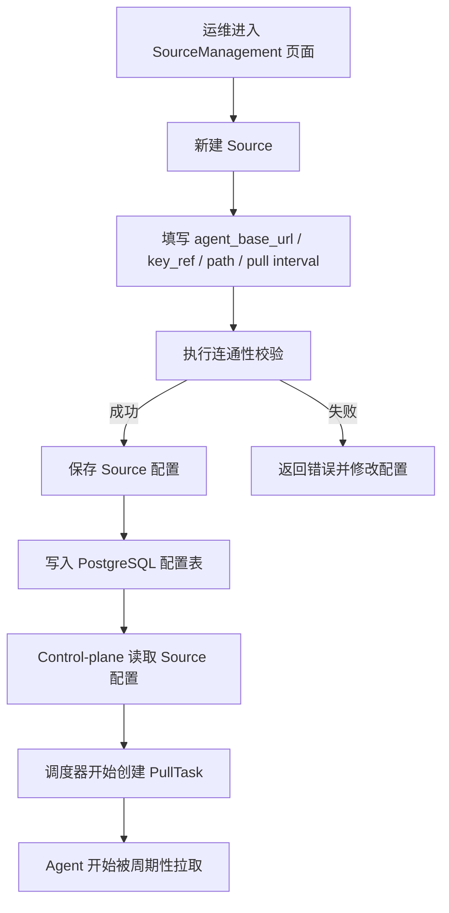
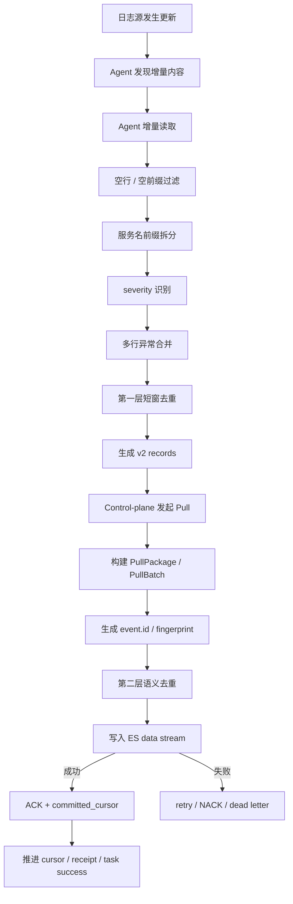
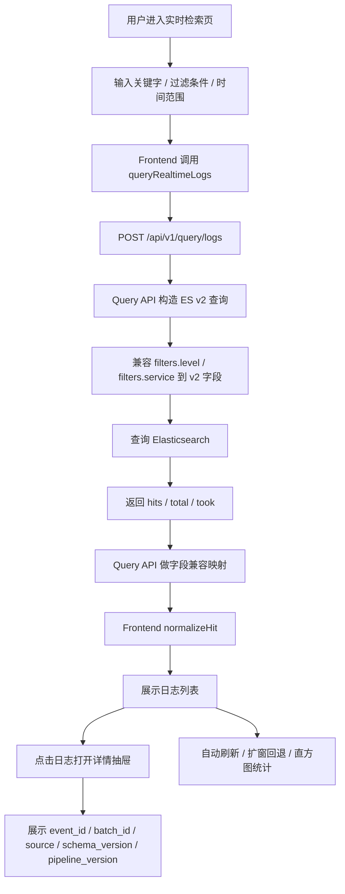
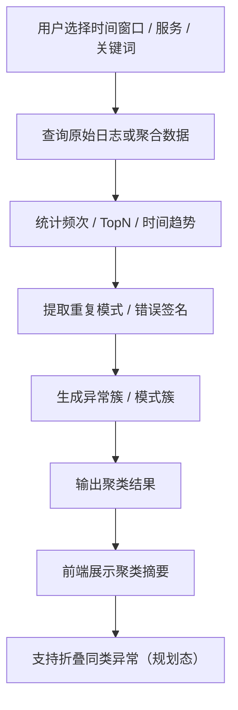
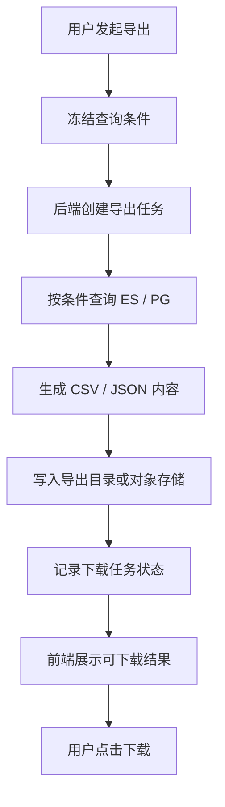

# NexusLog 运行时业务流程图（当前实现为主）

## 文档目的

本文档补充 NexusLog 在**运行时业务闭环**上的专题流程图，重点从“用户行为”和“系统行为”角度细化流程，覆盖：

- Source 接入配置
- 日志采集与入库
- 日志查询与前端展示
- 日志分析与聚类
- 导出与下载

> 适用口径：以**当前真实实现**为主；若某段流程仍属目标能力或规划态，会在图下明确标注。

---

## 1. 日志采集接入配置流程

> 口径：当前真实实现主流程。  
> 用于说明 Source 从配置到开始调度拉取的过程。



**Markdown 版（类图片样式）**

```text
┌────────────────────────────────────────────────────────────────────┐
│                    Source 接入配置流程（类图片样式）              │
├────────────────────────────────────────────────────────────────────┤
│ 运维进入 SourceManagement 页面                                     │
│   ↓                                                                │
│ 新建 Source                                                         │
│   ↓ 填写 agent_base_url / key_ref / path / interval               │
│ 执行连通性校验                                                     │
│   ├─ 成功 → 保存 Source 配置 → 写入 PostgreSQL 配置表             │
│   │        → Control-plane 读取配置 → 创建 PullTask               │
│   │        → Agent 被周期性拉取                                   │
│   └─ 失败 → 返回错误并修改配置                                    │
└────────────────────────────────────────────────────────────────────┘
```

**说明**：

- 当前链路以 Control-plane 主动拉 Agent 为核心
- 这是“接入配置”视角，不展开日志内容本身的归一化细节

---

## 2. 日志采集与入库细化流程

> 口径：当前真实实现主流程。  
> 这张图与 `32-log-sequence-diagram-mermaid.md` 的时序图互补：`32` 偏交互顺序，这里偏业务决策流。



**Markdown 版（类图片样式）**

```text
┌────────────────────────────────────────────────────────────────────┐
│                    日志采集与入库细化流程                         │
├────────────────────────────────────────────────────────────────────┤
│ 日志源更新 → Agent 发现增量 → Agent 增量读取                      │
│   ↓                                                                │
│ 空行 / 空前缀过滤                                                  │
│   ↓                                                                │
│ 服务名前缀拆分 → severity 识别 → 多行异常合并                     │
│   ↓                                                                │
│ 第一层短窗去重 → 生成 v2 records                                   │
│   ↓                                                                │
│ Control-plane Pull → PullPackage / PullBatch                       │
│   ↓                                                                │
│ event.id / fingerprint → 第二层语义去重                            │
│   ↓                                                                │
│ 写入 ES data stream                                                │
│   ├─ 成功 → ACK + committed_cursor → cursor / receipt / success    │
│   └─ 失败 → retry / NACK / dead letter                             │
└────────────────────────────────────────────────────────────────────┘
```

**说明**：

- 当前主链路已覆盖两层去重：Agent 第一层 + Control-plane 第二层
- 死信、回执、游标推进属于当前真实实现的重要追踪能力

---

## 3. 日志查询与前端展示流程

> 口径：当前真实实现主流程。  
> 这张图描述了从前端到 Query API 再到 ES 的实际查询路径。



**Markdown 版（类图片样式）**

```text
┌────────────────────────────────────────────────────────────────────┐
│                    日志查询与前端展示流程                         │
├────────────────────────────────────────────────────────────────────┤
│ 用户进入实时检索页                                                 │
│   ↓ 输入关键词 / 过滤条件 / 时间范围                               │
│ Frontend 调用 queryRealtimeLogs                                    │
│   ↓ POST /api/v1/query/logs                                        │
│ Query API 构造 ES v2 查询                                          │
│   ↓ 兼容 filters.level / filters.service                           │
│ Elasticsearch 返回 hits / total / took                             │
│   ↓ Query API 兼容字段映射                                         │
│ Frontend normalizeHit                                              │
│   ↓                                                                │
│ 展示日志列表 → 打开详情抽屉 → 展示 event_id / batch_id / source    │
│   └─ 同时支持自动刷新 / 扩窗回退 / 直方图统计                      │
└────────────────────────────────────────────────────────────────────┘
```

**说明**：

- 当前前端已经使用真实接口，不再以测试 mock 数据作为主来源
- 查询结果由 Query API 统一做 v2 兼容映射，前端不再承担 ES 字段猜测责任

---

## 4. 日志分析与聚类流程

> 口径：当前实现 + 规划扩展。  
> 当前查询和基础聚合存在，但“聚类分析”和“前端折叠展示”仍属于后续增强能力。



**Markdown 版（类图片样式）**

```text
┌────────────────────────────────────────────────────────────────────┐
│                    日志分析与聚类流程（含规划态）                 │
├────────────────────────────────────────────────────────────────────┤
│ 用户选择时间窗口 / 服务 / 关键词                                   │
│   ↓ 查询原始日志或聚合数据                                         │
│ 统计频次 / TopN / 时间趋势                                          │
│   ↓ 提取重复模式 / 错误签名                                         │
│ 生成异常簇 / 模式簇                                                 │
│   ↓ 输出聚类结果                                                    │
│ 前端展示聚类摘要                                                    │
│   └─ 支持折叠同类异常（规划态）                                     │
└────────────────────────────────────────────────────────────────────┘
```

**说明**：

- 当前主链路已具备聚合检索基础
- 聚类分析与前端折叠展示在规划中，不应误认为当前已全部落地

---

## 5. 报表 / 导出流程

> 口径：当前实现 + 目标收口。  
> 用于说明从查询条件到导出文件的闭环。



**Markdown 版（类图片样式）**

```text
┌────────────────────────────────────────────────────────────────────┐
│                      报表 / 导出流程（类图片样式）                │
├────────────────────────────────────────────────────────────────────┤
│ 用户发起导出                                                       │
│   ↓ 冻结查询条件                                                   │
│ 后端创建导出任务                                                   │
│   ↓ 按条件查询 ES / PG                                             │
│ 生成 CSV / JSON 内容                                               │
│   ↓ 写入导出目录或对象存储                                         │
│ 记录下载任务状态                                                   │
│   ↓ 前端展示可下载结果                                             │
│ 用户点击下载                                                       │
└────────────────────────────────────────────────────────────────────┘
```

**说明**：

- 导出与查询共享查询条件，但导出是异步任务化流程
- 导出文件的存放位置和保留时间应与对象存储 / 生命周期策略联动管理

---

## 参考资料

- `docs/NexusLog/process/04-frontend-pages-functional-workflow-dataflow.md`
- `docs/NexusLog/process/20-log-ingest-e2e-workflow-v2.md`
- `docs/NexusLog/process/31-log-end-to-end-lifecycle-and-uml.md`
- `docs/NexusLog/process/32-log-sequence-diagram-mermaid.md`
- `apps/frontend-console/src/pages/search/RealtimeSearch.tsx`
- `services/data-services/query-api/internal/service/service.go`

---

## 变更记录

| 日期 | 版本 | 变更内容 |
|---|---|---|
| 2026-03-07 | v1.1 | 在每个 Mermaid 图下补充纯 Markdown / ASCII 的类图片样式图，便于在不支持 Mermaid 的环境中阅读 |
| 2026-03-07 | v1.0 | 初始版本。新增 Source 接入、采集入库、查询展示、分析聚类、报表导出五张运行时业务流程图 |
