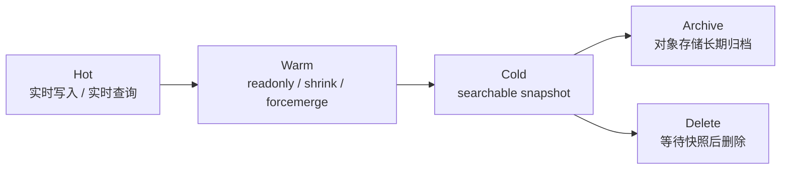
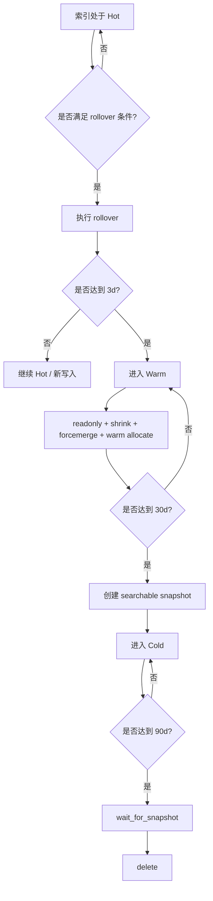
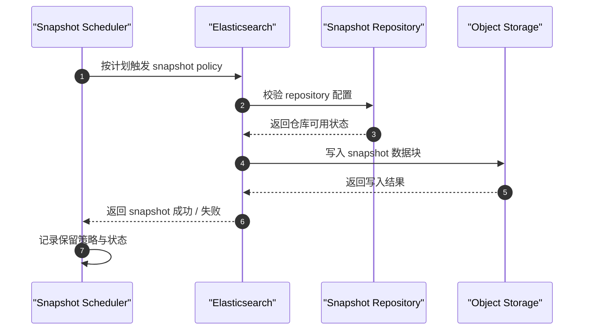
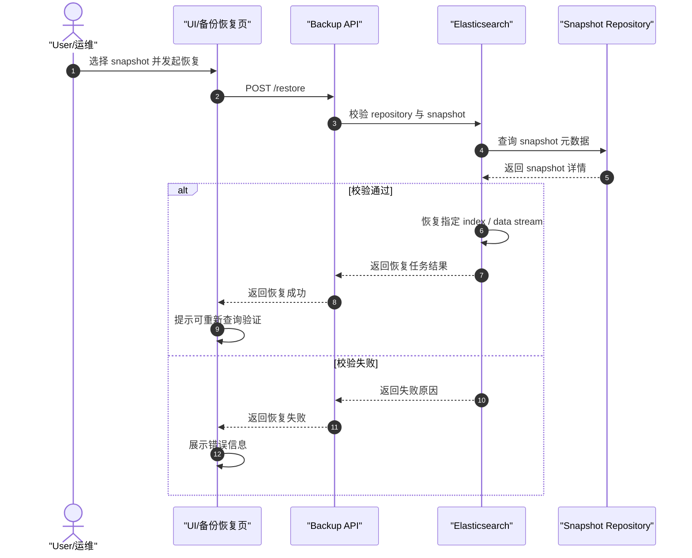
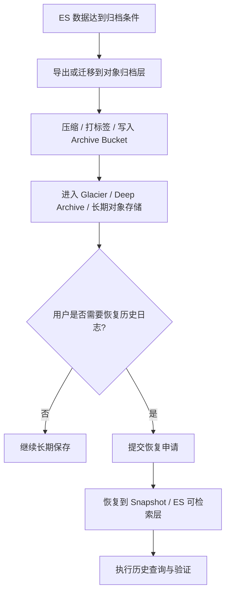
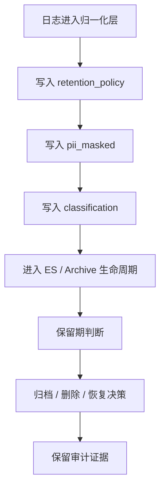

# NexusLog 存储、备份与归档流程图

## 文档目的

本文档专门描述 NexusLog 的存储生命周期与平台运维相关流程，覆盖：

- ES 热 / 温 / 冷 / 删除
- 快照创建与恢复
- 长期归档与恢复
- 保留策略与治理字段的作用位置

> 适用口径：以当前配置与当前文档口径为主，并保留目标治理能力说明。

---

## 1. ES 热温冷归档流程图

> 口径：当前配置主路径。  
> 参考：`storage/elasticsearch/ilm/nexuslog-logs-ilm.json`。



**Markdown 版（类图片样式）**

```text
┌────────────────────────────────────────────────────────────────────┐
│                 ES 热温冷归档主路径（类图片样式）                 │
├────────────────────────────────────────────────────────────────────┤
│ Hot：实时写入 / 实时查询                                            │
│   ↓                                                                  │
│ Warm：readonly / shrink / forcemerge                                │
│   ↓                                                                  │
│ Cold：searchable snapshot                                            │
│   ├─→ Archive：对象存储长期归档                                     │
│   └─→ Delete：等待快照后删除                                        │
└────────────────────────────────────────────────────────────────────┘
```

**说明**：

- Hot / Warm / Cold / Delete 是 ES 生命周期主阶段
- Archive 体现长期对象归档视角，与 Delete 存在治理衔接关系

---

## 2. ILM 生命周期决策流程图

> 口径：当前配置主路径。  
> 该图强调“什么时候发生什么动作”。



**Markdown 版（类图片样式）**

```text
┌────────────────────────────────────────────────────────────────────┐
│                   ILM 生命周期决策（类图片样式）                  │
├────────────────────────────────────────────────────────────────────┤
│ 索引处于 Hot                                                        │
│   ↓ 判断是否满足 rollover 条件                                      │
│   ├─ 否：继续 Hot                                                   │
│   └─ 是：执行 rollover                                              │
│             ↓ 判断是否达到 3d                                       │
│             ├─ 否：继续 Hot / 新写入                                │
│             └─ 是：进入 Warm                                        │
│                      ↓ readonly + shrink + forcemerge               │
│                      ↓ 判断是否达到 30d                             │
│                      ├─ 否：停留 Warm                               │
│                      └─ 是：创建 searchable snapshot → 进入 Cold    │
│                                   ↓ 判断是否达到 90d               │
│                                   ├─ 否：停留 Cold                  │
│                                   └─ 是：wait_for_snapshot → delete │
└────────────────────────────────────────────────────────────────────┘
```

**说明**：

- 该图是 ILM 决策逻辑，不涉及前端或查询视图
- 若对象归档策略与 ILM 删除阈值接近，需要额外治理保证“先归档再删除”

---

## 3. 快照备份流程图

> 口径：当前配置 + 备份平台流程。  
> 参考：`storage/elasticsearch/snapshots/snapshot-policy.json`。



**Markdown 版（类图片样式）**

```text
┌────────────────────────────────────────────────────────────────────┐
│                     快照备份流程（类图片样式）                     │
├────────────────────────────────────────────────────────────────────┤
│ Snapshot Scheduler → Elasticsearch：按计划触发 snapshot policy     │
│ Elasticsearch → Snapshot Repository：校验 repository 配置          │
│ Snapshot Repository → Elasticsearch：返回仓库可用状态              │
│ Elasticsearch → Object Storage：写入 snapshot 数据块               │
│ Object Storage → Elasticsearch：返回写入结果                       │
│ Elasticsearch → Scheduler：返回 snapshot 成功 / 失败               │
│ Scheduler：记录保留策略与状态                                      │
└────────────────────────────────────────────────────────────────────┘
```

**说明**：

- 快照是索引级备份能力，不等于对象归档
- 快照更偏恢复场景，归档更偏长期保留场景

---

## 4. 快照恢复流程图

> 口径：当前恢复能力主流程。  
> 用于说明从快照恢复到可检索状态的闭环。



**Markdown 版（类图片样式）**

```text
┌────────────────────────────────────────────────────────────────────┐
│                     快照恢复流程（类图片样式）                     │
├────────────────────────────────────────────────────────────────────┤
│ User/运维 → UI：选择 snapshot 并发起恢复                           │
│ UI → Backup API：POST /restore                                     │
│ Backup API → Elasticsearch：校验 repository 与 snapshot            │
│ Elasticsearch → Snapshot Repository：查询 snapshot 元数据          │
│ Snapshot Repository → Elasticsearch：返回 snapshot 详情            │
│   ├─ 校验通过：恢复 index / data stream → 返回恢复成功             │
│   │            UI 提示重新查询验证                                  │
│   └─ 校验失败：返回失败原因 → UI 展示错误信息                      │
└────────────────────────────────────────────────────────────────────┘
```

**说明**：

- 快照恢复重点在“恢复到可检索状态”
- 恢复后仍应做一次查询验证，而不是仅依赖任务成功状态

---

## 5. 长期归档与恢复流程图

> 口径：当前配置 + 目标治理路径。  
> 该图重点描述超过在线保留窗口后的长期归档闭环。



**Markdown 版（类图片样式）**

```text
┌────────────────────────────────────────────────────────────────────┐
│                  长期归档与恢复流程（类图片样式）                 │
├────────────────────────────────────────────────────────────────────┤
│ ES 数据达到归档条件                                                 │
│   ↓ 导出或迁移到对象归档层                                         │
│ 压缩 / 打标签 / 写入 Archive Bucket                                │
│   ↓                                                                │
│ Glacier / Deep Archive / 长期对象存储                              │
│   ↓                                                                │
│ 判断用户是否需要恢复历史日志                                       │
│   ├─ 否：继续长期保存                                               │
│   └─ 是：提交恢复申请 → 恢复到 Snapshot / ES 可检索层              │
│             ↓ 执行历史查询与验证                                   │
└────────────────────────────────────────────────────────────────────┘
```

**说明**：

- 长期归档强调低成本长保留
- 恢复路径可以回到 Snapshot 层或直接回到 ES 可检索层，具体依部署策略决定

---

## 6. 保留策略与治理流程图

> 口径：当前字段口径 + 目标治理流程。  
> 用于说明治理字段如何参与存储生命周期和合规过程。



**Markdown 版（类图片样式）**

```text
┌────────────────────────────────────────────────────────────────────┐
│                   保留策略与治理流程（类图片样式）                │
├────────────────────────────────────────────────────────────────────┤
│ 日志进入归一化层                                                   │
│   ↓ 写入 retention_policy                                          │
│   ↓ 写入 pii_masked                                                │
│   ↓ 写入 classification                                            │
│   ↓ 进入 ES / Archive 生命周期                                      │
│   ↓ 保留期判断                                                     │
│   ↓ 归档 / 删除 / 恢复决策                                         │
│   ↓ 保留审计证据                                                   │
└────────────────────────────────────────────────────────────────────┘
```

**说明**：

- 当前治理字段已进入 v2 文档结构，但完整治理流程仍在持续收口
- 该图主要用于表达“字段治理如何影响生命周期决策”

---

## 参考资料

- `storage/elasticsearch/ilm/nexuslog-logs-ilm.json`
- `storage/elasticsearch/snapshots/snapshot-policy.json`
- `storage/glacier/archive-policies/archive-policy.yaml`
- `storage/minio/lifecycle/lifecycle-rules.yaml`
- `docs/NexusLog/10-process/31-log-end-to-end-lifecycle-and-uml.md`

---

## 变更记录

| 日期 | 版本 | 变更内容 |
|---|---|---|
| 2026-03-07 | v1.1 | 在每个 Mermaid 图下补充纯 Markdown / ASCII 的类图片样式图，便于在不支持 Mermaid 的环境中阅读 |
| 2026-03-07 | v1.0 | 初始版本。新增热温冷归档、ILM 决策、快照备份、快照恢复、长期归档恢复、保留策略治理六张流程图 |
