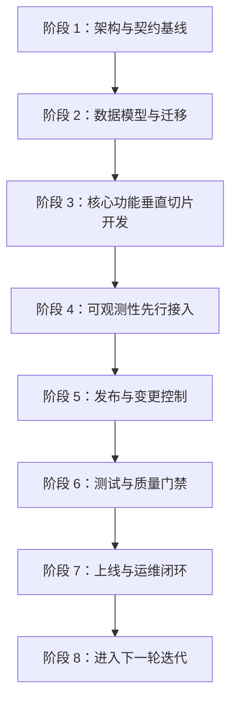
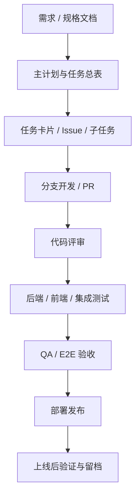
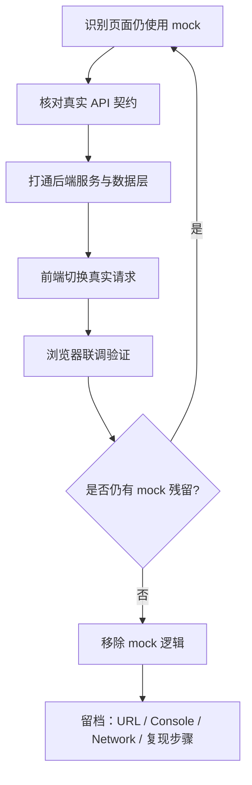
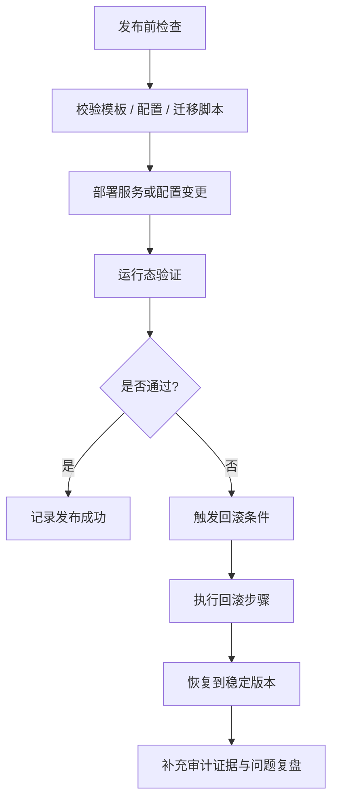
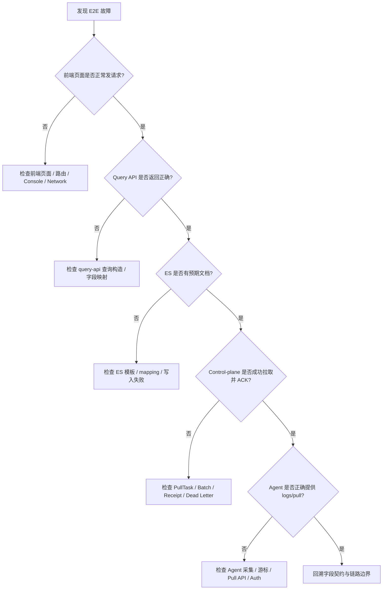

# NexusLog 工程交付与运维流程图

## 文档目的

本文档聚焦 NexusLog 项目本身的工程流程，补齐从需求、开发、测试、去 Mock、发布、回滚到 E2E 排障的一整套流程图。  
它回答的核心问题是：**这个项目应该如何被持续开发、验证、发布和运维。**

> 适用口径：当前工程流程与当前过程文档基线。

---

## 1. 项目 SDLC 完整流程图

> 参考：`docs/NexusLog/10-process/02-end-to-end-development-workflow.md`



**Markdown 版（类图片样式）**

```text
┌──────────────────────────────────────────────────────────────────────┐
│                    NexusLog 项目 SDLC 完整交付路径                  │
├──────────────────────────────────────────────────────────────────────┤
│ 阶段 1  架构与契约基线                                              │
└──────────────────────────────┬───────────────────────────────────────┘
                               ↓
┌──────────────────────────────────────────────────────────────────────┐
│ 阶段 2  数据模型与迁移                                              │
└──────────────────────────────┬───────────────────────────────────────┘
                               ↓
┌──────────────────────────────────────────────────────────────────────┐
│ 阶段 3  核心功能垂直切片开发                                        │
└──────────────────────────────┬───────────────────────────────────────┘
                               ↓
┌──────────────────────────────────────────────────────────────────────┐
│ 阶段 4  可观测性先行接入                                            │
└──────────────────────────────┬───────────────────────────────────────┘
                               ↓
┌──────────────────────────────────────────────────────────────────────┐
│ 阶段 5  发布与变更控制                                              │
└──────────────────────────────┬───────────────────────────────────────┘
                               ↓
┌──────────────────────────────────────────────────────────────────────┐
│ 阶段 6  测试与质量门禁                                              │
└──────────────────────────────┬───────────────────────────────────────┘
                               ↓
┌──────────────────────────────────────────────────────────────────────┐
│ 阶段 7  上线与运维闭环                                              │
└──────────────────────────────┬───────────────────────────────────────┘
                               ↓
┌──────────────────────────────────────────────────────────────────────┐
│ 阶段 8  进入下一轮迭代                                              │
└──────────────────────────────────────────────────────────────────────┘
```

**说明**：

- 这是项目级工程流程，不是运行时业务流程
- 它定义的是“交付顺序”和“质量门禁顺序”

---

## 2. 需求 → 任务 → 开发 → 验收流程图

> 参考：`23-project-master-plan-and-task-registry.md`、`25-full-lifecycle-task-registry.md`



**Markdown 版（类图片样式）**

```text
┌──────────────────────────────────────────────────────────────────────┐
│                  需求到交付的工程拆解与流转主路径                    │
└──────────────────────────────────────────────────────────────────────┘

┌──────────────────────┐
│ 需求 / 规格文档      │
└──────────┬───────────┘
           ↓
┌──────────────────────┐
│ 主计划与任务总表     │
└──────────┬───────────┘
           ↓
┌──────────────────────┐
│ 任务卡片 / Issue     │
│ 子任务 / 分工拆解    │
└──────────┬───────────┘
           ↓
┌──────────────────────┐
│ 分支开发 / PR        │
└──────────┬───────────┘
           ↓
┌──────────────────────┐
│ 代码评审             │
└──────────┬───────────┘
           ↓
┌──────────────────────┐
│ 后端 / 前端 / 集成测 │
│ 试                    │
└──────────┬───────────┘
           ↓
┌──────────────────────┐
│ QA / E2E 验收        │
└──────────┬───────────┘
           ↓
┌──────────────────────┐
│ 部署发布             │
└──────────┬───────────┘
           ↓
┌──────────────────────┐
│ 上线后验证与留档     │
└──────────────────────┘
```

**说明**：

- 该图用于统一“从需求到交付”的工程理解
- 任务注册表是承接总体规划到实施的中间层

---

## 3. 去 Mock 收口流程图

> 参考：`24-sdlc-development-process.md` 中 Mock 清除追踪与前端调试规范。



**Markdown 版（类图片样式）**

```text
┌──────────────────────────────────────────────────────────────────────┐
│                     去 Mock 收口与真实链路切换流程                  │
└──────────────────────────────────────────────────────────────────────┘

┌────────────────────────────┐
│ 识别页面仍使用 mock        │
└──────────────┬─────────────┘
               ↓
┌────────────────────────────┐
│ 核对真实 API 契约          │
└──────────────┬─────────────┘
               ↓
┌────────────────────────────┐
│ 打通后端服务与数据层       │
└──────────────┬─────────────┘
               ↓
┌────────────────────────────┐
│ 前端切换真实请求           │
└──────────────┬─────────────┘
               ↓
┌────────────────────────────┐
│ 浏览器联调验证             │
└──────────────┬─────────────┘
               ↓
        ┌──────────────────────┐
        │ 是否仍有 mock 残留?  │
        └───────┬────────┬─────┘
                │是      │否
                │        ↓
                │   ┌────────────────────────────┐
                │   │ 移除 mock 逻辑             │
                │   └──────────────┬─────────────┘
                │                  ↓
                │   ┌────────────────────────────┐
                │   │ 留档：URL / Console /      │
                │   │ Network / 复现步骤         │
                │   └────────────────────────────┘
                │
                └──────────────→ 返回起点继续收口
```

**说明**：

- 该图对应前端真实接入的收口流程
- 浏览器验证和四类证据留档是完成标准的一部分

---

## 4. 发布 / 回滚 / 审计流程图

> 参考：`20-log-ingest-e2e-workflow-v2.md`、`24-sdlc-development-process.md`



**Markdown 版（类图片样式）**

```text
┌──────────────────────────────────────────────────────────────────────┐
│                   发布、回滚与审计闭环控制流程                      │
└──────────────────────────────────────────────────────────────────────┘

┌────────────────────────────┐
│ 发布前检查                 │
└──────────────┬─────────────┘
               ↓
┌────────────────────────────┐
│ 校验模板 / 配置 / 迁移脚本 │
└──────────────┬─────────────┘
               ↓
┌────────────────────────────┐
│ 部署服务或配置变更         │
└──────────────┬─────────────┘
               ↓
┌────────────────────────────┐
│ 运行态验证                 │
└──────────────┬─────────────┘
               ↓
        ┌──────────────────────┐
        │      是否通过?       │
        └───────┬────────┬─────┘
                │是      │否
                ↓        ↓
     ┌────────────────┐  ┌────────────────┐
     │ 记录发布成功   │  │ 触发回滚条件   │
     └────────┬───────┘  └────────┬───────┘
              │                   ↓
              │         ┌────────────────────────────┐
              │         │ 执行回滚步骤               │
              │         └──────────────┬─────────────┘
              │                        ↓
              │         ┌────────────────────────────┐
              │         │ 恢复到稳定版本             │
              │         └──────────────┬─────────────┘
              │                        ↓
              └──────────────→┌──────────────────────┐
                               │ 补充审计证据与复盘  │
                               └──────────────────────┘
```

**说明**：

- 发布不是结束，运行态验证和审计证据是闭环的一部分
- 对日志链路类变更，模板与索引命中检查尤其关键

---

## 5. E2E 故障排查流程图

> 本图用于帮助快速定位“问题在前端、Query API、ES、Control-plane 还是 Agent”。



**Markdown 版（类图片样式）**

```text
┌──────────────────────────────────────────────────────────────────────┐
│                    E2E 故障定位与证据回溯总流程                     │
└──────────────────────────────────────────────────────────────────────┘

┌────────────────────────────┐
│ 发现 E2E 故障              │
└──────────────┬─────────────┘
               ↓
      ┌──────────────────────────────┐
      │ 前端页面是否正常发请求?      │
      └───────────┬───────────┬──────┘
                  │否         │是
                  ↓           ↓
┌─────────────────────────┐   ┌──────────────────────────────┐
│ 检查页面 / 路由 /       │   │ Query API 是否返回正确?     │
│ Console / Network       │   └───────────┬───────────┬──────┘
└─────────────────────────┘               │否         │是
                                          ↓           ↓
                              ┌──────────────────┐   ┌──────────────────────┐
                              │ 检查 query-api   │   │ ES 是否有预期文档?   │
                              │ 查询构造/字段映射│   └────────┬───────┬─────┘
                              └──────────────────┘            │否      │是
                                                              ↓        ↓
                                                ┌──────────────────┐  ┌─────────────────────────────┐
                                                │ 检查 ES 模板 /   │  │ Control-plane 是否成功 ACK? │
                                                │ mapping / 写失败 │  └──────────┬──────────┬───────┘
                                                └──────────────────┘             │否        │是
                                                                                 ↓          ↓
                                                                  ┌────────────────────┐  ┌────────────────────────┐
                                                                  │ 检查 PullTask /    │  │ Agent 是否正确提供     │
                                                                  │ Batch / DeadLetter │  │ logs/pull?              │
                                                                  └────────────────────┘  └──────────┬────────┬─────┘
                                                                                                     │否      │是
                                                                                                     ↓        ↓
                                                                                       ┌────────────────────┐  ┌────────────────────┐
                                                                                       │ 检查 Agent 采集 / │  │ 回溯字段契约与     │
                                                                                       │ 游标 / Pull / Auth │  │ 链路边界           │
                                                                                       └────────────────────┘  └────────────────────┘
```

**说明**：

- 该图适合作为排障 Runbook 的入口
- 建议和 `32` 文档的日志链路时序图配合使用

---

## 参考资料

- `docs/NexusLog/10-process/02-end-to-end-development-workflow.md`
- `docs/NexusLog/10-process/23-project-master-plan-and-task-registry.md`
- `docs/NexusLog/10-process/24-sdlc-development-process.md`
- `docs/NexusLog/10-process/25-full-lifecycle-task-registry.md`
- `docs/NexusLog/10-process/30-development-issues-and-solutions.md`

---

## 变更记录

| 日期 | 版本 | 变更内容 |
|---|---|---|
| 2026-03-07 | v1.1 | 在每个 Mermaid 图下补充纯 Markdown / ASCII 的类图片样式流程图，便于在不支持 Mermaid 的环境中阅读 |
| 2026-03-07 | v1.0 | 初始版本。新增 SDLC、需求到验收、去 Mock 收口、发布回滚审计、E2E 故障排查五张工程流程图 |
