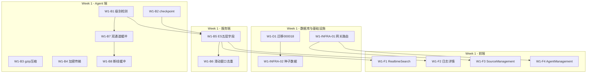
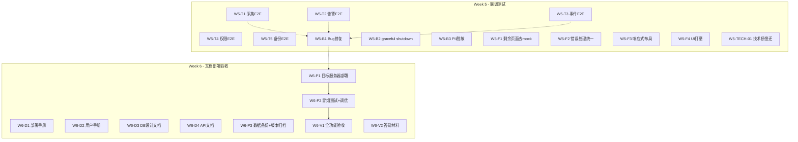
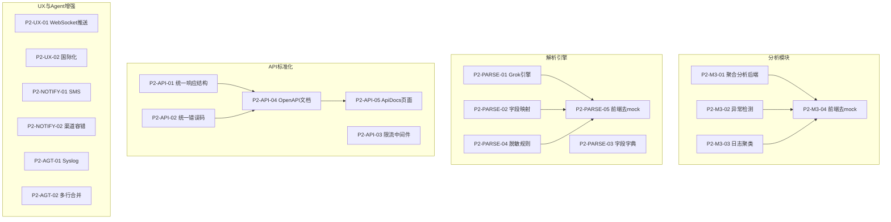
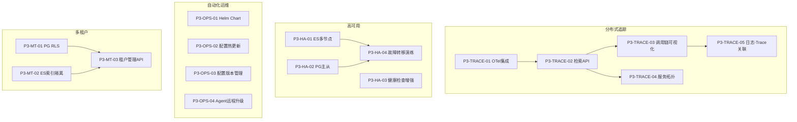

# NexusLog 全生命周期任务清单

> 版本：v1.0
> 基线日期：2026-03-06
> 开发规范：`24-sdlc-development-process.md`
> 整体规划：`23-project-master-plan-and-task-registry.md`
> Phase 1 详细执行：`22-full-requirements-and-6week-plan.md`

---

## 1. 文档目的与使用说明

### 1.1 文档目的

本文档是 NexusLog 项目的**可执行任务清单**，覆盖 4 个 Phase、全部 25 个功能模块。每个任务以标准化卡片呈现，包含依赖关系、变更范围、约束规则、验收标准和回滚方案。

### 1.2 使用方式

1. **AI Agent**：按任务 ID 顺序（同周内按 D→INFRA→B→F 优先级）领取任务，按 doc24 定义的 SDLC 流程执行
2. **人类审查者**：根据验收标准检查任务完成质量，审核代码变更范围是否合规
3. **项目管理**：通过里程碑检查点（第 8 章）跟踪进度

### 1.3 任务 ID 命名规则

| 前缀 | 含义 | 示例 |
|------|------|------|
| W{n}-D{m} | Week n 数据库任务 | W1-D1 |
| W{n}-INFRA-{m} | Week n 基础设施任务 | W1-INFRA-01 |
| W{n}-B{m} | Week n 后端任务 | W1-B1 |
| W{n}-F{m} | Week n 前端任务 | W1-F1 |
| W{n}-T{m} | Week n 测试任务 | W5-T1 |
| P{n}-{module}-{m} | Phase n 模块任务 | P2-M3-01 |
| P{n}-{category}-{m} | Phase n 分类任务 | P2-PARSE-01 |

---

## 2. 任务卡片格式规范

每个任务使用以下标准格式：

```
#### [任务ID] 任务标题

- **阶段**: Phase X / WY | **优先级**: PZ | **工时**: Nh
- **依赖**: 前置任务ID | **服务**: 涉及服务 | **SDLC**: 适用步骤编号
- **变更**: 需要创建或修改的文件路径
- **约束**: 代码/性能/安全约束
- **验收**:
  - [ ] 具体验收标准项
- **回滚**: 回滚方案
```

**字段说明**：
- **SDLC**：对应 doc24 第 3 章的步骤编号（1=需求理解, 2=后端开发, 3=后端测试, 4=接口联调, 5=前端接入, 6=部署验证, 7=chrome-devtools MCP 全功能测试）
- **优先级**：P0=必须完成, P1=应该完成, P2=可以延后

**步骤 7 全功能测试强制规则**（适用于所有 SDLC 包含 `→7` 的任务）：

> 所有包含步骤 7 的任务，在验收时**自动继承**以下全功能测试要求，无需在每个任务卡片中重复声明：
>
> 1. **工具**：必须使用 `chrome-devtools` MCP（配置见 `.mcp.json`，连接 `http://127.0.0.1:9222`）
> 2. **测试范围**：页面渲染、所有交互操作（CRUD）、路由跳转、API 联调、错误弹窗验证
> 3. **四类证据**：每个任务完成后必须收集 —— 目标 URL / Console 信息 / Network 请求 / 可复现操作步骤
> 4. **阻塞级别**：硬阻塞 —— 四类证据缺少任一项，任务不可标记为完成
> 5. **错误场景**：必须验证 API 出错时 `message.error()` 弹窗正确展示，页面不崩溃
> 6. **详细流程**：参考 doc24 第 12 章「前端调试规范」的标准测试流程（4 阶段 12 步）

---

## 3. 任务依赖关系图

### 3.1 Phase 1 Week 1 依赖图



### 3.2 Phase 1 Week 2~4 依赖图

```mermaid
graph TD
    subgraph w2 [Week 2]
        W2D1["W2-D1 迁移000019"] --> W2B1["W2-B1 用户CRUD"]
        W2D1 --> W2B4["W2-B4 告警规则CRUD"]
        W2D1 --> W2B6["W2-B6 通知渠道+邮箱"]
        W2D1 --> W2B8["W2-B8 审计中间件"]
        W2B1 --> W2B2["W2-B2 权限中间件"]
        W2B1 --> W2B3["W2-B3 /users/me"]
        W2B4 --> W2B5["W2-B5 告警评估引擎"]
        W2B5 --> W2B9["W2-B9 告警抑制"]
        W2B6 --> W2B7["W2-B7 钉钉Webhook"]
        W2B1 --> W2F1["W2-F1 UserManagement"]
        W2B1 --> W2F2["W2-F2 RolePermissions"]
        W2B2 --> W2F3["W2-F3 菜单权限"]
        W2B4 --> W2F4["W2-F4 AlertRules"]
        W2B5 --> W2F5["W2-F5 AlertList"]
        W2B6 --> W2F6["W2-F6 NotificationConfig"]
    end

    subgraph w3 [Week 3]
        W3D1["W3-D1 迁移000020"] --> W3B1["W3-B1 事件CRUD"]
        W3B1 --> W3B2["W3-B2 事件状态流转"]
        W3B2 --> W3B3["W3-B3 告警自动创建事件"]
        W3B2 --> W3B4["W3-B4 事件SLA"]
        W3D1 --> W3B6["W3-B6 资源指标存储"]
        W3B6 --> W3B7["W3-B7 阈值+告警"]
        W3B6 --> W3B8["W3-B8 指标查询API"]
        W3B5["W3-B5 Agent系统指标"] --> W3B6
        W3B1 --> W3F1["W3-F1 IncidentList"]
        W3B2 --> W3F2["W3-F2 IncidentDetail"]
        W3B8 --> W3F5["W3-F5 PerformanceMonitoring"]
        W3B7 --> W3F6["W3-F6 HealthCheck"]
    end

    subgraph w4 [Week 4]
        W4D1["W4-D1 迁移000021"] --> W4B1["W4-B1 导出异步任务"]
        W4B1 --> W4B2["W4-B2 导出下载"]
        W4B3["W4-B3 ES备份/恢复"]
        W4B4["W4-B4 Dashboard概览"]
        W4B5["W4-B5 聚合分析"]
        W4B6["W4-B6 告警静默"]
        W4B7["W4-B7 审计日志查询"]
        W4B1 --> W4F1["W4-F1 DownloadRecords"]
        W4B3 --> W4F2["W4-F2 BackupRecovery"]
        W4B4 --> W4F3["W4-F3 Dashboard"]
        W4B5 --> W4F4["W4-F4 AggregateAnalysis"]
        W4B7 --> W4F5["W4-F5 AuditLogs"]
        W4B6 --> W4F6["W4-F6 SilencePolicy"]
    end

    W2D1 -.-> W3D1
    W3D1 -.-> W4D1
```



### 3.3 Phase 1 Week 5~6 依赖图



### 3.4 Phase 2 依赖图



### 3.5 Phase 3 依赖图



---

## 4. Phase 1 完整任务卡片（Week 1~6）

> 总计 82 个任务。每周按 D（数据库）→ INFRA（基础设施）→ B（后端）→ F（前端）顺序执行。

### 4.1 Week 1：采集链路打通

---

#### W1-D1 迁移 000018: roles 种子数据

- **阶段**: Phase 1 / W1 | **优先级**: P0 | **工时**: 2h
- **依赖**: 无 | **服务**: database | **SDLC**: 1→2→6
- **变更**:
  - `storage/postgresql/migrations/000018_roles_seed_data.up.sql` — 新增
  - `storage/postgresql/migrations/000018_roles_seed_data.down.sql` — 新增
- **约束**: 使用 `ON CONFLICT DO NOTHING` 保证幂等；roles 表已在 000001 中创建
- **验收**:
  - [ ] `make db-migrate-up STEPS=1` 成功，roles 表含 admin/operator/viewer 三行
  - [ ] `make db-migrate-down STEPS=1` 成功，种子数据被清除
  - [ ] 重复执行 up 不报错（幂等）
- **回滚**: `make db-migrate-down STEPS=1`

---

#### W1-INFRA-01 网关路由配置（告警/事件/监控/导出/备份）

- **阶段**: Phase 1 / W1 | **优先级**: P0 | **工时**: 3h
- **依赖**: 无 | **服务**: gateway | **SDLC**: 1→2→6
- **变更**:
  - `gateway/openresty/conf.d/upstream.conf` — 修改（确认 control_plane upstream）
  - `gateway/openresty/nginx.conf` — 修改（添加 Phase 1 新增 API 路由）
- **约束**: 所有新增 `/api/v1/alert/*`、`/api/v1/incidents/*`、`/api/v1/notification/*`、`/api/v1/metrics/*`、`/api/v1/resource/*`、`/api/v1/backup/*`、`/api/v1/export/*` 路由到 control_plane upstream；`/api/v1/users/*`、`/api/v1/roles/*` 路由到 api_service
- **验收**:
  - [ ] `make dev-up` 后网关正常启动
  - [ ] 新增路径通过网关可达到对应后端服务
- **回滚**: `git checkout -- gateway/openresty/`

---

#### W1-INFRA-02 dev 环境种子数据脚本

- **阶段**: Phase 1 / W1 | **优先级**: P1 | **工时**: 2h
- **依赖**: W1-D1 | **服务**: scripts | **SDLC**: 1→2→6
- **变更**:
  - `scripts/seed-demo.sh` — 新增
- **约束**: 脚本幂等可重复执行；连接参数从环境变量读取
- **验收**:
  - [ ] 脚本创建 3 个测试用户（admin/operator/viewer）
  - [ ] 脚本可重复执行不报错
- **回滚**: 删除 `scripts/seed-demo.sh`

---

#### W1-B1 Agent 日志级别检测（三层策略）

- **阶段**: Phase 1 / W1 | **优先级**: P0 | **工时**: 6h
- **依赖**: 无 | **服务**: collector-agent | **SDLC**: 1→2→3→6
- **变更**:
  - `agents/collector-agent/internal/collector/level_detector.go` — 新增
  - `agents/collector-agent/internal/collector/level_detector_test.go` — 新增
- **约束**: CPU 增量 < 2%；必须覆盖三种格式；未识别默认 `UNKNOWN`
- **验收**:
  - [ ] 功能：`[ERROR] xxx` → ERROR, `{"level":"error"}` → ERROR, 独立关键字 → 对应级别
  - [ ] 边界：空行/二进制不 panic，返回 UNKNOWN
  - [ ] 性能：CPU 增量 < 2%
  - [ ] 测试：单元测试覆盖三种格式 + 边界，覆盖率 >= 80%
- **回滚**: 删除 level_detector.go，pipeline 中移除调用

---

#### W1-B2 Agent inode/dev + checkpoint 原子写入

- **阶段**: Phase 1 / W1 | **优先级**: P0 | **工时**: 6h
- **依赖**: 无 | **服务**: collector-agent | **SDLC**: 1→2→3→6
- **变更**:
  - `agents/collector-agent/internal/checkpoint/checkpoint.go` — 修改
  - `agents/collector-agent/internal/checkpoint/checkpoint_test.go` — 新增/修改
- **约束**: checkpoint flush 间隔 <= 5s；使用 `tmp+rename` 原子写入；记录 inode+device
- **验收**:
  - [ ] 功能：日志轮转后无漏采（inode 变更检测）
  - [ ] 边界：进程 crash 后 offset 正确恢复；checkpoint 文件损坏不 panic
  - [ ] 测试：覆盖轮转、crash 恢复、文件损坏场景
- **回滚**: `git checkout -- agents/collector-agent/internal/checkpoint/`

---

#### W1-B3 Agent Pull 响应 gzip 压缩

- **阶段**: Phase 1 / W1 | **优先级**: P0 | **工时**: 4h
- **依赖**: 无 | **服务**: collector-agent | **SDLC**: 1→2→3→6
- **变更**:
  - `agents/collector-agent/internal/pullapi/service.go` — 修改
  - `agents/collector-agent/internal/pullapi/compression.go` — 新增
  - `agents/collector-agent/internal/pullapi/compression_test.go` — 新增
- **约束**: 小于 1KB 跳过压缩；响应头含 `X-Compression: gzip`；压缩耗时 < 10ms/批次
- **验收**:
  - [ ] 功能：带宽降低 50%+；`X-Compression` 响应头正确
  - [ ] 边界：小于 1KB 不压缩；空响应不报错
  - [ ] 性能：压缩耗时 < 10ms/批次
- **回滚**: `git checkout -- agents/collector-agent/internal/pullapi/`

---

#### W1-B4 加密传输（AES-256-GCM + HMAC）

- **阶段**: Phase 1 / W1 | **优先级**: P0 | **工时**: 8h
- **依赖**: 无 | **服务**: collector-agent + control-plane | **SDLC**: 1→2→3→6
- **变更**:
  - `agents/collector-agent/internal/crypto/` — 新增目录（encrypt.go, encrypt_test.go）
  - `services/control-plane/internal/ingest/crypto/` — 新增目录（decrypt.go, decrypt_test.go）
- **约束**: 时间窗口 5min 防重放；active/next 双 key 轮换窗口均可解密；密钥不持久化到磁盘
- **验收**:
  - [ ] 功能：抓包不可见明文日志
  - [ ] 边界：密钥不匹配返回 NACK + `INGEST_DECRYPT_FAILED`
  - [ ] 安全：active/next 双 key 窗口均可解密；5min 外 nonce 拒绝
  - [ ] 测试：覆盖加解密、密钥不匹配、重放攻击场景，覆盖率 >= 80%
- **回滚**: 删除 crypto 目录；配置 fallback 明文模式开关

---

#### W1-B5 ES 五层字段落库 + event_id 幂等

- **阶段**: Phase 1 / W1 | **优先级**: P0 | **工时**: 6h
- **依赖**: W1-B1, W1-B2 | **服务**: control-plane | **SDLC**: 1→2→3→4→6
- **变更**:
  - `services/control-plane/internal/ingest/es_sink.go` — 修改
  - `services/control-plane/internal/ingest/field_model.go` — 新增
  - `storage/elasticsearch/index-templates/nexuslog-logs.json` — 新增
- **约束**: `_id = event_id`；ES 文档必须含 5 层字段（raw/event/transport/ingest/governance）；与 doc20 第 3 节字段模型一致
- **验收**:
  - [ ] 功能：ES 文档含 `agent_id`/`level`/`host`/`collect_time`/`ingested_at`/`schema_version`
  - [ ] 边界：重复写入同一 event_id 不增加文档数
  - [ ] 测试：字段模型映射的单元测试
- **回滚**: `git checkout -- services/control-plane/internal/ingest/`

---

#### W1-B6 滑动窗口去重

- **阶段**: Phase 1 / W1 | **优先级**: P0 | **工时**: 4h
- **依赖**: W1-B5 | **服务**: control-plane | **SDLC**: 1→2→3→6
- **变更**:
  - `services/control-plane/internal/ingest/deduplicator.go` — 新增
  - `services/control-plane/internal/ingest/deduplicator_test.go` — 新增
- **约束**: 窗口 5 批次；内存 < 50MB；基于 event_id 去重
- **验收**:
  - [ ] 功能：重拉同批次 ES 文档数不增长
  - [ ] 可观测：`duplicate_ratio` 指标可查
  - [ ] 性能：内存 < 50MB
  - [ ] 测试：覆盖率 >= 80%
- **回滚**: 删除 deduplicator.go，es_sink 中移除去重调用

---

#### W1-B7 critical/normal 双通道缓冲

- **阶段**: Phase 1 / W1 | **优先级**: P0 | **工时**: 5h
- **依赖**: W1-B1 | **服务**: collector-agent | **SDLC**: 1→2→3→6
- **变更**:
  - `agents/collector-agent/internal/pipeline/buffer.go` — 新增
  - `agents/collector-agent/internal/pipeline/buffer_test.go` — 新增
- **约束**: 缓冲上限 10000 条；critical 通道优先发送；溢出时裁剪 normal 保留 critical
- **验收**:
  - [ ] 功能：critical（FATAL/ERROR）端到端时延显著低于 normal
  - [ ] 边界：缓冲溢出时 critical 不被裁剪
  - [ ] 测试：覆盖优先级分配、溢出裁剪场景
- **回滚**: 删除 buffer.go，恢复单通道逻辑

---

#### W1-B8 Agent 断线缓冲 + 指数退避重试

- **阶段**: Phase 1 / W1 | **优先级**: P0 | **工时**: 5h
- **依赖**: W1-B7 | **服务**: collector-agent | **SDLC**: 1→2→3→6
- **变更**:
  - `agents/collector-agent/internal/retry/wal_buffer.go` — 新增
  - `agents/collector-agent/internal/retry/wal_buffer_test.go` — 新增
- **约束**: WAL 最大 1GB；路径可配置；指数退避初始 1s 最大 5min；缓存满时丢弃 normal 保留 critical
- **验收**:
  - [ ] 功能：网络中断时本地 WAL 缓存；恢复后自动续传
  - [ ] 边界：WAL 达到 1GB 上限时丢弃策略正确
  - [ ] 测试：覆盖断线、恢复、WAL 满场景
- **回滚**: 删除 wal_buffer.go，恢复原有 retry 逻辑

---

#### W1-F1 RealtimeSearch 级别/来源筛选

- **阶段**: Phase 1 / W1 | **优先级**: P0 | **工时**: 4h
- **依赖**: W1-B5 | **服务**: frontend | **SDLC**: 1→5→6→7
- **变更**:
  - `apps/frontend-console/src/pages/search/RealtimeSearch.tsx` — 修改
  - `apps/frontend-console/src/api/query.ts` — 修改
- **约束**: 筛选响应 < 3s；级别下拉含 DEBUG~FATAL + ALL；来源下拉列出已有 agent
- **验收**:
  - [ ] 功能：级别下拉可选 DEBUG~FATAL；来源下拉列出已有 agent
  - [ ] 性能：筛选响应 < 3s
  - [ ] 回归：现有搜索功能不受影响
- **回滚**: `git checkout -- apps/frontend-console/src/pages/search/RealtimeSearch.tsx`

---

#### W1-F2 日志详情展开（五层字段）

- **阶段**: Phase 1 / W1 | **优先级**: P0 | **工时**: 4h
- **依赖**: W1-B5 | **服务**: frontend | **SDLC**: 1→5→6→7
- **变更**:
  - `apps/frontend-console/src/pages/search/RealtimeSearch.tsx` — 修改（添加行展开功能）
- **约束**: 展开面板分组显示 raw/event/transport/ingest/governance 五层字段
- **验收**:
  - [ ] 功能：点击日志行展开，显示五层字段分组
  - [ ] 边界：字段缺失时显示 "—" 而非报错
- **回滚**: `git checkout -- apps/frontend-console/src/pages/search/RealtimeSearch.tsx`

---

#### W1-F3 SourceManagement 接入真实 API

- **阶段**: Phase 1 / W1 | **优先级**: P0 | **工时**: 4h
- **依赖**: W1-INFRA-01 | **服务**: frontend | **SDLC**: 1→5→6→7
- **变更**:
  - `apps/frontend-console/src/pages/ingestion/SourceManagement.tsx` — 修改
  - `apps/frontend-console/src/api/ingest.ts` — 新增
- **约束**: 完全删除 mock 数据；使用 `CRUD /api/v1/ingest/pull-sources`；错误时 `message.error()` 弹窗
- **验收**:
  - [ ] 功能：可新增/编辑/禁用采集源；状态实时刷新；所有数据来自真实 API
  - [ ] 边界：API 出错时弹窗提示错误原因，页面不崩溃
- **回滚**: `git checkout -- apps/frontend-console/src/pages/ingestion/`

---

#### W1-F4 AgentManagement 接入真实 API

- **阶段**: Phase 1 / W1 | **优先级**: P0 | **工时**: 3h
- **依赖**: W1-INFRA-01 | **服务**: frontend | **SDLC**: 1→5→6→7
- **变更**:
  - `apps/frontend-console/src/pages/ingestion/AgentManagement.tsx` — 修改
  - `apps/frontend-console/src/api/ingest.ts` — 修改
- **约束**: 完全删除 mock 数据；使用 `GET /api/v1/ingest/pull-sources` 按 agent 分组；错误时 `message.error()` 弹窗
- **验收**:
  - [ ] 功能：按 agent 分组显示；在线/离线状态可见；所有数据来自真实 API
  - [ ] 边界：API 出错时弹窗提示错误原因，页面不崩溃
- **回滚**: `git checkout -- apps/frontend-console/src/pages/ingestion/AgentManagement.tsx`

---

### 4.2 Week 2：权限体系 + 告警基础

---

#### W2-D1 迁移 000019: alert_events + notification_channels + audit_logs 补充索引

- **阶段**: Phase 1 / W2 | **优先级**: P0 | **工时**: 3h
- **依赖**: W1-D1 | **服务**: database | **SDLC**: 1→2→6
- **变更**:
  - `storage/postgresql/migrations/000019_alert_events_notification_channels.up.sql` — 新增
  - `storage/postgresql/migrations/000019_alert_events_notification_channels.down.sql` — 新增
- **约束**: alert_rules 已在 000001 创建，此处仅新增 alert_events 和 notification_channels；audit_logs 补充索引
- **验收**:
  - [ ] `make db-migrate-up STEPS=1` 成功
  - [ ] `make db-migrate-down STEPS=1` 成功
  - [ ] 新增表结构符合 doc22 DDL 定义
- **回滚**: `make db-migrate-down STEPS=1`

---

#### W2-B1 用户 CRUD + 角色分配接口

- **阶段**: Phase 1 / W2 | **优先级**: P0 | **工时**: 8h
- **依赖**: W2-D1 | **服务**: api-service | **SDLC**: 1→2→3→4→6
- **变更**:
  - `services/api-service/internal/handler/user_handler.go` — 新增
  - `services/api-service/internal/service/user_service.go` — 新增
  - `services/api-service/internal/repository/user_repository.go` — 新增
  - `services/api-service/internal/handler/user_handler_test.go` — 新增
- **约束**: 密码最小 8 位，含大小写+数字+特殊字符中 3 种；连续 5 次失败锁定 15 分钟；密码 bcrypt hash；handler→service→repository 分层
- **验收**:
  - [ ] 功能：admin 可创建/编辑/禁用用户并分配角色
  - [ ] 安全：密码 bcrypt 存储；锁定逻辑正确
  - [ ] 边界：弱密码返回 422；重复用户名返回 409
  - [ ] 测试：覆盖率 >= 60%
- **回滚**: 删除 user_handler/service/repository 文件

---

#### W2-B2 权限中间件

- **阶段**: Phase 1 / W2 | **优先级**: P0 | **工时**: 5h
- **依赖**: W2-B1 | **服务**: api-service + control-plane + data-services | **SDLC**: 1→2→3→4→6
- **变更**:
  - `services/api-service/internal/handler/auth_middleware.go` — 新增
  - `services/api-service/internal/handler/auth_middleware_test.go` — 新增
- **约束**: token → user → role → permission 校验链；403 返回统一错误体；校验耗时 < 5ms
- **验收**:
  - [ ] 功能：viewer 无法访问 admin 路由（返回 403）
  - [ ] 边界：无 token 返回 401；过期 token 返回 401
  - [ ] 性能：校验耗时 < 5ms
  - [ ] 测试：三角色隔离的单元测试
- **回滚**: 删除中间件文件，恢复无权限校验状态

---

#### W2-B3 /users/me 接口

- **阶段**: Phase 1 / W2 | **优先级**: P0 | **工时**: 2h
- **依赖**: W2-B1 | **服务**: api-service | **SDLC**: 1→2→3→4→6
- **变更**:
  - `services/api-service/internal/handler/user_handler.go` — 修改
- **约束**: 返回用户信息 + 角色 + 权限列表
- **验收**:
  - [ ] 功能：返回当前 token 对应用户的完整信息
  - [ ] 安全：仅返回当前用户信息，不可查看他人
- **回滚**: 删除 /users/me 路由注册

---

#### W2-B4 告警规则 CRUD

- **阶段**: Phase 1 / W2 | **优先级**: P0 | **工时**: 6h
- **依赖**: W2-D1 | **服务**: control-plane | **SDLC**: 1→2→3→4→6
- **变更**:
  - `services/control-plane/internal/alert/rule_handler.go` — 新增
  - `services/control-plane/internal/alert/rule_service.go` — 新增
  - `services/control-plane/internal/alert/rule_repository.go` — 新增
- **约束**: 支持 keyword/level_count/threshold 三种规则类型；规则数上限 1000
- **验收**:
  - [ ] 功能：CRUD + 启用/禁用告警规则
  - [ ] 边界：超过 1000 条规则返回 422
  - [ ] 测试：覆盖率 >= 60%
- **回滚**: 删除 alert/ 目录

---

#### W2-B5 告警评估引擎（定时扫描 ES）

- **阶段**: Phase 1 / W2 | **优先级**: P0 | **工时**: 8h
- **依赖**: W2-B4 | **服务**: control-plane | **SDLC**: 1→2→3→6
- **变更**:
  - `services/control-plane/internal/alert/evaluator.go` — 新增
  - `services/control-plane/internal/alert/evaluator_test.go` — 新增
- **约束**: 每 30s 扫描一次；匹配规则后 10s 内生成告警事件；单次扫描 < 5s
- **验收**:
  - [ ] 功能：日志匹配规则后自动生成告警事件
  - [ ] 性能：单次扫描 < 5s
  - [ ] 可观测：`alert_eval_duration_seconds` 和 `alert_events_total` 指标
- **回滚**: 删除 evaluator.go，停止定时扫描

---

#### W2-B6 通知渠道管理 + 邮箱 SMTP

- **阶段**: Phase 1 / W2 | **优先级**: P0 | **工时**: 6h
- **依赖**: W2-D1 | **服务**: control-plane | **SDLC**: 1→2→3→4→6
- **变更**:
  - `services/control-plane/internal/notification/channel_handler.go` — 新增
  - `services/control-plane/internal/notification/channel_service.go` — 新增
  - `services/control-plane/internal/notification/channel_repository.go` — 新增
  - `services/control-plane/internal/notification/smtp_sender.go` — 新增
- **约束**: SMTP TLS 加密；测试发送接口可用
- **验收**:
  - [ ] 功能：CRUD 通知渠道 + 邮箱测试发送成功
  - [ ] 安全：SMTP 密码加密存储
  - [ ] 测试：覆盖率 >= 60%
- **回滚**: 删除 notification/ 目录

---

#### W2-B7 钉钉 Webhook 通知

- **阶段**: Phase 1 / W2 | **优先级**: P0 | **工时**: 3h
- **依赖**: W2-B6 | **服务**: control-plane | **SDLC**: 1→2→3→4→6
- **变更**:
  - `services/control-plane/internal/notification/dingtalk_sender.go` — 新增
- **约束**: Webhook 超时 10s；告警消息使用卡片格式
- **验收**:
  - [ ] 功能：钉钉群收到告警消息卡片
  - [ ] 边界：Webhook URL 无效返回错误而非 panic
- **回滚**: 删除 dingtalk_sender.go

---

#### W2-B8 操作审计日志中间件

- **阶段**: Phase 1 / W2 | **优先级**: P0 | **工时**: 4h
- **依赖**: W2-D1 | **服务**: api-service + control-plane | **SDLC**: 1→2→3→6
- **变更**:
  - `services/api-service/internal/handler/audit_middleware.go` — 新增
  - `services/control-plane/internal/middleware/audit_middleware.go` — 新增
- **约束**: 登录/退出/创建用户/修改规则等写操作自动记录
- **验收**:
  - [ ] 功能：写操作自动记录到 audit_logs 表
  - [ ] 边界：GET 请求不记录审计日志
- **回滚**: 删除 audit_middleware.go

---

#### W2-B9 告警抑制规则（同源去重）

- **阶段**: Phase 1 / W2 | **优先级**: P1 | **工时**: 3h
- **依赖**: W2-B5 | **服务**: control-plane | **SDLC**: 1→2→3→6
- **变更**:
  - `services/control-plane/internal/alert/suppressor.go` — 新增
  - `services/control-plane/internal/alert/suppressor_test.go` — 新增
- **约束**: 同一规则 + 同一 source 在 5 分钟内不重复生成告警事件；抑制窗口可配置
- **验收**:
  - [ ] 功能：5 分钟内同源同规则不重复告警
  - [ ] 可观测：抑制计数可查
  - [ ] 测试：覆盖率 >= 80%
- **回滚**: 删除 suppressor.go

---

#### W2-F1 UserManagement 接入真实 API

- **阶段**: Phase 1 / W2 | **优先级**: P0 | **工时**: 4h
- **依赖**: W2-B1 | **服务**: frontend | **SDLC**: 1→5→6→7
- **变更**:
  - `apps/frontend-console/src/pages/security/UserManagement.tsx` — 修改
  - `apps/frontend-console/src/api/user.ts` — 新增
- **验收**:
  - [ ] 用户列表/创建/编辑/角色分配全部接入真实 API，mock 数据完全删除
  - [ ] API 出错时 `message.error()` 弹窗提示错误原因，页面不崩溃
- **回滚**: `git checkout -- apps/frontend-console/src/pages/security/UserManagement.tsx`

---

#### W2-F2 RolePermissions 接入真实 API

- **阶段**: Phase 1 / W2 | **优先级**: P0 | **工时**: 3h
- **依赖**: W2-B1 | **服务**: frontend | **SDLC**: 1→5→6→7
- **变更**:
  - `apps/frontend-console/src/pages/security/RolePermissions.tsx` — 修改
  - `apps/frontend-console/src/api/user.ts` — 修改
- **验收**:
  - [ ] 角色列表展示权限详情
- **回滚**: `git checkout -- apps/frontend-console/src/pages/security/RolePermissions.tsx`

---

#### W2-F3 菜单权限控制

- **阶段**: Phase 1 / W2 | **优先级**: P0 | **工时**: 4h
- **依赖**: W2-B2, W2-B3 | **服务**: frontend | **SDLC**: 1→5→6→7
- **变更**:
  - `apps/frontend-console/src/components/layout/AppSidebar.tsx` — 修改
  - `apps/frontend-console/src/stores/authStore.ts` — 修改
- **验收**:
  - [ ] viewer 看不到管理类菜单项（用户管理/系统设置等）
  - [ ] operator 看不到 admin 专属菜单
- **回滚**: `git checkout -- apps/frontend-console/src/components/layout/AppSidebar.tsx`

---

#### W2-F4 AlertRules 接入真实 API

- **阶段**: Phase 1 / W2 | **优先级**: P0 | **工时**: 4h
- **依赖**: W2-B4 | **服务**: frontend | **SDLC**: 1→5→6→7
- **变更**:
  - `apps/frontend-console/src/pages/alerts/AlertRules.tsx` — 修改
  - `apps/frontend-console/src/api/alert.ts` — 新增
- **验收**:
  - [ ] 规则创建/编辑/启用/禁用全部接入真实 API
- **回滚**: `git checkout -- apps/frontend-console/src/pages/alerts/AlertRules.tsx`

---

#### W2-F5 AlertList 接入真实 API

- **阶段**: Phase 1 / W2 | **优先级**: P0 | **工时**: 3h
- **依赖**: W2-B5 | **服务**: frontend | **SDLC**: 1→5→6→7
- **变更**:
  - `apps/frontend-console/src/pages/alerts/AlertList.tsx` — 修改
  - `apps/frontend-console/src/api/alert.ts` — 修改
- **验收**:
  - [ ] 告警列表实时刷新；支持状态筛选
- **回滚**: `git checkout -- apps/frontend-console/src/pages/alerts/AlertList.tsx`

---

#### W2-F6 NotificationConfig 接入真实 API

- **阶段**: Phase 1 / W2 | **优先级**: P0 | **工时**: 3h
- **依赖**: W2-B6 | **服务**: frontend | **SDLC**: 1→5→6→7
- **变更**:
  - `apps/frontend-console/src/pages/alerts/NotificationConfig.tsx` — 修改
  - `apps/frontend-console/src/api/notification.ts` — 新增
- **验收**:
  - [ ] 渠道配置 + 测试发送功能全部接入真实 API
- **回滚**: `git checkout -- apps/frontend-console/src/pages/alerts/NotificationConfig.tsx`

---

### 4.3 Week 3：事件管理 + 资源监控

---

#### W3-D1 迁移 000020: incidents + incident_timeline + server_metrics + resource_thresholds

- **阶段**: Phase 1 / W3 | **优先级**: P0 | **工时**: 3h
- **依赖**: W2-D1 | **服务**: database | **SDLC**: 1→2→6
- **变更**:
  - `storage/postgresql/migrations/000020_incidents_metrics.up.sql` — 新增
  - `storage/postgresql/migrations/000020_incidents_metrics.down.sql` — 新增
- **验收**:
  - [ ] up/down 双向成功；4 张表创建正确；索引生效
- **回滚**: `make db-migrate-down STEPS=1`

---

#### W3-B1 事件 CRUD 接口

- **阶段**: Phase 1 / W3 | **优先级**: P0 | **工时**: 6h
- **依赖**: W3-D1 | **服务**: control-plane | **SDLC**: 1→2→3→4→6
- **变更**:
  - `services/control-plane/internal/incident/handler.go` — 新增
  - `services/control-plane/internal/incident/service.go` — 新增
  - `services/control-plane/internal/incident/repository.go` — 新增
- **验收**:
  - [ ] 事件创建/列表/详情/更新/归档全部可用
  - [ ] 测试：覆盖率 >= 60%
- **回滚**: 删除 incident/ 目录

---

#### W3-B2 事件状态流转 + 时间线

- **阶段**: Phase 1 / W3 | **优先级**: P0 | **工时**: 5h
- **依赖**: W3-B1 | **服务**: control-plane | **SDLC**: 1→2→3→4→6
- **变更**:
  - `services/control-plane/internal/incident/state_machine.go` — 新增
  - `services/control-plane/internal/incident/timeline.go` — 新增
- **约束**: 状态机：open→acknowledged→investigating→resolved→closed；每次变更记录到 incident_timeline
- **验收**:
  - [ ] 功能：acknowledge/resolve/close 端点可用；时间线记录每次变更
  - [ ] 边界：非法状态转换返回 422
- **回滚**: 删除 state_machine.go + timeline.go

---

#### W3-B3 告警自动创建事件

- **阶段**: Phase 1 / W3 | **优先级**: P0 | **工时**: 3h
- **依赖**: W3-B2, W2-B5 | **服务**: control-plane | **SDLC**: 1→2→3→6
- **变更**:
  - `services/control-plane/internal/alert/incident_creator.go` — 新增
- **约束**: critical 告警自动创建事件；已有相同 alert 不重复创建
- **验收**:
  - [ ] critical 告警自动生成 incident
  - [ ] 同一 alert 不重复创建 incident
- **回滚**: 删除 incident_creator.go

---

#### W3-B4 事件 SLA 统计

- **阶段**: Phase 1 / W3 | **优先级**: P1 | **工时**: 4h
- **依赖**: W3-B2 | **服务**: control-plane | **SDLC**: 1→2→3→4→6
- **变更**:
  - `services/control-plane/internal/incident/sla_service.go` — 新增
- **验收**:
  - [ ] `GET /api/v1/incidents/sla/summary` 返回平均响应时间/处理时间/SLA 达标率
- **回滚**: 删除 sla_service.go

---

#### W3-B5 Agent 系统资源采集

- **阶段**: Phase 1 / W3 | **优先级**: P0 | **工时**: 4h
- **依赖**: 无 | **服务**: collector-agent | **SDLC**: 1→2→3→6
- **变更**:
  - `agents/collector-agent/internal/metrics/system_metrics.go` — 新增
  - `agents/collector-agent/internal/metrics/system_metrics_test.go` — 新增
- **约束**: CPU/内存/磁盘使用率 30s 采集一次；采集本身 CPU < 1%
- **验收**:
  - [ ] `GET /agent/v1/metrics` 返回 CPU/内存/磁盘使用率
  - [ ] 采集本身 CPU < 1%
- **回滚**: 删除 metrics/ 目录

---

#### W3-B6 资源指标上报 + 存储

- **阶段**: Phase 1 / W3 | **优先级**: P0 | **工时**: 4h
- **依赖**: W3-D1, W3-B5 | **服务**: control-plane | **SDLC**: 1→2→3→4→6
- **变更**:
  - `services/control-plane/internal/metrics/handler.go` — 新增
  - `services/control-plane/internal/metrics/service.go` — 新增
  - `services/control-plane/internal/metrics/repository.go` — 新增
- **约束**: 保留 30 天自动清理
- **验收**:
  - [ ] `POST /api/v1/metrics/report` 可接收 Agent 指标
  - [ ] 指标写入 server_metrics 表
- **回滚**: 删除 metrics/ 目录

---

#### W3-B7 资源阈值 + 触发告警

- **阶段**: Phase 1 / W3 | **优先级**: P0 | **工时**: 4h
- **依赖**: W3-B6, W2-B5 | **服务**: control-plane | **SDLC**: 1→2→3→4→6
- **变更**:
  - `services/control-plane/internal/metrics/threshold_handler.go` — 新增
  - `services/control-plane/internal/metrics/threshold_evaluator.go` — 新增
- **约束**: 复用 M4 通知渠道；支持 CPU/内存/磁盘三种阈值
- **验收**:
  - [ ] `CRUD /api/v1/resource/thresholds` 可用
  - [ ] CPU > 80% 时自动触发告警通知
- **回滚**: 删除 threshold_handler.go + threshold_evaluator.go

---

#### W3-B8 资源指标查询接口

- **阶段**: Phase 1 / W3 | **优先级**: P0 | **工时**: 3h
- **依赖**: W3-B6 | **服务**: control-plane | **SDLC**: 1→2→3→4→6
- **变更**:
  - `services/control-plane/internal/metrics/handler.go` — 修改
- **约束**: 支持 1h/6h/24h/7d 范围
- **验收**:
  - [ ] `GET /api/v1/metrics/servers/:agent_id` 返回指定时间范围的指标序列
- **回滚**: 删除查询相关路由和 handler 方法

---

#### W3-F1 IncidentList 接入真实 API

- **阶段**: Phase 1 / W3 | **优先级**: P0 | **工时**: 3h
- **依赖**: W3-B1 | **服务**: frontend | **SDLC**: 1→5→6→7
- **变更**:
  - `apps/frontend-console/src/pages/incidents/IncidentList.tsx` — 修改
  - `apps/frontend-console/src/api/incident.ts` — 新增
- **验收**:
  - [ ] 事件列表支持状态/严重度/时间筛选
- **回滚**: `git checkout -- apps/frontend-console/src/pages/incidents/IncidentList.tsx`

---

#### W3-F2 IncidentDetail + 时间线

- **阶段**: Phase 1 / W3 | **优先级**: P0 | **工时**: 4h
- **依赖**: W3-B2 | **服务**: frontend | **SDLC**: 1→5→6→7
- **变更**:
  - `apps/frontend-console/src/pages/incidents/IncidentDetail.tsx` — 修改
  - `apps/frontend-console/src/api/incident.ts` — 修改
- **验收**:
  - [ ] 完整时间线展示；状态流转按钮可操作
- **回滚**: `git checkout -- apps/frontend-console/src/pages/incidents/IncidentDetail.tsx`

---

#### W3-F3 IncidentTimeline 接入

- **阶段**: Phase 1 / W3 | **优先级**: P0 | **工时**: 2h
- **依赖**: W3-B2 | **服务**: frontend | **SDLC**: 1→5→6→7
- **变更**:
  - `apps/frontend-console/src/pages/incidents/IncidentTimeline.tsx` — 修改
- **验收**:
  - [ ] 时间线组件展示每个节点（时间、操作人、动作、备注）
- **回滚**: `git checkout -- apps/frontend-console/src/pages/incidents/IncidentTimeline.tsx`

---

#### W3-F4 IncidentArchive 接入

- **阶段**: Phase 1 / W3 | **优先级**: P0 | **工时**: 2h
- **依赖**: W3-B2 | **服务**: frontend | **SDLC**: 1→5→6→7
- **变更**:
  - `apps/frontend-console/src/pages/incidents/IncidentArchive.tsx` — 修改
- **约束**: 归档时必须填写研判结论
- **验收**:
  - [ ] 归档操作需填写研判结论后方可提交
- **回滚**: `git checkout -- apps/frontend-console/src/pages/incidents/IncidentArchive.tsx`

---

#### W3-F5 PerformanceMonitoring 接入

- **阶段**: Phase 1 / W3 | **优先级**: P0 | **工时**: 4h
- **依赖**: W3-B8 | **服务**: frontend | **SDLC**: 1→5→6→7
- **变更**:
  - `apps/frontend-console/src/pages/performance/PerformanceMonitoring.tsx` — 修改
  - `apps/frontend-console/src/api/metrics.ts` — 新增
- **约束**: 使用 ECharts 时序图
- **验收**:
  - [ ] 按 agent 分组显示 CPU/内存/磁盘图表
- **回滚**: `git checkout -- apps/frontend-console/src/pages/performance/PerformanceMonitoring.tsx`

---

#### W3-F6 HealthCheck 阈值配置

- **阶段**: Phase 1 / W3 | **优先级**: P0 | **工时**: 3h
- **依赖**: W3-B7 | **服务**: frontend | **SDLC**: 1→5→6→7
- **变更**:
  - `apps/frontend-console/src/pages/performance/HealthCheck.tsx` — 修改
  - `apps/frontend-console/src/api/metrics.ts` — 修改
- **验收**:
  - [ ] 阈值 CRUD + 启用/禁用
- **回滚**: `git checkout -- apps/frontend-console/src/pages/performance/HealthCheck.tsx`

---

### 4.4 Week 4：导出/备份 + Dashboard

---

#### W4-D1 迁移 000021: export_jobs

- **阶段**: Phase 1 / W4 | **优先级**: P0 | **工时**: 2h
- **依赖**: W3-D1 | **服务**: database | **SDLC**: 1→2→6
- **变更**:
  - `storage/postgresql/migrations/000021_export_jobs.up.sql` — 新增
  - `storage/postgresql/migrations/000021_export_jobs.down.sql` — 新增
- **验收**:
  - [ ] up/down 双向成功；export_jobs 表创建正确
- **回滚**: `make db-migrate-down STEPS=1`

---

#### W4-B1 日志导出异步任务

- **阶段**: Phase 1 / W4 | **优先级**: P0 | **工时**: 6h
- **依赖**: W4-D1 | **服务**: export-api | **SDLC**: 1→2→3→4→6
- **变更**:
  - `services/data-services/export-api/internal/handler/export_handler.go` — 新增
  - `services/data-services/export-api/internal/service/export_service.go` — 新增
  - `services/data-services/export-api/internal/repository/export_repository.go` — 新增
- **约束**: 异步查 ES → 写 CSV/JSON → 存文件；单次上限 10 万条
- **验收**:
  - [ ] `POST /api/v1/export/jobs` 创建异步导出任务
  - [ ] 任务状态可查询（pending/running/completed/failed）
- **回滚**: 删除 export handler/service/repository

---

#### W4-B2 导出文件下载

- **阶段**: Phase 1 / W4 | **优先级**: P0 | **工时**: 3h
- **依赖**: W4-B1 | **服务**: export-api | **SDLC**: 1→2→3→4→6
- **变更**:
  - `services/data-services/export-api/internal/handler/export_handler.go` — 修改
- **约束**: Content-Disposition 头正确；7 天后自动清理
- **验收**:
  - [ ] `GET /api/v1/export/jobs/:id/download` 文件可下载
- **回滚**: 删除下载路由

---

#### W4-B3 ES snapshot 备份/恢复（含增量）

- **阶段**: Phase 1 / W4 | **优先级**: P0 | **工时**: 8h
- **依赖**: 无 | **服务**: control-plane | **SDLC**: 1→2→3→4→6
- **变更**:
  - `services/control-plane/internal/backup/handler.go` — 新增
  - `services/control-plane/internal/backup/service.go` — 新增
- **约束**: 备份路径可配置；增量备份依赖 ES snapshot 内置增量机制；备份可自定义名称和备注
- **验收**:
  - [ ] 全量/增量备份均可用
  - [ ] 备份成功 → 删除索引 → 恢复 → 数据可查
  - [ ] `POST /api/v1/backup/snapshots/:id/cancel` 可取消进行中的备份
- **回滚**: 删除 backup/ 目录

---

#### W4-B4 Dashboard 概览统计

- **阶段**: Phase 1 / W4 | **优先级**: P0 | **工时**: 5h
- **依赖**: W1-B5 | **服务**: query-api | **SDLC**: 1→2→3→4→6
- **变更**:
  - `services/data-services/query-api/internal/handler/stats_handler.go` — 新增
  - `services/data-services/query-api/internal/service/stats_service.go` — 新增
- **约束**: ES 聚合查询 < 3s
- **验收**:
  - [ ] `GET /api/v1/query/stats/overview` 返回日志总量/级别分布/来源 TopN/告警摘要
  - [ ] 性能：查询 < 3s
- **回滚**: 删除 stats_handler/service

---

#### W4-B5 自定义聚合分析

- **阶段**: Phase 1 / W4 | **优先级**: P1 | **工时**: 4h
- **依赖**: W1-B5 | **服务**: query-api | **SDLC**: 1→2→3→4→6
- **变更**:
  - `services/data-services/query-api/internal/handler/stats_handler.go` — 修改
- **验收**:
  - [ ] `POST /api/v1/query/stats/aggregate` 支持按时间/级别/来源聚合
- **回滚**: 删除聚合相关方法

---

#### W4-B6 告警静默策略

- **阶段**: Phase 1 / W4 | **优先级**: P1 | **工时**: 4h
- **依赖**: W2-B4 | **服务**: control-plane | **SDLC**: 1→2→3→4→6
- **变更**:
  - `services/control-plane/internal/alert/silence_handler.go` — 新增
  - `services/control-plane/internal/alert/silence_service.go` — 新增
- **约束**: 静默期内不发通知但记录告警
- **验收**:
  - [ ] `CRUD /api/v1/alert/silences` 可用
  - [ ] 静默期内告警不触发通知
- **回滚**: 删除 silence_handler/service

---

#### W4-B7 审计日志查询接口

- **阶段**: Phase 1 / W4 | **优先级**: P0 | **工时**: 4h
- **依赖**: W2-B8 | **服务**: audit-api | **SDLC**: 1→2→3→4→6
- **变更**:
  - `services/data-services/audit-api/internal/handler/audit_handler.go` — 新增
  - `services/data-services/audit-api/internal/service/audit_service.go` — 新增
  - `services/data-services/audit-api/internal/repository/audit_repository.go` — 新增
- **约束**: 按用户/动作/时间筛选；分页 + 排序
- **验收**:
  - [ ] `GET /api/v1/audit/logs` 支持筛选/分页/排序
- **回滚**: 删除 audit handler/service/repository

---

#### W4-F1 DownloadRecords 接入

- **阶段**: Phase 1 / W4 | **优先级**: P0 | **工时**: 3h
- **依赖**: W4-B1 | **服务**: frontend | **SDLC**: 1→5→6→7
- **变更**:
  - `apps/frontend-console/src/pages/reports/DownloadRecords.tsx` — 修改
  - `apps/frontend-console/src/api/export.ts` — 新增
- **验收**:
  - [ ] 创建/列表/下载全流程可用
- **回滚**: `git checkout -- apps/frontend-console/src/pages/reports/DownloadRecords.tsx`

---

#### W4-F2 BackupRecovery 接入

- **阶段**: Phase 1 / W4 | **优先级**: P0 | **工时**: 3h
- **依赖**: W4-B3 | **服务**: frontend | **SDLC**: 1→5→6→7
- **变更**:
  - `apps/frontend-console/src/pages/storage/BackupRecovery.tsx` — 修改
  - `apps/frontend-console/src/api/export.ts` — 修改
- **验收**:
  - [ ] 备份列表/触发备份/恢复操作全部可用
- **回滚**: `git checkout -- apps/frontend-console/src/pages/storage/BackupRecovery.tsx`

---

#### W4-F3 Dashboard 真实数据

- **阶段**: Phase 1 / W4 | **优先级**: P0 | **工时**: 5h
- **依赖**: W4-B4 | **服务**: frontend | **SDLC**: 1→5→6→7
- **变更**:
  - `apps/frontend-console/src/pages/Dashboard.tsx` — 修改
  - `apps/frontend-console/src/api/query.ts` — 修改
- **约束**: 自动刷新 30s
- **验收**:
  - [ ] 趋势图/饼图/TopN/告警摘要/健康卡片展示真实数据
  - [ ] 自动刷新 30s
- **回滚**: `git checkout -- apps/frontend-console/src/pages/Dashboard.tsx`

---

#### W4-F4 AggregateAnalysis 接入

- **阶段**: Phase 1 / W4 | **优先级**: P1 | **工时**: 3h
- **依赖**: W4-B5 | **服务**: frontend | **SDLC**: 1→5→6→7
- **变更**:
  - `apps/frontend-console/src/pages/analysis/AggregateAnalysis.tsx` — 修改
- **验收**:
  - [ ] 按维度聚合图表展示真实数据
- **回滚**: `git checkout -- apps/frontend-console/src/pages/analysis/AggregateAnalysis.tsx`

---

#### W4-F5 AuditLogs 接入

- **阶段**: Phase 1 / W4 | **优先级**: P0 | **工时**: 3h
- **依赖**: W4-B7 | **服务**: frontend | **SDLC**: 1→5→6→7
- **变更**:
  - `apps/frontend-console/src/pages/security/AuditLogs.tsx` — 修改
  - `apps/frontend-console/src/api/audit.ts` — 新增
- **验收**:
  - [ ] 审计日志列表 + 筛选功能可用
- **回滚**: `git checkout -- apps/frontend-console/src/pages/security/AuditLogs.tsx`

---

#### W4-F6 SilencePolicy 接入

- **阶段**: Phase 1 / W4 | **优先级**: P1 | **工时**: 2h
- **依赖**: W4-B6 | **服务**: frontend | **SDLC**: 1→5→6→7
- **变更**:
  - `apps/frontend-console/src/pages/alerts/SilencePolicy.tsx` — 修改
- **验收**:
  - [ ] 静默规则管理全部接入真实 API
- **回滚**: `git checkout -- apps/frontend-console/src/pages/alerts/SilencePolicy.tsx`

---

### 4.5 Week 5：联调测试 + 体验优化

---

#### W5-T1 采集链路 E2E 测试

- **阶段**: Phase 1 / W5 | **优先级**: P0 | **工时**: 6h
- **依赖**: W1-B1~B8 全部 | **服务**: 全链路 | **SDLC**: 1→3→6→7
- **变更**:
  - `tests/e2e/tests/ingest-e2e.spec.js` — 新增
- **约束**: 10000 条/分钟无丢失
- **验收**:
  - [ ] 多源多文件、轮转、压力场景通过
  - [ ] 10000 条/分钟无丢失
- **回滚**: 删除测试文件

---

#### W5-T2 告警 E2E 测试

- **阶段**: Phase 1 / W5 | **优先级**: P0 | **工时**: 4h
- **依赖**: W2-B4~B7 | **服务**: 全链路 | **SDLC**: 1→3→6→7
- **变更**:
  - `tests/e2e/tests/alert-e2e.spec.js` — 新增
- **约束**: 30s 内完成规则触发 → 通知送达
- **验收**:
  - [ ] 规则触发 → 通知送达 → 事件创建全链路通过
- **回滚**: 删除测试文件

---

#### W5-T3 事件管理 E2E 测试

- **阶段**: Phase 1 / W5 | **优先级**: P0 | **工时**: 4h
- **依赖**: W3-B1~B4 | **服务**: 全链路 | **SDLC**: 1→3→6→7
- **变更**:
  - `tests/e2e/tests/incident-e2e.spec.js` — 新增
- **验收**:
  - [ ] 7 步闭环（创建→确认→调查→解决→归档）时间线完整
- **回滚**: 删除测试文件

---

#### W5-T4 权限 E2E 测试

- **阶段**: Phase 1 / W5 | **优先级**: P0 | **工时**: 3h
- **依赖**: W2-B1~B3 | **服务**: api-service + frontend | **SDLC**: 1→3→6→7
- **变更**:
  - `tests/e2e/tests/permission-e2e.spec.js` — 新增
- **验收**:
  - [ ] admin/operator/viewer 三角色隔离验证通过
- **回滚**: 删除测试文件

---

#### W5-T5 备份恢复 E2E 测试

- **阶段**: Phase 1 / W5 | **优先级**: P0 | **工时**: 3h
- **依赖**: W4-B3 | **服务**: control-plane + ES | **SDLC**: 1→3→6
- **变更**:
  - `tests/e2e/tests/backup-e2e.spec.js` — 新增
- **验收**:
  - [ ] 备份 → 删除索引 → 恢复 → 数据可查
- **回滚**: 删除测试文件

---

#### W5-B1 Bug 修复 + 性能优化

- **阶段**: Phase 1 / W5 | **优先级**: P0 | **工时**: 8h
- **依赖**: W5-T1~T5 | **服务**: 按 bug 所在服务 | **SDLC**: 1→2→3→6
- **变更**: 按 bug 定位确定
- **约束**: 无 P0 Bug
- **验收**:
  - [ ] 所有 E2E 测试中发现的 P0 Bug 已修复
  - [ ] 回归测试通过
- **回滚**: 按具体修复的文件回退

---

#### W5-B2 Agent graceful shutdown

- **阶段**: Phase 1 / W5 | **优先级**: P1 | **工时**: 3h
- **依赖**: W1-B2 | **服务**: collector-agent | **SDLC**: 1→2→3→6
- **变更**:
  - `agents/collector-agent/cmd/agent/main.go` — 修改
- **约束**: 30s 超时
- **验收**:
  - [ ] 关闭时 flush checkpoint → 等待 pending 完成 → 关闭连接
  - [ ] 30s 超时强制退出
- **回滚**: `git checkout -- agents/collector-agent/cmd/agent/main.go`

---

#### W5-B3 敏感信息脱敏

- **阶段**: Phase 1 / W5 | **优先级**: P1 | **工时**: 4h
- **依赖**: W1-B5 | **服务**: control-plane | **SDLC**: 1→2→3→6
- **变更**:
  - `services/control-plane/internal/ingest/masker.go` — 新增
  - `services/control-plane/internal/ingest/masker_test.go` — 新增
- **约束**: ES 中不可检索原始 IP/邮箱/手机号；`pii_masked=true` 标记
- **验收**:
  - [ ] ES 中 IP/邮箱/手机号已脱敏
  - [ ] `pii_masked=true` 字段存在
  - [ ] 测试：覆盖率 >= 80%
- **回滚**: 删除 masker.go

---

#### W5-TECH-01 技术债偿还窗口

- **阶段**: Phase 1 / W5 | **优先级**: P1 | **工时**: 4h
- **依赖**: W5-B1 | **服务**: 各服务 | **SDLC**: 1→2→3→6
- **变更**: 按技术债清单确定
- **验收**:
  - [ ] 至少解决 3 项 TECH_DEBT.md 中的技术债
  - [ ] 不引入新的技术债
- **回滚**: 按具体文件回退

---

#### W5-F1 剩余核心页面去 mock

- **阶段**: Phase 1 / W5 | **优先级**: P0 | **工时**: 6h
- **依赖**: W1~W4 全部后端任务 | **服务**: frontend | **SDLC**: 1→5→6→7
- **变更**: SourceStatus/IncidentSLA/SavedQueries/SearchHistory 页面修改
- **验收**:
  - [ ] doc24 Mock 追踪表中所有 Phase 1 目标页面状态为 REAL，mock 数据完全删除
  - [ ] 所有页面 API 出错时 `message.error()` 弹窗提示，无静默降级
- **回滚**: `git stash` 前端变更

---

#### W5-F2 错误处理统一

- **阶段**: Phase 1 / W5 | **优先级**: P1 | **工时**: 4h
- **依赖**: 所有前端任务 | **服务**: frontend | **SDLC**: 1→5→6→7
- **变更**:
  - `apps/frontend-console/src/utils/errorHandler.ts` — 新增
  - 各页面引用统一错误处理
- **约束**: 使用 Ant Design `message.error()` / `notification.error()` 弹窗组件；禁止静默吞错误
- **验收**:
  - [ ] API 错误统一 `message.error()` 弹窗提示，包含错误原因描述
  - [ ] 网络异常时展示错误弹窗 + 页面 Empty 空状态（非 mock 数据）
  - [ ] 所有页面无残留 console.warn 降级逻辑
- **回滚**: 删除 errorHandler.ts

---

#### W5-F3 响应式布局检查

- **阶段**: Phase 1 / W5 | **优先级**: P2 | **工时**: 3h
- **依赖**: 所有前端任务 | **服务**: frontend | **SDLC**: 1→5→6→7
- **变更**: 各页面响应式适配
- **约束**: 断点 768px
- **验收**:
  - [ ] 移动端底部导航可用
- **回滚**: `git stash` 前端变更

---

#### W5-F4 UI 细节打磨

- **阶段**: Phase 1 / W5 | **优先级**: P2 | **工时**: 3h
- **依赖**: 所有前端任务 | **服务**: frontend | **SDLC**: 1→5→6→7
- **变更**: 各页面 loading/空数据/表单校验
- **验收**:
  - [ ] 所有列表页有 loading 和空数据状态
  - [ ] 表单有校验提示
- **回滚**: `git stash` 前端变更

---

### 4.6 Week 6：文档 + 部署 + 验收

---

#### W6-D1 部署手册

- **阶段**: Phase 1 / W6 | **优先级**: P0 | **工时**: 4h
- **依赖**: W5 全部 | **服务**: docs | **SDLC**: 1→6
- **变更**: `docs/NexusLog/deployment-manual.md` — 新增
- **验收**:
  - [ ] Docker Compose 一键部署步骤 + 环境变量说明
  - [ ] 按文档操作可成功部署

---

#### W6-D2 用户使用手册

- **阶段**: Phase 1 / W6 | **优先级**: P0 | **工时**: 6h
- **依赖**: W5 全部 | **服务**: docs | **SDLC**: 1→6
- **变更**: `docs/NexusLog/user-manual.md` — 新增
- **验收**:
  - [ ] 覆盖核心功能操作（含截图）

---

#### W6-D3 数据库设计文档

- **阶段**: Phase 1 / W6 | **优先级**: P0 | **工时**: 3h
- **依赖**: W4-D1 | **服务**: docs | **SDLC**: 1→6
- **变更**: `docs/NexusLog/database-design.md` — 新增
- **验收**:
  - [ ] ER 图 + 字段说明

---

#### W6-D4 API 接口文档

- **阶段**: Phase 1 / W6 | **优先级**: P0 | **工时**: 4h
- **依赖**: W4 全部 | **服务**: docs | **SDLC**: 1→6
- **变更**: `docs/NexusLog/api-documentation.md` — 新增
- **验收**:
  - [ ] 覆盖所有 Phase 1 已实现 API

---

#### W6-P1 目标服务器部署

- **阶段**: Phase 1 / W6 | **优先级**: P0 | **工时**: 4h
- **依赖**: W6-D1 | **服务**: 全部 | **SDLC**: 1→6→7
- **变更**: 无代码变更（部署操作）
- **验收**:
  - [ ] 全套环境在目标服务器运行
  - [ ] 各服务健康检查通过

---

#### W6-P2 冒烟测试 + 参数调优

- **阶段**: Phase 1 / W6 | **优先级**: P0 | **工时**: 3h
- **依赖**: W6-P1 | **服务**: 全部 | **SDLC**: 1→6→7
- **验收**:
  - [ ] 各服务健康检查通过
  - [ ] ES 写入/查询性能符合预期

---

#### W6-P3 数据备份 + 版本归档

- **阶段**: Phase 1 / W6 | **优先级**: P0 | **工时**: 2h
- **依赖**: W6-P2 | **服务**: 全部 | **SDLC**: 1→6
- **验收**:
  - [ ] `git tag v1.0.0` + DB dump 完成

---

#### W6-V1 全功能验收

- **阶段**: Phase 1 / W6 | **优先级**: P0 | **工时**: 4h
- **依赖**: W6-P2 | **服务**: 全部 | **SDLC**: 1→7
- **验收**:
  - [ ] doc22 验收清单全部通过（8 大类 26 项）

---

#### W6-V2 答辩材料准备

- **阶段**: Phase 1 / W6 | **优先级**: P1 | **工时**: 4h
- **依赖**: W6-V1 | **服务**: docs | **SDLC**: 1
- **验收**:
  - [ ] PPT + 演示脚本准备完成

---

## 5. Phase 2 完整任务卡片（Week 7~10）

> 总计 40 个任务。按模块分组执行。

### 5.1 M3 日志分析

---

#### P2-M3-01 ES 聚合分析后端

- **阶段**: Phase 2 / W7 | **优先级**: P0 | **工时**: 6h
- **依赖**: W4-B5 | **服务**: query-api | **SDLC**: 1→2→3→4→6
- **变更**: `services/data-services/query-api/internal/handler/analysis_handler.go` — 新增
- **验收**:
  - [ ] `POST /api/v1/query/stats/aggregate` 支持多维聚合（时间/级别/来源/主机）
- **回滚**: 删除 analysis_handler.go

---

#### P2-M3-02 异常检测（统计方法）

- **阶段**: Phase 2 / W7 | **优先级**: P1 | **工时**: 8h
- **依赖**: P2-M3-01 | **服务**: query-api | **SDLC**: 1→2→3→4→6
- **变更**: `services/data-services/query-api/internal/service/anomaly_service.go` — 新增
- **约束**: 基于 3-sigma 检测日志量突变
- **验收**:
  - [ ] `GET /api/v1/analysis/anomalies` 返回突变时间段列表
  - [ ] 测试：3-sigma 边界场景覆盖
- **回滚**: 删除 anomaly_service.go

---

#### P2-M3-03 日志聚类

- **阶段**: Phase 2 / W8 | **优先级**: P1 | **工时**: 8h
- **依赖**: P2-M3-01 | **服务**: query-api | **SDLC**: 1→2→3→4→6
- **变更**: `services/data-services/query-api/internal/service/cluster_service.go` — 新增
- **验收**:
  - [ ] `POST /api/v1/analysis/clusters` 返回 Top 模式（相似日志归类）
- **回滚**: 删除 cluster_service.go

---

#### P2-M3-04 前端分析页面去 mock

- **阶段**: Phase 2 / W8 | **优先级**: P0 | **工时**: 6h
- **依赖**: P2-M3-01~03 | **服务**: frontend | **SDLC**: 1→5→6→7
- **变更**: `apps/frontend-console/src/pages/analysis/` 下 3 个页面修改
- **验收**:
  - [ ] AggregateAnalysis/AnomalyDetection/LogClustering 全接真实 API，mock 数据完全删除
  - [ ] API 出错时 `message.error()` 弹窗提示错误原因
- **回滚**: `git checkout -- apps/frontend-console/src/pages/analysis/`

---

### 5.2 M8 审计合规

---

#### P2-M8-01 操作审计完整化

- **阶段**: Phase 2 / W7 | **优先级**: P0 | **工时**: 4h
- **依赖**: W2-B8 | **服务**: api-service + control-plane | **SDLC**: 1→2→3→6
- **变更**: `services/*/internal/middleware/audit_middleware.go` — 修改
- **验收**:
  - [ ] 覆盖所有写操作（创建/更新/删除/导出/备份）
- **回滚**: `git checkout` 各 audit_middleware.go

---

#### P2-M8-02 审计日志导出

- **阶段**: Phase 2 / W7 | **优先级**: P1 | **工时**: 3h
- **依赖**: P2-M8-01 | **服务**: audit-api | **SDLC**: 1→2→3→4→6
- **变更**: `services/data-services/audit-api/internal/handler/audit_handler.go` — 修改
- **验收**:
  - [ ] `POST /api/v1/audit/logs/export` 按时间范围导出 CSV
- **回滚**: 删除导出路由

---

#### P2-M8-03 登录策略配置

- **阶段**: Phase 2 / W8 | **优先级**: P1 | **工时**: 4h
- **依赖**: W2-B1 | **服务**: api-service | **SDLC**: 1→2→3→4→5→6→7
- **变更**:
  - `services/api-service/internal/handler/security_handler.go` — 新增
  - `storage/postgresql/migrations/000025_login_policies.up.sql` — 新增
- **验收**:
  - [ ] `GET/PUT /api/v1/security/login-policy` 可配置密码复杂度/锁定/会话超时
- **回滚**: `make db-migrate-down STEPS=1` + 删除 security_handler.go

---

#### P2-M8-04 前端审计页面去 mock

- **阶段**: Phase 2 / W8 | **优先级**: P0 | **工时**: 4h
- **依赖**: P2-M8-01~03 | **服务**: frontend | **SDLC**: 1→5→6→7
- **变更**: `apps/frontend-console/src/pages/security/AuditLogs.tsx`, `LoginPolicy.tsx` — 修改
- **验收**:
  - [ ] AuditLogs/LoginPolicy 全接真实 API，mock 数据完全删除
  - [ ] API 出错时 `message.error()` 弹窗提示错误原因
- **回滚**: `git checkout -- apps/frontend-console/src/pages/security/`

---

### 5.3 解析引擎与脱敏

---

#### P2-PARSE-01 Grok 解析规则引擎

- **阶段**: Phase 2 / W8 | **优先级**: P0 | **工时**: 10h
- **依赖**: 无 | **服务**: control-plane | **SDLC**: 1→2→3→4→6
- **变更**:
  - `services/control-plane/internal/parsing/grok_engine.go` — 新增
  - `services/control-plane/internal/parsing/rule_handler.go` — 新增
  - `storage/postgresql/migrations/000022_parsing_rules.up.sql` — 新增
- **验收**:
  - [ ] `CRUD /api/v1/parsing/rules` 支持 Grok 模式；在线测试可用
- **回滚**: `make db-migrate-down STEPS=1` + 删除 parsing/ 目录

---

#### P2-PARSE-02 字段映射管理

- **阶段**: Phase 2 / W9 | **优先级**: P1 | **工时**: 5h
- **依赖**: P2-PARSE-01 | **服务**: control-plane | **SDLC**: 1→2→3→4→6
- **变更**:
  - `services/control-plane/internal/parsing/mapping_handler.go` — 新增
  - `storage/postgresql/migrations/000023_field_mappings.up.sql` — 新增
- **验收**:
  - [ ] `CRUD /api/v1/parsing/mappings` 原始字段 → 标准字段映射
- **回滚**: `make db-migrate-down STEPS=1`

---

#### P2-PARSE-03 字段字典

- **阶段**: Phase 2 / W9 | **优先级**: P2 | **工时**: 3h
- **依赖**: P2-PARSE-02 | **服务**: control-plane | **SDLC**: 1→2→3→4→6
- **变更**: `services/control-plane/internal/parsing/dictionary_handler.go` — 新增
- **验收**:
  - [ ] `GET /api/v1/parsing/dictionary` 展示所有已知字段的类型/含义/来源
- **回滚**: 删除 dictionary_handler.go

---

#### P2-PARSE-04 脱敏规则引擎

- **阶段**: Phase 2 / W9 | **优先级**: P0 | **工时**: 6h
- **依赖**: W5-B3 | **服务**: control-plane | **SDLC**: 1→2→3→4→6
- **变更**:
  - `services/control-plane/internal/parsing/masking_handler.go` — 新增
  - `storage/postgresql/migrations/000024_masking_rules.up.sql` — 新增
- **验收**:
  - [ ] `CRUD /api/v1/parsing/masking-rules` 按正则/字段名脱敏；在线预览
- **回滚**: `make db-migrate-down STEPS=1`

---

#### P2-PARSE-05 前端解析页面去 mock

- **阶段**: Phase 2 / W9 | **优先级**: P0 | **工时**: 6h
- **依赖**: P2-PARSE-01~04 | **服务**: frontend | **SDLC**: 1→5→6→7
- **变更**: `apps/frontend-console/src/pages/parsing/` 下 4 个页面修改
- **验收**:
  - [ ] FieldMapping/ParsingRules/MaskingRules/FieldDictionary 全接真实 API，mock 数据完全删除
  - [ ] API 出错时 `message.error()` 弹窗提示错误原因
- **回滚**: `git checkout -- apps/frontend-console/src/pages/parsing/`

---

### 5.4 性能优化

---

#### P2-PERF-01 ES 查询优化

- **阶段**: Phase 2 / W9 | **优先级**: P0 | **工时**: 5h
- **依赖**: W1-B5 | **服务**: control-plane | **SDLC**: 1→2→3→6
- **变更**: `storage/elasticsearch/index-templates/nexuslog-logs.json` — 修改
- **验收**:
  - [ ] 检索 P95 < 2s
- **回滚**: `git checkout -- storage/elasticsearch/index-templates/`

---

#### P2-PERF-02 Agent 连接池 + HTTP/2

- **阶段**: Phase 2 / W9 | **优先级**: P1 | **工时**: 4h
- **依赖**: W1-B3 | **服务**: collector-agent + control-plane | **SDLC**: 1→2→3→6
- **变更**: `agents/collector-agent/internal/pullapi/service.go` — 修改
- **验收**:
  - [ ] 多 Agent 并发无连接耗尽
- **回滚**: `git checkout` 相关文件

---

#### P2-PERF-03 ES bulk 分片

- **阶段**: Phase 2 / W9 | **优先级**: P1 | **工时**: 3h
- **依赖**: W1-B5 | **服务**: control-plane | **SDLC**: 1→2→3→6
- **变更**: `services/control-plane/internal/ingest/es_sink.go` — 修改
- **约束**: > 500 条拆分
- **验收**:
  - [ ] 单次 bulk 无超时
- **回滚**: `git checkout -- services/control-plane/internal/ingest/es_sink.go`

---

#### P2-PERF-04 前端虚拟滚动

- **阶段**: Phase 2 / W10 | **优先级**: P1 | **工时**: 5h
- **依赖**: 无 | **服务**: frontend | **SDLC**: 1→5→6→7
- **变更**: `apps/frontend-console/src/pages/search/RealtimeSearch.tsx` — 修改
- **验收**:
  - [ ] 10 万条日志列表不卡顿
- **回滚**: `git checkout` RealtimeSearch.tsx

---

#### P2-PERF-05 存储管理页面去 mock

- **阶段**: Phase 2 / W10 | **优先级**: P1 | **工时**: 6h
- **依赖**: P2-PERF-01 | **服务**: frontend | **SDLC**: 1→5→6→7
- **变更**: `apps/frontend-console/src/pages/storage/` 下 3 个页面修改（IndexManagement/LifecyclePolicy/CapacityMonitoring）
- **验收**:
  - [ ] 展示真实 ES 索引/容量/生命周期数据，mock 数据完全删除
  - [ ] API 出错时 `message.error()` 弹窗提示错误原因
- **回滚**: `git checkout -- apps/frontend-console/src/pages/storage/`

---

### 5.5 API 标准化

---

#### P2-API-01 统一响应结构

- **阶段**: Phase 2 / W7 | **优先级**: P0 | **工时**: 6h
- **依赖**: 无 | **服务**: 所有后端服务 | **SDLC**: 1→2→3→6
- **变更**: `services/*/internal/httpx/response.go` 或等效模块 — 修改/统一
- **验收**:
  - [ ] 所有 API 响应格式统一为 `{code, message, data, timestamp, request_id}`
- **回滚**: `git stash` 各服务 response 模块

---

#### P2-API-02 统一错误码体系

- **阶段**: Phase 2 / W7 | **优先级**: P0 | **工时**: 4h
- **依赖**: P2-API-01 | **服务**: 所有后端服务 | **SDLC**: 1→2→3→6
- **变更**: `services/api-service/internal/model/api_error_catalog.go` — 修改/扩展
- **验收**:
  - [ ] 错误码文档化（0/400/401/403/404/409/422/429/500/503）
- **回滚**: `git checkout` api_error_catalog.go

---

#### P2-API-03 API 限流中间件

- **阶段**: Phase 2 / W8 | **优先级**: P1 | **工时**: 5h
- **依赖**: 无 | **服务**: gateway 或 api-service | **SDLC**: 1→2→3→6
- **变更**: `gateway/openresty/lua/rate_limit.lua` — 修改（或 Go 中间件）
- **约束**: 默认 100 req/min/user
- **验收**:
  - [ ] 超过限制返回 429
- **回滚**: `git checkout` rate_limit.lua

---

#### P2-API-04 OpenAPI/Swagger 文档生成

- **阶段**: Phase 2 / W10 | **优先级**: P1 | **工时**: 6h
- **依赖**: P2-API-01, P2-API-02 | **服务**: api-service | **SDLC**: 1→2→6
- **变更**: `services/api-service/api/openapi/` — 新增 swagger.yaml 或使用 swag 生成
- **验收**:
  - [ ] `/api/docs` 可访问 Swagger UI
- **回滚**: 删除 OpenAPI 配置

---

#### P2-API-05 ApiDocs 前端页面接入

- **阶段**: Phase 2 / W10 | **优先级**: P1 | **工时**: 3h
- **依赖**: P2-API-04 | **服务**: frontend | **SDLC**: 1→5→6→7
- **变更**: `apps/frontend-console/src/pages/integration/ApiDocs.tsx` — 修改
- **验收**:
  - [ ] 嵌入 Swagger UI 或 iframe 方式展示 API 文档
- **回滚**: `git checkout` ApiDocs.tsx

---

### 5.6 UX 提升 + 通知增强 + Agent 增强

---

#### P2-UX-01 WebSocket 实时告警推送

- **阶段**: Phase 2 / W8 | **优先级**: P0 | **工时**: 8h
- **依赖**: W2-B5 | **服务**: control-plane + frontend | **SDLC**: 1→2→3→4→5→6→7
- **变更**:
  - `services/control-plane/internal/ws/alert_hub.go` — 新增
  - `apps/frontend-console/src/hooks/useAlertWebSocket.ts` — 新增
- **验收**:
  - [ ] 新告警 2s 内前端弹窗通知
- **回滚**: 删除 ws/ 目录 + useAlertWebSocket.ts

---

#### P2-UX-02 国际化基础（中英双语）

- **阶段**: Phase 2 / W10 | **优先级**: P2 | **工时**: 8h
- **依赖**: 无 | **服务**: frontend | **SDLC**: 1→5→6→7
- **变更**:
  - `apps/frontend-console/src/i18n/` — 新增目录
  - `apps/frontend-console/package.json` — 添加 react-i18next 依赖
- **验收**:
  - [ ] 菜单/按钮/提示中英可切换
- **回滚**: 删除 i18n/ 目录

---

#### P2-UX-03 帮助页面内容填充

- **阶段**: Phase 2 / W10 | **优先级**: P2 | **工时**: 4h
- **依赖**: 无 | **服务**: frontend | **SDLC**: 1→5→6→7
- **变更**: `apps/frontend-console/src/pages/help/QuerySyntax.tsx`, `FAQ.tsx` — 修改
- **验收**:
  - [ ] QuerySyntax/FAQ 有实际内容，mock 占位数据完全删除
- **回滚**: `git checkout -- apps/frontend-console/src/pages/help/`

---

#### P2-NOTIFY-01 SMS 短信通知渠道

- **阶段**: Phase 2 / W8 | **优先级**: P0 | **工时**: 6h
- **依赖**: W2-B6 | **服务**: control-plane | **SDLC**: 1→2→3→4→6
- **变更**: `services/control-plane/internal/notification/sms_sender.go` — 新增
- **约束**: 对接阿里云/腾讯云 SMS API
- **验收**:
  - [ ] 告警通知可选短信渠道
  - [ ] 测试发送成功
- **回滚**: 删除 sms_sender.go

---

#### P2-NOTIFY-02 通知渠道容错

- **阶段**: Phase 2 / W9 | **优先级**: P1 | **工时**: 4h
- **依赖**: P2-NOTIFY-01 | **服务**: control-plane | **SDLC**: 1→2→3→6
- **变更**: `services/control-plane/internal/notification/failover.go` — 新增
- **约束**: 主渠道失败时自动降级到备用渠道；重试 3 次
- **验收**:
  - [ ] 主渠道失败 → 自动切换备用 → 重试 3 次
- **回滚**: 删除 failover.go

---

#### P2-AGT-01 Syslog 采集支持

- **阶段**: Phase 2 / W9 | **优先级**: P1 | **工时**: 6h
- **依赖**: W1-B1 | **服务**: collector-agent | **SDLC**: 1→2→3→6
- **变更**: `agents/collector-agent/internal/collector/syslog_collector.go` — 新增
- **验收**:
  - [ ] UDP/TCP syslog 可收可存
- **回滚**: 删除 syslog_collector.go

---

#### P2-AGT-02 多行日志合并

- **阶段**: Phase 2 / W9 | **优先级**: P1 | **工时**: 5h
- **依赖**: W1-B1 | **服务**: collector-agent | **SDLC**: 1→2→3→6
- **变更**: `agents/collector-agent/internal/collector/multiline_merger.go` — 新增
- **验收**:
  - [ ] Java 堆栈合并为单条日志
- **回滚**: 删除 multiline_merger.go

---

#### P2-AGT-03 日志过滤路由引擎

- **阶段**: Phase 2 / W10 | **优先级**: P1 | **工时**: 5h
- **依赖**: W1-B1 | **服务**: collector-agent | **SDLC**: 1→2→3→6
- **变更**: `agents/collector-agent/internal/pipeline/filter_router.go` — 新增
- **验收**:
  - [ ] 按 level/source/keyword 过滤日志
- **回滚**: 删除 filter_router.go

---

### 5.7 Spec 差距补齐

---

#### P2-GAP-01 负载自适应采集

- **阶段**: Phase 2 / W8 | **优先级**: P1 | **工时**: 5h
- **依赖**: W1-B1 | **服务**: collector-agent | **SDLC**: 1→2→3→6
- **变更**: `agents/collector-agent/internal/collector/adaptive_collector.go` — 新增
- **验收**:
  - [ ] CPU > 80% 时自动降低非关键日志采集频率 50%；恢复后自动提升
- **回滚**: 删除 adaptive_collector.go

---

#### P2-GAP-02 异常事件自动提升日志源优先级

- **阶段**: Phase 2 / W8 | **优先级**: P1 | **工时**: 4h
- **依赖**: W1-B7, W2-B5 | **服务**: control-plane | **SDLC**: 1→2→3→6
- **变更**: `services/control-plane/internal/ingest/priority_promoter.go` — 新增
- **验收**:
  - [ ] 错误率 > 5% 时自动将对应 source 提升为 critical
- **回滚**: 删除 priority_promoter.go

---

#### P2-GAP-03 告警自动修复操作

- **阶段**: Phase 2 / W9 | **优先级**: P2 | **工时**: 6h
- **依赖**: W3-B3 | **服务**: control-plane | **SDLC**: 1→2→3→6
- **变更**: `services/control-plane/internal/alert/auto_remediation.go` — 新增
- **验收**:
  - [ ] 支持配置自动响应规则（服务重启/Webhook 触发）；操作记录到事件时间线
- **回滚**: 删除 auto_remediation.go

---

#### P2-GAP-04 自定义仪表盘

- **阶段**: Phase 2 / W10 | **优先级**: P2 | **工时**: 10h
- **依赖**: W4-F3 | **服务**: frontend + control-plane | **SDLC**: 1→2→3→4→5→6→7
- **变更**:
  - `apps/frontend-console/src/pages/Dashboard.tsx` — 修改
  - `services/control-plane/internal/dashboard/` — 新增
- **验收**:
  - [ ] 用户可拖拽组件 + 保存布局 + 加载预设模板；至少 8 种图表类型
- **回滚**: 删除 dashboard/ 目录

---

#### P2-GAP-05 合规报告生成

- **阶段**: Phase 2 / W10 | **优先级**: P2 | **工时**: 6h
- **依赖**: P2-M8-01 | **服务**: audit-api | **SDLC**: 1→2→3→4→6
- **变更**: `services/data-services/audit-api/internal/service/report_service.go` — 新增
- **验收**:
  - [ ] 按模板生成合规报告（操作审计摘要/权限变更/数据访问统计）；支持 PDF 导出
- **回滚**: 删除 report_service.go

---

#### P2-GAP-06 用户偏好设置

- **阶段**: Phase 2 / W10 | **优先级**: P2 | **工时**: 4h
- **依赖**: W2-B1 | **服务**: api-service + frontend | **SDLC**: 1→2→3→4→5→6→7
- **变更**:
  - `services/api-service/internal/handler/preferences_handler.go` — 新增
  - `apps/frontend-console/src/stores/preferencesStore.ts` — 修改
- **验收**:
  - [ ] `GET/PUT /api/v1/preferences` 含主题/语言/时区/默认页面配置
- **回滚**: 删除 preferences_handler.go

---

### 5.8 系统设置

---

#### P2-SYS-01 系统参数配置

- **阶段**: Phase 2 / W10 | **优先级**: P1 | **工时**: 5h
- **依赖**: 无 | **服务**: control-plane | **SDLC**: 1→2→3→4→6
- **变更**:
  - `services/control-plane/internal/settings/handler.go` — 新增
  - `storage/postgresql/migrations/000027_system_parameters.up.sql` — 新增
- **验收**:
  - [ ] `GET/PUT /api/v1/settings/parameters` 可配置采集间隔/ES 索引前缀/日志保留天数等
- **回滚**: `make db-migrate-down STEPS=1`

---

#### P2-SYS-02 全局配置管理

- **阶段**: Phase 2 / W10 | **优先级**: P1 | **工时**: 4h
- **依赖**: P2-SYS-01 | **服务**: control-plane | **SDLC**: 1→2→3→4→6
- **变更**: `services/control-plane/internal/settings/handler.go` — 修改
- **验收**:
  - [ ] `GET/PUT /api/v1/settings/global` 统一管理全局开关和默认值
- **回滚**: `git checkout` settings/handler.go

---

#### P2-SYS-03 前端设置页面去 mock

- **阶段**: Phase 2 / W10 | **优先级**: P1 | **工时**: 4h
- **依赖**: P2-SYS-01, P2-SYS-02 | **服务**: frontend | **SDLC**: 1→5→6→7
- **变更**: `apps/frontend-console/src/pages/settings/SystemParameters.tsx`, `GlobalConfig.tsx` — 修改
- **验收**:
  - [ ] SystemParameters/GlobalConfig 全接真实 API，mock 数据完全删除
  - [ ] API 出错时 `message.error()` 弹窗提示错误原因
- **回滚**: `git checkout -- apps/frontend-console/src/pages/settings/`

---

## 6. Phase 3 完整任务卡片（Week 11~14）

> 总计 20 个任务。

### 6.1 M5 分布式追踪

---

#### P3-TRACE-01 OpenTelemetry SDK 集成

- **阶段**: Phase 3 / W11 | **优先级**: P0 | **工时**: 8h
- **依赖**: 无 | **服务**: 所有后端服务 | **SDLC**: 1→2→3→6
- **变更**: 各服务 `cmd/*/main.go` 和 `go.mod` — 修改（添加 OTel SDK）
- **验收**:
  - [ ] Trace 数据写入 Jaeger
  - [ ] 每个服务的关键路径有 span 埋点
- **回滚**: 移除 OTel SDK 初始化代码

---

#### P3-TRACE-02 Trace 检索 API

- **阶段**: Phase 3 / W11 | **优先级**: P0 | **工时**: 6h
- **依赖**: P3-TRACE-01 | **服务**: query-api | **SDLC**: 1→2→3→4→6
- **变更**: `services/data-services/query-api/internal/handler/trace_handler.go` — 新增
- **验收**:
  - [ ] `GET /api/v1/tracing/traces` 按 traceID/服务/时间查询
- **回滚**: 删除 trace_handler.go

---

#### P3-TRACE-03 调用链可视化

- **阶段**: Phase 3 / W12 | **优先级**: P0 | **工时**: 8h
- **依赖**: P3-TRACE-02 | **服务**: frontend | **SDLC**: 1→5→6→7
- **变更**: `apps/frontend-console/src/pages/tracing/TraceSearch.tsx`, `TraceAnalysis.tsx` — 修改
- **验收**:
  - [ ] TraceAnalysis 页面展示火焰图/瀑布图
- **回滚**: `git checkout -- apps/frontend-console/src/pages/tracing/`

---

#### P3-TRACE-04 服务拓扑图

- **阶段**: Phase 3 / W12 | **优先级**: P1 | **工时**: 6h
- **依赖**: P3-TRACE-02 | **服务**: frontend | **SDLC**: 1→5→6→7
- **变更**: `apps/frontend-console/src/pages/tracing/ServiceTopology.tsx` — 修改
- **验收**:
  - [ ] ServiceTopology 页面展示服务依赖关系图
- **回滚**: `git checkout` ServiceTopology.tsx

---

#### P3-TRACE-05 日志-Trace 关联

- **阶段**: Phase 3 / W12 | **优先级**: P1 | **工时**: 4h
- **依赖**: P3-TRACE-03 | **服务**: frontend + query-api | **SDLC**: 1→2→5→6→7
- **变更**: `apps/frontend-console/src/pages/search/RealtimeSearch.tsx` — 修改
- **验收**:
  - [ ] 日志详情页可跳转到关联 Trace
- **回滚**: `git checkout` RealtimeSearch.tsx

---

### 6.2 M9 高可用与灾备

---

#### P3-HA-01 ES 多节点部署（3 节点）

- **阶段**: Phase 3 / W11 | **优先级**: P0 | **工时**: 6h
- **依赖**: 无 | **服务**: infrastructure | **SDLC**: 1→2→6
- **变更**: `docker-compose.yml` 或 K8s 配置 — 修改
- **验收**:
  - [ ] 单节点故障后数据不丢失
- **回滚**: 恢复单节点配置

---

#### P3-HA-02 PG 主从复制

- **阶段**: Phase 3 / W11 | **优先级**: P0 | **工时**: 6h
- **依赖**: 无 | **服务**: infrastructure | **SDLC**: 1→2→6
- **变更**: `storage/postgresql/` — 修改配置
- **验收**:
  - [ ] 主库故障后从库可读
- **回滚**: 恢复单节点配置

---

#### P3-HA-03 服务健康检查增强

- **阶段**: Phase 3 / W12 | **优先级**: P1 | **工时**: 4h
- **依赖**: 无 | **服务**: 所有后端服务 | **SDLC**: 1→2→3→6
- **变更**: 各服务的健康检查端点 — 修改
- **验收**:
  - [ ] `/healthz` + `/readyz` 完善（含依赖检查）
- **回滚**: `git checkout` 各服务健康检查

---

#### P3-HA-04 故障转移演练

- **阶段**: Phase 3 / W13 | **优先级**: P0 | **工时**: 6h
- **依赖**: P3-HA-01, P3-HA-02 | **服务**: 全部 | **SDLC**: 1→6
- **变更**: `docs/runbooks/failover-drill.md` — 新增
- **验收**:
  - [ ] 有回放脚本和恢复手册
  - [ ] 演练成功
- **回滚**: N/A

---

#### P3-HA-05 DisasterRecovery 页面去 mock

- **阶段**: Phase 3 / W13 | **优先级**: P1 | **工时**: 4h
- **依赖**: P3-HA-01~03 | **服务**: frontend | **SDLC**: 1→5→6→7
- **变更**: `apps/frontend-console/src/pages/performance/DisasterRecovery.tsx` — 修改
- **验收**:
  - [ ] 灾备状态可视化展示真实数据，mock 数据完全删除
  - [ ] API 出错时 `message.error()` 弹窗提示错误原因
- **回滚**: `git checkout` DisasterRecovery.tsx

---

### 6.3 M11 自动化运维

---

#### P3-OPS-01 Helm Chart 完善

- **阶段**: Phase 3 / W12 | **优先级**: P0 | **工时**: 8h
- **依赖**: 无 | **服务**: platform | **SDLC**: 1→2→6
- **变更**: `platform/helm/` 下各 Chart — 修改
- **验收**:
  - [ ] `helm install nexuslog` 一键部署到 K8s
- **回滚**: `git checkout -- platform/helm/`

---

#### P3-OPS-02 配置热更新实现

- **阶段**: Phase 3 / W13 | **优先级**: P1 | **工时**: 6h
- **依赖**: 无 | **服务**: 所有后端服务 | **SDLC**: 1→2→3→6
- **变更**: 各服务 `internal/config/watcher.go` — 修改
- **验收**:
  - [ ] 修改配置后 30s 内生效（无需重启）
- **回滚**: `git checkout` 各 watcher.go

---

#### P3-OPS-03 配置版本管理

- **阶段**: Phase 3 / W13 | **优先级**: P1 | **工时**: 6h
- **依赖**: P3-OPS-02 | **服务**: control-plane + frontend | **SDLC**: 1→2→3→4→5→6→7
- **变更**:
  - `services/control-plane/internal/settings/version_handler.go` — 新增
  - `storage/postgresql/migrations/000032_config_versions.up.sql` — 新增
  - `apps/frontend-console/src/pages/settings/ConfigVersions.tsx` — 修改
- **验收**:
  - [ ] ConfigVersions 页面展示配置历史和 diff
- **回滚**: `make db-migrate-down STEPS=1`

---

#### P3-OPS-04 Agent 远程升级

- **阶段**: Phase 3 / W14 | **优先级**: P1 | **工时**: 8h
- **依赖**: 无 | **服务**: control-plane + collector-agent | **SDLC**: 1→2→3→6
- **变更**:
  - `services/control-plane/internal/agent/upgrade_handler.go` — 新增
  - `agents/collector-agent/internal/upgrade/self_updater.go` — 新增
  - `storage/postgresql/migrations/000033_agent_versions.up.sql` — 新增
- **验收**:
  - [ ] 日志服务器下发升级指令 → Agent 自动更新 → 版本确认
- **回滚**: `make db-migrate-down STEPS=1`

---

### 6.4 M14 协作工作流

---

#### P3-COLLAB-01 事件评论功能

- **阶段**: Phase 3 / W13 | **优先级**: P1 | **工时**: 5h
- **依赖**: W3-B2 | **服务**: control-plane + frontend | **SDLC**: 1→2→3→4→5→6→7
- **变更**:
  - `services/control-plane/internal/incident/comment_handler.go` — 新增
  - `storage/postgresql/migrations/000031_incident_comments.up.sql` — 新增
  - `apps/frontend-console/src/pages/incidents/IncidentDetail.tsx` — 修改
- **验收**:
  - [ ] 事件详情页可添加评论
- **回滚**: `make db-migrate-down STEPS=1`

---

#### P3-COLLAB-02 @通知

- **阶段**: Phase 3 / W14 | **优先级**: P2 | **工时**: 4h
- **依赖**: P3-COLLAB-01 | **服务**: control-plane | **SDLC**: 1→2→3→6
- **变更**: `services/control-plane/internal/incident/mention_notifier.go` — 新增
- **验收**:
  - [ ] 评论中 @用户，被 @用户收到通知
- **回滚**: 删除 mention_notifier.go

---

#### P3-COLLAB-03 Webhook 管理

- **阶段**: Phase 3 / W14 | **优先级**: P1 | **工时**: 6h
- **依赖**: 无 | **服务**: control-plane + frontend | **SDLC**: 1→2→3→4→5→6→7
- **变更**:
  - `services/control-plane/internal/integration/webhook_handler.go` — 新增
  - `storage/postgresql/migrations/000030_webhook_configs.up.sql` — 新增
  - `apps/frontend-console/src/pages/integration/WebhookManagement.tsx` — 修改
- **验收**:
  - [ ] 事件状态变更时触发外部 Webhook
- **回滚**: `make db-migrate-down STEPS=1`

---

### 6.5 M22 多租户基础

---

#### P3-MT-01 PG RLS 策略启用

- **阶段**: Phase 3 / W13 | **优先级**: P1 | **工时**: 6h
- **依赖**: 无 | **服务**: database | **SDLC**: 1→2→3→6
- **变更**: `storage/postgresql/migrations/000028_tenants.up.sql` — 新增
- **验收**:
  - [ ] 不同租户数据隔离
- **回滚**: `make db-migrate-down STEPS=1`

---

#### P3-MT-02 ES 索引前缀隔离

- **阶段**: Phase 3 / W14 | **优先级**: P1 | **工时**: 4h
- **依赖**: P3-MT-01 | **服务**: control-plane | **SDLC**: 1→2→3→6
- **变更**: `services/control-plane/internal/ingest/es_sink.go` — 修改
- **验收**:
  - [ ] 租户 A 无法搜索租户 B 日志
- **回滚**: `git checkout` es_sink.go

---

#### P3-MT-03 租户管理 API

- **阶段**: Phase 3 / W14 | **优先级**: P1 | **工时**: 5h
- **依赖**: P3-MT-01, P3-MT-02 | **服务**: control-plane | **SDLC**: 1→2→3→4→6
- **变更**: `services/control-plane/internal/tenant/handler.go` — 新增
- **验收**:
  - [ ] `CRUD /api/v1/tenants` 可用
- **回滚**: 删除 tenant/ 目录

---

## 7. Phase 4 完整任务卡片（Week 15+）

> 规划级任务，每个方向拆分为 3~5 个具体任务。总计 24 个任务。

### 7.1 M15 企业级特性

---

#### P4-ENT-01 K8s Operator 开发

- **阶段**: Phase 4 | **优先级**: P2 | **工时**: 16h
- **依赖**: P3-OPS-01 | **服务**: platform | **SDLC**: 1→2→3→6
- **验收**: CRD 定义 NexusLog 资源；Operator 自动管理生命周期

---

#### P4-ENT-02 跨云部署支持

- **阶段**: Phase 4 | **优先级**: P2 | **工时**: 12h
- **依赖**: P4-ENT-01 | **服务**: infra | **SDLC**: 1→2→6
- **验收**: Terraform 模块支持 AWS/阿里云/腾讯云

---

#### P4-ENT-03 IoT 设备管理

- **阶段**: Phase 4 | **优先级**: P3 | **工时**: 12h
- **依赖**: P3-MT-03 | **服务**: control-plane | **SDLC**: 1→2→3→4→6
- **验收**: IoT 设备注册/心跳/日志采集

---

#### P4-ENT-04 SSO 集成（SAML/OIDC）

- **阶段**: Phase 4 | **优先级**: P2 | **工时**: 8h
- **依赖**: W2-B1 | **服务**: api-service | **SDLC**: 1→2→3→4→6
- **验收**: 企业 SSO 单点登录

---

### 7.2 M16 高级功能

---

#### P4-ADV-01 复杂事件处理引擎（CEP）

- **阶段**: Phase 4 | **优先级**: P2 | **工时**: 20h
- **依赖**: W2-B5 | **服务**: control-plane | **SDLC**: 1→2→3→6
- **验收**: 支持时间窗口内的多条件事件关联

---

#### P4-ADV-02 数据血缘追踪

- **阶段**: Phase 4 | **优先级**: P3 | **工时**: 12h
- **依赖**: P3-TRACE-01 | **服务**: query-api | **SDLC**: 1→2→3→4→6
- **验收**: 日志数据从采集到展示的完整血缘图

---

#### P4-ADV-03 系统健康评分

- **阶段**: Phase 4 | **优先级**: P2 | **工时**: 8h
- **依赖**: W3-B6 | **服务**: control-plane + frontend | **SDLC**: 1→2→3→4→5→6→7
- **验收**: Dashboard 展示系统整体健康评分（0~100）

---

#### P4-ADV-04 语义日志分析

- **阶段**: Phase 4 | **优先级**: P3 | **工时**: 16h
- **依赖**: P2-M3-03 | **服务**: query-api | **SDLC**: 1→2→3→6
- **验收**: 自动提取日志中的实体/关系/时间

---

### 7.3 M20 ML/AI

---

#### P4-ML-01 异常检测模型训练

- **阶段**: Phase 4 | **优先级**: P2 | **工时**: 16h
- **依赖**: P2-M3-02 | **服务**: ml | **SDLC**: 1→2→3→6
- **验收**: MLflow 管理的异常检测模型；准确率 > 80%

---

#### P4-ML-02 根因推荐引擎

- **阶段**: Phase 4 | **优先级**: P2 | **工时**: 16h
- **依赖**: P4-ML-01 | **服务**: ml + query-api | **SDLC**: 1→2→3→4→6
- **验收**: 异常事件自动推荐可能的根因

---

#### P4-ML-03 日志模式自学习

- **阶段**: Phase 4 | **优先级**: P3 | **工时**: 12h
- **依赖**: P4-ML-01 | **服务**: ml | **SDLC**: 1→2→3→6
- **验收**: 新日志模式自动识别并建议解析规则

---

### 7.4 M21 NLP

---

#### P4-NLP-01 自然语言查询

- **阶段**: Phase 4 | **优先级**: P2 | **工时**: 12h
- **依赖**: 无 | **服务**: query-api + frontend | **SDLC**: 1→2→3→4→5→6→7
- **验收**: "昨天凌晨的 ERROR 日志" → 自动转换为 ES 查询

---

#### P4-NLP-02 LLM API 对接

- **阶段**: Phase 4 | **优先级**: P2 | **工时**: 8h
- **依赖**: P4-NLP-01 | **服务**: query-api | **SDLC**: 1→2→3→6
- **验收**: 对接 OpenAI/Deepseek API；Intent 识别准确率 > 85%

---

#### P4-NLP-03 智能日志摘要

- **阶段**: Phase 4 | **优先级**: P3 | **工时**: 8h
- **依赖**: P4-NLP-02 | **服务**: query-api + frontend | **SDLC**: 1→2→3→5→6→7
- **验收**: 一键生成大量日志的摘要报告

---

### 7.5 M23 边缘计算

---

#### P4-EDGE-01 边缘 Agent（轻量版）

- **阶段**: Phase 4 | **优先级**: P2 | **工时**: 12h
- **依赖**: W1-B2 | **服务**: edge | **SDLC**: 1→2→3→6
- **验收**: 编译后 < 10MB；ARM/MIPS 交叉编译

---

#### P4-EDGE-02 MQTT 传输

- **阶段**: Phase 4 | **优先级**: P2 | **工时**: 8h
- **依赖**: P4-EDGE-01 | **服务**: edge | **SDLC**: 1→2→3→6
- **验收**: 边缘 Agent 通过 MQTT 上报日志

---

#### P4-EDGE-03 本地缓存（BoltDB）

- **阶段**: Phase 4 | **优先级**: P2 | **工时**: 6h
- **依赖**: P4-EDGE-01 | **服务**: edge | **SDLC**: 1→2→3→6
- **验收**: 离线缓存 + 断点续传

---

### 7.6 M24 成本管理

---

#### P4-COST-01 用量追踪

- **阶段**: Phase 4 | **优先级**: P2 | **工时**: 8h
- **依赖**: P3-MT-03 | **服务**: control-plane | **SDLC**: 1→2→3→4→6
- **验收**: 按租户/来源追踪日志存储/查询用量

---

#### P4-COST-02 成本计算引擎

- **阶段**: Phase 4 | **优先级**: P2 | **工时**: 8h
- **依赖**: P4-COST-01 | **服务**: control-plane | **SDLC**: 1→2→3→6
- **验收**: 用量 × 单价 = 成本

---

#### P4-COST-03 预算告警

- **阶段**: Phase 4 | **优先级**: P2 | **工时**: 5h
- **依赖**: P4-COST-02 | **服务**: control-plane + frontend | **SDLC**: 1→2→3→4→5→6→7
- **验收**: 成本超预算自动告警

---

#### P4-COST-04 优化建议

- **阶段**: Phase 4 | **优先级**: P3 | **工时**: 6h
- **依赖**: P4-COST-02 | **服务**: control-plane + frontend | **SDLC**: 1→2→3→5→6→7
- **验收**: 基于用量分析给出降本建议

---

## 8. 里程碑检查点

### 8.1 检查点定义

| 里程碑 | 时间 | 检查内容 | 验证方式 |
|--------|------|---------|---------|
| M1 采集链路通 | W1 末 | Agent 采集日志 → 加密传输 → Control-Plane 解密 → ES 存储 → 前端检索可见 | `chrome-devtools` MCP 全功能测试：写入测试日志 → 前端搜索验证 |
| M2 权限+告警基础 | W2 末 | 三角色隔离 + 告警规则触发通知 | `chrome-devtools` MCP：三用户登录验证 + 告警触发邮件/钉钉 |
| M3 事件+监控 | W3 末 | 事件 7 步闭环 + 资源阈值告警 | `chrome-devtools` MCP：完整状态流转 + CPU 超阈值通知验证 |
| M4 导出+Dashboard | W4 末 | 数据可导出 + 仪表盘真实数据 | `chrome-devtools` MCP：导出 CSV + Dashboard 图表有数据 |
| M5 MVP 验收 | W6 末 | doc22 验收清单全部通过 | `chrome-devtools` MCP：逐项全功能测试验收 |
| M6 分析+解析+标准化 | W10 末 | 异常检测 + Grok 解析 + API 统一 | `chrome-devtools` MCP：解析规则测试 + Swagger 可访问 |
| M7 HA+追踪+运维 | W14 末 | 分布式追踪 + 高可用 + 故障演练 | `chrome-devtools` MCP：Trace 可视化 + 故障转移演练通过 |

### 8.2 检查点验证流程

```text
里程碑到期
  │
  ├── 逐项验证检查内容
  │     ├── 全部通过 → 标记里程碑 PASSED → 进入下一阶段
  │     └── 部分失败 → 记录未通过项 → 评估是否阻塞
  │
  └── 阻塞评估
        ├── P0 任务未完成 → 阶段延期 → 优先完成 P0
        └── P1/P2 任务未完成 → 记录技术债 → 继续下一阶段
```

---

## 9. 跨任务集成测试矩阵

### 9.1 Phase 1 集成测试场景

| 场景 ID | 场景名称 | 前置任务 | 测试链路 | 预期结果 |
|---------|---------|---------|---------|---------|
| INT-01 | 采集入库检索 | W1-B1~B6, W1-F1 | Agent 采集 → 加密 → 传输 → 解密 → 去重 → ES → 前端检索 | 日志在前端可搜索，level 正确 |
| INT-02 | 告警通知链路 | W2-B4~B7 | 日志匹配规则 → 生成告警事件 → 发送通知 | 邮件/钉钉收到告警消息 |
| INT-03 | 告警创建事件 | W2-B5, W3-B1~B3 | critical 告警 → 自动创建事件 → 事件可查 | 事件列表中出现新事件 |
| INT-04 | 事件闭环 | W3-B1~B4 | 创建 → 确认 → 调查 → 解决 → 归档 | 时间线完整，SLA 统计正确 |
| INT-05 | 权限隔离 | W2-B1~B3, W2-F3 | viewer 登录 → 访问 admin API | 返回 403 + 前端无管理菜单 |
| INT-06 | 资源阈值告警 | W3-B5~B7 | Agent 上报 CPU 90% → 阈值触发 → 通知 | 通知送达 |
| INT-07 | 备份恢复 | W4-B3 | 备份 → 删除索引 → 恢复 → 查询 | 数据恢复后可查 |
| INT-08 | 导出下载 | W4-B1~B2 | 创建导出 → 等待完成 → 下载 | 文件可打开且数据正确 |
| INT-09 | Dashboard 数据 | W4-B4, W4-F3 | ES 有数据 → Dashboard 图表 | 图表展示非空数据 |
| INT-10 | 审计追溯 | W2-B8, W4-B7 | 执行写操作 → 查询审计日志 | 操作记录可查 |

### 9.2 Phase 2 集成测试场景

| 场景 ID | 场景名称 | 前置任务 | 测试链路 |
|---------|---------|---------|---------|
| INT-11 | 解析入库 | P2-PARSE-01, W1-B5 | 配置 Grok 规则 → 日志入库 → 字段解析正确 |
| INT-12 | 脱敏验证 | P2-PARSE-04, W1-B5 | 配置脱敏规则 → 日志入库 → ES 中敏感字段已脱敏 |
| INT-13 | WebSocket 告警 | P2-UX-01, W2-B5 | 告警触发 → 2s 内前端弹窗 |
| INT-14 | SMS 通知 | P2-NOTIFY-01, W2-B5 | 告警触发 → 短信送达 |
| INT-15 | API 限流 | P2-API-03 | 超过 100 req/min → 返回 429 |

---

## 10. Phase 间衔接与技术债清单

### 10.1 Phase 1 → Phase 2 衔接任务

| 编号 | 任务 | 说明 | 工时 |
|------|------|------|------|
| TRANS-01 | API 响应格式统一 | Phase 1 各服务响应格式可能不一致，P2-API-01 统一 | 含在 P2-API-01 |
| TRANS-02 | Phase 1 测试补充 | 补充 Phase 1 遗漏的单元测试 | 8h |
| TRANS-03 | Mock 清理核验 | 验证 doc24 Mock 追踪表中所有 Phase 1 页面状态 | 2h |
| TRANS-04 | 技术债偿还 | 偿还 W5-TECH-01 中未完成的技术债 | 4h |
| TRANS-05 | 性能基线建立 | 记录当前写入 TPS/查询 P95/前端首屏加载作为基线 | 4h |

### 10.2 Phase 2 → Phase 3 衔接任务

| 编号 | 任务 | 说明 | 工时 |
|------|------|------|------|
| TRANS-06 | 多节点准备 | Phase 3 ES/PG 多节点部署前的数据迁移规划 | 4h |
| TRANS-07 | RLS 前置评估 | 评估现有 SQL 对 RLS 的兼容性 | 4h |
| TRANS-08 | OTel 依赖准备 | 各服务 go.mod 添加 OTel SDK 依赖 | 2h |
| TRANS-09 | Phase 2 E2E 补充 | 补充解析/分析/审计的 E2E 测试 | 8h |
| TRANS-10 | API 文档校准 | Swagger 文档与实现的一致性校验 | 4h |

### 10.3 已知技术债登记

| 编号 | 类别 | 描述 | 引入阶段 | 计划偿还 |
|------|------|------|---------|---------|
| TD-01 | 代码 | api-service 和 control-plane 可能重复实现响应封装 | Phase 1 | P2-API-01 |
| TD-02 | 代码 | 前端 mock 数据散落在各页面组件中（功能完成时必须完全删除，不保留 fallback） | 现有 | 每个功能完成时同步清除 |
| TD-03 | 测试 | Phase 1 W1~W4 后端覆盖率可能不足 | Phase 1 | TRANS-02 |
| TD-04 | 架构 | control-plane 职责过重（采集+告警+事件+监控+备份） | Phase 1 | Phase 3 考虑拆分 |
| TD-05 | 文档 | API 文档手工维护，易与实现不同步 | Phase 1 | P2-API-04 |
| TD-06 | 依赖 | Go 1.22（go.mod）vs CI Go 1.23 版本不一致 | 现有 | Phase 2 统一 |
| TD-07 | 代码 | 前端无 hooks 目录，自定义 hooks 写在组件内 | 现有 | Phase 2 重构 |
| TD-08 | 代码 | 前端仅 src/api/query.ts 一个 API 文件 | 现有 | Phase 1 逐步按模块拆分 |
| TD-09 | 测试 | vitest 配置 environment: 'node'，非 jsdom | 现有 | Phase 2 切换 jsdom |
| TD-10 | 代码 | data-services 子服务共用 shared 模块通过 replace 引用 | 现有 | Phase 3 评估 |

---

## 变更记录

| 日期 | 版本 | 变更内容 |
|------|------|---------|
| 2026-03-06 | v1.0 | 初始版本。覆盖 4 Phase 全部 166 个任务卡片；任务依赖关系图（mermaid）；7 个里程碑检查点；15 个集成测试场景；10 项衔接任务；10 项已知技术债 |
