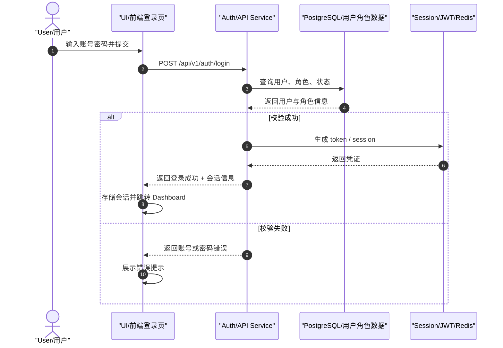
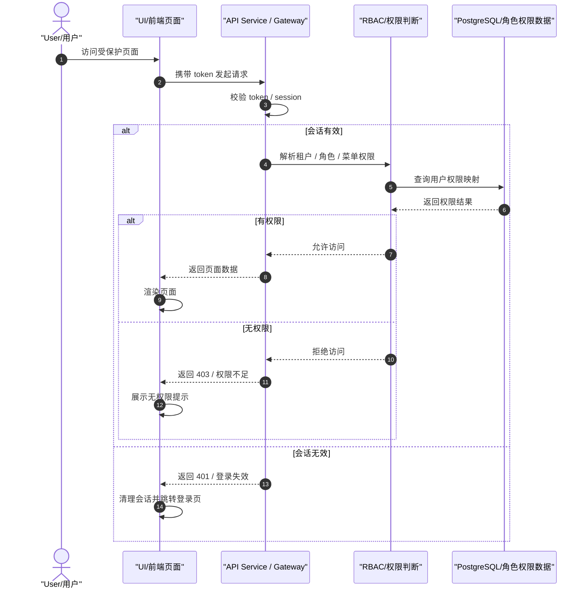
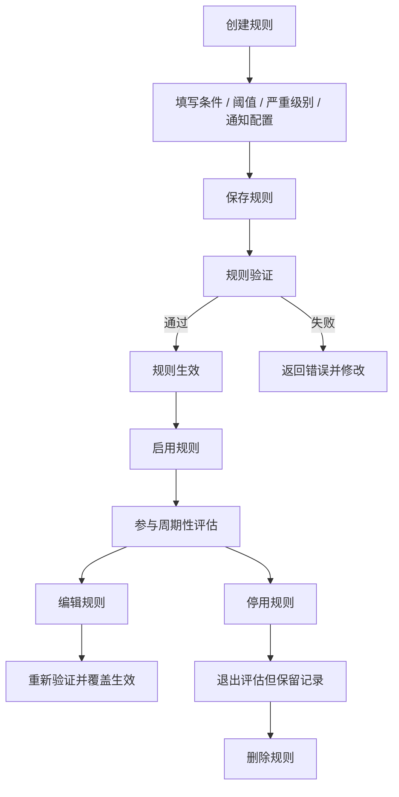
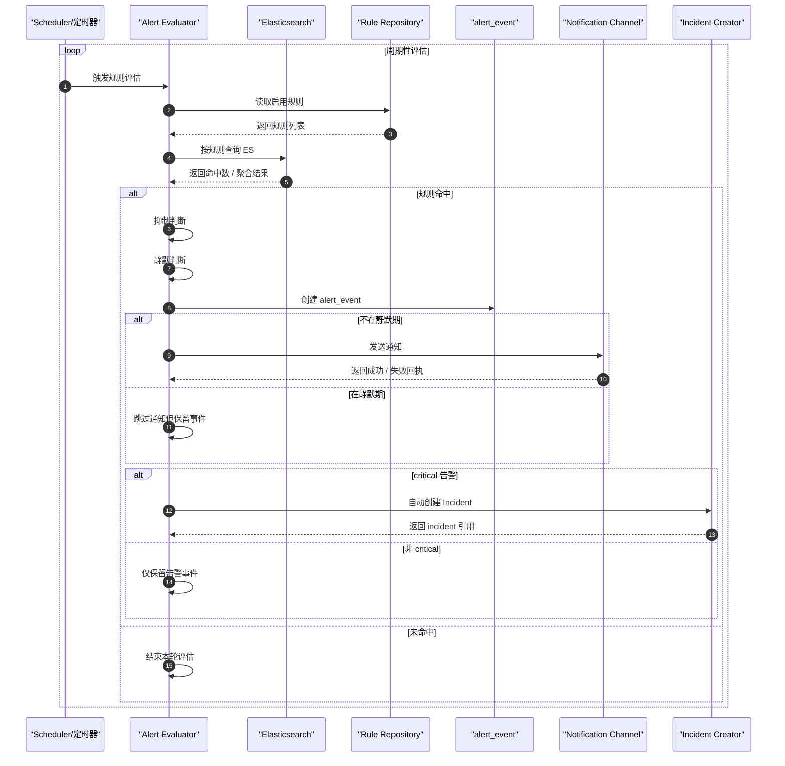
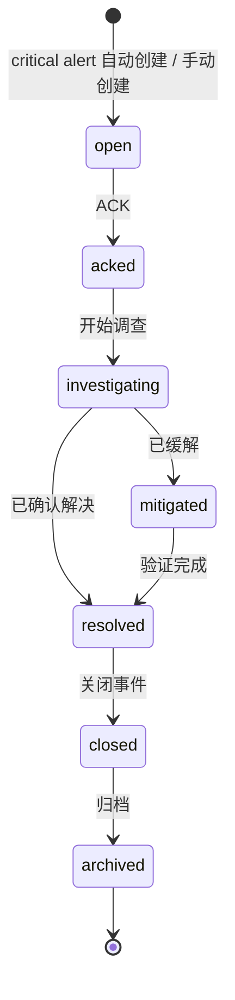

# NexusLog 认证、告警与 Incident 流程图

## 文档目的

本文档用于把 NexusLog 中最接近“业务时序图”风格的三类流程单独拆出来：

- 登录 / 会话建立
- 页面访问与 RBAC 鉴权
- 告警规则与通知闭环
- Incident 生命周期

> 适用口径：以当前实现和当前文档基线为主，必要时补充目标扩展说明。  
> 若某段流程仍偏目标态，会在图下明确说明。

---

## 1. 登录 / 会话建立流程图

> 口径：当前实现优先。  
> 该图不强制绑定 Keycloak，而描述当前系统需要的登录与会话建立闭环。

**说明**：

- 当前图只表达登录闭环，不强制规定具体 IAM 产品实现
- 若未来统一切换到 Keycloak / OIDC，应在目标蓝图文档中体现，而不是回写成当前事实

---

## 2. 页面访问与 RBAC 鉴权流程图

> 口径：当前实现优先。  
> 该图表达“用户访问页面时，系统如何完成会话和角色权限检查”。

**说明**：

- 这张图强调当前权限闭环
- 若未来引入更完整的 OPA / IAM / 外部 IdP，应在目标蓝图中进一步展开

---

## 3. 告警规则生命周期流程图

> 口径：当前实现 + 目标收口。  
> 用于描述一条告警规则从创建到停用/删除的完整生命周期。

**说明**：

- 当前规则能力已覆盖 keyword / level_count / threshold 等类型
- 通知渠道和静默策略与规则生命周期密切相关，但在评估流程图里继续展开

---

## 4. 告警评估与通知流程图

> 口径：当前实现主流程。  
> 该图重点模拟“定时评估 → 规则命中 → 抑制 / 静默 → 通知 / 事件”的完整闭环。

**说明**：

- 当前实现已经有抑制、静默、critical 升级 Incident 的基础能力
- 通知渠道细节可随具体渠道实现进一步扩展，但不改变主流程

---

## 5. Incident 生命周期状态图

> 口径：当前实现 + 目标收口。  
> 状态机用于统一事件处理阶段的语义。

**说明**：

- 当前实现至少需要支持从 alert_event 升级到 Incident 的闭环
- 更复杂的 SLA、升级路径、postmortem 可在后续专题文档补充

---

## 参考资料

- `docs/NexusLog/process/04-frontend-pages-functional-workflow-dataflow.md`
- `docs/NexusLog/process/23-project-master-plan-and-task-registry.md`
- `docs/NexusLog/process/25-full-lifecycle-task-registry.md`
- `docs/architecture/05-security-architecture.md`
- `services/control-plane/internal/alert/evaluator.go`

---

## 变更记录

| 日期 | 版本 | 变更内容 |
|---|---|---|
| 2026-03-07 | v1.0 | 初始版本。新增登录、RBAC 鉴权、告警规则生命周期、告警评估通知、Incident 生命周期状态图 |
