# 当前项目完成情况总结

## 摘要

随着云原生架构、微服务架构和自动化运维体系的快速普及，企业生产环境中的日志规模持续增长，日志来源也从单一业务应用扩展到操作系统、容器平台、网关、数据库、中间件与安全审计等多个层面。传统依赖脚本和人工检索的日志处理方式在多源接入、统一存储、快速检索、权限治理和运行审计方面已经难以满足企业运维与安全场景的需求。基于此，本文围绕“采集—传输—存储—检索—告警—可视化”的主链路，设计并实现了一个企业级日志管理系统 NexusLog。

本项目采用 Monorepo 组织方式，前端控制台使用 React 19、TypeScript、Ant Design、Zustand 与 ECharts 构建，后端采用 Go 语言和 Gin 框架实现多个微服务，数据层使用 PostgreSQL 维护元数据，使用 Elasticsearch 存储和检索日志数据，并结合 OpenResty、Docker Compose、Prometheus、Grafana 与 Alertmanager 构建本地可运行的交付与观测环境。当前阶段已经完成统一认证闭环、网关统一路由、数据库迁移框架、Agent 文件采集与断点续传、控制面拉取源与任务管理、日志写入 Elasticsearch v2 数据流、查询服务与实时检索页面对接真实数据、采集源管理与运行态展示、基础告警与审计接口、健康检查与监控接入等核心能力。

结合 2026 年 4 月的本地运行环境验证结果，系统已能够完成用户登录、日志实时检索、采集源状态查看、仪表盘概览和部分治理能力展示，主路径接口返回正常，浏览器控制台未出现报错，证明系统已形成可运行的最小可用闭环。与此同时，项目中仍存在服务名富化、自愈调度、部分高级分析能力、部分治理页面全量去 Mock 与交互回归证据不完备等问题，需要在后续迭代中持续完善。实践表明，采用分层架构、统一契约和“先闭环、后增强”的迭代策略，能够有效降低复杂企业平台的研发风险，为后续扩展告警、事件、审计、安全治理和智能分析能力奠定坚实基础。

**关键词**：企业级日志管理系统；B/S 结构；微服务；Elasticsearch；可观测性

---

## 绪论

### 引言

在企业数字化转型过程中，业务系统逐步由单体应用演进为云原生与微服务架构，系统实例数量、网络调用链路和运行组件数量迅速增加。应用日志、主机日志、容器日志、安全审计日志和运维操作日志共同构成了企业日常运行的重要事实依据。当线上故障、接口超时、安全风险、资源异常或发布回归问题出现时，日志往往是最直接、最有效的排障入口。

然而，许多中小型企业仍然采用“各节点独立落盘 + 运维临时登录 + grep/awk 手工检索”的处理方式。这种方式虽然实现成本低，但存在明显问题：一是日志来源分散，缺乏统一接入和标准化结构；二是检索效率低，跨服务排障成本高；三是权限控制与操作审计薄弱；四是日志生命周期、告警联动和可视化能力不足；五是当系统规模扩大后，人工方式难以支撑稳定运维与合规治理。因此，设计一套兼顾工程可落地性与扩展能力的企业级日志管理系统，具有明确的现实需求。

NexusLog 项目正是在上述背景下开展。该项目以企业日志观测与治理场景为核心，强调“统一采集、统一检索、统一治理、统一展示”，希望为运维、安全与研发团队提供一个可持续演进的平台基础。

### 项目背景

本课题具有以下几个方面的意义。

第一，具有明显的工程实践意义。日志系统不是单纯的数据展示页面，而是贯穿采集、接入、存储、索引、查询、告警、审计和可视化的综合性平台。通过本课题，可以系统性地锻炼前后端协同设计、微服务接口设计、数据库建模、日志链路编排、部署与运维自动化等工程能力。

第二，具有较强的运维与安全价值。统一日志平台能够缩短故障定位时间，提高问题回溯效率，同时为权限治理、审计留痕、异常发现和告警联动提供基础数据支撑，从而提升系统稳定性和安全性。

第三，具有教学与方法论价值。企业级平台开发往往需求复杂、模块众多、交付周期紧张，容易出现“功能很多但闭环不完整”的问题。NexusLog 采用“先实现最小闭环，再逐步增强”的设计思路，对毕业设计中如何收敛范围、如何区分目标蓝图与当前实现、如何通过文档和证据控制研发过程，具有较强的参考意义。

### 本文主要工作

围绕课题目标，本文完成的主要工作如下。

1. 在需求层面，结合当前仓库文档与代码实现，梳理系统的功能需求、非功能需求与分阶段建设目标，明确当前已完成能力与后续扩展范围。
2. 在总体设计层面，完成基于前端控制台、统一网关、多 Go 微服务、PostgreSQL、Elasticsearch 和观测体系的整体架构设计，明确主链路的数据流转方式。
3. 在实现层面，完成认证闭环、网关统一路由、数据库迁移框架、Agent 文件采集与 checkpoint、控制面拉取源与任务闭环、Elasticsearch v2 结构化写入、Query API 与前端实时检索联动、采集源管理、基础告警与审计能力接入等核心功能。
4. 在验证层面，结合当前本地运行环境，对登录、仪表盘、实时检索、采集源管理等页面与接口进行运行态验证，为说明书中关于“当前已完成内容”的判断提供依据。

---

## 系统设计

### 需求分析

#### 总体目标

NexusLog 的总体目标是建设一套面向企业场景的统一日志管理平台，覆盖日志从产生、采集、传输、存储、检索、展示到治理的关键环节。项目既要满足当前最小可用闭环的交付目标，也要为后续告警、事件、权限、审计、发布和扩展功能预留架构空间。

结合当前项目文档、代码实现与运行情况，系统当前阶段的建设目标可以概括为以下五项：

1. 完成统一认证与基础治理入口，保证系统具备基本登录访问能力。
2. 打通日志接入主链路，支持通过 Agent 采集本地文件日志，并由控制面主动拉取进入平台。
3. 完成日志检索主链路，支持控制台按时间范围、级别、服务等条件查询真实日志数据。
4. 建立采集源管理、运行状态查看、指标概览、审计查询等最小治理能力。
5. 构建本地可运行的部署、监控与交付基础设施，为后续持续迭代提供验证环境。

#### 功能需求分析

##### 用户认证与访问控制需求

系统需要提供统一的认证入口，支持注册、登录、刷新令牌、退出登录与密码重置等基本能力。登录后的用户需要根据令牌状态和权限信息访问受保护页面，避免未认证用户直接进入系统内部功能模块。对治理类接口，还需要具备按能力点进行控制的扩展空间。

在当前项目实现中，该部分已经形成较为完整的基础闭环。后端提供了认证接口与 `users/me` 查询接口，前端提供了登录页、注册页、忘记密码页与路由守卫，满足最小访问控制需求。

##### 日志采集与接入需求

作为日志平台的基础能力，系统需要支持多源日志接入，并能够维护来源、任务、资源包、回执、死信和文件游标等关键状态，以便实现可追踪、可回放和可治理的采集链路。考虑到企业现场环境复杂，系统还应兼顾容器、主机、本地文件和后续扩展采集模式。

当前阶段重点落地的是文件日志采集与主动拉取模式。具体表现为：Agent 负责增量读取日志文件并维护 checkpoint，控制面负责管理 pull source、拉取任务、资源包和回执，同时将成功处理的日志写入 Elasticsearch，并在 PostgreSQL 中留存元数据与状态记录。

##### 日志检索与展示需求

控制台用户需要能够在统一界面中进行实时日志检索，查看结果列表、日志详情、查询历史和收藏查询，并进一步在仪表盘或其他分析页面中查看日志量概览与聚合结果。该功能是平台面向用户的核心使用场景之一。

当前项目已完成实时检索主页面与 Query API 的基本对接，能够显示真实日志而不是仅依赖 Mock 数据；同时提供查询历史、收藏查询和统计概览相关接口与页面基础，为后续聚合分析、异常检测与日志聚类扩展打下基础。

##### 告警、事件与审计需求

企业日志平台除了“看日志”，还需要向治理能力演进，包括告警规则、告警事件、静默策略、通知渠道、事件工单、操作审计和导出等功能。考虑到毕业设计阶段的工期限制，当前系统以“最小治理闭环”为目标，优先实现规则接口、事件接口、静默接口、审计查询接口和运行指标能力。

从当前项目实现看，控制面已经具备告警规则、告警事件、静默策略、通知渠道、资源阈值和部分事件联动能力；审计服务和导出服务也具备基础接口框架，但完整治理闭环仍处于逐步收口阶段。

#### 非功能需求分析

##### 可扩展性需求

平台需要支持模块持续扩展，既要允许前端页面与后端服务按模块拆分，也要允许后续接入 Kafka、Flink、插件体系、更多治理模块和更复杂的分析能力。因此，系统采用 Monorepo + 多服务分层设计，通过网关路由和统一接口契约进行协同，降低模块耦合度。

##### 可维护性需求

日志平台的能力跨度大，如果缺少清晰的目录结构与统一规范，会导致功能和文档严重偏离。当前项目通过 Monorepo 管理前端、服务端、Agent、数据库迁移、部署与文档，并在 `docs/NexusLog` 下维护需求、设计、过程和证据文档，有利于后续维护与交接。

##### 安全性需求

系统需要具备基本的安全控制能力，包括 JWT 认证、登录与密码重置控制、受保护路由、审计记录、权限能力点校验和对高风险接口的访问隔离等。当前认证服务和控制面中间件已体现出对这些能力的支持。

##### 可观测性需求

作为一个运维平台，系统自身也必须可观测。服务应暴露健康检查、基础指标和错误信息，前端页面在调试时也需要具备接口可联调、控制台可排错、页面可验证的条件。项目目前已经接入健康检查、Prometheus 指标、Dashboard 概览和部分浏览器运行态验证能力。

#### 可行性分析

从技术可行性看，React + TypeScript、Go + Gin、PostgreSQL 与 Elasticsearch 都是成熟的工程选型，具有完善的生态和丰富的实践经验，适合在毕业设计阶段实现可运行的企业级原型。

从经济可行性看，项目主要依赖开源组件，可通过本地开发机和少量服务器资源完成开发、测试与演示，不需要高昂的软件许可成本。

从时间可行性看，项目采用分阶段迭代方式，优先完成最小闭环，再在此基础上增加告警、事件、审计与监控能力，能够避免因目标过大导致全部模块“只做骨架、不成闭环”的问题。

---

### 系统整体框架设计

#### 总体架构设计

NexusLog 采用分层式平台架构，整体可以划分为四层：用户与前端交互层、统一网关与服务层、数据与存储层、运行观测与交付层。

1. **用户与前端交互层**：由前端控制台组成，负责用户登录、仪表盘、日志检索、采集源管理、告警与审计等页面展示与操作入口。
2. **统一网关与服务层**：由 OpenResty 网关和多个 Go 服务构成。网关负责前缀路由、统一入口与跨服务转发；后端服务包括认证服务、控制面服务、查询服务、审计服务、导出服务等。
3. **数据与存储层**：PostgreSQL 负责元数据管理与业务状态记录，Elasticsearch 负责日志全文检索和聚合统计，二者共同支撑平台的数据能力。
4. **运行观测与交付层**：通过 Docker Compose 组织本地运行环境，通过健康检查、Prometheus、Grafana、Alertmanager 等组件观察系统运行状态，通过 GitHub Actions 和脚本支撑交付过程。

从当前实现看，系统的主链路已经收敛为：**Collector Agent → Control-Plane → Elasticsearch v2 → Query API → Frontend Console**。这一链路是本阶段说明书中的重点，也是当前“已跑通”的核心闭环。

#### 核心业务流程设计

##### 用户登录流程

用户在前端登录页面输入账号与密码后，请求通过网关进入认证服务；认证服务校验凭据后签发令牌，前端保存登录状态并请求 `users/me` 获取当前用户信息；随后用户可访问受保护页面，路由守卫负责对未登录状态进行拦截和重定向。

##### 日志接入流程

日志接入流程是平台的核心。其主要步骤如下。

1. Agent 根据配置扫描指定文件路径，按增量方式读取新增内容。
2. 采集器对日志进行基础预处理，并结合 checkpoint 维护读取位置。
3. 控制面根据拉取源配置生成或调度拉取任务，主动从 Agent 拉取日志包。
4. 控制面将日志写入 Elasticsearch v2 数据流，同时把拉取任务、资源包、回执与死信等元数据写入 PostgreSQL。
5. Query API 从 Elasticsearch 读取数据，并提供统一的查询与聚合接口。
6. 前端实时检索页展示日志结果、统计信息和详情数据。

##### 日志检索与展示流程

前端用户进入实时检索页后，可以设置时间范围、查询语句和筛选条件。前端将请求发送给 Query API，查询服务读取 Elasticsearch 中的真实日志数据并返回兼容前端展示的数据结构，页面进一步展示结果列表、级别、服务、主机、消息内容和统计聚合结果。

### 技术选型

为了兼顾工程效率、运行性能和后续扩展能力，系统采用如下技术方案。

- **前端层**：React 19 + TypeScript + Ant Design + Zustand + ECharts。该组合开发效率高，组件化能力强，适合构建大型管理后台与图表展示页面。
- **后端层**：Go + Gin。Go 语言并发性能较好，部署简单，适合实现控制面、认证、查询等服务。
- **数据层**：PostgreSQL + Elasticsearch。PostgreSQL 适合保存关系型元数据和状态记录，Elasticsearch 适合日志场景下的全文检索、过滤和聚合。
- **接入层**：Collector Agent 采用 Go 实现，具备文件采集、断点续传、重试缓存和 Pull API 能力。
- **网关与部署**：OpenResty 作为统一入口，Docker Compose 用于本地编排，便于演示与环境复现。
- **观测与治理**：Prometheus、Grafana、Alertmanager 与健康检查接口共同支撑系统自观测。

该技术组合一方面满足毕业设计对“可实现、可展示、可说明”的要求，另一方面也保留了企业级平台向更高复杂度演进的空间。

### 前后端交互协议

系统通过统一网关暴露主要业务前缀，包括认证、查询、控制面、审计、导出与 BFF 等接口。后端服务内部通过统一 JSON 结构返回结果，并在关键路径上增加鉴权中间件、能力点校验和审计写入逻辑。

在安全设计方面，当前系统的核心措施包括：

1. JWT 令牌认证。
2. 受保护页面与路由守卫。
3. 控制面与查询接口的能力点校验。
4. 审计中间件记录关键操作。
5. 健康检查与基础运行信息暴露，便于系统运行态核查。

---

## 数据库设计

系统采用 PostgreSQL 作为元数据库。当前仓库已维护从 `000001` 到 `000028` 的迁移脚本，覆盖初始化、认证安全、拉取接入、查询元数据、运行配置、告警事件、事件管理、导出任务、静默策略和权限治理等内容。

结合当前实现，核心数据表可以划分为以下几类。

**表3-1 用户与安全类核心表说明**

1. `user_credentials`：保存用户认证相关信息。
2. `user_sessions`：保存登录会话与令牌状态。
3. `password_reset_tokens`：支持密码重置流程。
4. `login_attempts`：记录登录尝试，便于风控与审计。
5. `roles`、`user_roles`：为角色与权限治理扩展预留基础。

**表3-2 日志接入类核心表说明**

1. `ingest_pull_sources`：记录拉取源配置。
2. `ingest_pull_tasks`：记录控制面创建与调度的拉取任务。
3. `agent_incremental_packages`：记录 Agent 侧产生的资源包。
4. `agent_package_files`：描述资源包中的文件明细。
5. `ingest_delivery_receipts`：记录回执状态。
6. `ingest_file_checkpoints`：保存断点续传游标。
7. `ingest_dead_letters`：保存失败或待重放的异常数据。

**表3-3 查询与治理类核心表说明**

1. `query_histories`：保存用户查询历史。
2. `saved_queries`：保存用户收藏查询条件。
3. `alert_rules`、`alert_events`、`alert_silences`：支撑告警规则、事件与静默能力。
4. `incidents`：为事件管理提供数据基础。
5. `audit_logs`：保存操作审计记录。
6. `export_jobs`：保存导出任务信息。

这种数据库设计遵循“日志正文放 ES，业务元数据放 PG”的原则，使系统既能保持日志检索性能，又能对平台治理状态进行结构化管理。

## 系统详细实现

### 认证与网关模块实现

认证服务位于 `services/api-service`，当前已经实现注册、登录、刷新令牌、退出登录、密码重置申请和密码重置确认等接口，并提供 `users/me` 用于登录后获取当前用户信息。系统还在登录相关路径上增加了基础限流和鉴权逻辑，为后续安全治理提供支持。

前端控制台在认证模块中实现了登录页、注册页、忘记密码页、路由守卫和本地认证状态管理。用户登录成功后，系统进入受保护路由，并根据当前权限加载仪表盘及各业务模块页面。根据当前环境中的默认账号说明，本地超级管理员账号为 `sys-superadmin`，可进入控制台主流程。

网关层负责统一入口与路由转发，使前端能够通过统一前缀访问不同后端服务，降低前后端联调复杂度。当前项目的网关映射已经覆盖认证、查询、控制面、审计、导出和 BFF 等主要服务前缀，满足最小可用环境的调用需求。

### 日志采集 Agent 与控制面实现

#### 4.2.1 Agent 采集实现

Collector Agent 是系统日志接入的起点。当前实现支持以下能力：

1. 按路径规则扫描本地日志文件。
2. 使用 checkpoint 文件存储断点位置，保证增量读取能力。
3. 支持关键日志与普通日志的分级处理策略。
4. 支持 fsnotify 触发与定时扫描结合的采集模式。
5. 支持路径标签规则、基础系统指标采集和本地重试缓存。
6. 提供 Pull API 与 Pull v2 兼容接口，便于控制面主动拉取日志。

除此之外，项目中还保留了 Kafka 双模式、gRPC/WASM 插件体系与 syslog 监听等扩展方向。其中一部分已经具有代码骨架，但尚未全部构成当前阶段的稳定主路径。

#### 4.2.2 控制面接入实现

控制面服务承担接入治理与运行调度职责。当前系统已经实现或部分实现如下能力：

1. 拉取源管理：支持拉取源列表、创建与更新。
2. 拉取任务管理：支持任务列表、任务详情和手动触发。
3. 资源包管理：支持资源包列表和详情查看。
4. 回执管理：支持回执查询与写入。
5. 死信重放：支持失败数据留存与重放入口。
6. Agent 运行态视图：支持 Agent 列表、采集源状态和部署脚本生成。
7. 控制面运行保护：支持 PostgreSQL 不可用时按配置降级为内存模式，保证开发环境可用性。

控制面还实现了 Pull v2 的游标规划与提交接口，为日志结构 v2 的主链路打通提供了基础。结合项目文档记录，当前 `agent → control-plane → ES v2 → query-api → 前端实时检索页` 已经完成主链路收口。

### 查询服务与前端控制台实现

#### 4.3.1 Query API 实现

Query API 负责面向前端提供日志查询与统计接口。当前已经提供如下主要能力：

1. `POST /api/v1/query/logs`：日志检索。
2. `GET /api/v1/query/history` 与删除接口：查询历史。
3. `GET/POST/PUT/DELETE /api/v1/query/saved`：收藏查询。
4. `GET /api/v1/query/stats/overview`：概览统计。
5. 聚合、异常和聚类相关统计接口：为后续分析模块预留能力。

查询服务在底层已经适配 Elasticsearch v2 结构化日志，并对前端继续维持兼容输出字段，从而降低前端切换成本。这一设计体现了工程项目中“后端先完成内部结构升级，再逐步对齐前端展示”的实践思路。

#### 4.3.2 前端控制台实现

前端控制台位于 `apps/frontend-console`。当前仓库中 `src/pages` 目录下共有 67 个页面或页面级组件，覆盖概览、日志检索、日志分析、告警中心、事件管理、采集与接入、解析与字段、存储、性能与高可用、分布式追踪、报表中心、安全与审计、系统设置、帮助中心等模块，已经形成 60+ 页规模的管理控制台骨架。

当前已经具备较高完成度或已完成真实接口对接的页面主要包括：

1. 登录、注册、忘记密码等认证页面。
2. 仪表盘概览页面。
3. 实时检索、查询历史、收藏查询页面。
4. 采集源管理、Agent 管理、接入向导、数据源状态页面。
5. 告警规则、告警列表、通知配置、静默策略等治理页面。
6. 用户管理、角色权限、审计日志等安全治理页面。

从工程实现角度看，前端采用 HashRouter、懒加载、统一布局、主题切换和路由保护的方式组织，具备典型企业后台管理系统的结构特点。

### 运行态验证结果

为了确保说明书中的“已完成内容”不只是静态代码判断，本文结合 2026 年 4 月 9 日的本地运行环境进行了页面与接口验证，重点核查登录、仪表盘、实时检索和采集源管理等当前核心路径。

#### 4.4.1 登录与仪表盘验证

使用默认超级管理员账号 `sys-superadmin` 登录后，系统成功进入控制台首页。登录后页面展示了总日志量、错误率、活跃来源、基础设施监控、平台健康总览和最近审计活动等信息，说明前端首页已经能够联动查询、指标、BFF 和审计等多类后端接口。

本次验证中，登录相关和首页相关接口均返回成功状态，包括登录接口、当前用户信息接口、查询概览接口、指标概览接口、BFF 概览接口和审计日志接口，证明系统首页已不是静态展示，而是与真实服务协同工作。

#### 4.4.2 实时检索验证

在实时检索页面中，系统能够展示真实日志结果、最近查询、时间范围选择、统计图和结果表格。当前运行时页面显示“共 1,036 条结果，耗时 124ms”，列表内容包含 `audit.log`、主机名、主机 IP 和审计消息正文，说明页面已经接入真实日志数据源，而不是依赖预置测试数据。

本次验证中，实时检索页关联的 `POST /api/v1/query/logs` 与统计聚合接口均返回 `200`，浏览器控制台未出现错误信息，说明实时查询主路径在当前环境下处于可用状态。

#### 4.4.3 采集源管理验证

在采集源管理页面中，系统能够展示真实 pull source 配置、运行态状态与最近资源包统计。当前页面显示采集源总数为 3，启用中 2，健康运行 2，在线 Agent 2，最近资源包 413，最近日志条数 1,609，并列出多个具体采集源的主机、路径、任务状态和资源包状态。

与该页面对应的 `GET /api/v1/ingest/pull-sources`、`GET /api/v1/ingest/agents` 和 `GET /api/v1/ingest/pull-sources/status` 等接口均返回 `200`，说明控制面的采集源管理和运行态查看功能已形成可见结果。

#### 4.4.4 验证结论

综合本次运行态验证，可以得出以下结论：

1. 认证与路由守卫链路可用。
2. 仪表盘页面已联动真实后端接口。
3. 实时检索已展示真实日志数据。
4. 采集源管理页已展示真实配置与运行状态。
5. 本次验证页面浏览器控制台未出现报错。

这说明系统已经形成“可登录、可查看、可检索、可管理”的平台基础闭环。

### 告警、审计、监控与交付实现

在治理与运维方面，当前项目已经实现或接入以下能力：

1. 告警规则、告警事件、静默策略和通知渠道接口。
2. 资源阈值、基础指标上报与查询能力。
3. 审计服务与审计查询接口。
4. 导出服务基础接口框架。
5. 控制面、认证服务、查询服务等健康检查与基础指标接口。
6. Docker Compose 本地编排、OpenResty 网关转发和 GitHub Actions 流水线基础。

这些能力意味着系统已经不只是一个“日志列表页面”，而是开始向企业平台所需的治理、交付和运维支持能力演进。

### 主要页面功能与截图

为了保证本总结只陈述当前已完成内容，本节将页面分为两类：第一类是已经通过 `chrome-devtools` MCP 工具完成运行态核验并生成截图的页面；第二类是代码中已经完成路由与页面组件、并在部分场景已经完成接口适配的页面。对第一类页面，本文在相应位置放置截图；对第二类页面，本文以当前代码能力和抽样验证结果说明其完成度，不将其夸大为“全部联调完成”。

#### 登录页与认证入口

登录页是当前项目的访问起点，页面左侧提供平台定位说明，右侧提供账号密码登录、忘记密码、单点登录切换和社交登录入口。就当前项目完成情况而言，登录相关能力已经形成较完整的前后端闭环：后端认证服务已经提供注册、登录、刷新令牌、退出登录、密码重置申请和密码重置确认接口；前端通过认证状态存储、受保护路由和 Token 过期刷新逻辑，将认证结果接入整个控制台的路由体系。

在页面层面，当前登录页已经不是简单的静态表单，而是作为控制台的统一入口承载身份校验、访问重定向和产品导航作用。登录成功后，用户可以进入 HashRouter 下的受保护页面；当 Token 过期但仍有刷新令牌时，前端会尝试刷新会话，从而减少二次登录的打断。对毕业设计阶段来说，这意味着系统已经具备“可进入、可校验、可退出、可保护”的基础访问控制能力。

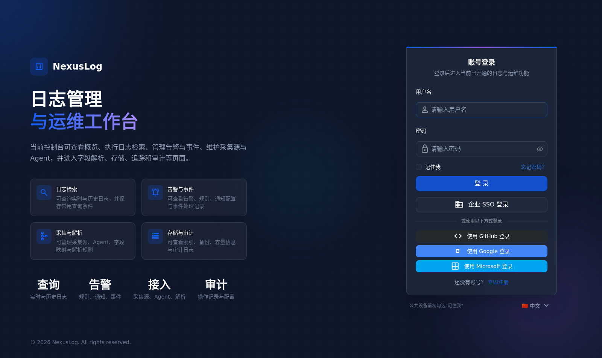

#### 首页 Dashboard

首页 Dashboard 是当前系统运行态信息的总入口，也是判断平台是否形成“最小可用闭环”的关键页面。当前首页已经能够联合查询服务、指标服务、BFF 聚合服务和审计服务，展示总日志量、错误率、最近活跃来源、基础设施状态、平台健康概览和最近审计活动，并提供跳转实时检索、审计日志、采集与接入等模块的快捷入口。

从实现角度看，Dashboard 并非单纯读取一个后端接口，而是通过前端并发请求多个服务，再将结果统一映射为 KPI 卡片、趋势图、服务状态卡片和审计列表。这个设计一方面体现了 BFF 聚合在首页场景中的价值，另一方面也说明项目已经在“统一入口 + 多服务汇总展示”这一企业后台常见模式上形成了稳定工程做法。

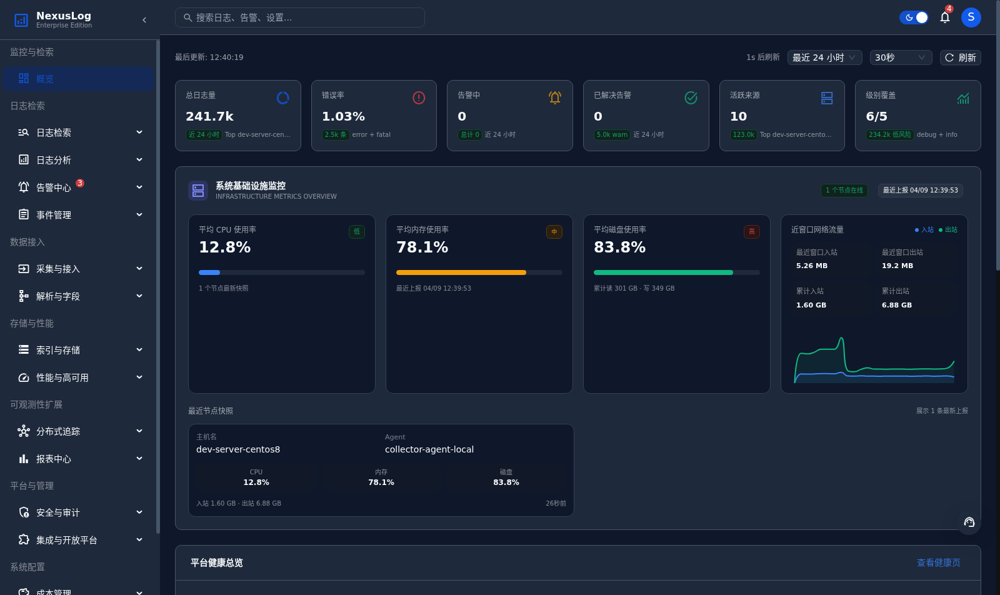

#### 实时检索

实时检索页是当前项目完成度最高、用户价值最直接的核心页面之一。当前页面支持输入查询语句、选择最近查询、设置时间范围、按级别和服务维度筛选、查看事件量分布、浏览日志表格、配置列显示、查看详情抽屉并将查询保存为收藏查询。页面展示的数据已经来自真实日志索引，而不是仅依赖前端示例数据。

从交互链路看，实时检索页会向 Query API 发起日志查询请求，并在需要时调用聚合统计接口生成图表；前端还额外维护最近查询、启动预设查询、查询清洗预览等增强交互，使页面不只是一个简单的“搜索框 + 表格”，而是具备了较完整的日志检索工作台形态。对整个项目而言，实时检索页的可用性说明“日志接入—日志存储—日志查询—页面展示”这条主链路已经打通。

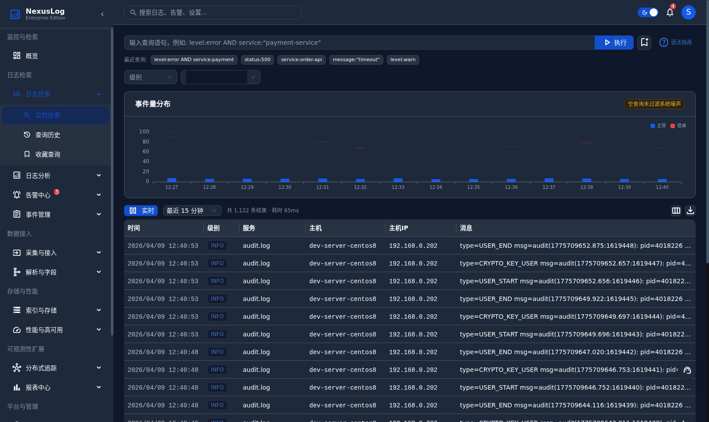

#### 查询历史与收藏查询

在实时检索完成真实联调的基础上，系统继续补齐了查询历史与收藏查询这两个高频辅助页面。查询历史页当前支持按关键词和时间范围筛选历史记录，并可执行重新查询、收藏查询、单条删除和批量删除等操作。收藏查询页则支持创建、编辑、执行、删除收藏查询，并兼容旧格式查询数据的批量清理，这使得用户可以将常用检索条件沉淀为可复用资产。

这两个页面的重要意义在于，它们把“搜索”从一次性动作扩展为可追溯、可复用、可管理的行为闭环。对平台类产品来说，这类能力会显著提升用户复盘效率和日常使用黏性。当前项目在这一点上已经不是只做单次查询展示，而是初步具备了“查询资产管理”的产品雏形。

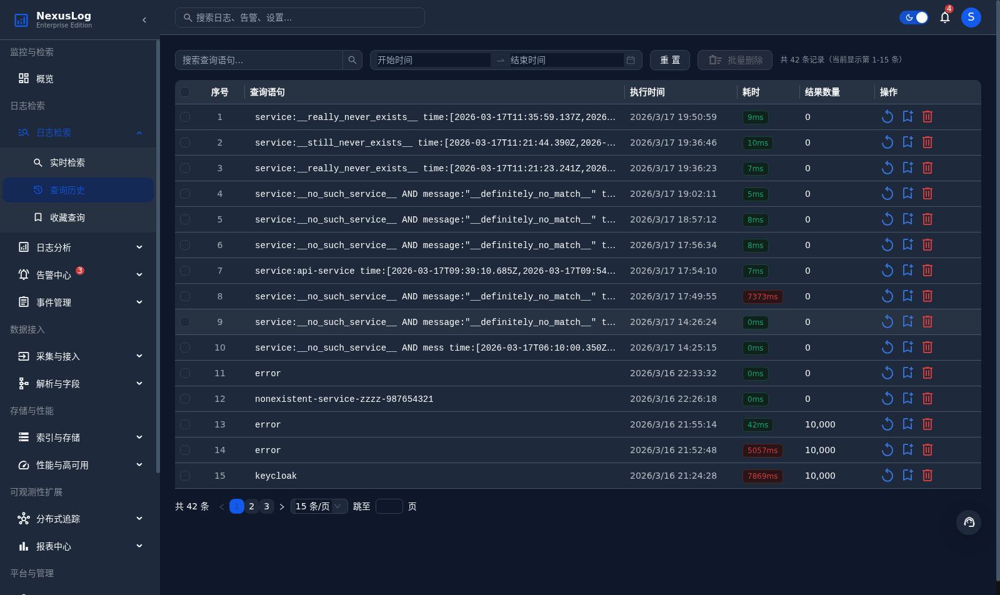

#### 告警规则、通知与静默治理

告警治理模块是当前项目从“日志平台”向“运维治理平台”延伸的重要体现。当前已经完成的核心页面包括告警列表、告警规则、通知配置和静默策略。告警规则页支持配置查询条件、严重程度、评估间隔和通知路由，并支持规则创建、编辑、启停和删除；通知配置页用于管理通知渠道、Webhook 集成、联系人和值班信息；静默策略页则用于在维护窗口或已知故障期间抑制告警噪声。

这些页面之所以重要，在于它们将日志检索能力和后续治理动作连接起来：日志满足条件后可以触发规则，规则可以走通知通道，通知又可以在特定条件下被静默策略接管，从而形成企业告警治理中常见的“规则—事件—通知—静默”闭环。当前项目虽然尚未把所有高级联动细节全部扩展完毕，但规则、事件、通知和静默的基础接口与页面已经具备可用形态。

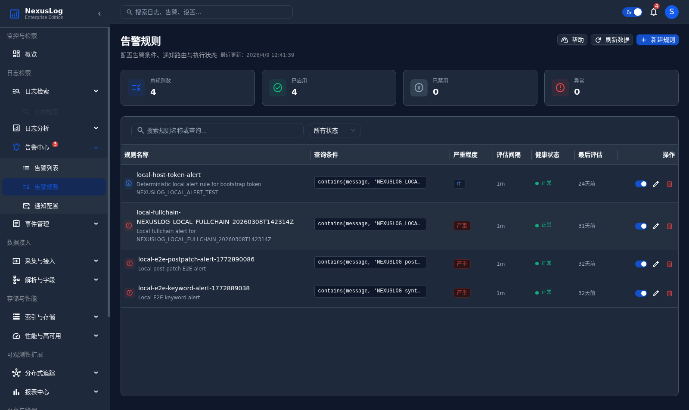

#### 事件列表与事件处置页面

在告警基础上，当前项目已经进一步建设了事件管理模块。事件列表页用于集中查看真实事件的状态、负责人、MTTA、MTTR、流转情况和归档情况，并支持创建、筛选、跳转详情等动作。除列表页外，当前代码与抽样核验还表明系统已经提供事件详情、全流程时间线、根因分析、SLA 监控、归档管理和归档报告等页面，用于承载事件从发现、接手、分析、恢复到复盘的完整处理过程。

事件管理模块的意义在于把“告警”提升为“可协同处置的对象”。一条告警如果只是停留在列表里，平台价值有限；而当事件拥有负责人、时间线、SLA、归档报告和复盘材料时，平台就具备了更强的治理深度。当前项目已经在这一方向上完成较大篇幅的页面和接口实现，说明系统不再只关注日志本身，也开始关注日志触发后的处置流程。

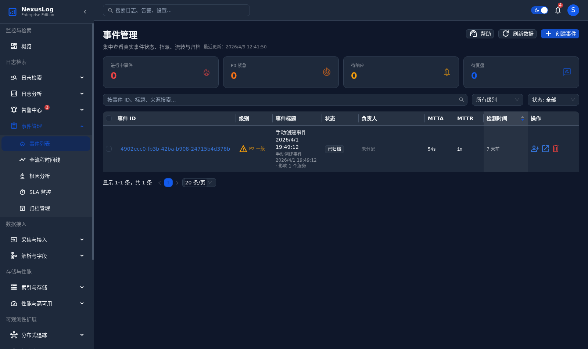

#### 采集源管理与 Agent 管理

采集与接入模块是 NexusLog 当前主链路最有工程含量的部分之一。采集源管理页能够展示真实 pull source 配置、运行状态、最近拉取事件和统计卡片，支持新建、编辑、禁用和立即采集等操作；Agent 管理页则展示真实 Agent 的在线状态、版本、资源指标、采集目录和详情弹窗，并可进一步跳转接入向导。

从系统视角看，这两个页面共同承担“平台接入侧治理”的职责。前者更偏配置与运行态，后者更偏节点与执行主体的可视化。它们与控制面后端、拉取任务、资源包、回执、游标和部署脚本生成接口共同构成了当前项目中最完整的一组治理能力，也直接支撑了实时检索页能够拿到真实日志数据。

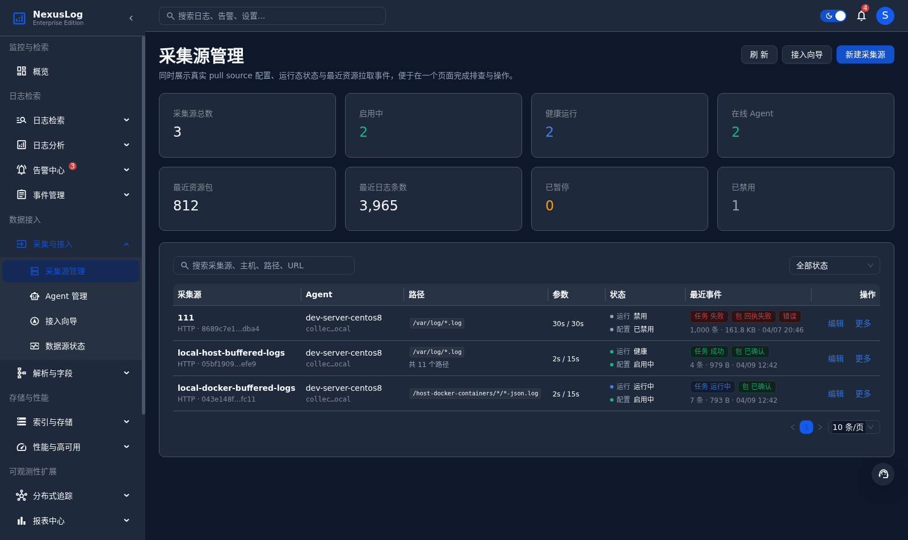

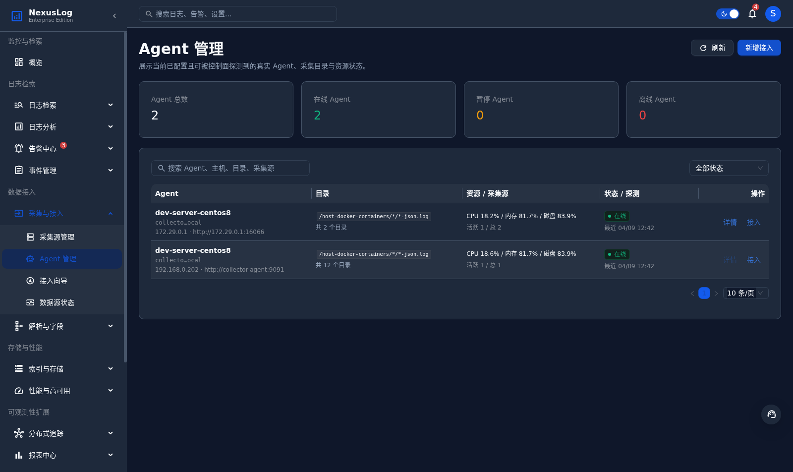

#### 审计日志与用户管理

安全与审计模块当前已经具备较高的联调完成度。审计日志页可以读取真实审计日志，支持按用户、操作、资源和时间范围筛选，也支持导出和保留账号快捷筛选；用户管理页则已经接入真实用户列表，支持搜索、筛选、详情抽屉、创建、编辑、启停以及批量状态变更。与之配套的角色权限页也已经能够读取真实角色与权限范围，支持权限详情查看和权限复制。

这部分能力的完成说明平台已经不仅能“看日志”，也能“管理谁能看什么、谁做了什么”。对于企业级后台来说，这是从功能可见走向治理可控的重要一步。当前项目中，认证服务、用户服务、角色查询和审计查询已经构成了一个较为清晰的安全治理最小闭环。

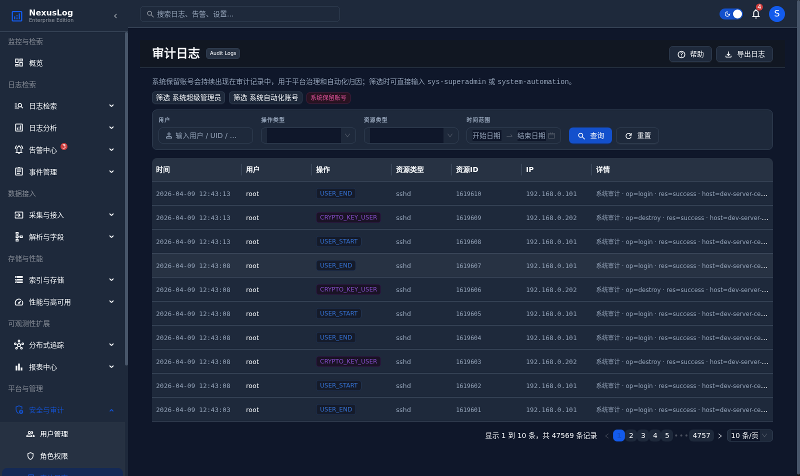

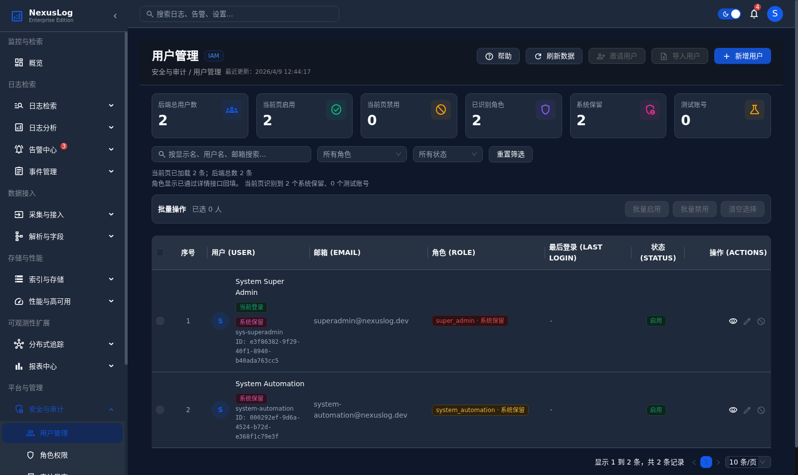

#### 配置版本与系统设置

系统设置模块中，配置版本页当前已经具备完整的页面视觉结构，包括版本列表、搜索、差异对比和回滚入口。虽然该页面当前主要使用本地版本数据展示，但它已经比较完整地表达了配置治理场景所需要的核心交互方式：配置版本可追溯、差异可对比、历史可回滚。与之相邻的系统参数页、全局配置页也已经完成分组布局和交互骨架，为后续接入配置中心和发布系统保留了清晰入口。

对于当前项目总结而言，配置版本页代表的是另一类“已完成内容”：它并非像实时检索那样已经完全联动真实业务数据，但在页面结构、交互方式和产品语义上已经形成稳定成品，可以作为后续接入真实配置服务的直接载体。

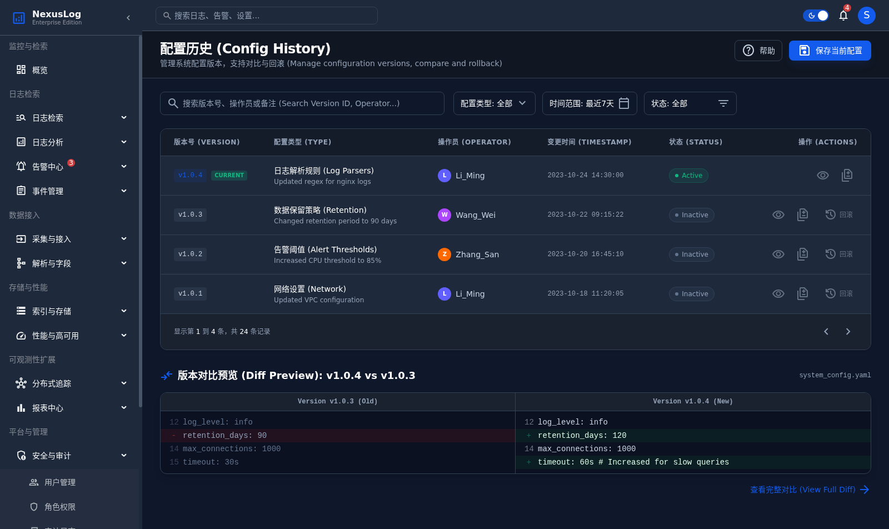

### 当前前端页面完成度总表

结合前端路由、页面组件、`src/api` 接口层以及 `chrome-devtools` 抽样验证结果，当前控制台页面可分为三类：

- **真接口页**：页面已经实际命中 `/api/v1/...` 业务接口，并能展示真实结果。
- **页面骨架页**：页面结构、表单、表格、图表和交互入口已经完成，但数据仍以本地状态、示例数据或部分接口驱动为主。
- **静态页**：页面以帮助说明、SDK 下载或 API 文档展示为主，不依赖复杂后端业务接口。

按照模块汇总，当前完成情况如下。

- **Dashboard**
  - 概览首页：展示总日志量、错误率、告警数、活跃来源、日志量趋势、服务状态和最近审计记录，并提供跳转实时检索与健康检查入口。`[真接口]`

- **搜索**
  - 实时检索：支持输入查询语句、最近查询、级别/服务过滤、事件量分布、日志表格、列设置和保存查询。`[真接口]`
  - 查询历史：支持按关键词与时间筛选、重新执行、收藏以及单条/批量删除。`[真接口]`
  - 收藏查询：支持创建、编辑、执行、删除，以及对旧格式查询做批量清洗。`[真接口]`

- **分析**
  - 聚合分析：支持按维度、时间范围、关键词、服务过滤，对真实日志做分组统计、趋势聚合和明细查看。`[真接口]`
  - 异常检测：基于真实日志趋势与错误率展示异常数量、严重等级、时间桶和详情抽屉，并可跳转告警规则或实时检索。`[真接口]`
  - 聚类分析：对真实日志样本做模式聚合，展示命中量、样本量、模式数和聚类详情。`[真接口]`

- **告警**
  - 告警列表：展示实时告警状态、触发次数、通知结果和关联事件，支持确认、解决、静默和查看日志/事件。`[真接口]`
  - 告警规则：配置告警查询条件、严重程度、评估间隔和通知路由，支持创建、编辑、启停和删除。`[真接口]`
  - 通知配置：管理通知渠道、Webhook 集成、联系人和值班信息，支持新增、编辑和删除通知通道。`[真接口]`
  - 静默策略：配置维护窗口或已知故障期间的静默规则，支持时间范围、标签匹配和 CRUD 操作。`[真接口]`

- **事件**
  - 事件列表：集中查看真实事件的状态、负责人、MTTA/MTTR、流转与归档情况，并支持创建和筛选。`[真接口]`
  - 事件详情：展示单个事件的概览、处置步骤、时间线、根因信息和归档动作。`[真接口]`
  - 全流程时间线：按事件维度展示从触发到归档的生命周期时间线。`[真接口]`
  - 根因分析：展示真实事件的根因、处置结果与归档分析信息。`[真接口]`
  - SLA 监控：展示响应时效、解决时效和升级层级，并支持跳转到具体事件。`[真接口]`
  - 归档管理：展示已归档事件及其结论，支持预览、导出 Markdown、生成 PDF 和跳转详情。`[真接口]`
  - 归档报告：提供单个归档事件的独立报告页，用于留痕、复盘共享和对外汇报。`[真接口]`

- **采集**
  - 采集源管理：展示真实 pull source 配置、运行状态、最近拉取事件和统计卡片，支持新建、编辑、禁用和立即采集。`[真接口]`
  - Agent 管理：展示真实 Agent 的在线状态、版本、资源指标、采集目录和详情弹窗，并可跳接入向导。`[真接口]`
  - 接入向导：以步骤流配置来源、Agent、采集参数和发布包来源，支持新接入和回流采集源页。`[真接口]`
  - 数据源状态：基于真实 pull task、package、cursor 和 agent 探活数据展示采集链路状态、趋势图、任务历史和包历史。`[真接口]`

- **解析**
  - 字段映射：提供源字段到目标字段的映射表、类型设置、自动检测和新增/编辑入口。`[页面骨架]`
  - 解析规则：提供样本日志、解析模式、规则列表和新建/编辑弹窗。`[页面骨架]`
  - 脱敏规则：提供字段、模式、作用域管理、预览和 CRUD 交互。`[页面骨架]`
  - 字段字典：维护标准字段名称、别名、类型和说明。`[页面骨架]`

- **存储**
  - 索引管理：展示索引总数、文档数、存储量、状态和分片等信息。`[页面骨架]`
  - 生命周期 ILM：展示热/温/冷/删阶段和策略状态。`[页面骨架]`
  - 备份与恢复：管理快照仓库和快照列表，支持创建快照、查看仓库、恢复快照等操作。`[真接口]`
  - 容量监控：通过图表展示容量占用和结构分布。`[页面骨架]`

- **性能**
  - 性能监控：按时间范围读取真实指标源构建监控视图；当前环境中部分服务指标接口返回 `404`，因此页面会显示暂无指标数据。`[真接口]`
  - 健康检查：基于真实指标和 BFF 信息管理健康阈值、服务状态与规则项，支持阈值新增、编辑和删除。`[真接口]`
  - 扩缩容策略：展示容量、配额和扩缩容策略卡片与表格。`[页面骨架]`
  - 灾备状态：展示主备、切换、恢复和演练信息。`[页面骨架]`

- **追踪**
  - Trace 搜索：提供服务、耗时、状态筛选、Trace 列表和汇总卡片，当前数据来自页面内置样例。`[页面骨架]`
  - 调用链分析：展示调用链节点、跨度关系和成功/错误状态。`[页面骨架]`
  - 服务拓扑：展示网关、服务、数据库和缓存之间的拓扑关系及健康状态。`[页面骨架]`

- **报表**
  - 报表管理：管理报表模板、类型、状态与预览/生成/删除入口。`[页面骨架]`
  - 定时任务：管理报表自动生成任务、执行频率与发送渠道。`[页面骨架]`
  - 下载记录：读取真实导出任务列表，支持按格式筛选并新建导出任务。`[真接口]`

- **安全**
  - 用户管理：读取真实用户列表，支持搜索、筛选、详情抽屉、创建、编辑、启停和批量状态变更。`[真接口]`
  - 角色权限：读取真实角色与权限范围，支持查看权限详情抽屉和复制完整权限列表。`[真接口]`
  - 审计日志：读取真实审计日志，支持用户、操作、资源、时间筛选和导出。`[真接口]`
  - 登录策略：提供 MFA、密码强度、会话管理和 IP 白名单配置，当前策略保存在浏览器本地。`[页面骨架]`

- **集成**
  - API 文档：提供鉴权、摄取、查询、告警等接口目录和 Postman 入口。`[静态页]`
  - Webhook：提供 Webhook 列表、筛选、新建、编辑、删除和测试推送流程。`[页面骨架]`
  - SDK 下载：提供多语言 SDK 卡片、版本说明和下载入口。`[静态页]`
  - 插件市场：展示插件卡片、安装/卸载/配置入口与筛选。`[页面骨架]`

- **成本**
  - 成本概览：展示成本总额、日均支出、预算对比和分布图。`[页面骨架]`
  - 预算告警：管理预算项目、告警级别、通知对象和历史记录。`[页面骨架]`
  - 优化建议：展示冷存储迁移、重复采集清理等建议卡片及风险说明。`[页面骨架]`

- **设置**
  - 系统参数：分通用、性能、网络、安全、通知等标签页管理系统参数。`[页面骨架]`
  - 全局配置：配置系统名、Logo/Favicon、品牌色、默认语言/时区和 SMTP 信息。`[页面骨架]`
  - 配置版本：展示版本列表、搜索、差异对比和回滚入口。`[页面骨架]`

- **帮助**
  - 查询语法：提供查询语法、运算符、字段检索、聚合和正则示例。`[静态页]`
  - FAQ：按接入、告警等主题整理常见问题与示例配置片段。`[静态页]`
  - 工单入口：提供工单列表、分类、状态和详情抽屉。`[静态页]`

### 当前不足与后续优化方向

尽管系统当前已经完成了较多核心能力，但结合代码、文档和运行状态，可以看到以下不足。

1. **服务名富化仍需增强**：当前部分日志链路已通，但 `service.name` 等语义字段富化仍不充分，影响后续更精细的服务维度分析。
2. **任务自愈能力仍待完善**：对于陈旧 `running` 任务的自动恢复与清理能力仍需增强，当前部分异常场景仍依赖人工干预。
3. **高级功能未全部闭环**：Kafka 双通道、插件化扩展、复杂分析、分布式追踪、成本管理和智能分析等模块中，仍有部分页面或代码处于骨架或规划阶段。
4. **前端并非所有页面都完成真实联调**：当前已经形成 60+ 页控制台结构，但并非所有页面都达到与核心链路相同的完成度，后续需要继续收敛与去 Mock。
5. **系统化回归验证仍需补强**：虽然当前主路径可用，但对筛选器交互、失败注入、性能压测和更多治理流程的全量回归还应进一步补齐。

这些问题并不否定当前系统已经取得的阶段性成果，而是反映出企业级平台建设本身具有长期迭代特征，需要在后续周期中持续增强稳定性与治理深度。

---

## 结论

本文从当前仓库代码、已注册路由、数据库迁移、页面组件以及本地运行态核验结果出发，对 NexusLog 的当前完成情况进行了集中总结。综合全文可以看到，项目已经不再停留于概念设计或原型草图阶段，而是形成了较为清晰的工程落地结果：认证与路由守卫链路已经可用，网关统一转发已经建立，Collector Agent 与控制面已经打通了文件日志采集主路径，Elasticsearch 与 Query API 已能够为控制台实时检索、查询历史、收藏查询和部分分析页面提供真实数据，用户、角色、审计、告警、事件、采集源、Agent 管理等治理页面也已经具备较高完成度。

与此同时，当前项目还完成了 PostgreSQL 迁移体系、OpenResty 网关层、BFF 首页聚合、导出任务、资源阈值、备份恢复、健康检查和本地观测体系等基础设施建设，使平台不仅能“展示日志”，也具备了“治理平台”的初步形态。通过文中截图和附录中的 Console、Network、URL 与复现步骤证据，可以进一步确认：至少在登录、首页、实时检索、查询历史、告警规则、事件列表、采集源管理、Agent 管理、审计日志、用户管理和配置版本等关键页面上，系统已经具备可展示、可操作、可复核的完成结果。

因此，可以将 NexusLog 当前阶段概括为：主链路可运行、核心治理能力已成形、扩展模块已铺开页面与接口基础。对毕业设计场景而言，这样的完成度已经能够较完整地说明项目的设计思路、工程组织方式和阶段性实现成果，也为后续继续向更完整的企业级日志观测与治理平台演进保留了清晰基础。

---

## 文献

[1] 龚正, 吴治辉, 闫健勇. Kubernetes 权威指南：从 Docker 到 Kubernetes 实践全接触（第 5 版）[M]. 北京: 电子工业出版社, 2021.

[2] 国家市场监督管理总局, 国家标准化管理委员会. 信息安全技术 网络安全等级保护定级指南: GB/T 22240-2020[M]. 北京, 2020.

[3] 牛冬. Elasticsearch 实战与原理解析[M]. 北京: 电子工业出版社, 2020.

[4] 张超. Elasticsearch 源码解析与优化实战[M]. 北京: 电子工业出版社, 2018.

[5] 朱忠华. 深入理解 Kafka：核心设计与实践原理[M]. 北京: 电子工业出版社, 2019.

[6] NARKHEDE N, SHAPIRA G, PALINO T. Kafka 权威指南[M]. 薛命灯, 译. 北京: 人民邮电出版社, 2017.

[7] NexusLog 项目组. NexusLog 项目整体规划与任务登记表[Z]. 2026.

[8] NexusLog 项目组. 日志结构 v2 完成 / 未完成项清单[Z]. 2026.

[9] NexusLog 项目组. NexusLog 链路完整性判定与后续核验计划[Z]. 2026.

[10] PostgreSQL Global Development Group. PostgreSQL Documentation[EB/OL].

[11] React Team. React Documentation[EB/OL].

[12] Prometheus Authors. Prometheus Documentation[EB/OL].

---

## 附录：页面核验记录

本附录用于补充本次文档中关于“已完成页面”的运行态证据。所有结论均基于本地环境下使用 `chrome-devtools` MCP 工具完成的页面访问、截图、Console 检查与 Network 检查结果。截图文件统一存放在 `./当前项目完成情况总结/images/` 目录。

### A.1 登录页

- 目标 URL：`http://127.0.0.1:3000/#/login`
- Console 信息：本次核验未发现前端报错。
- Network 请求：页面加载阶段以静态资源与配置加载为主，未触发业务 API 调用。
- 可复现步骤：打开控制台登录路由即可复现该页面状态。
- 对应截图：`fig-01-login-page.png`

### A.2 首页 Dashboard

- 目标 URL：`http://127.0.0.1:3000/#/`
- Console 信息：本次核验未发现前端报错。
- Network 请求：`GET /api/v1/query/stats/overview?range=24h`、`GET /api/v1/metrics/overview?range=24h&limit=4`、`GET /api/v1/bff/overview`、`GET /api/v1/audit/logs?page=1&page_size=5`、`POST /api/v1/query/logs`，均返回 `200`。
- 可复现步骤：使用可登录账号进入控制台首页，等待页面完成卡片、图表和审计区域加载。
- 对应截图：`fig-02-dashboard.png`

### A.3 实时检索页

- 目标 URL：`http://127.0.0.1:3000/#/search/realtime`
- Console 信息：本次核验未发现前端报错。
- Network 请求：`POST /api/v1/query/logs`、`POST /api/v1/query/stats/aggregate`，均返回 `200`。
- 可复现步骤：登录后进入“搜索 / 实时检索”，输入或使用默认查询条件即可看到真实日志结果。
- 对应截图：`fig-03-realtime-search.png`

### A.4 查询历史页

- 目标 URL：`http://127.0.0.1:3000/#/search/history`
- Console 信息：本次核验未发现前端报错。
- Network 请求：`GET /api/v1/query/history?page=1&page_size=15` 返回 `200`。
- 可复现步骤：登录后进入“搜索 / 查询历史”，等待历史记录表格加载完成。
- 对应截图：`fig-04-search-history.png`

### A.5 告警规则页

- 目标 URL：`http://127.0.0.1:3000/#/alerts/rules`
- Console 信息：本次核验未发现前端报错。
- Network 请求：`GET /api/v1/alert/rules?page=1&page_size=200`、`GET /api/v1/notification/channels?page=1&page_size=200`，均返回 `200`。
- 可复现步骤：登录后进入“告警 / 告警规则”，等待规则列表与通知渠道数据加载。
- 对应截图：`fig-05-alert-rules.png`

### A.6 事件列表页

- 目标 URL：`http://127.0.0.1:3000/#/incidents/list`
- Console 信息：本次核验未发现前端报错。
- Network 请求：`GET /api/v1/incidents?page=1&page_size=20`、`GET /api/v1/incidents/sla/summary`、`GET /api/v1/users?page=1&page_size=200&status=active`，均返回 `200`。
- 可复现步骤：登录后进入“事件 / 事件列表”，等待表格、SLA 摘要和指派用户数据加载。
- 对应截图：`fig-06-incident-list.png`

### A.7 采集源管理页

- 目标 URL：`http://127.0.0.1:3000/#/ingestion/sources`
- Console 信息：本次核验未发现前端报错。
- Network 请求：`GET /api/v1/ingest/pull-sources?page=1&page_size=200`、`GET /api/v1/ingest/agents`、`GET /api/v1/ingest/pull-sources/status?range=1h`，均返回 `200`。
- 可复现步骤：登录后进入“采集 / 采集源管理”，等待统计卡片、列表和运行状态区域加载。
- 对应截图：`fig-07-source-management.png`

### A.8 Agent 管理页

- 目标 URL：`http://127.0.0.1:3000/#/ingestion/agents`
- Console 信息：本次核验未发现前端报错。
- Network 请求：`GET /api/v1/ingest/agents` 返回 `200`。
- 可复现步骤：登录后进入“采集 / Agent 管理”，等待 Agent 列表和节点状态信息加载。
- 对应截图：`fig-08-agent-management.png`

### A.9 审计日志页

- 目标 URL：`http://127.0.0.1:3000/#/security/audit`
- Console 信息：本次核验未发现前端报错。
- Network 请求：`GET /api/v1/audit/logs?to=...&page=1&page_size=10&sort_by=created_at&sort_order=desc` 返回 `200`，同时页面联动触发 `POST /api/v1/query/logs` 返回 `200`。
- 可复现步骤：登录后进入“安全 / 审计日志”，等待审计列表和筛选条件区域加载完成。
- 对应截图：`fig-09-audit-logs.png`

### A.10 用户管理页

- 目标 URL：`http://127.0.0.1:3000/#/security/users`
- Console 信息：本次核验未发现前端报错。
- Network 请求：`GET /api/v1/users?page=1&page_size=10`、`GET /api/v1/roles`、`GET /api/v1/users/{id}`，均返回 `200`。
- 可复现步骤：登录后进入“安全 / 用户管理”，等待用户列表、角色列表和详情抽屉数据加载。
- 对应截图：`fig-10-user-management.png`

### A.11 配置版本页

- 目标 URL：`http://127.0.0.1:3000/#/settings/versions`
- Console 信息：本次核验未发现前端报错。
- Network 请求：当前主要加载页面源码资源，未触发完整业务接口；页面更偏向已完成的配置治理骨架展示。
- 可复现步骤：登录后进入“设置 / 配置版本”，即可看到版本列表、对比预览和回滚入口。
- 对应截图：`fig-11-config-versions.png`

### A.12 抽样补充核验结论

除上述 11 个截图页外，本次还对部分未单独截图的页面进行了抽样访问，包括 `/#/analysis/aggregate`、`/#/alerts/list`、`/#/storage/backup`、`/#/reports/downloads`、`/#/help/syntax` 等路径。抽样结果显示：

- 真接口页通常会命中 `/api/v1/...` 业务请求，例如 `GET /api/v1/alert/events`、`GET /api/v1/backup/snapshots`、`GET /api/v1/export/jobs` 等。
- 页面骨架或静态页通常只加载页面源码资源或本地状态，不产生对应业务 API 请求。
- 大多数抽样页面 Console 无报错；个别页面如性能监控页会因当前环境缺少部分指标资源而出现 `404`，这也从侧面说明页面已经尝试接入真实接口，而不是完全静态展示。
- 统一复现方式为：登录控制台后通过左侧导航进入目标模块，再在浏览器开发者工具中查看 Console 与 Network，即可判断页面属于真接口页、页面骨架页还是静态页。
