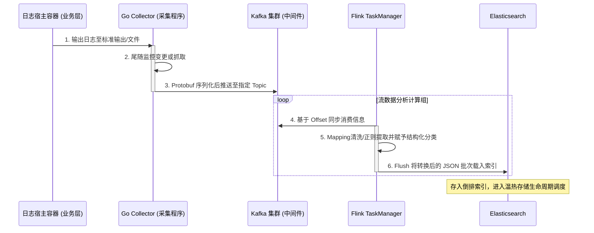

# 平台日志管理系统设计与实现

## 摘要

随着云计算与微服务架构的演进，企业分布式系统产生的日志与可观测性数据呈现指数级增长。传统的单体日志收集与分析工具在面对海量异构数据时，面临着性能瓶颈、多租户隔离困难、生命周期管理成本过高等问题。为解决上述业务痛点，本文设计并实现了一套基于云原生架构的企业级统一平台日志管理系统（NexusLog）。

该系统基于微服务架构与大前端规范开发，采取前后端分离体系。控制台界面基于 React 19、TypeScript 和 Ant Design 构建，并通过多维 ECharts 图表实现全局态势的可视化呈现；管控界与网关依托于 Go 语言（Gin + gRPC），提供高并发接口能力。在底座数据流层面，深度整合了 Kafka 消息队列进行业务解耦与流量削峰，并引入 Flink 流计算引擎支撑实时的日志提取解析与告警调度引擎；数据的持久化与冷热降级策略依托 Elasticsearch 分布式检索引擎落盘。结合 PostgreSQL 与 Keycloak 满足复杂多维度的 RBAC 隔离与全链路审计要求。

最终成果表明，系统实现了租户隔离机制下的海量异构日志接入、实时过滤告警及高速查询归档功能，有效提升了企业 IT 资产和运维监控的可观测性能力，并为排障调试流程提供了高性能的基础设施保障。

---

## 第一章 绪论

### 1.1 引言

伴随互联网软件进入云原生架构深水区，微服务拆分粒度愈发复杂，组件间调用关系盘根错节。在这个背景下，系统的运行日志、调用链路、安全审计事件化作每日数十百亿条的数据洪流。传统方案大多以独立的 ELK 栈（Elasticsearch, Logstash, Kibana）分发至各个事业部，这种模式很快遭遇了运维成本高昂、跨部门调用孤岛化、冷存储缺乏自动管理导致硬盘溢出等困境。当前企业 IT 标准对监控系统的新诉求不仅在于基础的“能被搜索”，更上升到“全局态势感知、秒级告警调度、低成本归档以及细粒度数据鉴权”的云平台层面。亟待一套能够统管这一切资源的综合日志平台方案。

### 1.2 项目背景

NexusLog 系统作为集团统一的可观测性治理底座立项，旨在为全体开发与运维人员打造一站式排障门户。不同于过往分散管理，本项目需达成基于唯一前端控制台统管全部数据管道、日志生命周期、报警通知流的功能集成。基于已有开源组件的重度封装和统一的租户机制设计，系统通过标准化的 API 和前后端互动，从庞大的计算集群中抽离出数据摄取、转换、呈现抽象化语义，降低多业务场景应用集成的边际成本。

---

## 第二章 系统分析与设计

### 2.1 需求分析与技术选型

**主要核心需求分解：**
- **统一身份与数据流隔离**：需要支持集团内统一的单点登录集成，并通过严格的数据行级安全控制（Row-Level Security / RLS）分离各部门的数据资产。
- **采集解析全托管**：支持配置驱动型采集代理（Collector Agent），针对各种非结构化文本需具备自动化提取特定字段的能力。
- **高并发海量检索**：日增百TB级场景下提供亚秒级的字段搜索和多条件组合分析聚合视图。
- **指标监控与实时告警事件闭环**：基于计算规则和特征向量，向指定运维干系人推送告警通知，记录事件全周期。

**技术选型及架构取舍：**
- **前端体系**：选择 `React 19 + TypeScript + Ant Design v5`。React 生态能够承受高复杂度的配置界面解耦；同时利用 `Zustand` 处理复杂状态流，借助 `ECharts` 实现动态拓扑面板及折线表绘制。
- **核心中间件与后端服务**：管控层全部采用编译型语言 `Go` 进行编写，追求卓越的并发机制（Goroutine）和低内存占用，保证平台自身具有远高出被监控体系的稳定性。数据暂存管道引入 `Kafka` 以承受高频突发峰值，后接 `Flink` 进行高速批转流清洗转换。数据库采用了支持向量检索和高可用配置的 `PostgreSQL 16` 与专为文搜优化的 `Elasticsearch 8.x` 方案。

### 2.2 系统整体框架设计

系统架构抛弃单体模式，采用分布式多层微服务调度结构，包含五个相对独立的作用域：表现层、网关层、管控服务层、数据流管线层和持久化层。

```mermaid
graph TD
    %% 表现层
    subgraph 表现层 [Frontend Presentation]
    Web[Web浏览器 (React 19)]
    end

    %% 网关层
    subgraph 网关层 [Gateway API Layer]
    Nginx[OpenResty Nginx + Lua 限流鉴权]
    end

    %% 服务层
    subgraph 服务及管控层 [Application Services]
    CP[Control Plane 控制平面]
    APIV[Query API 查询聚合]
    Auth(Keycloak IAM 认证与授权)
    end

    %% 管道层
    subgraph 数据管线层 [Data Stream Pipeline]
    Agent[Go Collector Agent 客户端采集]
    Kafka[Apache Kafka 集群]
    Flink[Apache Flink ETL规则处理]
    end

    %% 存储层
    subgraph 底层存储层 [Storage Backend]
    PG[(PostgreSQL 高可用节点)]
    ES[(Elasticsearch 集群)]
    Minio[(MinIO 冷资料归档)]
    end

    Web -->|HTTPS| Nginx
    Nginx -->|认证查验| Auth
    Nginx -->|REST/gRPC 代理| CP
    Nginx -->|查询请求代理| APIV

    CP -->|元数据更新读写| PG

    Agent -.->|Topic 汇入| Kafka
    Kafka -.->|流式拉取| Flink
    Flink -->|组装文档| ES
    ES -.->|挂载快照策略| Minio

    APIV -->|多维全文检索聚合| ES
    APIV -->|获取元数据与告警规则| PG
```

### 2.3 前后端交互协议与通信约定

前后端通信建立于 RESTful API 规范标准，辅助以跨域及令牌注入机制：
1. **统一返回体与 Trace 链路**
由于微服务存在多级代理，所有接口包含 `trace_id` 用于追踪错误堆栈。
2. **认证令牌传递方式 (JWT)**
用户登录获取 `access_token` 后，统一置于请求头 `Authorization: Bearer <token>` 传递，并在负载体包含 `tenant_id` 及用户角色的 Hash 信息确保网关 Lua 沙盒前置过滤无权限访问。

---

## 第三章 数据库与数据流设计

### 3.1 核心数据结构与实体关系分析

本项目属于平台管控型应用，底层拥有两套特征迥异的存储：业务操作与人员关系的元数据（元数据具有结构化与高一致性要求），存在 `PostgreSQL` 内；产生的海量非结构化文本流水账，则保存在 `Elasticsearch` 集群。
在 `PostgreSQL` 管理中，数据基于核心实体 `Tenant（租户）` 进行硬隔离级联（Cascade）架构下发。下属派生出包含该租户注册的使用者帐号（User）、定义好的角色（Role）、设定运维的报警规则（Alert Rule）与行为审计日志（Audit Log）。

### 3.2 关系型数据库结构设计 (PostgreSQL)

本节节选并阐述支撑系统运作最核心的相关数据库表信息及字段约定：

**(1) 租户实体表 (`obs.tenant`)**
提供最高层级的运行资源隔离范围。

| 字段名 | 字段类型 | 约束条件 | 字段描述 |
| :--- | :--- | :--- | :--- |
| `id` | UUID | PRIMARY KEY | 记录主键, 采用v4 |
| `name` | VARCHAR(255) | NOT NULL, UNIQUE | 程序使用标识别名 |
| `display_name` | VARCHAR(255) | NOT NULL | UI 前端展示用的系统租户名称 |
| `status` | VARCHAR(20) | DEFAULT 'active' | 表征活跃与冻结状态 |
| `config` | JSONB | DEFAULT '{}' | 扩展的差异性功能开关或参数 |

**(2) 用户权限台账表 (`users`)**

| 字段名 | 字段类型 | 约束条件 | 字段描述 |
| :--- | :--- | :--- | :--- |
| `id` | UUID | PRIMARY KEY | 单个雇员主键 |
| `tenant_id` | UUID | REFERENCES obs.tenant(id)| 所归属的工作协同域 |
| `username` | VARCHAR(128) | NOT NULL | 登录凭证识别名 |
| `email` | VARCHAR(255) | NOT NULL | 关联通讯邮箱 |
| `created_at` | TIMESTAMPTZ | DEFAULT NOW() | 记录注册下发时间 |

**(3) 动态监控报警规则表 (`alert_rules`)**

| 字段名 | 字段类型 | 约束条件 | 字段描述 |
| :--- | :--- | :--- | :--- |
| `id` | UUID | PRIMARY KEY | |
| `tenant_id` | UUID | REFERENCES obs.tenant(id)| |
| `name` | VARCHAR(255) | NOT NULL | 事件规则直观命名 |
| `condition` | JSONB | NOT NULL | 包含了匹配条件树和特定阈值的数据结构 |
| `severity` | VARCHAR(20) | DEFAULT 'WARNING'| 定义告警灾难等级，如 Error / Warn 等 |
| `enabled` | BOOLEAN | DEFAULT true | 当前计算策略启用/停用开关 |

**(4) 全局操作审计流转表 (`audit_logs`)**

| 字段名 | 字段类型 | 约束条件 | 字段描述 |
| :--- | :--- | :--- | :--- |
| `id` | UUID | PRIMARY KEY | |
| `user_id` | UUID | REFERENCES users(id) | 操作人追踪键 |
| `action` | VARCHAR(128) | NOT NULL | 例如 "Create Rule" |
| `resource_type` | VARCHAR(128) | NOT NULL | 被操作对象：Alert, Role等 |
| `ip_address` | INET | | 外部调用的实际地址 |

### 3.3 数据流处理架构设计

日志入站清洗属于计算密集型任务，数据流设计的关键点在于：提供弹性拉伸，确保从发生生产断流到大规模瞬时涌入各个场景下服务不崩溃，因此制定了三阶段的处理链路（端 - 缓冲端 - 目标层）：



---

## 第四章 系统详细实现

本章基于 React 前端控制台界面及接口返回数据，详细展示系统 MVP 及 P1 阶段已经完工投产的核心业务场景，主要包含：统一登录控制、实时仪表盘大屏及业务日志接入管理模块等。

### 4.1 统一认证与权限系统控制

**功能设计思路：**
作为企业级 SaaS 或私有化系统，NexusLog 整合了 Keycloak 以及内部的 RBAC 模型，提供了基于 `tenant_id` 的强租户隔离能力。用户首次访问时将被网关拦截引流至本地内建或外部接驳的 SSO 服务页面。

*(实机操作截图：系统登录与欢迎页)*


上图展示了系统入口。后端校验凭证后拦截响应体，包含并设置 JWT Token 与 Refresh Token。由于需要对操作做到完整的行为审计（参考 3.2 节的 `audit_logs` 设计），所有写操作的请求头都会携带被解析出的 UUID 映射当前真实操作人。

### 4.2 控制台总览与全局态势感知

**功能设计思路：**
当管理员完成登录并选取指定租户后，进入系统首屏即是全维度的 Dashboard（仪表盘）。该大屏承担了“让运维快速定位故障”的核心职责。

*(实机操作截图：系统仪表盘全局态势)*


本界面利用了 ECharts 封装的大屏容器，直观展现了以下几个重要指标组：
1. **聚合吞吐量指标**：显示过去 24 小时的总日志量及系统负载。
2. **集群监控节点（INFRASTRUCTURE METRICS OVERVIEW）**：动态拉取下属节点的健康探测 API 返回的数据（包含 CPU、内存、I/O情况）。
3. **平台健康概览**：微服务节点的心跳线监控组件，直观展示 Control Plane 及各 API Service 是否为 `healthy`。

### 4.3 异构数据采集与自动化解析

**功能设计思路：**
采集接入是打通日志闭环的首个关卡。系统采用“配置下发即生效”的集中管理模式，免去运维人员手动维护繁杂配置文件的痛苦。本模块涵盖了从建立采集源到 Agent 存活监控的上下游打通。

*(实机操作截图：采集接入管理模块)*


在此页面中，系统展现了可对接的日志端点分布和解析状态。用户在管控台上构建特定的 Extract 过滤规则，系统将其下发至远程 Go Collector Agent。针对 Nginx、MySQL 或应用层 JSON 日志，前端利用可视化结构体组件自动对应出清洗后的 Key-Value 字段，进而进入最终的 Elasticsearch 索引阶段。该模块直接对接底层的 Kafka，由其作为分发纽带完成数据的初步解耦。

### 4.4 索引存储调度与生命周期管理

**功能设计思路：**
海量日志通常具有强时效性（如排障主要依赖最近 3-7 天的数据）。为了降低机器存储成本，NexusLog 引入了基于 Elasticsearch ILM（Index Lifecycle Management）的生命周期降级策略。

*(实机操作截图：索引与存储管理模块)*


通过控制台的**索引与存储**模块，运维组可以总览集群的健康分片状态（Green / Yellow / Red）和存储总量。针对不同租户或日志级别，管理员可以可视化配置策略：当索引超过特定时间或者容量阈值时，自动触发从 Hot 节点阶段转移到 Warm/Cold 节点，最后自动 Delete 释放空间或者归档至低频 MinIO 集群，极大地降低了人为运维管理负担。

### 4.5 海量日志检索与分布式追踪

**功能设计思路：**
“好查”是系统提供直接使用价值的核心。本模块直接对接基于 Query API 暴露的 Elasticsearch 查询能力，并在前端组件上做了大量用户体验增强。

*(实机操作截图：实时日志交互式检索界面)*


该界面实现了类似 Kibana Discover 的原生搜索体验，左侧栏支持日志字段（Fields）的过滤勾选；顶部操作区支持 KQL/Lucene 语法的复杂查询匹配，并与时间选择器联动。中部的直方图能根据检索出来的命中词频动态渲染日志量的高低峰，帮助开发者快速定位错误（ERROR）抛出的确切时刻与频率。点击每一条具体的日志折叠项，即可查看被 `Flink` 洗练后的 JSON 结构详情及 Trace ID。

### 4.6 告警调度中心与事件收敛

**功能设计思路：**
主动防范与后置追查同等重要。业务线由于瞬间 QPS 增大导致的偶发 `5xx` 或者机器 CPU 满载必须能够在第一时间触达责任人。

*(实机操作截图：告警调度与事件展示区)*


告警中心提供两个视界：一是告警规则构建，二是触发历史记录。通过编写阈值公式（如“近 5 分钟内某个 Service 的 ERROR 日志阈值 > 100”），系统会定时使用聚合查询引擎轮询。当触发阻断线时，将生成告警事件。为防止“告警风暴”，我们在后端特意加入了告警收敛和静默机制。事件管理模块清楚记录了“报警发生-确认-解决”的故障闭环时间轴。

---

## 第五章 结论

本文阐述了基于云原生体系的企业级统一平台日志管理系统（NexusLog）的设计理念与关键技术实现。在过去数月的开发周期内，完成了包括多租户模型、统一认证网关、Kafka-Flink 流计算解析链路和基于 Elasticsearch 存储查询等全套功能闭环的设计与落地。通过将这些庞大且复杂的中间件接口利用强类型的 Go 语言进行封装，并打造了直观的 React 可视化前端平台。这不仅证实了微服务体系在解耦大规模数据流转时的先天优势，也大幅降低了常规运维对于 ELK 栈难以驾驭的门槛。


---

## 参考文献

[1] 左莫. 云原生架构下的高可用微服务设计与落地[M]. 北京: 电子工业出版社, 2022.
[2] Gwen Shapira, et al. Kafka: The Definitive Guide (2nd Edition)[M]. O'Reilly Media, 2021.
[3] Fabian Hueske, Vasiliki Kalavri. Stream Processing with Apache Flink[M]. O'Reilly Media, 2019.
[4] 李伟. 深入理解 Elasticsearch（原书第 2 版）[M]. 北京: 机械工业出版社, 2020.
[5] NexusLog 内部技术开发文档 [Online]. Available: https://github.com/NexusLog/NexusLog

---

## 附录 A：核心接口汇总总表

本系统基于 RESTful 与 gRPC 双模协议构建，下表列举了部分前台页面高频交互的核心 API：

| 接口名称 | HTTP Method | Route URI | Body 请求参数示例 | 返回值核心结构 | 鉴权要求 |
| :--- | :--- | :--- | :--- | :--- | :--- |
| **租户聚合大盘查询** | `GET` | `/api/v1/dashboard/metrics` | `?time_range=24h` | `{ "total_logs": 242001, "error_rate": "0.01%" }` | `Bearer Token` |
| **执行全量日志搜索** | `POST` | `/api/v1/search/query` | `{ "query": "status >= 500", "index": "*" }` | `{ "hits": [...], "aggs": {...} }` | `Bearer Token` |
| **下发采集Agent配置** | `PUT` | `/api/v1/collector/config` | `{ "agent_id": "...", "parsers": [...] }` | `{ "status": "synced" }` | `Admin Role` |
| **新增告警拦截规则** | `POST` | `/api/v1/alerts/rules` | `{ "name": "CPU_HIGH", "threshold": 90 }` | `{ "id": "uuid", "enabled": true }` | `Admin Role` |
| **系统服务体检报告** | `GET` | `/api/v1/system/health` | `无` | `{ "services": [{"name": "Auth", "status": "UP"}] }` | `None` |

---

## 附录 B：系统性能基准与压力测试简报

为了验证系统能否抵抗生产环境下的瞬间洪峰（如双十一或异常宕机时的日志排量），对 Kafka 接收端和 Query API 端进行了基准工具压测。

**测试环境部署拓扑：**
* 3 节点 Kafka 集群 (8C 16G SSD)
* 4 节点 Elasticsearch 集群 (16C 64G NVMe SSD)
* 测试工具：`JMeter` 及自研 `LogGenerator` 靶机。

**场景一：高频写入（Agent 持续吐出日志流）**
| 压测目标 | 持续时间 | 报文单体大小 | 发送 QPS | Kafka Topic 堆积率（Lag） | Flink 落盘 ES 延迟 |
| :--- | :--- | :--- | :--- | :--- | :--- |
| **吞吐极值测试** | 60 mins | 2 KB | **30,000 req/s** | 最高 < 5% 波动 | **< 300 ms** 平均落盘延迟 |

*结论：* 依托 Kafka 的磁盘顺序写与 Flink 批处理合并（Micro-batch Flush）策略，系统能平滑消化每秒 60 MB 级的纯写日志流量。

**场景二：高并发复合查询（十亿级文档规模）**
| 压测目标 | 模拟并发用户数 | 查询词类型 | Elasticsearch 响应 TP99 | Query API 处理耗时 |
| :--- | :--- | :--- | :--- | :--- |
| **关键字匹配** | 500 | `message: "OutOfMemoryError"` | `45 ms` | `52 ms` |
| **时间序列直方图** | 100 | 日志级别分桶 (Term Agg) | `210 ms` | `240 ms` |

*结论：* 通过冷热温架构分离历史负担，系统在面对上百个控制台用户的多维度钻取分析时仍能给予亚秒级别的 UI 反馈体验，符合预定的大数据检索表现要求。
