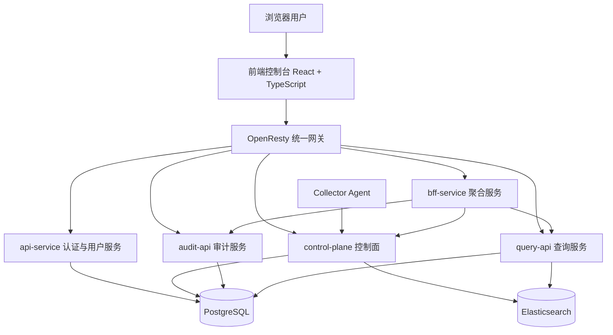

# NexusLog 平台日志管理系统的设计与实现

## 摘要

随着云计算、容器化部署以及微服务架构在企业信息系统中的广泛应用，应用服务数量持续增长，服务之间的调用链路日趋复杂，系统运行过程中产生的日志数据也呈现出高并发、高维度和高异构的特点。传统日志处理方式往往以分散式部署和人工运维为主，难以在统一身份认证、采集接入治理、检索分析效率、告警闭环以及安全审计等方面满足企业级平台建设的实际需求。基于此，本文围绕企业日志的统一接入、集中存储、快速检索和治理协同等目标，设计并实现了一套面向 B/S 架构的企业级平台日志管理系统——NexusLog。

本文结合当前项目代码仓库中已经完成的前后端模块、数据库迁移脚本、接口注册情况以及本地运行验证结果，对系统的总体架构、关键技术、数据库设计和核心模块实现进行了系统性阐述。系统以前后端分离模式构建，前端控制台采用 React、TypeScript 与 Ant Design 实现，后端以 Go 语言为主要开发语言，结合 OpenResty 网关、PostgreSQL 元数据存储和 Elasticsearch 检索存储，构建起认证鉴权、日志采集、查询分析、告警治理、审计留痕和用户权限管理等关键能力。围绕当前已完成内容，系统已实现统一登录入口、基于令牌的访问控制、Agent 增量采集与控制面调度、日志实时检索、查询历史与收藏查询、告警规则管理、事件管理、审计日志查询和用户角色管理等主要功能，并形成了“Agent—Control Plane—Elasticsearch—Query API—Frontend Console”的核心业务闭环。

实践结果表明，NexusLog 当前阶段已经具备较为完整的企业级日志平台雏形，能够支撑日志接入、运行态观测、异常定位与治理协同等典型场景。本文的研究与实现不仅验证了基于微服务与分层架构建设统一日志平台的可行性，也为后续系统向更高等级的自动化治理、配置中心整合和可观测性平台演进奠定了工程基础。

**关键词：** 企业级日志管理系统；B/S 架构；微服务；Elasticsearch；可观测性

---

## 第一章 绪论

### 1.1 研究背景

在数字化转型不断深入的背景下，企业业务系统已经从传统单体应用逐步演进为由多个微服务、网关组件、消息中间件和基础设施服务共同构成的分布式系统。随着系统规模不断扩大，日志不再只是辅助开发排查问题的文本记录，而逐渐演变为反映系统运行状态、用户行为轨迹、接口调用结果和安全事件的重要数据资源。尤其是在生产环境中，应用日志、审计日志、设备日志和基础设施指标之间往往相互关联，只有实现统一采集、统一检索和统一治理，才能真正发挥日志在故障定位、运行分析和安全审计中的价值。

然而，在许多企业的实际建设过程中，日志能力通常分散在不同团队和不同系统之间，存在采集标准不统一、接入配置不集中、查询入口不一致、权限边界不清晰以及审计留痕能力不足等问题。这种模式不仅提升了平台运维复杂度，也限制了日志在跨系统联动分析、告警治理和事件处置中的应用深度。因此，构建一套能够覆盖“接入—存储—检索—分析—治理—审计”全过程的统一日志管理平台，已经成为企业可观测性建设的重要内容。

### 1.2 项目研究意义

NexusLog 项目的研究意义主要体现在三个方面。第一，从工程实践角度看，统一日志管理平台能够打通分散系统的日志链路，使日志数据由“局部可见”转变为“全局可管”，从而显著提升研发和运维人员对系统运行状态的把握能力。第二，从平台治理角度看，通过统一认证、用户角色、告警规则、事件流转和审计日志等模块的协同设计，可以将传统“日志查询工具”扩展为兼具管理与协同能力的企业级平台。第三，从毕业设计研究角度看，本项目覆盖了需求分析、架构设计、数据库设计、接口规范、前端交互和后端实现等多个技术层面，具有较强的系统性与综合性，能够较完整地体现软件工程项目从设计到实现的全过程。

### 1.3 研究内容与论文结构

本文围绕 NexusLog 当前阶段已经完成的功能展开研究，重点包括以下内容：其一，对企业级日志平台的业务需求、非功能需求及总体设计原则进行分析；其二，对系统的分层架构、技术选型与前后端交互方式进行说明；其三，对 PostgreSQL 元数据模型和 Elasticsearch 日志检索模型进行设计分析；其四，对认证、日志采集、实时检索、告警治理、事件管理、审计查询和用户权限管理等核心模块的实现进行阐述；其五，结合本地运行核验结果，对当前项目完成度与后续优化方向进行总结。

全文共分为五章。第一章为绪论，介绍研究背景、项目意义与论文结构；第二章为系统分析与设计，阐述需求分析、总体架构和技术选型；第三章为数据库与数据流设计，说明系统元数据模型和日志流转过程；第四章为系统详细实现，重点说明已经完成的关键模块与主要页面；第五章为结论，总结当前项目的实现成果与进一步研究方向。

---

## 第二章 系统分析与设计

### 2.1 业务需求分析

结合当前项目目标与已完成实现，NexusLog 的核心需求可以概括为以下几个方面。

首先，系统需要提供统一的访问入口与身份认证能力。由于平台面向企业内部多角色用户使用，因此系统必须具备登录、会话刷新、退出登录、用户信息获取、用户角色管理和权限校验等基础能力，以保证不同用户在访问平台时具备清晰的身份边界和操作范围。

其次，系统需要提供可治理的日志接入能力。企业日志来源复杂，既可能来自应用容器、宿主机文件，也可能来自远端服务节点，因此系统需要支持通过 Agent 对日志文件进行持续扫描与增量读取，并由控制面统一管理采集源、调度任务、处理回执和死信重放，以形成完整的接入治理链路。

再次，系统需要提供高效的日志检索与查询管理能力。日志平台的核心价值之一在于能够帮助使用者快速完成故障定位与运行分析，因此系统必须支持按关键字、字段、时间范围和多条件组合进行检索，并保留查询历史、收藏查询和聚合统计等功能，以增强查询行为的复用性和持续性。

最后，系统还需要承担一定的治理协同职责。这意味着平台不仅要“能查日志”，还要在告警规则、通知渠道、事件流转、审计日志、用户管理和配置版本等方面形成基础能力，使日志平台逐步向可观测性与运维治理平台演进。

从非功能需求看，系统还需要满足接口响应稳定、模块边界清晰、页面交互一致、数据结构可扩展以及部署架构可演进等要求。当前项目采用 Monorepo 方式组织前端控制台、网关和多个后端服务，正是为了兼顾模块解耦与工程协同的平衡。

### 2.2 系统总体架构设计

NexusLog 采用典型的分层式企业平台架构，整体上可以分为表现层、网关层、服务层、数据层和接入层。其中，表现层由前端控制台构成，负责页面渲染、用户交互和状态展示；网关层由 OpenResty 统一接管外部请求，实现路由转发与统一入口；服务层由 `api-service`、`control-plane`、`query-api`、`audit-api` 以及 `bff-service` 等模块构成，分别承担认证权限、接入控制、查询服务、审计查询和聚合视图等职责；数据层以 PostgreSQL 作为元数据存储，以 Elasticsearch 作为日志检索和结构化文档存储；接入层则由 Collector Agent 负责日志发现、增量采集和数据打包。

当前阶段系统已经形成的核心主路径为：Collector Agent 在源端扫描日志文件并生成增量数据包，控制面负责调度拉取任务并处理回执、死信和采集状态，处理后的日志写入 Elasticsearch，Query API 基于索引文档提供查询与统计能力，前端控制台通过统一接口完成日志展示、聚合分析和治理页面交互。对于 Kafka、Flink、外部 IAM 或更复杂的流式处理模块，项目在代码和文档层面保留了扩展空间，但本文在描述时仅以当前已形成稳定闭环的主路径作为重点。

该架构的优势在于职责分离较为清晰：认证与用户管理由独立服务承担，日志查询与统计由查询服务承担，接入链路治理由控制面承担，前端通过统一网关访问不同服务，从而降低了模块之间的直接耦合关系。同时，分层架构也有利于后续在不影响前端整体结构的前提下逐步替换或扩展后端实现。

### 2.3 关键技术选型分析

为了兼顾系统可维护性、开发效率与运行稳定性，NexusLog 在技术选型上采用了“前端重交互、后端重并发、数据层重检索”的总体思路。系统关键技术选型如表2-1所示。

表2-1 系统关键技术选型

| 层次 | 技术选型 | 主要用途 | 选型理由 |
| --- | --- | --- | --- |
| 前端表现层 | React、TypeScript、Ant Design、ECharts | 控制台页面、表单、图表与交互 | 生态成熟、组件能力强、便于构建复杂后台界面 |
| 网关层 | OpenResty | 统一入口、转发与网关治理 | 易于统一路由前缀和服务接入，便于后续扩展限流与鉴权能力 |
| 认证与权限 | Go、Gin、JWT | 登录、会话刷新、用户与角色管理 | 具备较好并发性能，接口实现清晰，适合平台基础服务建设 |
| 接入控制 | Go、Gin | 采集源、任务、回执、死信和 Agent 管理 | 便于实现高并发调度与明确的业务边界 |
| 查询服务 | Go、Gin、Elasticsearch | 日志查询、聚合统计、历史与收藏查询 | 适合高并发日志检索与结构化聚合场景 |
| 元数据存储 | PostgreSQL | 用户、角色、告警、事件、查询历史等元数据持久化 | 关系模型清晰，事务能力强，适合平台元数据管理 |
| 检索存储 | Elasticsearch | 日志文档写入与全文检索 | 在日志检索和聚合统计场景中具有较强适配性 |
| 聚合服务 | NestJS BFF | 聚合首页概览数据 | 便于封装多个后端服务的组合视图 |

从当前实现结果看，该技术组合能够满足毕业设计阶段对于架构完整性、交互复杂度和工程落地性的要求。尤其是 React 与 Ant Design 的配合，使前端控制台在大规模页面组织方面具备了较强表达能力；Go 服务的划分则使不同业务域接口得以独立演进。

### 2.4 前后端交互协议与接口规范

系统前后端之间主要采用基于 HTTP 的 RESTful 风格接口进行通信，数据格式统一为 JSON。考虑到前端控制台需要访问多个后端服务，系统通过 OpenResty 网关统一暴露 `/api/v1/...` 前缀接口，由网关按路径将请求转发到不同服务。这种方式使前端无需感知具体服务部署位置，只需围绕统一的接口命名规则完成调用。

在认证机制方面，系统采用基于 JWT 的访问控制方式。用户登录后，前端持有访问令牌与刷新令牌，受保护路由在进入时会校验登录状态；当访问令牌失效但刷新令牌仍有效时，前端会通过 `/api/v1/auth/refresh` 触发会话刷新，从而降低重复登录对用户体验的影响。对于多租户或多作用域场景，系统还会在鉴权过程中结合租户信息和能力标识进行进一步校验。

在接口语义方面，系统尽量保持统一的分页与响应结构。例如，列表接口通常支持 `page` 与 `page_size` 参数；成功响应除数据主体外还会携带分页或附加元信息；错误响应则通过统一错误码和消息体表达失败原因。当前项目中，查询服务、告警规则、事件列表、采集源管理、审计日志、用户管理等模块均遵循这一设计习惯，从而保证了前端交互逻辑的一致性。

---

## 第三章 数据库与数据流设计

### 3.1 数据存储总体设计

NexusLog 采用“关系型数据库 + 检索型数据库”的混合存储模式。具体而言，PostgreSQL 负责存储平台元数据，包括租户、用户、角色、会话、查询历史、告警规则、事件流转、配置版本和审计日志等结构化信息；Elasticsearch 则负责存储已经结构化的日志文档，用于支撑全文检索、聚合统计与趋势分析。该设计既发挥了关系型数据库在事务一致性和复杂关系建模方面的优势，也利用了 Elasticsearch 在海量日志检索和多维聚合方面的高适配性。

在当前项目实现中，PostgreSQL 的表结构通过迁移脚本持续演进，已经覆盖认证安全、采集接入、查询元数据、告警治理、事件管理、资源指标和运行时配置等多个业务域。与之对应，Elasticsearch 中的日志文档则主要承载时间戳、日志级别、消息内容、来源标识、标签字段和结构化语义字段等信息，供查询服务直接调用。

### 3.2 关系型数据库核心表设计

为了体现当前系统已完成模块与数据库结构之间的对应关系，本文选取用户认证、采集接入、查询资产、事件治理与配置版本等若干关键表进行说明。

表3-1 用户表结构设计

| 字段名 | 数据类型 | 约束 | 说明 |
| --- | --- | --- | --- |
| id | UUID | 主键 | 用户唯一标识 |
| tenant_id | UUID | 外键，关联 `obs.tenant(id)` | 所属租户 |
| username | VARCHAR(128) | 非空，租户内唯一 | 登录用户名 |
| email | VARCHAR(255) | 非空，租户内唯一 | 用户邮箱 |
| display_name | VARCHAR(255) | 可空 | 展示名称 |
| status | VARCHAR(20) | 默认 `active` | 用户状态 |
| last_login_at | TIMESTAMPTZ | 可空 | 最近登录时间 |
| created_at | TIMESTAMPTZ | 非空 | 创建时间 |
| updated_at | TIMESTAMPTZ | 非空 | 更新时间 |

表3-2 用户会话表结构设计

| 字段名 | 数据类型 | 约束 | 说明 |
| --- | --- | --- | --- |
| id | UUID | 主键 | 会话唯一标识 |
| tenant_id | UUID | 非空，外键 | 所属租户 |
| user_id | UUID | 非空，外键 | 所属用户 |
| refresh_token_hash | VARCHAR(255) | 非空，唯一 | 刷新令牌摘要 |
| access_token_jti | VARCHAR(128) | 可空 | 访问令牌标识 |
| session_status | VARCHAR(20) | 默认 `active` | 会话状态 |
| client_ip | INET | 可空 | 客户端 IP |
| user_agent | TEXT | 可空 | 客户端标识 |
| expires_at | TIMESTAMPTZ | 非空 | 过期时间 |
| created_at | TIMESTAMPTZ | 非空 | 创建时间 |

表3-3 采集源表结构设计

| 字段名 | 数据类型 | 约束 | 说明 |
| --- | --- | --- | --- |
| id | UUID | 主键 | 采集源唯一标识 |
| tenant_id | UUID | 非空，外键 | 所属租户 |
| name | VARCHAR(255) | 非空，租户内唯一 | 采集源名称 |
| host | VARCHAR(255) | 非空 | 目标主机地址 |
| port | INTEGER | 非空 | 目标端口 |
| protocol | VARCHAR(20) | 非空 | 协议类型，如 `ssh`、`sftp` 等 |
| path_pattern | TEXT | 可空 | 日志路径匹配规则 |
| poll_interval_sec | INTEGER | 默认 `30` | 拉取间隔 |
| status | VARCHAR(20) | 默认 `active` | 采集源状态 |
| metadata | JSONB | 默认 `{}` | 额外扩展配置 |
| updated_at | TIMESTAMPTZ | 非空 | 更新时间 |

表3-4 查询历史表结构设计

| 字段名 | 数据类型 | 约束 | 说明 |
| --- | --- | --- | --- |
| id | UUID | 主键 | 查询历史记录唯一标识 |
| tenant_id | UUID | 非空，外键 | 所属租户 |
| user_id | UUID | 外键 | 发起查询的用户 |
| query_text | TEXT | 非空 | 查询语句 |
| query_hash | CHAR(64) | 可空 | 查询摘要 |
| filters | JSONB | 默认 `{}` | 查询过滤条件 |
| time_range_start | TIMESTAMPTZ | 可空 | 查询起始时间 |
| time_range_end | TIMESTAMPTZ | 可空 | 查询结束时间 |
| result_count | BIGINT | 可空 | 查询命中量 |
| duration_ms | INTEGER | 可空 | 查询耗时 |
| status | VARCHAR(20) | 默认 `success` | 查询状态 |
| created_at | TIMESTAMPTZ | 非空 | 创建时间 |

表3-5 事件表结构设计

| 字段名 | 数据类型 | 约束 | 说明 |
| --- | --- | --- | --- |
| id | UUID | 主键 | 事件唯一标识 |
| tenant_id | UUID | 外键 | 所属租户 |
| title | VARCHAR(500) | 非空 | 事件标题 |
| description | TEXT | 可空 | 事件描述 |
| severity | VARCHAR(20) | 非空 | 严重程度 |
| status | VARCHAR(30) | 默认 `open` | 事件状态 |
| source_alert_id | UUID | 外键 | 来源告警事件 |
| assigned_to | UUID | 外键 | 当前负责人 |
| created_by | UUID | 外键 | 创建人 |
| acknowledged_at | TIMESTAMPTZ | 可空 | 确认时间 |
| resolved_at | TIMESTAMPTZ | 可空 | 解决时间 |
| closed_at | TIMESTAMPTZ | 可空 | 关闭时间 |
| created_at | TIMESTAMPTZ | 非空 | 创建时间 |

表3-6 配置版本表结构设计

| 字段名 | 数据类型 | 约束 | 说明 |
| --- | --- | --- | --- |
| id | UUID | 主键 | 配置版本唯一标识 |
| namespace_id | UUID | 非空，外键 | 所属配置命名空间 |
| version_no | INTEGER | 非空 | 版本号 |
| snapshot | JSONB | 非空 | 配置快照 |
| change_level | VARCHAR(16) | 默认 `none` | 变更级别 |
| created_by | UUID | 外键 | 创建人 |
| created_at | TIMESTAMPTZ | 非空 | 创建时间 |

通过上述表结构可以看出，系统的数据库设计并非围绕单一功能展开，而是围绕平台化治理目标形成多业务域协同的模型。用户、角色与会话共同支撑身份认证与权限控制；采集源、拉取任务、包记录、回执与死信共同支撑接入治理；查询历史与收藏查询支撑查询资产沉淀；事件、告警与审计相关表支撑运维协同与留痕；配置版本相关表则为后续运行时配置治理奠定基础。

### 3.3 日志检索数据组织设计

与 PostgreSQL 负责元数据不同，日志正文与结构化检索主要依赖 Elasticsearch 完成。系统在日志进入检索链路后，会将时间戳、日志级别、消息体、来源信息、标签信息以及解析后的结构化字段组织为统一文档，以便支持关键字检索、字段筛选、时间直方图统计和多维聚合分析。当前查询服务已经针对 Elasticsearch 查询结果进行了前端兼容输出封装，使前端控制台在后端数据结构逐步升级时仍能够保持页面稳定。

这种“元数据入 PostgreSQL、日志文档入 Elasticsearch”的双存储设计，使系统既能够保持平台管理能力所需的关系完整性，又能够满足日志检索场景所需的查询性能与统计能力。对企业级日志平台而言，这是一种较为合理且可扩展的设计方式。

### 3.4 数据流转过程设计

当前阶段系统的日志数据流转主要由以下几个环节组成。第一，Collector Agent 在目标节点扫描指定路径下的日志文件，通过 checkpoint 等机制记录读取进度，保证增量采集的连续性。第二，控制面根据采集源配置生成拉取任务，并对任务状态、包记录、回执信息和死信数据进行统一管理。第三，经过处理后的日志数据被写入 Elasticsearch 检索索引，成为可查询的结构化日志文档。第四，Query API 依据前端传入的查询条件访问 Elasticsearch，并将结果以统一 JSON 结构返回给控制台页面。第五，告警规则、事件流转、审计记录和首页聚合视图等能力，则在查询结果和元数据基础上进一步形成治理闭环。

从当前实现情况看，系统已经在“采集—调度—写入—检索—展示”这一主路径上形成了可运行闭环，这是毕业设计场景下最核心的工程成果之一。同时，仓库中也保留了更复杂的数据流扩展接口，例如流式处理、复杂规则与更多异构接入方式等，为后续迭代预留了空间。

---

## 第四章 系统详细实现

### 4.1 统一认证与网关接入实现

认证与网关模块是整个系统的访问基础。当前项目中，`api-service` 已经实现注册、登录、刷新令牌、退出登录、密码重置申请、密码重置确认以及 `users/me` 等接口，前端控制台则通过认证状态管理与受保护路由机制，对未登录用户进行拦截，并在登录成功后统一进入控制台主界面。该设计保证了平台访问行为的规范性，也为后续用户、角色和审计模块提供了统一的身份上下文。

在系统接入方式上，前端并不直接调用各个后端服务的独立地址，而是通过 OpenResty 统一暴露的 `/api/v1/...` 前缀接口访问认证、查询、控制面、审计和 BFF 等服务。这样既降低了前端配置复杂度，也便于后续在网关层引入更丰富的限流、鉴权和策略控制能力。

图4-1 系统登录页面

从当前页面实现看，登录页已经不仅仅是一个简单表单，而是承担了平台身份校验、会话刷新和入口引导等多重职责。配合 JWT 会话机制，系统已形成较为完整的访问控制闭环。

### 4.2 控制台首页与综合态势实现

首页 Dashboard 是系统运行态信息的统一入口，也是反映平台完成度的关键页面之一。当前首页已经能够联合调用查询服务、指标服务、BFF 聚合服务和审计服务，将日志量、错误率、系统概览、审计活动等信息汇总为统一的可视化界面。这种首页聚合方式使运维人员能够在进入平台后快速掌握整体运行态势，提高问题定位效率。

从实现角度看，首页并非依赖单一数据源，而是将多个后端接口返回结果映射为 KPI 卡片、趋势区域和摘要列表。这一做法体现了 BFF 聚合层在前端复杂展示场景中的价值，也说明系统已经在“多服务协同 + 单页面汇总”方面形成了实际工程落地。

图4-2 系统首页仪表盘

### 4.3 日志采集与控制面实现

日志接入能力是系统主链路的起点。当前项目中，Collector Agent 负责对目标日志文件进行扫描、增量读取与数据打包，控制面则负责采集源配置、拉取任务管理、回执记录、死信处理和 Agent 节点信息展示等能力。数据库中的 `ingest_pull_sources`、`ingest_pull_tasks`、`agent_incremental_packages`、`ingest_delivery_receipts` 与 `ingest_dead_letters` 等表，共同支撑了接入治理链路的数据持久化。

在页面层面，采集源管理与 Agent 管理已经完成真实接口联调，能够展示采集源状态、节点在线信息、最近拉取结果以及运行统计等内容。该模块意味着系统已不再停留在“日志可上传”的阶段，而是逐步具备“日志接入可管理、可观察、可维护”的平台化特征。

图4-3 采集源管理页面

### 4.4 实时检索与查询资产管理实现

实时检索是 NexusLog 当前完成度最高、直接业务价值最突出的模块之一。系统已经实现 `POST /api/v1/query/logs`、`GET /api/v1/query/history`、`GET/POST/PUT/DELETE /api/v1/query/saved` 以及统计聚合相关接口，前端页面则在此基础上构建了时间范围选择、字段筛选、结果表格、图表摘要、查询历史与收藏查询等一系列交互功能。

与一般的简单检索页面不同，NexusLog 的实时检索界面更接近“日志工作台”的定位。用户不仅可以执行临时查询，还可以对常用语句进行沉淀、复用与回放，从而将一次性查询行为转化为可管理、可追溯的查询资产。这一设计提升了平台的可持续使用价值，也使检索模块从单纯的数据展示升级为具有工作流属性的功能区域。

图4-4 实时检索页面

### 4.5 告警规则与事件处置实现

在日志检索基础上，系统进一步向治理场景延伸，形成了告警规则、通知配置、静默策略、事件列表和事件时间线等模块。当前控制面已经提供告警规则的创建、编辑、启停和删除接口，也支持通知渠道管理和告警事件的后续处理。事件管理模块则进一步承担告警后的协同处置职责，支持事件状态流转、负责人分配、时间线记录和归档扩展。

这一模块的意义在于，平台已经不再局限于“发现问题”，而是开始支持“处理问题”和“记录处理过程”。通过将告警与事件进行关联，系统能够逐步形成从异常发现、规则触发、责任分派到结果归档的治理闭环，这也是企业级日志平台与单一检索工具的重要区别。

图4-5 告警规则页面

图4-6 事件列表页面

### 4.6 审计日志与用户权限管理实现

企业级平台除了关注业务数据，还必须关注“谁在什么时间做了什么操作”。基于这一需求，当前系统在 `audit-api` 中实现了审计日志查询能力，并在前端控制台提供审计日志页面，以支持按用户、操作、资源和时间范围进行筛选与回溯。与此同时，`api-service` 已经实现用户列表、用户详情、批量状态变更、角色查询与角色授权等接口，为平台的用户权限治理提供了基础支撑。

从系统能力角度看，审计日志与用户权限管理共同构成了安全治理最小闭环。前者负责操作行为留痕与查询，后者负责用户对象和权限边界管理，两者结合可以保证平台在具备强交互能力的同时，仍能保持较清晰的访问控制和责任追踪机制。

图4-7 审计日志页面

图4-8 用户管理页面

### 4.7 当前实现特征与存在不足

综合当前代码实现与运行结果，可以认为 NexusLog 已经形成“主链路可运行、核心页面可联调、治理模块可扩展”的阶段性成果。具体而言，认证、采集、检索、告警、事件、审计和用户管理等关键模块已具备较为清晰的实现路径；同时，控制台也已构建出较大规模的页面体系，为平台后续演进提供了稳定的 UI 承载基础。

但与此同时，系统仍存在若干需要进一步完善的方面。其一，部分高级能力仍处于页面骨架、局部联调或扩展预留阶段，例如更复杂的解析规则、追踪拓扑、成本管理和部分配置治理页面等；其二，日志语义富化与复杂规则处理能力仍有进一步提升空间，当前主链路虽然已经打通，但在更精细的服务维度分析和自动化治理方面仍需持续增强；其三，系统虽然已经具备多个关键页面的真实接口联调能力，但尚未覆盖全部页面的一致性验证与全量回归测试。因此，从毕业设计视角看，NexusLog 已完成核心系统雏形与关键功能闭环，但仍保留了较大工程演进空间。

---

## 第五章 结论

本文围绕 NexusLog 平台日志管理系统的设计与实现，系统阐述了项目在需求分析、总体架构、数据库设计和核心模块实现等方面的主要工作。研究结果表明，基于前后端分离与分层服务架构构建企业级统一日志平台是可行的，并且能够较好地兼顾工程可维护性、功能可扩展性与页面交互复杂度。通过将认证服务、控制面、查询服务、审计服务、BFF 聚合服务与前端控制台进行协同设计，系统已经完成了统一入口、日志接入、实时检索、告警治理、事件处置、审计留痕和用户权限管理等关键能力的初步实现。

从当前完成度来看，NexusLog 已经形成一条较为清晰的核心业务闭环，即日志从 Agent 侧被采集后进入控制面管理，再写入 Elasticsearch，由查询服务和前端控制台完成检索、展示和治理交互。这一闭环不仅满足了毕业设计在系统完整性上的要求，也体现了平台型软件在架构设计、数据建模和模块协同方面的实际工程价值。

当然，企业级日志平台建设本身具有长期演进特征。当前项目在配置治理、复杂解析、追踪拓扑、全量回归验证和更高等级自动化治理方面仍有继续深入的空间。未来若能在日志语义标准化、规则引擎增强、配置中心联动和更多可观测性能力整合等方向上持续推进，NexusLog 有望进一步发展为更加完整的企业级日志观测与治理平台。

---

## 参考文献

[1] 龚正, 吴治辉, 闫健勇. Kubernetes 权威指南：从 Docker 到 Kubernetes 实践全接触（第5版）[M]. 北京: 电子工业出版社, 2021.

[2] 牛冬. Elasticsearch 实战与原理解析[M]. 北京: 电子工业出版社, 2020.

[3] 张超. Elasticsearch 源码解析与优化实战[M]. 北京: 电子工业出版社, 2018.

[4] 朱忠华. 深入理解 Kafka：核心设计与实践原理[M]. 北京: 电子工业出版社, 2019.

[5] NARKHEDE N, SHAPIRA G, PALINO T. Kafka 权威指南[M]. 薛命灯, 译. 北京: 人民邮电出版社, 2017.

[6] PostgreSQL Global Development Group. PostgreSQL Documentation[EB/OL].

[7] React Team. React Documentation[EB/OL].

[8] Prometheus Authors. Prometheus Documentation[EB/OL].

[9] NexusLog 项目组. NexusLog 项目整体规划与任务登记表[Z]. 2026.

[10] NexusLog 项目组. 日志结构与链路演进说明[Z]. 2026.

---

## 附录 A：核心接口汇总表

结合当前仓库中的接口注册情况，系统部分核心接口如表A-1所示。

表A-1 核心接口汇总表

| 接口名称 | HTTP 方法 | 路由地址 | 主要功能 |
| --- | --- | --- | --- |
| 用户登录 | `POST` | `/api/v1/auth/login` | 校验账号密码并签发访问令牌 |
| 刷新令牌 | `POST` | `/api/v1/auth/refresh` | 刷新会话状态，续签访问令牌 |
| 当前用户信息 | `GET` | `/api/v1/users/me` | 获取当前登录用户信息 |
| 日志检索 | `POST` | `/api/v1/query/logs` | 执行日志查询并返回命中结果 |
| 首页概览统计 | `GET` | `/api/v1/query/stats/overview` | 返回首页概览统计信息 |
| 收藏查询管理 | `GET/POST/PUT/DELETE` | `/api/v1/query/saved` | 查询、创建、更新和删除收藏查询 |
| 采集源管理 | `GET/POST/PUT` | `/api/v1/ingest/pull-sources` | 管理采集源配置 |
| 拉取任务执行 | `POST` | `/api/v1/ingest/pull-tasks/run` | 手动触发采集拉取任务 |
| 告警规则管理 | `GET/POST/PUT/DELETE` | `/api/v1/alert/rules` | 管理告警规则 |
| 通知渠道管理 | `GET/POST/PUT/DELETE` | `/api/v1/notification/channels` | 管理通知渠道 |
| 事件管理 | `GET/POST/PUT/DELETE` | `/api/v1/incidents` | 管理事件列表与事件对象 |
| 审计日志查询 | `GET` | `/api/v1/audit/logs` | 查询审计留痕信息 |
| 资源指标概览 | `GET` | `/api/v1/metrics/overview` | 获取资源指标概览 |
| BFF 概览聚合 | `GET` | `/api/v1/bff/overview` | 聚合首页多服务概览数据 |

---

## 附录 B：关键页面运行核验摘要

本附录基于 2026 年 4 月 9 日使用 `chrome-devtools` MCP 工具完成的页面访问结果整理而成，用于补充第四章中关于关键页面实现的运行态证据。每项记录均包含目标 URL、Console 信息、Network 请求与可复现步骤。

### B.1 登录页

- 目标 URL：`http://127.0.0.1:3000/#/login`
- Console 信息：未发现前端报错。
- Network 请求：`GET /config/app-config.json`、`GET /config/app-config.local.json`，均返回 `200`。
- 可复现步骤：在浏览器中访问登录路由即可加载登录页面。

### B.2 首页 Dashboard

- 目标 URL：`http://127.0.0.1:3000/#/`
- Console 信息：未发现前端报错。
- Network 请求：`POST /api/v1/auth/refresh`、`GET /api/v1/users/me`、`GET /api/v1/query/stats/overview?range=24h`、`GET /api/v1/metrics/overview?range=24h&limit=4`、`GET /api/v1/bff/overview`、`GET /api/v1/audit/logs?page=1&page_size=5`、`POST /api/v1/query/logs`，均返回 `200`。
- 可复现步骤：登录系统后访问首页，等待首页卡片、概览和审计信息加载完成。

### B.3 实时检索页

- 目标 URL：`http://127.0.0.1:3000/#/search/realtime`
- Console 信息：未发现前端报错。
- Network 请求：`POST /api/v1/query/logs`、`POST /api/v1/query/stats/aggregate`，均返回 `200`。
- 可复现步骤：登录后进入“搜索/实时检索”页面，使用默认或自定义条件执行查询。

### B.4 采集源管理页

- 目标 URL：`http://127.0.0.1:3000/#/ingestion/sources`
- Console 信息：未发现前端报错。
- Network 请求：`GET /api/v1/ingest/pull-sources?page=1&page_size=200`、`GET /api/v1/ingest/agents`、`GET /api/v1/ingest/pull-sources/status?range=1h`，均返回 `200`。
- 可复现步骤：登录后进入“采集/采集源管理”页面，等待统计卡片、列表和状态区域加载完成。

### B.5 告警规则页

- 目标 URL：`http://127.0.0.1:3000/#/alerts/rules`
- Console 信息：未发现前端报错。
- Network 请求：`GET /api/v1/alert/rules?page=1&page_size=200`、`GET /api/v1/notification/channels?page=1&page_size=200`，均返回 `200`。
- 可复现步骤：登录后进入“告警/告警规则”页面，等待规则列表和通知渠道数据加载完成。

### B.6 事件列表页

- 目标 URL：`http://127.0.0.1:3000/#/incidents/list`
- Console 信息：未发现前端报错。
- Network 请求：`GET /api/v1/incidents?page=1&page_size=20`、`GET /api/v1/incidents/sla/summary`、`GET /api/v1/users?page=1&page_size=200&status=active`，均返回 `200`。
- 可复现步骤：登录后进入“事件/事件列表”页面，等待事件表格和 SLA 概览加载完成。

### B.7 审计日志页

- 目标 URL：`http://127.0.0.1:3000/#/security/audit`
- Console 信息：未发现前端报错。
- Network 请求：`GET /api/v1/audit/logs?to=...&page=1&page_size=10&sort_by=created_at&sort_order=desc`、`POST /api/v1/query/logs`，均返回 `200`。
- 可复现步骤：登录后进入“安全/审计日志”页面，等待审计列表和筛选区域加载完成。

### B.8 用户管理页

- 目标 URL：`http://127.0.0.1:3000/#/security/users`
- Console 信息：存在浏览器级提示 `Incorrect use of <label for=FORM_ELEMENT>` 与“输入框缺少 autocomplete 属性”的建议信息，未发现阻塞页面运行的前端报错。
- Network 请求：`GET /api/v1/users?page=1&page_size=10`、`GET /api/v1/roles`、`GET /api/v1/users/{id}`，均返回 `200`。
- 可复现步骤：登录后进入“安全/用户管理”页面，等待用户列表、角色列表和详情数据加载完成。
