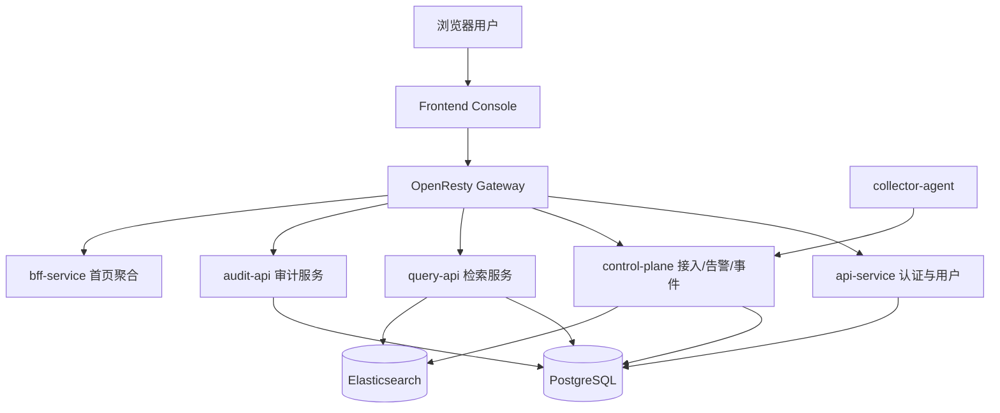

# NexusLog 平台日志管理系统的设计与实现

## 摘要

随着云计算、容器化部署以及微服务架构在企业信息系统中的广泛应用，应用服务数量持续增长，服务之间的调用链路日趋复杂，系统运行过程中产生的日志数据也呈现出高并发、高维度和高异构的特点。传统日志处理方式往往以分散式部署和人工运维为主，难以在统一身份认证、采集接入治理、检索分析效率、告警闭环以及安全审计等方面满足企业级平台建设的实际需求。基于此，本文围绕企业日志的统一接入、集中存储、快速检索和治理协同等目标，设计并实现了一套面向 B/S 架构的企业级平台日志管理系统——NexusLog。

本文结合当前项目代码仓库中已经完成的前后端模块、数据库迁移脚本、Elasticsearch 模板、接口注册情况以及测试资产，对系统的需求分析、总体设计、关键模块实现和测试方案进行了系统性阐述。系统以前后端分离模式构建，前端控制台采用 React、TypeScript 与 Ant Design 实现，后端以 Go 语言和 Gin 框架为主要开发技术，结合 OpenResty 网关、PostgreSQL 元数据存储和 Elasticsearch 检索存储，构建起认证鉴权、日志采集、查询分析、告警治理、审计留痕和用户权限管理等关键能力。围绕当前已完成内容，系统已实现统一登录入口、基于令牌的访问控制、会话刷新与轮换、Agent 增量采集与控制面调度、日志实时检索、查询历史与收藏查询、告警规则管理、事件管理、审计日志查询和用户角色管理等主要功能，并形成了“Agent—Control Plane—Elasticsearch—Query API—Frontend Console”的核心业务闭环。

在数据安全方面，系统已实现密码摘要存储、刷新令牌轮换追踪、通知渠道敏感配置脱敏返回、操作审计留痕以及日志治理字段预留，并通过 Elasticsearch ILM 模板与快照策略支持日志生命周期管理。实践结果表明，NexusLog 当前阶段已经具备较为完整的企业级日志平台雏形，能够支撑日志接入、运行态观测、异常定位与治理协同等典型场景。本文的研究与实现不仅验证了基于微服务与分层架构建设统一日志平台的可行性，也为后续系统向更高等级的自动化治理、精细化权限控制和统一可观测性平台演进奠定了工程基础。

**关键词：** 企业级日志管理系统；B/S 架构；微服务；Elasticsearch；日志治理；安全审计

## Abstract

With the rapid adoption of cloud computing, containerized deployment, and microservice architecture in enterprise information systems, the number of application services continues to increase, service invocation chains become more complex, and log data shows the characteristics of high concurrency, high dimensionality, and high heterogeneity. Traditional log processing solutions, which are usually fragmented and manually operated, can no longer satisfy enterprise requirements for unified authentication, ingest governance, efficient retrieval, alert closure, and security auditing. To address these challenges, this paper designs and implements an enterprise-oriented log management platform named NexusLog under a browser/server architecture.

Based on the current repository implementation, database migrations, Elasticsearch templates, API registrations, and existing testing assets, this paper systematically describes the requirement analysis, overall design, core module implementation, and testing strategy of the system. The platform adopts a front-end and back-end separated architecture. The front-end console is built with React, TypeScript, and Ant Design, while the back-end is mainly developed in Go with Gin, together with OpenResty gateway, PostgreSQL metadata storage, and Elasticsearch search storage. The implemented modules include unified login, token-based access control, session refresh and rotation, incremental log collection through agents, control-plane scheduling, real-time log search, query history and saved queries, alert rule management, incident handling, audit log query, and user-role administration. These components form a complete business loop from collection to storage, retrieval, display, and governance.

In terms of data security, the platform already supports password hash storage, refresh-token rotation tracking, masked return of sensitive notification configuration, operation auditing, and governance-oriented log metadata reservation. It also provides lifecycle management support for log data through Elasticsearch ILM templates and snapshot policies. The practical results show that NexusLog has established a relatively complete prototype of an enterprise log platform and can support typical scenarios such as log ingest, runtime observation, anomaly diagnosis, and governance collaboration. The study verifies the feasibility of building a unified enterprise log platform with a layered microservice architecture and provides an engineering basis for future evolution toward stronger automation, finer-grained authorization, and integrated observability.

**Keywords:** enterprise log management system; browser/server architecture; microservices; Elasticsearch; log governance; security auditing

---

## 第一章 绪论

### 1.1 引言

在数字化转型不断深入的背景下，企业业务系统已经从传统单体应用逐步演进为由多个微服务、网关组件、消息中间件和基础设施服务共同构成的分布式系统。随着系统规模不断扩大，日志不再只是辅助开发排查问题的文本记录，而逐渐演变为反映系统运行状态、用户行为轨迹、接口调用结果和安全事件的重要数据资源。尤其是在生产环境中，应用日志、审计日志、设备日志和基础设施指标之间往往相互关联，只有实现统一采集、统一检索和统一治理，才能真正发挥日志在故障定位、运行分析和安全审计中的价值。

然而，在许多企业的实际建设过程中，日志能力通常分散在不同团队和不同系统之间，存在采集标准不统一、接入配置不集中、查询入口不一致、权限边界不清晰以及审计留痕能力不足等问题。这种模式不仅提升了平台运维复杂度，也限制了日志在跨系统联动分析、告警治理和事件处置中的应用深度。因此，构建一套能够覆盖“接入—存储—检索—分析—治理—审计”全过程的统一日志管理平台，已经成为企业可观测性建设的重要内容。

### 1.2 项目背景

基于上述行业背景与工程需求，NexusLog 项目以构建企业级统一日志管理平台为目标，尝试将分散在不同系统和不同团队中的日志接入、查询分析、告警治理、事件处置与审计留痕能力整合到统一平台之中。项目采用前后端分离与分层服务架构，通过前端控制台、统一网关、认证服务、控制面、查询服务、审计服务和 BFF 聚合层等模块协同运行，逐步形成覆盖日志采集、存储、检索、治理与安全管理的整体解决方案。

从项目价值看，NexusLog 的建设不仅能够打通分散系统之间的日志链路，使日志数据由“局部可见”转变为“全局可管”，还能够通过统一认证、用户角色、告警规则、事件流转和审计日志等模块的协同设计，将传统“日志查询工具”扩展为兼具管理与协同能力的企业级平台。对于毕业设计研究而言，该项目覆盖了需求分析、架构设计、数据库设计、接口规范、前端交互和后端实现等多个技术层面，具有较强的系统性与综合性，能够较完整地体现软件工程项目从设计到实现的全过程。

本文围绕 NexusLog 当前阶段已经完成的功能展开研究，重点包括业务需求分析、总体架构设计、数据库与数据流设计、核心模块实现以及测试验证等内容。全文共分为六章：第一章为绪论；第二章为系统需求分析；第三章为系统总体设计；第四章为系统详细设计与实现；第五章为系统测试；第六章为总结与展望。

---

## 第二章 系统需求分析

### 2.1 系统总体目标

NexusLog 的总体目标是面向企业内部多角色使用场景，构建一套能够支撑日志统一接入、集中存储、实时检索、告警治理、事件协同和安全审计的日志管理平台。从当前仓库实现情况看，系统不仅要求主链路能够跑通，还要求平台具备较清晰的权限边界、数据留痕能力与后续演进空间。因此，系统总体目标可以概括为以下四点：一是建立统一访问入口与身份体系；二是实现日志从采集到查询的完整闭环；三是支撑告警、事件和审计等治理能力；四是在架构、数据模型和测试体系上为后续扩展预留明确接口。

### 2.2 功能性需求分析

#### 2.2.1 统一认证与权限管理

系统首先需要提供统一的访问入口与身份认证能力。当前项目中，用户通过 `/api/v1/auth/login`、`/api/v1/auth/refresh` 和 `/api/v1/auth/logout` 等接口完成登录、续期和退出；前端通过 `ProtectedRoute` 组件对未登录用户进行拦截，并对访问令牌过期场景执行自动刷新。除登录态管理外，系统还需要支持当前用户信息获取、用户列表管理、角色查询与角色授权，以满足企业平台中超级管理员、运维操作员、只读用户等多角色并存的访问控制需求。

#### 2.2.2 日志接入治理

日志接入能力是系统的主链路起点，也是平台化建设与简单日志工具的重要区别。结合当前实现，系统需要支持采集源配置管理、Agent 增量读取、断点续传、采集任务执行、包级回执处理和死信重试等能力。仓库中的 `ingest_pull_sources`、`ingest_pull_tasks`、`agent_incremental_packages`、`ingest_delivery_receipts` 和 `ingest_dead_letters` 等表，反映出系统并非仅要求“日志能够上传”，而是要求“接入过程可配置、可追踪、可恢复”。

#### 2.2.3 日志检索与查询管理

作为日志平台的核心业务能力，系统需要支持实时检索、聚合统计、查询历史保存和收藏查询复用等功能。当前项目中，查询服务已经提供 `POST /api/v1/query/logs`、`GET /api/v1/query/history`、`GET/POST/PUT/DELETE /api/v1/query/saved` 等接口，前端页面支持时间范围、关键字、字段过滤、统计摘要和历史回放。这意味着系统对检索功能的需求不仅是“查得出来”，还包括“查询结果可回看、查询条件可沉淀、查询体验可复用”。

#### 2.2.4 告警与事件治理

日志平台在企业场景中不仅需要发现问题，还要支撑问题的治理过程。因此，系统要求在查询能力之上提供告警规则、通知渠道、静默策略、告警事件和事件处置等治理功能。当前仓库中已经存在 `alert_rules`、`alert_events`、`notification_channels`、`alert_silences`、`incidents` 和 `incident_timeline` 等数据结构与接口实现，说明系统在设计上已经考虑从异常发现、消息通知、人员协同到事件闭环的完整链路。

#### 2.2.5 审计与安全管理

对于企业级平台而言，系统不仅要管理业务数据，还要管理操作行为本身。当前项目要求对登录、刷新、退出、采集源管理、用户管理和部分治理操作进行审计记录，并支持在前端页面按用户、操作、资源和时间范围进行查询与回溯。同时，系统还要对用户、角色、保留账号和交互式登录权限进行治理，以避免高权限账号滥用和责任归因缺失。

#### 2.2.6 数据安全与合规需求

数据安全与合规需求贯穿日志平台全生命周期。结合当前仓库的真实实现与预留设计，系统在本阶段至少需要满足以下要求：其一，用户密码必须以摘要形式存储，避免明文或弱保护写入数据库；其二，会话刷新令牌必须支持哈希存储、轮换链路追踪和重放防护；其三，敏感配置在接口返回时必须进行脱敏处理，例如通知渠道中的 SMTP 密码或 webhook 密钥；其四，日志文档需要预留数据治理字段，用于标识保留策略、敏感信息处理状态和数据分类；其五，日志数据应支持生命周期管理和快照归档，以满足数据留存与清理的合规要求。需要说明的是，独立的“日志脱敏规则引擎”与统一密钥管理能力在仓库中已存在设计与页面预留，但当前尚不宜写为全部完成。

### 2.3 非功能性需求分析

#### 2.3.1 性能需求

日志平台需要面对大体量、高频率、宽时间范围的检索请求，因此系统必须在查询响应时间、统计计算效率和多页面并发访问方面保持可接受性能。当前项目通过 Elasticsearch 承担日志全文检索和聚合计算，通过前端分页和后端元数据拆分减轻单次请求压力，从架构层面满足日志查询场景的性能需求。

#### 2.3.2 可扩展性需求

系统应具备较好的模块扩展能力与技术演进空间。NexusLog 采用 Monorepo 结构组织前端、网关、服务、存储和测试资产，使新增业务模块可以在统一工程规范下扩展；同时，数据层采用 PostgreSQL 与 Elasticsearch 的组合，为未来增加导出、归档、追踪、成本治理等能力提供了基础。

#### 2.3.3 安全性需求

安全性需求包括身份认证、权限校验、会话安全、敏感配置保护和操作留痕等多个维度。当前项目已实现令牌校验、租户作用域控制、能力项校验、密码摘要存储、刷新令牌轮换、登录失败记录和审计中间件等机制。这些能力共同构成了平台在当前阶段的最小安全闭环。

#### 2.3.4 易用性需求

平台需要面向不同角色用户提供统一且直观的交互体验。当前前端控制台基于 Ant Design 组件体系构建，已经形成首页仪表盘、实时检索、采集源管理、告警规则、事件列表、审计日志和用户管理等页面，能够以较低学习成本支撑常见运维与治理操作。

### 2.4 系统用例分析

#### 2.4.1 参与者定义

表2-1 系统主要参与者定义

| 参与者 | 角色说明 | 典型操作 |
| --- | --- | --- |
| 平台超级管理员 | 负责系统初始化、用户与角色管理、关键配置维护 | 登录平台、管理用户与角色、查看审计日志 |
| 运维操作员 | 负责日志接入、检索分析、告警规则与事件处理 | 管理采集源、执行查询、维护告警规则、处置事件 |
| 只读分析用户 | 负责查看运行态信息与查询结果 | 访问首页、执行只读检索、查看趋势统计 |
| Collector Agent | 负责日志采集、状态上报与指标上报 | 拉取或上传日志批次、上报采集状态和资源指标 |
| 系统自动化账号 | 用于自动化操作归因，不参与日常交互式登录 | 写入自动化审计记录、执行系统保留操作 |

#### 2.4.2 核心用例描述

表2-2 核心用例描述

| 用例名称 | 参与者 | 输入 | 处理过程 | 输出 |
| --- | --- | --- | --- | --- |
| 用户登录与续期 | 平台超级管理员、运维操作员、只读分析用户 | 用户名、密码、租户标识 | 校验账号状态与密码摘要，创建会话并签发访问令牌；令牌到期后执行刷新 | 登录成功、续期成功或失败提示 |
| 采集源管理 | 平台超级管理员、运维操作员 | 采集源配置 | 创建或更新采集源，生成调度配置并维护运行状态 | 采集源列表、状态与变更结果 |
| 实时日志检索 | 运维操作员、只读分析用户 | 时间范围、关键字、筛选条件 | 查询服务访问 Elasticsearch，返回命中结果与统计摘要 | 查询列表、聚合统计、分页信息 |
| 收藏查询管理 | 运维操作员、只读分析用户 | 查询名称、条件、公开属性 | 写入收藏查询元数据并支持后续复用 | 收藏查询清单与执行结果 |
| 告警与事件处置 | 平台超级管理员、运维操作员 | 告警规则、事件状态变更 | 规则触发产生告警事件，人员接手并维护时间线 | 告警事件、事件列表、SLA 摘要 |
| 审计与权限治理 | 平台超级管理员 | 用户、角色、操作记录 | 管理用户角色、查看审计日志、验证系统留痕 | 用户与角色清单、审计记录 |

### 2.5 技术选型说明

表2-3 当前实现所采用的主要技术选型

| 层级 | 技术选型 | 当前状态 | 选型理由 |
| --- | --- | --- | --- |
| 前端控制台 | React 19 + TypeScript + Ant Design + Vite | 已实现 | 适合构建复杂交互页面，工程化能力较强 |
| 网关层 | OpenResty | 已实现 | 统一入口、便于路由转发与策略集中化 |
| 认证与用户服务 | Go + Gin + PostgreSQL | 已实现 | 代码结构清晰，便于实现鉴权、会话和用户治理 |
| 控制面服务 | Go + Gin | 已实现 | 适合承载采集治理、告警和事件等平台逻辑 |
| 查询与审计服务 | Go + Gin + Elasticsearch/PostgreSQL | 已实现 | 兼顾检索性能和元数据关系管理 |
| 元数据存储 | PostgreSQL | 已实现 | 事务一致性好，适合认证、审计、告警和关系建模 |
| 检索存储 | Elasticsearch Data Stream + Index Template | 已实现 | 适合日志全文检索、聚合统计与生命周期管理 |
| 缓存与辅助组件 | Redis | 已实现 | 用于缓存与运行态支撑 |
| 自动化测试 | Vitest、Go Test、Playwright、集成脚本 | 已实现 | 覆盖前端单测、后端测试、端到端和联调验证 |

需要说明的是，仓库中的部分设计文档还包含 Keycloak、OPA、Vault 等更高阶安全组件与 P1/P2 能力规划。这些内容反映了项目演进方向，但本文只将当前仓库中已落地的能力写作“已实现”，将规划项保留为后续扩展方向。

### 2.6 本章小结

本章从总体目标、功能性需求、非功能性需求、系统用例和技术选型五个方面，对 NexusLog 的需求背景和建设边界进行了分析。结合当前仓库的实际实现情况可以看出，系统已经具备较完整的主链路与治理能力基础，后续章节将在此基础上进一步说明总体设计和具体实现。

---

## 第三章 系统总体设计

### 3.1 系统架构设计

#### 3.1.1 分层架构总览

NexusLog 采用典型的分层式企业平台架构，整体上可以分为表现层、网关层、服务层、数据层和接入层。其中，表现层由前端控制台构成，负责页面渲染、用户交互和状态展示；网关层由 OpenResty 统一接管外部请求，实现路由转发与统一入口；服务层由 `api-service`、`control-plane`、`query-api`、`audit-api` 以及 `bff-service` 等模块构成，分别承担认证权限、接入控制、查询服务、审计查询和聚合视图等职责；数据层以 PostgreSQL 作为元数据存储，以 Elasticsearch 作为日志检索和结构化文档存储；接入层则由 Collector Agent 负责日志发现、增量采集和数据打包。



#### 3.1.2 数据流转设计

当前阶段系统的日志数据流转主要由以下几个环节组成。第一，Collector Agent 在目标节点扫描指定路径下的日志文件，通过 checkpoint 等机制记录读取进度，保证增量采集的连续性。第二，控制面根据采集源配置生成拉取任务，并对任务状态、包记录、回执信息和死信数据进行统一管理。第三，经过处理后的日志数据被写入 Elasticsearch 检索索引，成为可查询的结构化日志文档。第四，Query API 依据前端传入的查询条件访问 Elasticsearch，并将结果以统一 JSON 结构返回给控制台页面。第五，告警规则、事件流转、审计记录和首页聚合视图等能力，则在查询结果和元数据基础上进一步形成治理闭环。

从当前实现情况看，系统已经在“采集—调度—写入—检索—展示”这一主路径上形成了可运行闭环，这是毕业设计场景下最核心的工程成果之一。同时，仓库中也保留了更复杂的数据流扩展接口，例如导出、更多异构接入方式和更高阶分析能力等，为后续迭代预留了空间。

#### 3.1.3 安全架构设计

结合当前仓库实现，系统安全架构主要由三层构成。第一层是身份与会话层，由 `api-service` 负责登录、刷新、退出、密码重置和登录风控，底层依托 `users`、`user_credentials`、`user_sessions`、`login_attempts` 等表实现账号与会话治理。第二层是授权与边界控制层，前端通过 `routeAuthorization` 与 `ProtectedRoute` 对页面访问进行控制，后端通过 capability、scope 和租户上下文校验约束 API 访问边界。第三层是审计与安全治理层，通过审计中间件、显式审计事件和审计日志查询接口，完成对关键操作的留痕与追溯。

需要强调的是，设计文档中还包含更高等级的统一 IAM 与策略引擎规划，但当前论文所描述的“已实现安全架构”以仓库现有代码为准，即 JWT 会话、能力项校验、租户作用域限制、密码摘要存储、敏感配置脱敏和审计留痕等能力。

### 3.2 功能模块划分

表3-1 系统功能模块划分

| 模块 | 核心组成 | 主要职责 | 当前状态 |
| --- | --- | --- | --- |
| 认证与用户模块 | `api-service`、前端登录页、`ProtectedRoute` | 登录、刷新、退出、当前用户、用户与角色管理 | 已实现 |
| 日志采集模块 | `collector-agent`、`control-plane` | 采集源配置、任务调度、包回执、断点续传、死信处理 | 已实现 |
| 日志检索模块 | `query-api`、实时检索页、历史与收藏页 | 日志查询、统计概览、查询历史、收藏查询 | 已实现 |
| 告警与事件模块 | `control-plane` 中 alert/incident 相关组件 | 告警规则、告警事件、通知渠道、静默策略、事件流转 | 已实现 |
| 审计与权限模块 | `audit-api`、用户管理页、审计日志页 | 审计留痕、审计查询、用户与角色治理 | 已实现 |
| 首页聚合模块 | `bff-service`、Dashboard 页面 | 聚合多服务概览信息并供首页统一展示 | 已实现 |
| 数据安全模块 | 密码摘要、会话轮换、配置脱敏、治理字段 | 支撑平台基础安全和生命周期治理 | 部分实现 |

### 3.3 数据库设计

#### 3.3.1 数据库总体设计思路

NexusLog 采用“关系型数据库 + 检索型数据库”的混合存储模式。具体而言，PostgreSQL 负责存储平台元数据，包括租户、用户、角色、会话、查询历史、告警规则、事件流转、审计日志和采集治理数据等结构化信息；Elasticsearch 则负责存储已经结构化的日志文档，用于支撑全文检索、聚合统计与趋势分析。该设计既发挥了关系型数据库在事务一致性和复杂关系建模方面的优势，也利用了 Elasticsearch 在海量日志检索和多维聚合方面的高适配性。

在当前项目实现中，PostgreSQL 的表结构通过迁移脚本持续演进，已经覆盖认证安全、采集接入、查询元数据、告警治理、事件管理和运行态辅助能力等多个业务域。与之对应，Elasticsearch 中的日志文档则主要承载时间戳、日志级别、消息内容、来源标识、标签字段和治理字段等信息，供查询服务直接调用。

#### 3.3.2 PostgreSQL 核心表结构设计

为保证论文内容与仓库实现保持一致，本文以迁移脚本中的真实字段为依据，提炼出平台当前阶段最关键的认证、接入、检索、告警、事件和审计数据模型。受论文篇幅限制，表3-2 列出各核心业务表的主要字段，而非全部字段。

表3-2 PostgreSQL 核心表设计表（节选）

| 表名 | 字段名 | 数据类型 | 长度 | 主键 / 外键 | 非空 | 默认值 | 说明 |
| --- | --- | --- | --- | --- | --- | --- | --- |
| `users` | `id` | UUID | 36 | 主键 | 是 | `uuid_generate_v4()` | 用户唯一标识 |
| `users` | `tenant_id` | UUID | 36 | 外键→`obs.tenant.id` | 否 | 无 | 所属租户 |
| `users` | `username` | VARCHAR | 128 | - | 是 | 无 | 登录用户名，租户内唯一 |
| `users` | `email` | VARCHAR | 255 | - | 是 | 无 | 用户邮箱，租户内唯一 |
| `users` | `display_name` | VARCHAR | 255 | - | 否 | 无 | 展示名称 |
| `users` | `status` | VARCHAR | 20 | - | 是 | `active` | 用户状态 |
| `users` | `last_login_at` | TIMESTAMPTZ | - | - | 否 | 无 | 最近登录时间 |
| `users` | `created_at` | TIMESTAMPTZ | - | - | 是 | `NOW()` | 创建时间 |
| `roles` | `id` | UUID | 36 | 主键 | 是 | `uuid_generate_v4()` | 角色唯一标识 |
| `roles` | `tenant_id` | UUID | 36 | 外键→`obs.tenant.id` | 否 | 无 | 所属租户 |
| `roles` | `name` | VARCHAR | 128 | - | 是 | 无 | 角色名称，租户内唯一 |
| `roles` | `description` | TEXT | - | - | 否 | 无 | 角色说明 |
| `roles` | `permissions` | JSONB | - | - | 否 | `[]` | 角色权限集合 |
| `roles` | `created_at` | TIMESTAMPTZ | - | - | 是 | `NOW()` | 创建时间 |
| `user_roles` | `user_id` | UUID | 36 | 联合主键，外键→`users.id` | 是 | 无 | 关联用户 |
| `user_roles` | `role_id` | UUID | 36 | 联合主键，外键→`roles.id` | 是 | 无 | 关联角色 |
| `user_roles` | `granted_at` | TIMESTAMPTZ | - | - | 是 | `NOW()` | 授权时间 |
| `user_sessions` | `id` | UUID | 36 | 主键 | 是 | `uuid_generate_v4()` | 会话唯一标识 |
| `user_sessions` | `tenant_id` | UUID | 36 | 外键→`obs.tenant.id` | 是 | 无 | 所属租户 |
| `user_sessions` | `user_id` | UUID | 36 | 外键→`users.id` | 是 | 无 | 所属用户 |
| `user_sessions` | `refresh_token_hash` | VARCHAR | 255 | - | 是 | 无 | 刷新令牌哈希 |
| `user_sessions` | `access_token_jti` | VARCHAR | 128 | - | 否 | 无 | 访问令牌标识 |
| `user_sessions` | `session_status` | VARCHAR | 20 | - | 是 | `active` | 会话状态 |
| `user_sessions` | `expires_at` | TIMESTAMPTZ | - | - | 是 | 无 | 会话过期时间 |
| `user_sessions` | `session_family_id` | UUID | 36 | - | 是 | 无 | 刷新令牌轮换链标识 |
| `user_sessions` | `replaced_by_session_id` | UUID | 36 | 外键→`user_sessions.id` | 否 | 无 | 被下一次轮换会话替换 |
| `ingest_pull_sources` | `id` | UUID | 36 | 主键 | 是 | `uuid_generate_v4()` | 采集源唯一标识 |
| `ingest_pull_sources` | `tenant_id` | UUID | 36 | 外键→`obs.tenant.id` | 是 | 无 | 所属租户 |
| `ingest_pull_sources` | `name` | VARCHAR | 255 | - | 是 | 无 | 采集源名称 |
| `ingest_pull_sources` | `host` | VARCHAR | 255 | - | 是 | 无 | 目标主机地址 |
| `ingest_pull_sources` | `port` | INTEGER | - | - | 是 | 无 | 目标端口 |
| `ingest_pull_sources` | `protocol` | VARCHAR | 20 | - | 是 | 无 | 接入协议类型 |
| `ingest_pull_sources` | `path_pattern` | TEXT | - | - | 否 | 无 | 日志路径规则 |
| `ingest_pull_sources` | `poll_interval_sec` | INTEGER | - | - | 是 | `30` | 拉取间隔 |
| `ingest_pull_sources` | `agent_base_url` | TEXT | - | - | 否 | 无 | Agent 基础访问地址 |
| `ingest_pull_sources` | `pull_interval_sec` | INTEGER | - | - | 是 | `30` | 当前执行链实际使用的拉取间隔 |
| `ingest_pull_sources` | `pull_timeout_sec` | INTEGER | - | - | 是 | `30` | 拉取超时时间 |
| `ingest_pull_sources` | `key_ref` | VARCHAR | 255 | - | 否 | 无 | Agent 拉取鉴权密钥引用 |
| `ingest_pull_sources` | `status` | VARCHAR | 20 | - | 是 | `active` | 采集源状态 |
| `ingest_pull_sources` | `metadata` | JSONB | - | - | 是 | `{}` | 扩展配置 |
| `ingest_pull_tasks` | `id` | UUID | 36 | 主键 | 是 | `uuid_generate_v4()` | 拉取任务唯一标识 |
| `ingest_pull_tasks` | `source_id` | UUID | 36 | 外键→`ingest_pull_sources.id` | 是 | 无 | 所属采集源 |
| `ingest_pull_tasks` | `scheduled_at` | TIMESTAMPTZ | - | - | 是 | `NOW()` | 调度时间 |
| `ingest_pull_tasks` | `started_at` | TIMESTAMPTZ | - | - | 否 | 无 | 开始执行时间 |
| `ingest_pull_tasks` | `finished_at` | TIMESTAMPTZ | - | - | 否 | 无 | 结束时间 |
| `ingest_pull_tasks` | `status` | VARCHAR | 20 | - | 是 | `pending` | 执行状态 |
| `ingest_pull_tasks` | `trigger_type` | VARCHAR | 32 | - | 是 | `manual` | 任务触发方式 |
| `ingest_pull_tasks` | `options` | JSONB | - | - | 是 | `{}` | 执行参数 |
| `ingest_pull_tasks` | `bytes_pulled` | BIGINT | - | - | 是 | `0` | 拉取字节数 |
| `ingest_pull_tasks` | `files_pulled` | INTEGER | - | - | 是 | `0` | 拉取文件数 |
| `ingest_pull_tasks` | `package_count` | INTEGER | - | - | 是 | `0` | 产生包数量 |
| `ingest_pull_tasks` | `retry_count` | INTEGER | - | - | 是 | `0` | 重试次数 |
| `ingest_pull_tasks` | `last_cursor` | TEXT | - | - | 否 | 无 | 最近一次任务游标 |
| `query_histories` | `id` | UUID | 36 | 主键 | 是 | `uuid_generate_v4()` | 查询历史记录标识 |
| `query_histories` | `tenant_id` | UUID | 36 | 外键→`obs.tenant.id` | 是 | 无 | 所属租户 |
| `query_histories` | `user_id` | UUID | 36 | 外键→`users.id` | 否 | 无 | 发起查询的用户 |
| `query_histories` | `query_text` | TEXT | - | - | 是 | 无 | 查询语句 |
| `query_histories` | `query_hash` | CHAR | 64 | - | 否 | 无 | 查询摘要 |
| `query_histories` | `filters` | JSONB | - | - | 是 | `{}` | 过滤条件 |
| `query_histories` | `time_range_start` | TIMESTAMPTZ | - | - | 否 | 无 | 查询起始时间 |
| `query_histories` | `time_range_end` | TIMESTAMPTZ | - | - | 否 | 无 | 查询结束时间 |
| `query_histories` | `result_count` | BIGINT | - | - | 否 | 无 | 命中数量 |
| `query_histories` | `duration_ms` | INTEGER | - | - | 否 | 无 | 查询耗时 |
| `query_histories` | `status` | VARCHAR | 20 | - | 是 | `success` | 查询状态 |
| `saved_queries` | `id` | UUID | 36 | 主键 | 是 | `uuid_generate_v4()` | 收藏查询唯一标识 |
| `saved_queries` | `tenant_id` | UUID | 36 | 外键→`obs.tenant.id` | 是 | 无 | 所属租户 |
| `saved_queries` | `user_id` | UUID | 36 | 外键→`users.id` | 是 | 无 | 创建人 |
| `saved_queries` | `name` | VARCHAR | 255 | - | 是 | 无 | 收藏查询名称 |
| `saved_queries` | `description` | TEXT | - | - | 否 | 无 | 收藏说明 |
| `saved_queries` | `query_text` | TEXT | - | - | 是 | 无 | 收藏的查询语句 |
| `saved_queries` | `filters` | JSONB | - | - | 是 | `{}` | 收藏的过滤条件 |
| `saved_queries` | `is_public` | BOOLEAN | 1 | - | 是 | `false` | 是否公开 |
| `saved_queries` | `run_count` | BIGINT | - | - | 是 | `0` | 被执行次数 |
| `alert_rules` | `id` | UUID | 36 | 主键 | 是 | `uuid_generate_v4()` | 告警规则标识 |
| `alert_rules` | `tenant_id` | UUID | 36 | 外键→`obs.tenant.id` | 否 | 无 | 所属租户 |
| `alert_rules` | `name` | VARCHAR | 255 | - | 是 | 无 | 规则名称 |
| `alert_rules` | `condition` | JSONB | - | - | 是 | 无 | 规则条件 |
| `alert_rules` | `severity` | VARCHAR | 20 | - | 是 | `WARNING` | 默认严重级别 |
| `alert_rules` | `enabled` | BOOLEAN | 1 | - | 是 | `true` | 是否启用 |
| `alert_rules` | `notification_channels` | JSONB | - | - | 否 | `[]` | 通知渠道配置 |
| `alert_rules` | `created_by` | UUID | 36 | 外键→`users.id` | 否 | 无 | 创建人 |
| `alert_events` | `id` | UUID | 36 | 主键 | 是 | `gen_random_uuid()` | 告警事件标识 |
| `alert_events` | `tenant_id` | UUID | 36 | 外键→`obs.tenant.id` | 否 | 无 | 所属租户 |
| `alert_events` | `rule_id` | UUID | 36 | 外键→`alert_rules.id` | 否 | 无 | 来源规则，资源阈值告警场景下可空 |
| `alert_events` | `severity` | VARCHAR | 20 | - | 是 | 无 | 事件严重级别 |
| `alert_events` | `title` | VARCHAR | 500 | - | 是 | 无 | 事件标题 |
| `alert_events` | `status` | VARCHAR | 20 | - | 是 | `firing` | 事件状态 |
| `alert_events` | `fired_at` | TIMESTAMPTZ | - | - | 是 | `now()` | 触发时间 |
| `alert_events` | `resolved_at` | TIMESTAMPTZ | - | - | 否 | 无 | 恢复时间 |
| `alert_events` | `notification_result` | JSONB | - | - | 否 | 无 | 通知结果 |
| `alert_events` | `resource_threshold_id` | UUID | 36 | 外键→`resource_thresholds.id` | 否 | 无 | 资源阈值类告警来源 |
| `incidents` | `id` | UUID | 36 | 主键 | 是 | `gen_random_uuid()` | 事件单唯一标识 |
| `incidents` | `tenant_id` | UUID | 36 | 外键→`obs.tenant.id` | 否 | 无 | 所属租户 |
| `incidents` | `title` | VARCHAR | 500 | - | 是 | 无 | 事件标题 |
| `incidents` | `severity` | VARCHAR | 20 | - | 是 | 无 | 严重级别 |
| `incidents` | `status` | VARCHAR | 30 | - | 是 | `open` | 事件状态 |
| `incidents` | `source_alert_id` | UUID | 36 | 外键→`alert_events.id` | 否 | 无 | 来源告警事件 |
| `incidents` | `assigned_to` | UUID | 36 | 外键→`users.id` | 否 | 无 | 当前负责人 |
| `incidents` | `created_by` | UUID | 36 | 外键→`users.id` | 否 | 无 | 创建人 |
| `incidents` | `acknowledged_at` | TIMESTAMPTZ | - | - | 否 | 无 | 确认时间 |
| `incidents` | `resolved_at` | TIMESTAMPTZ | - | - | 否 | 无 | 解决时间 |
| `incidents` | `closed_at` | TIMESTAMPTZ | - | - | 否 | 无 | 关闭时间 |
| `incidents` | `sla_response_minutes` | INT | - | - | 否 | 无 | 响应 SLA |
| `audit_logs` | `id` | UUID | 36 | 主键 | 是 | `uuid_generate_v4()` | 审计日志标识 |
| `audit_logs` | `tenant_id` | UUID | 36 | 外键→`obs.tenant.id` | 否 | 无 | 所属租户 |
| `audit_logs` | `user_id` | UUID | 36 | 外键→`users.id` | 否 | 无 | 操作用户 |
| `audit_logs` | `action` | VARCHAR | 128 | - | 是 | 无 | 操作动作 |
| `audit_logs` | `resource_type` | VARCHAR | 128 | - | 是 | 无 | 资源类型 |
| `audit_logs` | `resource_id` | VARCHAR | 255 | - | 否 | 无 | 资源标识 |
| `audit_logs` | `details` | JSONB | - | - | 否 | `{}` | 审计详情 |
| `audit_logs` | `ip_address` | INET | - | - | 否 | 无 | 来源 IP |
| `audit_logs` | `user_agent` | TEXT | - | - | 否 | 无 | 客户端标识 |
| `audit_logs` | `created_at` | TIMESTAMPTZ | - | - | 是 | `NOW()` | 记录时间 |

从表3-2 可以看出，当前系统数据库设计围绕平台治理目标形成了多业务域协同模型：`users`、`roles` 与 `user_sessions` 共同支撑身份认证与权限控制；`ingest_pull_sources` 与 `ingest_pull_tasks` 支撑接入治理；`query_histories` 与 `saved_queries` 支撑查询资产沉淀；`alert_rules`、`alert_events` 与 `incidents` 支撑异常治理；`audit_logs` 则负责对关键操作进行统一留痕。

需要进一步说明的是，运行时迁移在后续版本中还对接入主链和告警模型做了增强：一方面，`000017_m2_ingest_execution_chain_enhancement` 为 `ingest_pull_sources`、`ingest_pull_tasks` 和 `agent_incremental_packages` 增加了 `agent_base_url`、`pull_interval_sec`、`trigger_type`、`batch_id`、`retry_count` 与链路追踪等字段，使采集链路更贴近真实执行场景；另一方面，`000021_resource_alerts_support` 将 `alert_events.rule_id` 调整为可空，并新增 `resource_threshold_id` 以支撑资源阈值型告警。因此，论文在描述数据库结构时应将这些增强字段视为当前运行时事实的一部分。

#### 3.3.3 Elasticsearch 索引设计

与 PostgreSQL 负责元数据不同，日志正文与结构化检索主要依赖 Elasticsearch 完成。当前仓库已经提供 `nexuslog-logs-v2` 索引模板，其模式同时兼容 `nexuslog-logs-v2` 与 `nexuslog-logs-v2-*`，并以 data stream 方式组织日志数据。模板中不仅包含 `@timestamp`、`message`、`log.level`、`service.name`、`host.name`、`trace.id` 等常规检索字段，还预留了传输、采集与治理字段，用于支撑日志批次追踪、生命周期管理和安全治理。

表3-3 Elasticsearch 结构化日志字段分组示意

| 字段类别 | 代表字段 | 主要作用 |
| --- | --- | --- |
| 基础检索字段 | `@timestamp`、`message`、`log.level` | 支撑时间排序、全文检索与级别过滤 |
| 来源标识字段 | `agent.id`、`host.name`、`service.name`、`source.path` | 标识日志来源与运行环境 |
| 关联分析字段 | `trace.id`、`span.id`、`request.id`、`event.id` | 支撑跨请求与跨服务关联分析 |
| 传输链路字段 | `nexuslog.transport.batch_id`、`channel`、`encrypted` | 支撑批次追踪与传输安全识别 |
| 采集治理字段 | `nexuslog.ingest.received_at`、`parse_status`、`retry_count` | 支撑采集过程监控与重试分析 |
| 数据治理字段 | `nexuslog.governance.retention_policy`、`pii_masked`、`classification` | 支撑生命周期、脱敏与分类治理 |

这种“元数据入 PostgreSQL、日志文档入 Elasticsearch”的双存储设计，使系统既能够保持平台管理能力所需的关系完整性，又能够满足日志检索场景所需的查询性能与统计能力。对企业级日志平台而言，这是一种较为合理且可扩展的设计方式。

#### 3.3.4 日志生命周期管理策略

日志生命周期管理是平台长期运行所必须考虑的问题。结合当前仓库实现，Elasticsearch 模板已绑定 `nexuslog-logs-ilm` 生命周期策略，默认在 hot 阶段执行滚动控制，并在数据达到删除条件前等待快照完成。从策略文件可见，当前设置包括：日志索引在 hot 阶段根据主分片大小、索引年龄和文档数量进行 rollover；达到 15 天后触发 delete 阶段，并在删除前依赖 `nexuslog-snapshot-policy` 快照策略完成归档保护。快照策略默认在每日凌晨执行，对 `nexuslog-logs-*` 索引进行快照，并设置 30 天保留上限。

因此，当前仓库中的“日志生命周期管理”可以概括为“在线热数据检索 + 快照冷归档 + 到期删除”的实现方式。与传统意义上的 Elasticsearch warm/cold 节点分层相比，该方案更贴近当前项目的本地开发与毕业设计场景：一方面控制部署复杂度，另一方面仍然保留了数据保留、归档与清理的治理能力。

### 3.4 接口设计

#### 3.4.1 RESTful API 设计规范

NexusLog 当前实现的主要业务接口均以 `/api/v1` 为统一前缀，并遵循资源导向的 REST 风格。接口设计采用名词化路径与 HTTP 动词组合表达资源操作，例如用户登录使用 `POST /api/v1/auth/login`，实时查询使用 `POST /api/v1/query/logs`，收藏查询管理使用 `GET/POST/PUT/DELETE /api/v1/query/saved`，用户管理使用 `GET/POST/PUT/DELETE /api/v1/users`。这种设计方式有利于前后端协作，也便于后续进行网关路由治理与版本迭代。

除路径规范外，系统接口还具有以下共性特征：一是大多数受保护接口要求携带 `Authorization: Bearer <token>`；二是租户范围接口要求带上 `X-Tenant-ID`；三是成功与失败响应均采用统一响应信封结构，便于前端统一处理异常和请求追踪。

#### 3.4.2 主要接口定义

表3-4 系统主要接口定义

| 接口名称 | HTTP 方法 | 路由地址 | 主要功能 |
| --- | --- | --- | --- |
| 用户登录 | `POST` | `/api/v1/auth/login` | 校验账号密码并签发访问令牌 |
| 刷新令牌 | `POST` | `/api/v1/auth/refresh` | 刷新会话状态并轮换 refresh token |
| 当前用户信息 | `GET` | `/api/v1/users/me` | 获取当前登录用户信息 |
| 用户管理 | `GET/POST/PUT/DELETE` | `/api/v1/users` | 查询、创建、更新与删除用户 |
| 角色查询 | `GET` | `/api/v1/roles` | 获取租户可用角色列表 |
| 日志检索 | `POST` | `/api/v1/query/logs` | 执行日志查询并返回命中结果 |
| 查询历史 | `GET` | `/api/v1/query/history` | 查询历史记录列表 |
| 收藏查询管理 | `GET/POST/PUT/DELETE` | `/api/v1/query/saved` | 管理收藏查询 |
| 首页概览统计 | `GET` | `/api/v1/query/stats/overview` | 返回首页概览统计信息 |
| 采集源管理 | `GET/POST/PUT` | `/api/v1/ingest/pull-sources` | 管理采集源配置 |
| 拉取任务执行 | `POST` | `/api/v1/ingest/pull-tasks/run` | 手动触发采集拉取任务 |
| 告警规则管理 | `GET/POST/PUT/DELETE` | `/api/v1/alert/rules` | 管理告警规则 |
| 通知渠道管理 | `GET/POST/PUT/DELETE` | `/api/v1/notification/channels` | 管理通知渠道 |
| 事件管理 | `GET/POST/PUT/DELETE` | `/api/v1/incidents` | 管理事件对象 |
| 审计日志查询 | `GET` | `/api/v1/audit/logs` | 查询审计留痕信息 |
| 首页 BFF 聚合 | `GET` | `/api/v1/bff/overview` | 聚合多服务概览数据 |

### 3.5 前后端交互协议

#### 3.5.1 请求与响应格式

当前系统主要采用 JSON 作为前后端交互载体。对于写操作，前端将业务参数封装为 JSON 请求体并通过 `fetch` 发起请求；对于读操作，前端通常以 query string 传递分页、关键字、时间范围等参数。服务端响应则尽可能采用统一信封格式，核心字段包括 `code`、`message`、`request_id`、`data` 和 `meta`。该结构便于前端统一处理正常结果、错误提示与请求追踪。

典型成功响应格式如下：

```json
{
  "code": "OK",
  "message": "success",
  "request_id": "api-1710000000-abcdef123456",
  "data": {},
  "meta": {}
}
```

典型失败响应格式如下：

```json
{
  "code": "QUERY_INVALID_PARAMS",
  "message": "invalid request",
  "request_id": "api-1710000000-abcdef123456",
  "data": {},
  "meta": {}
}
```

#### 3.5.2 认证与鉴权流程

当前系统的认证与鉴权流程可概括为以下步骤。

1. 用户在登录页面输入用户名和密码，前端携带租户标识调用 `/api/v1/auth/login`。
2. `api-service` 在 PostgreSQL 中校验 `users` 与 `user_credentials`，同时记录登录尝试并在成功后写入 `user_sessions`。
3. 服务端返回访问令牌与刷新令牌，前端将其写入本地存储，并通过 `ProtectedRoute` 同步当前授权上下文。
4. 当访问令牌接近过期时，前端自动调用 `/api/v1/auth/refresh`；后端基于 `user_sessions` 进行 refresh token 校验、轮换和重放防护，并返回新令牌对。
5. 后续业务请求统一通过 `Authorization` 头访问 `/api/v1/...` 接口；对于租户范围受控接口，还需传递 `X-Tenant-ID`，后端再结合 capability 与 scope 完成最终授权判断。

### 3.6 本章小结

本章从系统架构、模块划分、数据库设计、接口设计和前后端交互协议五个方面，对 NexusLog 的总体设计进行了说明。可以看出，当前实现已经形成较清晰的分层结构和数据模型，既支撑了当前主链路功能，也为后续扩展留出了设计接口。

---

## 第四章 系统详细设计与实现

### 4.1 认证与网关模块实现

#### 4.1.1 登录与会话管理

认证模块是整个系统的访问基础。当前项目中，`api-service` 已经实现注册、登录、刷新令牌、退出登录、密码重置申请、密码重置确认以及 `users/me` 等接口。底层数据模型上，系统通过 `user_credentials` 保存密码摘要，通过 `user_sessions` 保存会话、刷新令牌哈希、过期时间和轮换链路信息，通过 `login_attempts` 记录登录成功、失败和锁定结果。该设计使得系统不仅能够完成基本登录鉴权，还具备会话续期、重放防护和登录行为追踪能力。

从前端实现角度看，登录页面不仅承担用户名密码输入功能，还负责在会话过期时触发自动刷新逻辑。`ProtectedRoute` 会周期性检查令牌有效性，并在必要时调用 `/api/v1/auth/refresh` 以保证受保护页面的访问连续性。这一设计保证了平台访问行为的规范性，也为后续用户、角色和审计模块提供了统一的身份上下文。

#### 4.1.2 网关路由转发

在系统接入方式上，前端并不直接调用各个后端服务的独立地址，而是通过统一前缀的 `/api/v1/...` 接口访问认证、查询、控制面、审计和 BFF 等服务。当前仓库采用 OpenResty 作为入口网关，对外统一暴露前端页面与后端 API，便于后续在网关层进一步引入流量控制、统一日志记录和安全策略。对前端而言，这种设计降低了配置复杂度；对后端而言，这种设计便于在服务拆分后保持一致的 API 出口。


图4-1 系统登录页面

### 4.2 日志采集模块实现

#### 4.2.1 Collector Agent 设计

日志采集能力是系统主链路的起点。当前项目中，Collector Agent 负责对目标日志文件进行扫描、增量读取、打包和来源标识维护。围绕这一过程，系统通过包序号、文件偏移量、校验和和来源引用等信息，保证同一采集源下日志的连续读取与可追踪性。仓库中的 `agent_incremental_packages`、`agent_package_files` 和 `ingest_file_checkpoints` 等数据结构说明，系统已经不只是将日志“读出来”，而是将采集链路设计为可恢复、可补偿、可追踪的过程。

#### 4.2.2 控制面调度机制

控制面负责对采集源配置、拉取任务管理、回执记录、死信处理和 Agent 节点信息进行统一治理。当前 `control-plane` 已经提供采集源 CRUD、任务手动执行、状态查询、包查询、回执查询和死信重放等接口。数据库中的 `ingest_pull_sources`、`ingest_pull_tasks`、`ingest_delivery_receipts` 与 `ingest_dead_letters` 共同支撑了接入治理链路的数据持久化。该模块意味着系统已不再停留在“日志可上传”的阶段，而是逐步具备“日志接入可管理、可观察、可维护”的平台化特征。


图4-2 采集源管理页面

### 4.3 日志检索模块实现

#### 4.3.1 查询服务设计

实时检索是 NexusLog 当前完成度最高、直接业务价值最突出的模块之一。系统已经实现 `POST /api/v1/query/logs`、`GET /api/v1/query/stats/overview`、`POST /api/v1/query/stats/aggregate` 等接口，查询服务以 Elasticsearch 为核心检索后端，在返回结果时对前端显示所需的分页、摘要和统计信息进行统一封装。由于 Elasticsearch 文档中已经包含时间、级别、来源和治理字段，因此系统可以较好地支撑关键字检索、字段过滤、时间直方图统计和多维聚合分析。

#### 4.3.2 查询历史与收藏管理

在实时检索之外，系统还围绕查询资产沉淀提供了查询历史与收藏查询两类能力。当前仓库中的 `query_histories` 与 `saved_queries` 表分别用于记录历史查询与长期复用查询。前端页面支持用户查看已执行查询、按条件回放查询，以及将常用检索条件保存为收藏查询。这样的设计使检索模块从单纯的数据展示升级为具有工作流属性的功能区域。


图4-3 实时检索页面

### 4.4 告警与事件模块实现

#### 4.4.1 告警规则引擎

在日志检索基础上，系统进一步向治理场景延伸，形成了告警规则、通知配置、静默策略和告警事件等模块。当前控制面已经提供告警规则的创建、编辑、启停和删除接口，也支持通知渠道管理和静默策略管理。数据层面，`alert_rules`、`alert_events`、`notification_channels` 与 `alert_silences` 共同构成了从规则配置到事件触发的基础模型。

#### 4.4.2 事件流转与状态管理

事件管理模块进一步承担告警后的协同处置职责。当前项目中的 `incidents` 与 `incident_timeline` 表分别用于保存事件对象和时间线记录；前端页面支持事件列表查看、负责人分配和 SLA 摘要展示。通过将告警与事件进行关联，系统能够逐步形成从异常发现、规则触发、责任分派到结果归档的治理闭环，这也是企业级日志平台与单一检索工具的重要区别。


图4-4 告警规则页面


图4-5 事件列表页面

### 4.5 审计与权限管理模块实现

#### 4.5.1 审计日志记录与查询

企业级平台除了关注业务数据，还必须关注“谁在什么时间做了什么操作”。基于这一需求，当前系统在用户侧受保护路由上挂载审计中间件，并在认证、采集源管理等处理器中补充显式审计事件。最终，审计记录被写入 `audit_logs` 表，并由 `audit-api` 提供查询接口。前端控制台也已经提供审计日志页面，以支持按用户、操作、资源和时间范围进行筛选与回溯。

#### 4.5.2 用户与角色管理

在权限治理方面，`api-service` 已经实现用户列表、用户详情、批量状态变更、角色查询与角色授权等接口。数据库中的 `users`、`roles` 与 `user_roles` 共同构成用户角色管理模型；迁移脚本中还固化了 `sys-superadmin` 和 `system-automation` 等保留账号与角色关系。这些能力共同保证平台在具备强交互能力的同时，仍能保持较清晰的访问控制和责任追踪机制。


图4-6 审计日志页面


图4-7 用户管理页面

### 4.6 数据安全模块实现

#### 4.6.1 敏感信息脱敏策略

当前阶段的数据安全实现以“已落地能力”为主。一方面，通知渠道配置在服务端返回时会对 `smtp_password`、`webhook_url`、`access_token` 和 `secret` 等敏感字段进行掩码处理，从而避免前端直接拿到明文配置；另一方面，Elasticsearch 日志模板已在 `nexuslog.governance` 下预留 `retention_policy`、`pii_masked` 和 `classification` 等治理字段，为后续日志脱敏和数据分类提供了结构基础。需要说明的是，独立的日志脱敏规则引擎与完整的在线预览能力在仓库中已有页面与设计预留，但当前尚处于扩展阶段，因此本文不将其表述为完整交付。

#### 4.6.2 传输与存储加密

在传输与存储安全方面，系统已经实现密码摘要存储与部分通信加密约束。数据库中的 `user_credentials` 明确使用 `bcrypt` 作为默认密码算法，密码成本因子默认为 12；刷新令牌不以明文存储，而是以哈希形式保存至 `user_sessions` 表中。通知渠道模块要求 DingTalk webhook 使用 HTTPS，并对 SMTP 发送的 TLS 使用进行校验；日志索引模板中也预留了 `nexuslog.transport.encrypted` 字段用于标识传输链路加密状态。综上，系统当前阶段已完成基础认证安全、敏感配置保护与部分传输安全控制，但统一密钥管理和更全面的静态数据加密仍是后续可加强方向。

### 4.7 首页聚合模块实现

#### 4.7.1 BFF 聚合层设计

首页 Dashboard 是系统运行态信息的统一入口，也是反映平台完成度的关键页面之一。当前仓库中的 `bff-service` 提供 `GET /api/v1/bff/overview` 接口，用于聚合控制面、认证服务和数据服务的部分概览信息。BFF 层的意义在于，前端不需要在首页加载阶段直接感知多个后端服务的差异，而是通过一个相对稳定的接口获取统一结构的数据，降低首页复杂展示场景的耦合度。

#### 4.7.2 多服务数据整合

从当前页面运行方式看，首页并非依赖单一数据源，而是联合调用查询服务、指标服务、审计服务和 BFF 聚合接口，将日志量、错误率、系统概览、审计活动等信息汇总为统一的可视化界面。这种首页聚合方式使运维人员能够在进入平台后快速掌握整体运行态势，提高问题定位效率，也说明系统已经在“多服务协同 + 单页面汇总”方面形成了实际工程落地。


图4-8 系统首页仪表盘

### 4.8 关键页面运行效果展示

为了体现系统实现的可视化效果和运行态真实性，本文在第四章中给出了登录页、首页仪表盘、采集源管理、实时检索、告警规则、事件列表、审计日志和用户管理等关键页面的截图。相应的运行核验摘要见附录 B。附录 B 中的每项记录均包含目标 URL、Console 信息、Network 请求与可复现步骤，可作为页面级实现的补充证据。

### 4.9 本章小结

本章围绕认证与网关、日志采集、日志检索、告警与事件、审计与权限、数据安全以及首页聚合等模块，说明了系统在当前阶段的真实实现情况。结合前后端页面、服务代码和数据库结构可以看出，NexusLog 已经形成“主链路可运行、核心页面可联调、治理模块可扩展”的阶段性成果。

---

## 第五章 系统测试

### 5.1 测试环境与方案

#### 5.1.1 测试环境配置

当前仓库已经形成较完整的本地开发与测试环境。基于 `docker-compose.yml`，系统可在本地同时启动前端控制台、网关、认证服务、控制面、查询服务、审计服务、导出服务以及 PostgreSQL、Redis、Elasticsearch 等依赖组件。前端端到端测试位于 `tests/e2e` 目录，使用 Playwright 执行；前端单元测试位于 `apps/frontend-console/tests`，使用 Vitest 执行；后端则同时具备 Go 单元测试、接口测试和脚本化集成测试资产。

表5-1 测试环境组成

| 类别 | 组成 | 用途 |
| --- | --- | --- |
| 运行环境 | Docker Compose 本地集群 | 启动前后端与数据库、中间件依赖 |
| 前端单测 | Vitest + jsdom | 验证页面逻辑、路由授权与展示逻辑 |
| 前端 E2E | Playwright | 验证登录、首页、关键页面与交互流程 |
| 后端测试 | Go Test | 验证服务逻辑、鉴权、查询处理与安全行为 |
| 集成脚本 | `tests/integration/*.sh` | 验证认证链路、网关路由和发布门禁 |

#### 5.1.2 测试方案设计

为了提高验证覆盖度，系统测试采用“单元测试 + 接口测试 + 集成测试 + 页面联调验证”相结合的方式。单元测试主要覆盖前端页面逻辑、权限控制辅助函数和后端服务内部逻辑；接口测试用于验证登录、检索、采集、告警、事件和审计等 API 的输入输出；集成测试用于验证认证链路、网关转发和关键脚本门禁；页面联调验证则通过关键页面运行核验补充用户视角下的真实访问证据。

### 5.2 功能测试

#### 5.2.1 核心功能测试用例

表5-2 核心功能测试用例

| 编号 | 测试对象 | 测试内容 | 预期结果 |
| --- | --- | --- | --- |
| FT-01 | 登录与刷新 | 登录后访问受保护页面，令牌过期后执行刷新 | 成功进入首页，刷新成功后页面保持可访问 |
| FT-02 | 实时检索 | 输入关键字和时间范围执行查询 | 返回日志结果、统计摘要和分页信息 |
| FT-03 | 收藏查询 | 新建、更新和删除收藏查询 | 收藏查询可持久化、可复用、可删除 |
| FT-04 | 采集源管理 | 新建采集源并触发拉取任务 | 采集源状态可见，任务可被调度与跟踪 |
| FT-05 | 告警与事件 | 管理告警规则并查看事件列表 | 规则可维护，事件状态与负责人可追踪 |
| FT-06 | 审计与权限 | 访问审计日志页和用户管理页 | 审计记录可查询，用户与角色可管理 |

#### 5.2.2 测试结果分析

从当前仓库中的自动化测试资产可以看出，系统已经建立较完整的验证基础。前端端到端测试目录中已维护 smoke、regression、debug 和 full 四类 Playwright 用例，README 中汇总的 E2E 数量为 19 条；前端页面和辅助函数存在较多 Vitest 测试；后端在认证、授权、查询、审计和控制面模块中也包含较丰富的 Go 测试用例。结合附录 B 中已经完成的关键页面运行核验，可以认为系统主链路已经具备较强的可验证性与可复现性。

### 5.3 接口测试

#### 5.3.1 主要接口测试

表5-3 主要接口测试项

| 接口 | 典型场景 | 验证目标 |
| --- | --- | --- |
| `/api/v1/auth/login` | 正常登录 | 校验账号密码、签发令牌、写入会话与审计 |
| `/api/v1/auth/refresh` | 刷新续期 | 校验 refresh token、执行轮换并返回新令牌 |
| `/api/v1/query/logs` | 实时检索 | 返回日志命中结果、分页与统计信息 |
| `/api/v1/ingest/pull-sources` | 采集源管理 | 校验创建、查询和更新采集源流程 |
| `/api/v1/alert/rules` | 告警规则管理 | 校验规则列表、创建与维护行为 |
| `/api/v1/incidents` | 事件处置 | 校验事件列表、状态流转与详情查看 |
| `/api/v1/audit/logs` | 审计查询 | 校验按条件筛选与返回结果结构 |

#### 5.3.2 异常场景测试

表5-4 异常场景测试项

| 场景 | 相关模块 | 验证目标 |
| --- | --- | --- |
| 非法或过期 refresh token | 认证模块 | 应拒绝续期并返回明确错误信息 |
| 连续登录失败触发锁定 | 认证模块 | 应记录失败尝试并给出锁定提示 |
| 缺失租户上下文访问受保护接口 | 授权模块 | 应返回未授权或参数缺失错误 |
| 非法收藏查询载荷 | 查询模块 | 应返回参数校验失败，避免脏数据落库 |
| 不安全通知目标或明文 SMTP 配置 | 通知模块 | 应拒绝危险配置，避免 SSRF 或弱传输 |

### 5.4 安全与合规测试

#### 5.4.1 脱敏效果验证

考虑到当前仓库尚未完整交付通用日志脱敏规则引擎，本节测试以已经真实落地的敏感信息保护能力为对象。具体而言，通知渠道配置在返回给前端时会对 SMTP 密码、webhook 地址和 access token 等敏感字段执行掩码处理；Elasticsearch 日志模板中已提供 `pii_masked` 等治理字段，为后续统一脱敏策略落地提供结构支撑。因此，本阶段的脱敏验证重点不是“所有日志内容均已自动脱敏”，而是“已实现的敏感配置不会以明文方式暴露，日志治理字段已具备表达能力”。

#### 5.4.2 访问控制验证

访问控制验证主要围绕页面级访问控制与接口级访问控制展开。前端通过 `routeAuthorization` 与 `ProtectedRoute` 对页面访问进行能力项检查；后端在用户服务、查询服务、控制面与审计服务中通过 capability、scope 和租户上下文进行接口保护。相关测试覆盖了页面路由授权匹配、租户读取范围解析以及不同 capability 下的接口访问结果，能够较好地说明系统访问边界控制已具备基础可用性。

#### 5.4.3 审计记录完整性验证

审计完整性验证关注两个方面：其一，关键行为是否被写入审计流水；其二，审计记录是否能够被检索与回放。当前系统已在登录、刷新、退出和部分控制面操作上显式设置审计事件，同时在受保护用户路由上挂载审计中间件。结合审计日志页面与 `/api/v1/audit/logs` 查询接口，可以验证关键操作具备“产生记录—存入数据库—支持回查”的基本闭环。

### 5.5 本章小结

本章从测试环境、测试方案、功能测试、接口测试以及安全与合规测试等方面，对 NexusLog 的验证体系进行了说明。结合仓库中现有的自动化测试资产和关键页面运行核验结果，可以认为系统已经形成较完整的测试基础，并具备进一步提升覆盖率和自动化程度的条件。

---

## 第六章 总结与展望

### 6.1 工作总结

本文围绕 NexusLog 平台日志管理系统的设计与实现，系统阐述了项目在需求分析、总体架构、数据库设计、核心模块实现和测试方案等方面的主要工作。研究结果表明，基于前后端分离与分层服务架构构建企业级统一日志平台是可行的，并且能够较好地兼顾工程可维护性、功能可扩展性与页面交互复杂度。通过将认证服务、控制面、查询服务、审计服务、BFF 聚合服务与前端控制台进行协同设计，系统已经完成了统一入口、日志接入、实时检索、告警治理、事件处置、审计留痕和用户权限管理等关键能力的初步实现。

### 6.2 存在的不足

尽管 NexusLog 已经形成较完整的核心业务闭环，但系统仍存在若干需要进一步完善的方面。首先，部分能力仍处于页面骨架、局部联调或扩展预留阶段，例如更加完整的日志脱敏规则引擎、统一密钥管理和更高阶分析页面。其次，当前生命周期治理以热数据检索与快照归档为主，尚未在主链路中形成更复杂的冷热分层部署。最后，系统虽然已经具备较丰富的自动化测试资产，但仍需要进一步提高全链路回归覆盖度和结果可视化程度。

### 6.3 未来展望

未来可以从以下几个方向继续推进系统演进：其一，进一步完善数据安全能力，补齐通用日志脱敏规则、统一密钥管理和更精细的安全审计；其二，增强日志智能治理能力，在现有检索与告警基础上引入更复杂的规则编排与异常分析；其三，完善生命周期治理和冷归档方案，使日志数据在成本、性能和合规之间取得更优平衡；其四，持续提升自动化测试、发布门禁和运行观测能力，使平台更接近企业级可持续交付要求。

---

## 参考文献

[1] 龚正, 吴治辉, 闫健勇. Kubernetes 权威指南：从 Docker 到 Kubernetes 实践全接触（第5版）[M]. 北京: 电子工业出版社, 2021.

[2] 牛冬. Elasticsearch 实战与原理解析[M]. 北京: 电子工业出版社, 2020.

[3] 张超. Elasticsearch 源码解析与优化实战[M]. 北京: 电子工业出版社, 2018.

[4] 朱忠华. 深入理解 Kafka：核心设计与实践原理[M]. 北京: 电子工业出版社, 2019.

[5] NARKHEDE N, SHAPIRA G, PALINO T. Kafka 权威指南[M]. 薛命灯, 译. 北京: 人民邮电出版社, 2017.

[6] PostgreSQL Global Development Group. PostgreSQL Documentation[EB/OL].

[7] React Team. React Documentation[EB/OL].

[8] Prometheus Authors. Prometheus Documentation[EB/OL].

[9] NexusLog 项目组. NexusLog 项目整体规划与任务登记表[Z]. 2026.

[10] NexusLog 项目组. 日志结构与链路演进说明[Z]. 2026.

## 致谢

在本次毕业设计的选题、分析、设计、实现与整理过程中，我得到了老师、同学以及项目资料的多方面支持。指导教师在选题方向、论文结构和内容表达上给予了耐心指导；项目实践过程中的文档、代码与测试资产也为本文提供了扎实的工程依据。在此一并表示衷心感谢。后续我还将继续结合指导意见，对论文中的细节表述、图表格式与实验结果进行进一步完善。

---

## 附录 A：核心接口汇总表

结合当前仓库中的接口注册情况，系统部分核心接口如表A-1所示。

表A-1 核心接口汇总表

| 接口名称 | HTTP 方法 | 路由地址 | 主要功能 |
| --- | --- | --- | --- |
| 用户登录 | `POST` | `/api/v1/auth/login` | 校验账号密码并签发访问令牌 |
| 刷新令牌 | `POST` | `/api/v1/auth/refresh` | 刷新会话状态，续签访问令牌 |
| 当前用户信息 | `GET` | `/api/v1/users/me` | 获取当前登录用户信息 |
| 用户管理 | `GET/POST/PUT/DELETE` | `/api/v1/users` | 管理用户列表、状态和详情 |
| 角色查询 | `GET` | `/api/v1/roles` | 获取角色列表 |
| 日志检索 | `POST` | `/api/v1/query/logs` | 执行日志查询并返回命中结果 |
| 首页概览统计 | `GET` | `/api/v1/query/stats/overview` | 返回首页概览统计信息 |
| 收藏查询管理 | `GET/POST/PUT/DELETE` | `/api/v1/query/saved` | 查询、创建、更新和删除收藏查询 |
| 采集源管理 | `GET/POST/PUT` | `/api/v1/ingest/pull-sources` | 管理采集源配置 |
| 拉取任务执行 | `POST` | `/api/v1/ingest/pull-tasks/run` | 手动触发采集拉取任务 |
| 告警规则管理 | `GET/POST/PUT/DELETE` | `/api/v1/alert/rules` | 管理告警规则 |
| 通知渠道管理 | `GET/POST/PUT/DELETE` | `/api/v1/notification/channels` | 管理通知渠道 |
| 事件管理 | `GET/POST/PUT/DELETE` | `/api/v1/incidents` | 管理事件列表与事件对象 |
| 审计日志查询 | `GET` | `/api/v1/audit/logs` | 查询审计留痕信息 |
| 资源指标概览 | `GET` | `/api/v1/metrics/overview` | 获取资源指标概览 |
| BFF 概览聚合 | `GET` | `/api/v1/bff/overview` | 聚合首页多服务概览数据 |

---

## 附录 B：关键页面运行核验摘要

本附录基于 2026 年 4 月 9 日使用 `chrome-devtools` MCP 工具完成的页面访问结果整理而成，用于补充第四章中关于关键页面实现的运行态证据。每项记录均包含目标 URL、Console 信息、Network 请求与可复现步骤。

### B.1 登录页

- 目标 URL：`http://127.0.0.1:3000/#/login`
- Console 信息：未发现前端报错。
- Network 请求：`GET /config/app-config.json`、`GET /config/app-config.local.json`，均返回 `200`。
- 可复现步骤：在浏览器中访问登录路由即可加载登录页面。

### B.2 首页 Dashboard

- 目标 URL：`http://127.0.0.1:3000/#/`
- Console 信息：未发现前端报错。
- Network 请求：`POST /api/v1/auth/refresh`、`GET /api/v1/users/me`、`GET /api/v1/query/stats/overview?range=24h`、`GET /api/v1/metrics/overview?range=24h&limit=4`、`GET /api/v1/bff/overview`、`GET /api/v1/audit/logs?page=1&page_size=5`、`POST /api/v1/query/logs`，均返回 `200`。
- 可复现步骤：登录系统后访问首页，等待首页卡片、概览和审计信息加载完成。

### B.3 实时检索页

- 目标 URL：`http://127.0.0.1:3000/#/search/realtime`
- Console 信息：未发现前端报错。
- Network 请求：`POST /api/v1/query/logs`、`POST /api/v1/query/stats/aggregate`，均返回 `200`。
- 可复现步骤：登录后进入“搜索/实时检索”页面，使用默认或自定义条件执行查询。

### B.4 采集源管理页

- 目标 URL：`http://127.0.0.1:3000/#/ingestion/sources`
- Console 信息：未发现前端报错。
- Network 请求：`GET /api/v1/ingest/pull-sources?page=1&page_size=200`、`GET /api/v1/ingest/agents`、`GET /api/v1/ingest/pull-sources/status?range=1h`，均返回 `200`。
- 可复现步骤：登录后进入“采集/采集源管理”页面，等待统计卡片、列表和状态区域加载完成。

### B.5 告警规则页

- 目标 URL：`http://127.0.0.1:3000/#/alerts/rules`
- Console 信息：未发现前端报错。
- Network 请求：`GET /api/v1/alert/rules?page=1&page_size=200`、`GET /api/v1/notification/channels?page=1&page_size=200`，均返回 `200`。
- 可复现步骤：登录后进入“告警/告警规则”页面，等待规则列表和通知渠道数据加载完成。

### B.6 事件列表页

- 目标 URL：`http://127.0.0.1:3000/#/incidents/list`
- Console 信息：未发现前端报错。
- Network 请求：`GET /api/v1/incidents?page=1&page_size=20`、`GET /api/v1/incidents/sla/summary`、`GET /api/v1/users?page=1&page_size=200&status=active`，均返回 `200`。
- 可复现步骤：登录后进入“事件/事件列表”页面，等待事件表格和 SLA 概览加载完成。

### B.7 审计日志页

- 目标 URL：`http://127.0.0.1:3000/#/security/audit`
- Console 信息：未发现前端报错。
- Network 请求：`GET /api/v1/audit/logs?to=...&page=1&page_size=10&sort_by=created_at&sort_order=desc`、`POST /api/v1/query/logs`，均返回 `200`。
- 可复现步骤：登录后进入“安全/审计日志”页面，等待审计列表和筛选区域加载完成。

### B.8 用户管理页

- 目标 URL：`http://127.0.0.1:3000/#/security/users`
- Console 信息：存在浏览器级提示 `Incorrect use of <label for=FORM_ELEMENT>` 与“输入框缺少 autocomplete 属性”的建议信息，未发现阻塞页面运行的前端报错。
- Network 请求：`GET /api/v1/users?page=1&page_size=10`、`GET /api/v1/roles`、`GET /api/v1/users/{id}`，均返回 `200`。
- 可复现步骤：登录后进入“安全/用户管理”页面，等待用户列表、角色列表和详情数据加载完成。

---

## 附录 C：核心代码清单

表C-1 核心代码清单

| 模块 | 核心文件 | 说明 |
| --- | --- | --- |
| 前端路由总入口 | `apps/frontend-console/src/App.tsx` | 定义系统主要页面路由与受保护页面结构 |
| 前端权限控制 | `apps/frontend-console/src/components/auth/ProtectedRoute.tsx` | 实现登录态校验、自动刷新与页面访问控制 |
| 前端页面授权注册表 | `apps/frontend-console/src/auth/routeAuthorization.ts` | 统一维护页面级 capability 映射 |
| API 服务路由 | `services/api-service/cmd/api/router.go` | 注册认证、用户与角色相关接口 |
| 认证核心逻辑 | `services/api-service/internal/service/auth_service.go` | 实现登录、刷新、轮换与安全校验 |
| 统一响应封装 | `services/api-service/internal/httpx/response.go` | 定义统一响应信封格式 |
| 控制面主入口 | `services/control-plane/cmd/api/main.go` | 注册采集、告警、事件、通知和指标等路由 |
| 接入运行时路由 | `services/control-plane/cmd/api/ingest_runtime.go` | 管理采集源、任务、包、回执与死信接口 |
| 查询服务处理器 | `services/data-services/query-api/internal/handler/handler.go` | 实现日志检索、查询历史与收藏查询接口 |
| 审计服务处理器 | `services/data-services/audit-api/internal/handler/audit_handler.go` | 实现审计日志查询接口 |
| PostgreSQL 初始化迁移 | `storage/postgresql/migrations/000001_init_schema.up.sql` | 定义用户、角色、告警和审计等基础表 |
| 认证与会话迁移 | `storage/postgresql/migrations/000012_mvp_auth_session_and_security.up.sql` | 定义会话、密码重置和登录尝试表 |
| 接入治理迁移 | `storage/postgresql/migrations/000013_mvp_ingest_pull_and_incremental_package.up.sql` | 定义采集源、任务、包、回执和死信表 |
| 查询元数据迁移 | `storage/postgresql/migrations/000014_mvp_search_query_metadata.up.sql` | 定义查询历史与收藏查询表 |
| 告警与事件迁移 | `storage/postgresql/migrations/000019_alert_events_notification_channels.up.sql`、`storage/postgresql/migrations/000020_incidents_metrics.up.sql` | 定义告警事件、通知渠道和事件管理表 |
| Elasticsearch 模板 | `storage/elasticsearch/index-templates/nexuslog-logs-v2.json` | 定义结构化日志字段、治理字段和 ILM 绑定 |
