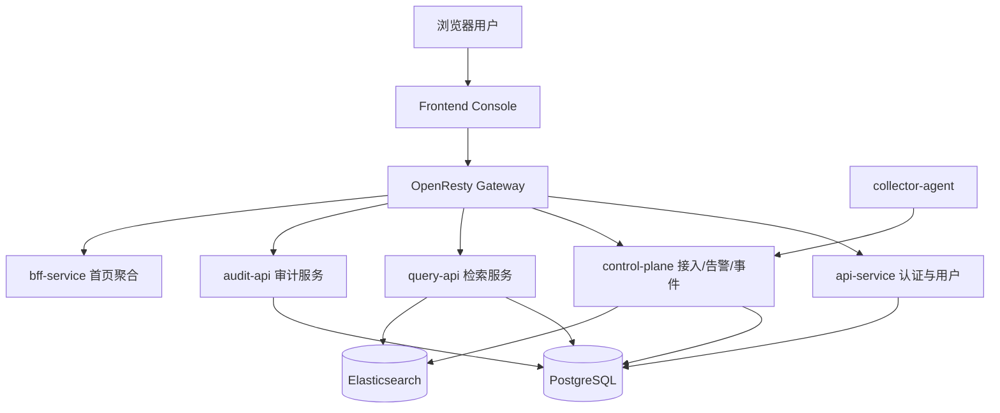
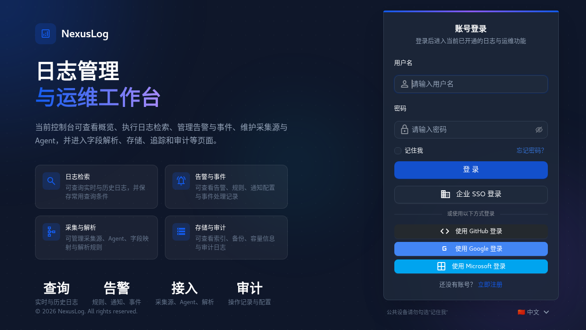
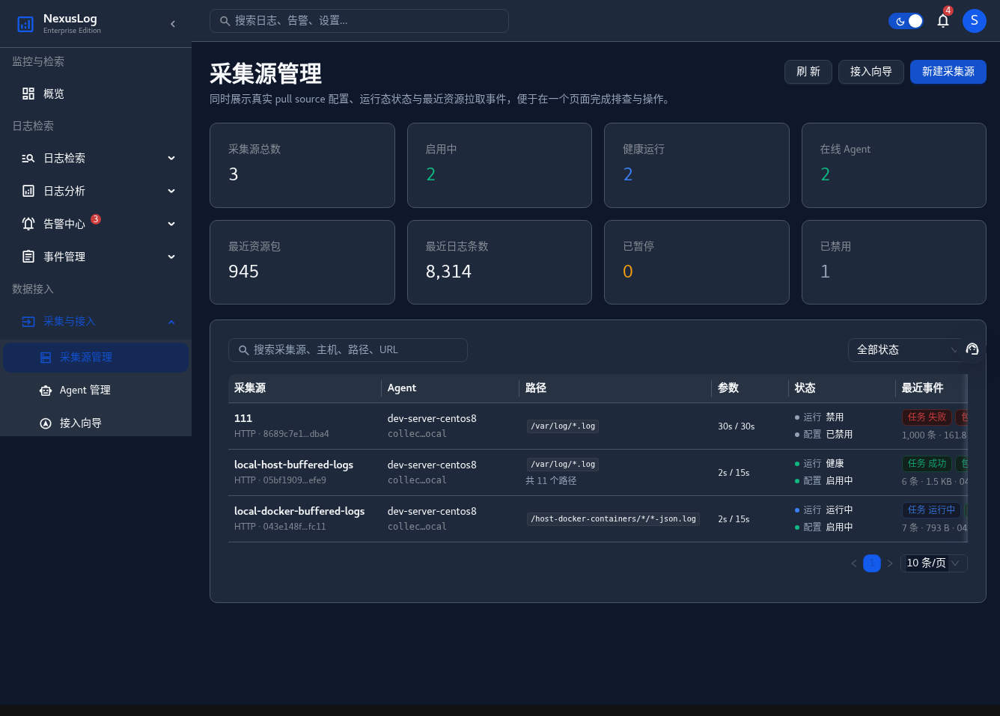
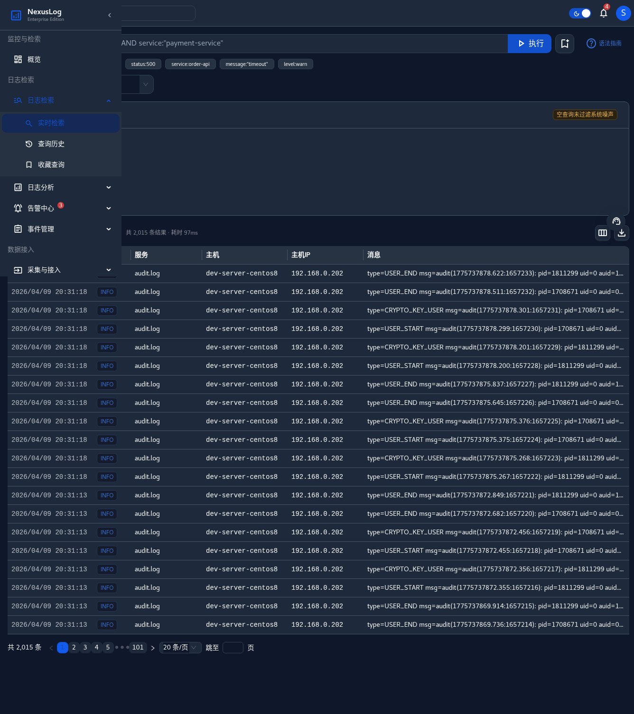
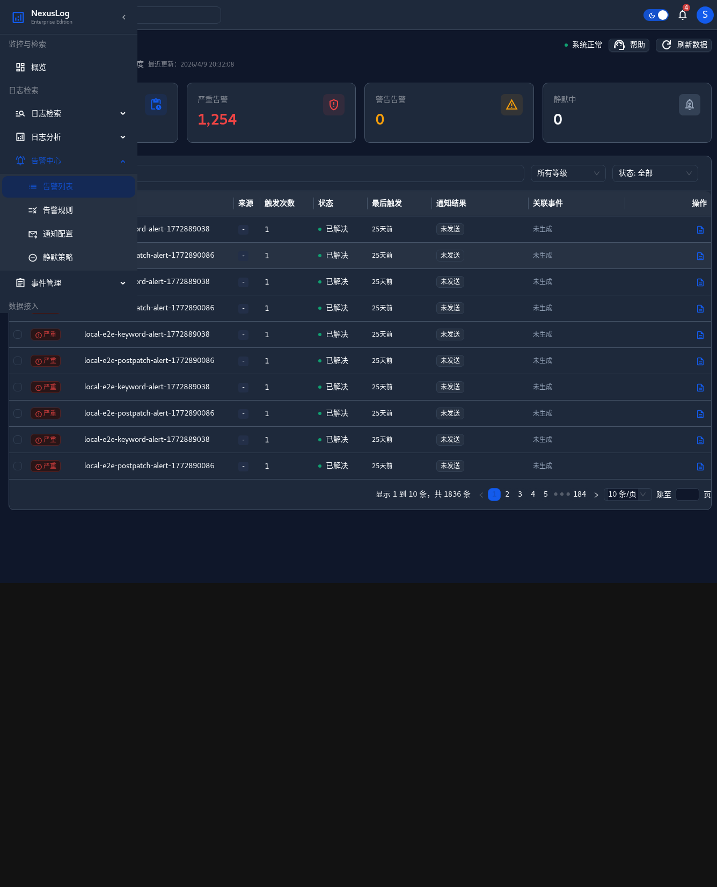
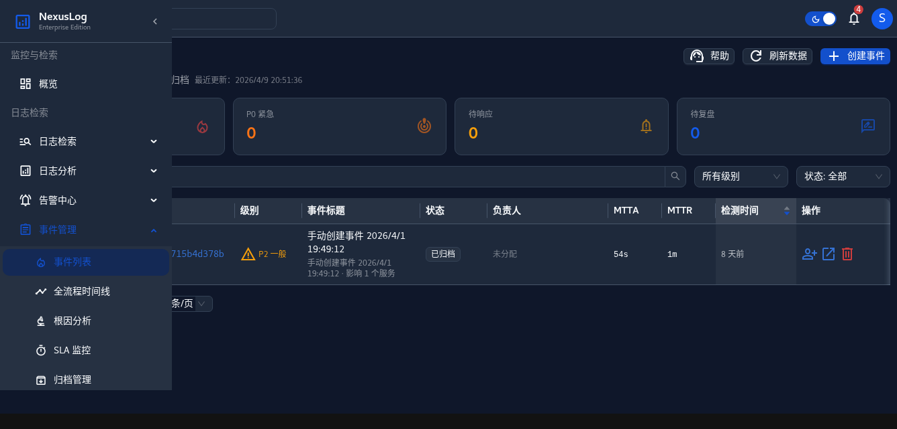
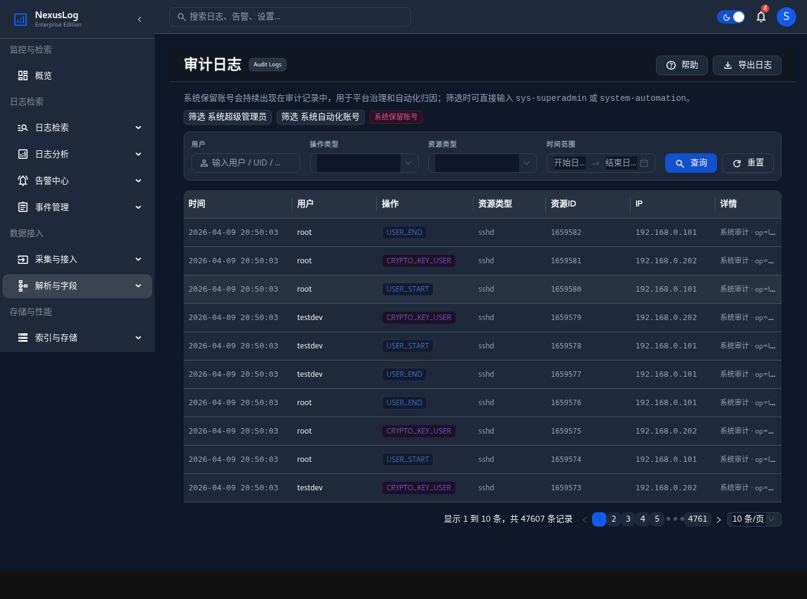
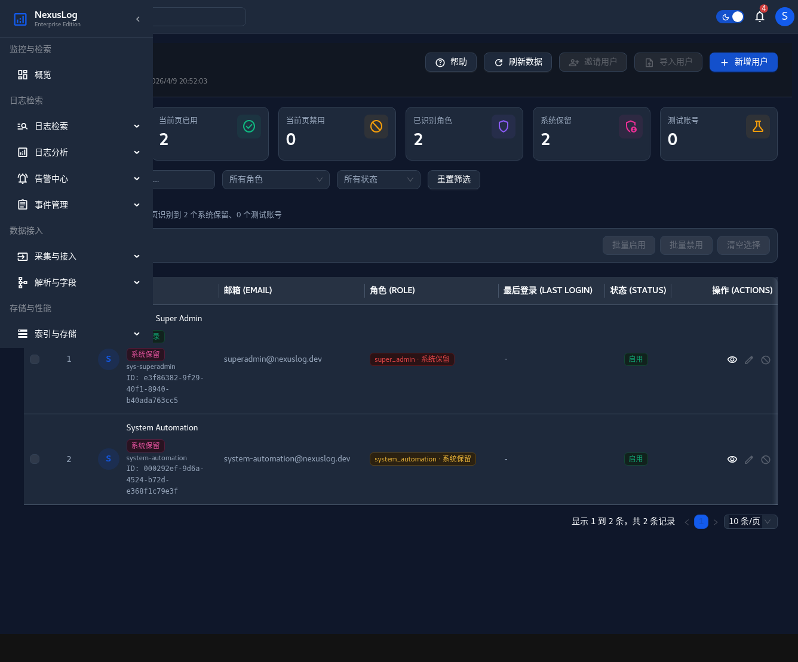
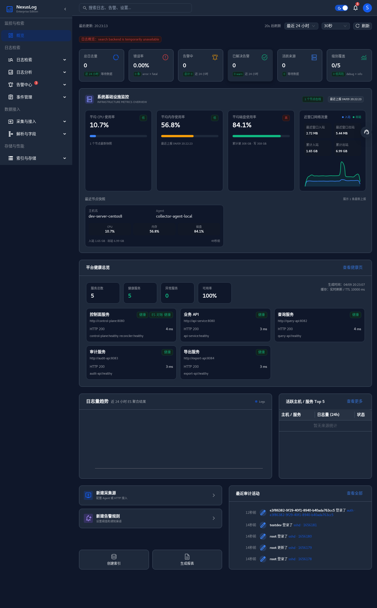

# NexusLog 平台日志管理系统的设计与实现

## 摘要

随着云计算、容器化部署以及微服务架构在企业信息系统中的广泛应用，应用服务数量持续增长，服务之间的调用链路日趋复杂，系统运行过程中产生的日志数据也呈现出高并发、高维度和高异构的特点。传统日志处理方式往往以分散式部署和人工运维为主，难以在统一身份认证、采集接入治理、检索分析效率、告警闭环以及安全审计等方面满足企业级平台建设的实际需求。基于此，本文围绕企业日志的统一接入、集中存储、快速检索和治理协同等目标，设计并实现了一套面向 B/S 架构的企业级平台日志管理系统——NexusLog。

本文结合当前项目代码仓库中已经完成的前后端模块、数据库迁移脚本、Elasticsearch 模板、接口注册情况以及测试资产，对系统的需求分析、总体设计、关键模块实现和测试方案进行了系统性阐述。系统以前后端分离模式构建，前端控制台采用 React、TypeScript 与 Ant Design 实现，后端以 Go 语言和 Gin 框架为主要开发技术，结合 OpenResty 网关、PostgreSQL 元数据存储和 Elasticsearch 检索存储，构建起认证鉴权、日志采集、查询分析、告警治理、审计留痕和用户权限管理等关键能力。围绕当前已完成内容，系统已实现统一登录入口、基于令牌的访问控制、会话刷新与轮换、Agent 增量采集与控制面调度、日志实时检索、查询历史与收藏查询、告警规则管理、事件管理、审计日志查询和用户角色管理等主要功能，并形成了“Agent—Control Plane—Elasticsearch—Query API—Frontend Console”的核心业务闭环。

在数据安全方面，系统已实现密码摘要存储、刷新令牌轮换追踪、通知渠道敏感配置脱敏返回、操作审计留痕以及日志治理字段预留，并通过 Elasticsearch ILM 模板与快照策略支持日志生命周期管理。实践结果表明，NexusLog 当前阶段已经具备较为完整的企业级日志平台雏形，能够支撑日志接入、运行态观测、异常定位与治理协同等典型场景。本文的研究与实现不仅验证了基于微服务与分层架构建设统一日志平台的可行性，也为后续系统向更高等级的自动化治理、精细化权限控制和统一可观测性平台演进奠定了工程基础。

**关键词：** 企业级日志管理系统；B/S 架构；微服务；Elasticsearch；日志治理；安全审计

---

## 第一章 绪论

### 1.1 引言

在数字化转型不断深入的背景下，企业业务系统已经从传统单体应用逐步演进为由多个微服务、网关组件、消息中间件和基础设施服务共同构成的分布式系统。随着系统规模不断扩大，日志不再只是辅助开发排查问题的文本记录，而逐渐演变为反映系统运行状态、用户行为轨迹、接口调用结果和安全事件的重要数据资源。尤其是在生产环境中，应用日志、审计日志、设备日志和基础设施指标之间往往相互关联，只有实现统一采集、统一检索和统一治理，才能真正发挥日志在故障定位、运行分析和安全审计中的价值。

然而，在许多企业的实际建设过程中，日志能力通常分散在不同团队和不同系统之间，存在采集标准不统一、接入配置不集中、查询入口不一致、权限边界不清晰以及审计留痕能力不足等问题。这种模式不仅提升了平台运维复杂度，也限制了日志在跨系统联动分析、告警治理和事件处置中的应用深度。因此，构建一套能够覆盖“接入—存储—检索—分析—治理—审计”全过程的统一日志管理平台，已经成为企业可观测性建设的重要内容。

### 1.2 项目背景

基于上述行业背景与工程需求，NexusLog 项目以构建企业级统一日志管理平台为目标，尝试将分散在不同系统和不同团队中的日志接入、查询分析、告警治理、事件处置与审计留痕能力整合到统一平台之中。项目采用前后端分离与分层服务架构，通过前端控制台、统一网关、认证服务、控制面、查询服务、审计服务和 BFF 聚合层等模块协同运行，逐步形成覆盖日志采集、存储、检索、治理与安全管理的整体解决方案。

从项目价值看，NexusLog 的建设不仅能够打通分散系统之间的日志链路，使日志数据由“局部可见”转变为“全局可管”，还能够通过统一认证、用户角色、告警规则、事件流转和审计日志等模块的协同设计，将传统“日志查询工具”扩展为兼具管理与协同能力的企业级平台。对于毕业设计研究而言，该项目覆盖了需求分析、架构设计、数据库设计、接口规范、前端交互和后端实现等多个技术层面，具有较强的系统性与综合性，能够较完整地体现软件工程项目从设计到实现的全过程。

本文围绕 NexusLog 当前阶段已经完成的功能展开研究，重点包括业务需求分析、总体架构设计、数据库与数据流设计、核心模块实现以及测试验证等内容。全文共分为六章：第一章为绪论；第二章为系统需求分析；第三章为系统总体设计；第四章为系统详细设计与实现；第五章为系统测试；第六章为总结与展望。

---

## 第二章 系统需求分析

### 2.1 系统总体目标

NexusLog 的总体目标是面向企业内部多角色使用场景，构建一套能够支撑日志统一接入、集中存储、实时检索、告警治理、事件协同和安全审计的日志管理平台。从当前仓库实现情况看，系统不仅要求主链路能够跑通，还要求平台具备较清晰的权限边界、数据留痕能力与后续演进空间。因此，系统总体目标可以概括为以下四点：一是建立统一访问入口与身份体系；二是实现日志从采集到查询的完整闭环；三是支撑告警、事件和审计等治理能力；四是在架构、数据模型和测试体系上为后续扩展预留明确接口。

### 2.2 功能性需求分析

#### 2.2.1 统一认证与权限管理

系统首先需要提供统一的访问入口与身份认证能力。当前项目中，用户通过 `/api/v1/auth/login`、`/api/v1/auth/refresh` 和 `/api/v1/auth/logout` 等接口完成登录、续期和退出；前端通过 `ProtectedRoute` 组件对未登录用户进行拦截，并对访问令牌过期场景执行自动刷新。除登录态管理外，系统还需要支持当前用户信息获取、用户列表管理、角色查询与角色授权，以满足企业平台中超级管理员、运维操作员、只读用户等多角色并存的访问控制需求。

#### 2.2.2 日志接入治理

日志接入能力是系统的主链路起点，也是平台化建设与简单日志工具的重要区别。结合当前实现，系统需要支持采集源配置管理、Agent 增量读取、断点续传、采集任务执行、包级回执处理和死信重试等能力。仓库中的 `ingest_pull_sources`、`ingest_pull_tasks`、`agent_incremental_packages`、`ingest_delivery_receipts` 和 `ingest_dead_letters` 等表，反映出系统并非仅要求“日志能够上传”，而是要求“接入过程可配置、可追踪、可恢复”。

#### 2.2.3 日志检索与查询管理

作为日志平台的核心业务能力，系统需要支持实时检索、聚合统计、查询历史保存和收藏查询复用等功能。当前项目中，查询服务已经提供 `POST /api/v1/query/logs`、`GET /api/v1/query/history`、`GET/POST/PUT/DELETE /api/v1/query/saved` 等接口，前端页面支持时间范围、关键字、字段过滤、统计摘要和历史回放。这意味着系统对检索功能的需求不仅是“查得出来”，还包括“查询结果可回看、查询条件可沉淀、查询体验可复用”。

#### 2.2.4 告警与事件治理

日志平台在企业场景中不仅需要发现问题，还要支撑问题的治理过程。因此，系统要求在查询能力之上提供告警规则、通知渠道、静默策略、告警事件和事件处置等治理功能。当前仓库中已经存在 `alert_rules`、`alert_events`、`notification_channels`、`alert_silences`、`incidents` 和 `incident_timeline` 等数据结构与接口实现，说明系统在设计上已经考虑从异常发现、消息通知、人员协同到事件闭环的完整链路。

#### 2.2.5 审计与安全管理

对于企业级平台而言，系统不仅要管理业务数据，还要管理操作行为本身。当前项目要求对登录、刷新、退出、采集源管理、用户管理和部分治理操作进行审计记录，并支持在前端页面按用户、操作、资源和时间范围进行查询与回溯。同时，系统还要对用户、角色、保留账号和交互式登录权限进行治理，以避免高权限账号滥用和责任归因缺失。

#### 2.2.6 数据安全与合规需求

数据安全与合规需求贯穿日志平台全生命周期。结合当前仓库的真实实现与预留设计，系统在本阶段至少需要满足以下要求：其一，用户密码必须以摘要形式存储，避免明文或弱保护写入数据库；其二，会话刷新令牌必须支持哈希存储、轮换链路追踪和重放防护；其三，敏感配置在接口返回时必须进行脱敏处理，例如通知渠道中的 SMTP 密码或 webhook 密钥；其四，日志文档需要预留数据治理字段，用于标识保留策略、敏感信息处理状态和数据分类；其五，日志数据应支持生命周期管理和快照归档，以满足数据留存与清理的合规要求。需要说明的是，独立的“日志脱敏规则引擎”与统一密钥管理能力在仓库中已存在设计与页面预留，但当前尚不宜写为全部完成。

### 2.3 非功能性需求分析

#### 2.3.1 性能需求

日志平台需要面对大体量、高频率、宽时间范围的检索请求，因此系统必须在查询响应时间、统计计算效率和多页面并发访问方面保持可接受性能。当前项目通过 Elasticsearch 承担日志全文检索和聚合计算，通过前端分页和后端元数据拆分减轻单次请求压力，从架构层面满足日志查询场景的性能需求。

#### 2.3.2 可扩展性需求

系统应具备较好的模块扩展能力与技术演进空间。NexusLog 采用 Monorepo 结构组织前端、网关、服务、存储和测试资产，使新增业务模块可以在统一工程规范下扩展；同时，数据层采用 PostgreSQL 与 Elasticsearch 的组合，为未来增加导出、归档、追踪、成本治理等能力提供了基础。

#### 2.3.3 安全性需求

安全性需求包括身份认证、权限校验、会话安全、敏感配置保护和操作留痕等多个维度。当前项目已实现令牌校验、租户作用域控制、能力项校验、密码摘要存储、刷新令牌轮换、登录失败记录和审计中间件等机制。这些能力共同构成了平台在当前阶段的最小安全闭环。

#### 2.3.4 易用性需求

平台需要面向不同角色用户提供统一且直观的交互体验。当前前端控制台基于 Ant Design 组件体系构建，已经形成首页仪表盘、实时检索、采集源管理、告警规则、事件列表、审计日志和用户管理等页面，能够以较低学习成本支撑常见运维与治理操作。

### 2.4 系统用例分析

#### 2.4.1 参与者定义

表2-1 系统主要参与者定义

| 参与者 | 角色说明 | 典型操作 |
| --- | --- | --- |
| 平台超级管理员 | 负责系统初始化、用户与角色管理、关键配置维护 | 登录平台、管理用户与角色、查看审计日志 |
| 运维操作员 | 负责日志接入、检索分析、告警规则与事件处理 | 管理采集源、执行查询、维护告警规则、处置事件 |
| 只读分析用户 | 负责查看运行态信息与查询结果 | 访问首页、执行只读检索、查看趋势统计 |
| Collector Agent | 负责日志采集、状态上报与指标上报 | 拉取或上传日志批次、上报采集状态和资源指标 |
| 系统自动化账号 | 用于自动化操作归因，不参与日常交互式登录 | 写入自动化审计记录、执行系统保留操作 |

#### 2.4.2 核心用例描述

表2-2 核心用例描述

| 用例名称 | 参与者 | 输入 | 处理过程 | 输出 |
| --- | --- | --- | --- | --- |
| 用户登录与续期 | 平台超级管理员、运维操作员、只读分析用户 | 用户名、密码、租户标识 | 校验账号状态与密码摘要，创建会话并签发访问令牌；令牌到期后执行刷新 | 登录成功、续期成功或失败提示 |
| 采集源管理 | 平台超级管理员、运维操作员 | 采集源配置 | 创建或更新采集源，生成调度配置并维护运行状态 | 采集源列表、状态与变更结果 |
| 实时日志检索 | 运维操作员、只读分析用户 | 时间范围、关键字、筛选条件 | 查询服务访问 Elasticsearch，返回命中结果与统计摘要 | 查询列表、聚合统计、分页信息 |
| 收藏查询管理 | 运维操作员、只读分析用户 | 查询名称、条件、公开属性 | 写入收藏查询元数据并支持后续复用 | 收藏查询清单与执行结果 |
| 告警与事件处置 | 平台超级管理员、运维操作员 | 告警规则、事件状态变更 | 规则触发产生告警事件，人员接手并维护时间线 | 告警事件、事件列表、SLA 摘要 |
| 审计与权限治理 | 平台超级管理员 | 用户、角色、操作记录 | 管理用户角色、查看审计日志、验证系统留痕 | 用户与角色清单、审计记录 |

### 2.5 技术选型说明

表2-3 当前实现所采用的主要技术选型

| 层级 | 技术选型 | 当前状态 | 选型理由 |
| --- | --- | --- | --- |
| 前端控制台 | React 19 + TypeScript + Ant Design + Vite | 已实现 | 适合构建复杂交互页面，工程化能力较强 |
| 网关层 | OpenResty | 已实现 | 统一入口、便于路由转发与策略集中化 |
| 认证与用户服务 | Go + Gin + PostgreSQL | 已实现 | 代码结构清晰，便于实现鉴权、会话和用户治理 |
| 控制面服务 | Go + Gin | 已实现 | 适合承载采集治理、告警和事件等平台逻辑 |
| 查询与审计服务 | Go + Gin + Elasticsearch/PostgreSQL | 已实现 | 兼顾检索性能和元数据关系管理 |
| 元数据存储 | PostgreSQL | 已实现 | 事务一致性好，适合认证、审计、告警和关系建模 |
| 检索存储 | Elasticsearch Data Stream + Index Template | 已实现 | 适合日志全文检索、聚合统计与生命周期管理 |
| 缓存与辅助组件 | Redis | 已实现 | 用于缓存与运行态支撑 |
| 自动化测试 | Vitest、Go Test、Playwright、集成脚本 | 已实现 | 覆盖前端单测、后端测试、端到端和联调验证 |

需要说明的是，仓库中的部分设计文档还包含 Keycloak、OPA、Vault 等更高阶安全组件与 P1/P2 能力规划。这些内容反映了项目演进方向，但本文只将当前仓库中已落地的能力写作“已实现”，将规划项保留为后续扩展方向。

### 2.6 本章小结

本章从总体目标、功能性需求、非功能性需求、系统用例和技术选型五个方面，对 NexusLog 的需求背景和建设边界进行了分析。结合当前仓库的实际实现情况可以看出，系统已经具备较完整的主链路与治理能力基础，后续章节将在此基础上进一步说明总体设计和具体实现。

---

## 第三章 系统总体设计

### 3.1 系统架构设计

#### 3.1.1 分层架构总览

NexusLog 采用典型的分层式企业平台架构，整体上可以分为表现层、网关层、服务层、数据层和接入层。其中，表现层由前端控制台构成，负责页面渲染、用户交互和状态展示；网关层由 OpenResty 统一接管外部请求，实现路由转发与统一入口；服务层由 `api-service`、`control-plane`、`query-api`、`audit-api` 以及 `bff-service` 等模块构成，分别承担认证权限、接入控制、查询服务、审计查询和聚合视图等职责；数据层以 PostgreSQL 作为元数据存储，以 Elasticsearch 作为日志检索和结构化文档存储；接入层则由 Collector Agent 负责日志发现、增量采集和数据打包。



#### 3.1.2 数据流转设计

当前阶段系统的日志数据流转主要由以下几个环节组成。第一，Collector Agent 在目标节点扫描指定路径下的日志文件，通过 checkpoint 等机制记录读取进度，保证增量采集的连续性。第二，控制面根据采集源配置生成拉取任务，并对任务状态、包记录、回执信息和死信数据进行统一管理。第三，经过处理后的日志数据被写入 Elasticsearch 检索索引，成为可查询的结构化日志文档。第四，Query API 依据前端传入的查询条件访问 Elasticsearch，并将结果以统一 JSON 结构返回给控制台页面。第五，告警规则、事件流转、审计记录和首页聚合视图等能力，则在查询结果和元数据基础上进一步形成治理闭环。

从当前实现情况看，系统已经在“采集—调度—写入—检索—展示”这一主路径上形成了可运行闭环，这是毕业设计场景下最核心的工程成果之一。同时，仓库中也保留了更复杂的数据流扩展接口，例如导出、更多异构接入方式和更高阶分析能力等，为后续迭代预留了空间。

#### 3.1.3 安全架构设计

结合当前仓库实现，系统安全架构主要由三层构成。第一层是身份与会话层，由 `api-service` 负责登录、刷新、退出、密码重置和登录风控，底层依托 `users`、`user_credentials`、`user_sessions`、`login_attempts` 等表实现账号与会话治理。第二层是授权与边界控制层，前端通过 `routeAuthorization` 与 `ProtectedRoute` 对页面访问进行控制，后端通过 capability、scope 和租户上下文校验约束 API 访问边界。第三层是审计与安全治理层，通过审计中间件、显式审计事件和审计日志查询接口，完成对关键操作的留痕与追溯。

需要强调的是，设计文档中还包含更高等级的统一 IAM 与策略引擎规划，但当前论文所描述的“已实现安全架构”以仓库现有代码为准，即 JWT 会话、能力项校验、租户作用域限制、密码摘要存储、敏感配置脱敏和审计留痕等能力。

### 3.2 功能模块划分

表3-1 系统功能模块划分

| 模块 | 核心组成 | 主要职责 | 当前状态 |
| --- | --- | --- | --- |
| 认证与用户模块 | `api-service`、前端登录页、`ProtectedRoute` | 登录、刷新、退出、当前用户、用户与角色管理 | 已实现 |
| 日志采集模块 | `collector-agent`、`control-plane` | 采集源配置、任务调度、包回执、断点续传、死信处理 | 已实现 |
| 日志检索模块 | `query-api`、实时检索页、历史与收藏页 | 日志查询、统计概览、查询历史、收藏查询 | 已实现 |
| 告警与事件模块 | `control-plane` 中 alert/incident 相关组件 | 告警规则、告警事件、通知渠道、静默策略、事件流转 | 已实现 |
| 审计与权限模块 | `audit-api`、用户管理页、审计日志页 | 审计留痕、审计查询、用户与角色治理 | 已实现 |
| 首页聚合模块 | `bff-service`、Dashboard 页面 | 聚合多服务概览信息并供首页统一展示 | 已实现 |
| 数据安全模块 | 密码摘要、会话轮换、配置脱敏、治理字段 | 支撑平台基础安全和生命周期治理 | 部分实现 |

### 3.3 数据库设计

#### 3.3.1 数据库总体设计思路

NexusLog 采用“关系型数据库 + 检索型数据库”的混合存储模式。具体而言，PostgreSQL 负责存储平台元数据，包括租户、用户、角色、会话、查询历史、告警规则、事件流转、审计日志和采集治理数据等结构化信息；Elasticsearch 则负责存储已经结构化的日志文档，用于支撑全文检索、聚合统计与趋势分析。该设计既发挥了关系型数据库在事务一致性和复杂关系建模方面的优势，也利用了 Elasticsearch 在海量日志检索和多维聚合方面的高适配性。

在当前项目实现中，PostgreSQL 的表结构通过迁移脚本持续演进，已经覆盖认证安全、采集接入、查询元数据、告警治理、事件管理和运行态辅助能力等多个业务域。与之对应，Elasticsearch 中的日志文档则主要承载时间戳、日志级别、消息内容、来源标识、标签字段和治理字段等信息，供查询服务直接调用。

#### 3.3.2 PostgreSQL 核心表结构设计

为保证论文内容与仓库实现保持一致，本文以迁移脚本中的真实字段为依据，提炼出平台当前阶段最关键的认证、接入、检索、告警、事件和审计数据模型。考虑毕业设计说明书的常见排版方式，本文将核心业务表拆分为独立的 Markdown 表格，便于后续直接调整为学校要求的“三线表”形式。需要说明的是，`user_roles` 作为用户与角色的关联表，结构较为简单，本文在分表说明后统一补充说明。

表3-2 用户表（`users`）设计

| 字段名 | 数据类型 | 长度 | 主键 / 外键 | 非空 | 默认值 | 说明 |
| --- | --- | --- | --- | --- | --- | --- |
| `id` | UUID | 36 | 主键 | 是 | `uuid_generate_v4()` | 用户唯一标识 |
| `tenant_id` | UUID | 36 | 外键→`obs.tenant.id` | 否 | 无 | 所属租户 |
| `username` | VARCHAR | 128 | - | 是 | 无 | 登录用户名，租户内唯一 |
| `email` | VARCHAR | 255 | - | 是 | 无 | 用户邮箱，租户内唯一 |
| `display_name` | VARCHAR | 255 | - | 否 | 无 | 展示名称 |
| `status` | VARCHAR | 20 | - | 是 | `active` | 用户状态 |
| `last_login_at` | TIMESTAMPTZ | - | - | 否 | 无 | 最近登录时间 |
| `created_at` | TIMESTAMPTZ | - | - | 是 | `NOW()` | 创建时间 |
| `updated_at` | TIMESTAMPTZ | - | - | 是 | `NOW()` | 更新时间 |

表3-3 角色表（`roles`）设计

| 字段名 | 数据类型 | 长度 | 主键 / 外键 | 非空 | 默认值 | 说明 |
| --- | --- | --- | --- | --- | --- | --- |
| `id` | UUID | 36 | 主键 | 是 | `uuid_generate_v4()` | 角色唯一标识 |
| `tenant_id` | UUID | 36 | 外键→`obs.tenant.id` | 否 | 无 | 所属租户 |
| `name` | VARCHAR | 128 | - | 是 | 无 | 角色名称，租户内唯一 |
| `description` | TEXT | - | - | 否 | 无 | 角色说明 |
| `permissions` | JSONB | - | - | 否 | `[]` | 角色权限集合 |
| `created_at` | TIMESTAMPTZ | - | - | 是 | `NOW()` | 创建时间 |

表3-4 用户会话表（`user_sessions`）设计

| 字段名 | 数据类型 | 长度 | 主键 / 外键 | 非空 | 默认值 | 说明 |
| --- | --- | --- | --- | --- | --- | --- |
| `id` | UUID | 36 | 主键 | 是 | `uuid_generate_v4()` | 会话唯一标识 |
| `tenant_id` | UUID | 36 | 外键→`obs.tenant.id` | 是 | 无 | 所属租户 |
| `user_id` | UUID | 36 | 外键→`users.id` | 是 | 无 | 所属用户 |
| `refresh_token_hash` | VARCHAR | 255 | - | 是 | 无 | 刷新令牌哈希 |
| `access_token_jti` | VARCHAR | 128 | - | 否 | 无 | 访问令牌标识 |
| `session_status` | VARCHAR | 20 | - | 是 | `active` | 会话状态 |
| `expires_at` | TIMESTAMPTZ | - | - | 是 | 无 | 会话过期时间 |
| `last_seen_at` | TIMESTAMPTZ | - | - | 否 | 无 | 最近活跃时间 |
| `revoked_at` | TIMESTAMPTZ | - | - | 否 | 无 | 会话吊销时间 |
| `session_family_id` | UUID | 36 | - | 是 | 无 | 刷新令牌轮换链标识 |
| `replaced_by_session_id` | UUID | 36 | 外键→`user_sessions.id` | 否 | 无 | 被新会话替换的关联标识 |

表3-5 采集源表（`ingest_pull_sources`）设计

| 字段名 | 数据类型 | 长度 | 主键 / 外键 | 非空 | 默认值 | 说明 |
| --- | --- | --- | --- | --- | --- | --- |
| `id` | UUID | 36 | 主键 | 是 | `uuid_generate_v4()` | 采集源唯一标识 |
| `tenant_id` | UUID | 36 | 外键→`obs.tenant.id` | 是 | 无 | 所属租户 |
| `name` | VARCHAR | 255 | - | 是 | 无 | 采集源名称 |
| `host` | VARCHAR | 255 | - | 是 | 无 | 目标主机地址 |
| `port` | INTEGER | - | - | 是 | 无 | 目标端口 |
| `protocol` | VARCHAR | 20 | - | 是 | 无 | 接入协议类型 |
| `path_pattern` | TEXT | - | - | 否 | 无 | 日志路径规则 |
| `poll_interval_sec` | INTEGER | - | - | 是 | `30` | 初始轮询间隔 |
| `agent_base_url` | TEXT | - | - | 否 | 无 | Agent 基础访问地址 |
| `pull_interval_sec` | INTEGER | - | - | 是 | `30` | 当前执行链实际使用的拉取间隔 |
| `pull_timeout_sec` | INTEGER | - | - | 是 | `30` | 拉取超时时间 |
| `key_ref` | VARCHAR | 255 | - | 否 | 无 | Agent 拉取鉴权密钥引用 |
| `status` | VARCHAR | 20 | - | 是 | `active` | 采集源状态 |
| `metadata` | JSONB | - | - | 是 | `{}` | 扩展配置 |

表3-6 拉取任务表（`ingest_pull_tasks`）设计

| 字段名 | 数据类型 | 长度 | 主键 / 外键 | 非空 | 默认值 | 说明 |
| --- | --- | --- | --- | --- | --- | --- |
| `id` | UUID | 36 | 主键 | 是 | `uuid_generate_v4()` | 拉取任务唯一标识 |
| `source_id` | UUID | 36 | 外键→`ingest_pull_sources.id` | 是 | 无 | 所属采集源 |
| `scheduled_at` | TIMESTAMPTZ | - | - | 是 | `NOW()` | 调度时间 |
| `started_at` | TIMESTAMPTZ | - | - | 否 | 无 | 开始执行时间 |
| `finished_at` | TIMESTAMPTZ | - | - | 否 | 无 | 结束时间 |
| `status` | VARCHAR | 20 | - | 是 | `pending` | 执行状态 |
| `trigger_type` | VARCHAR | 32 | - | 是 | `manual` | 任务触发方式 |
| `options` | JSONB | - | - | 是 | `{}` | 执行参数 |
| `bytes_pulled` | BIGINT | - | - | 是 | `0` | 拉取字节数 |
| `files_pulled` | INTEGER | - | - | 是 | `0` | 拉取文件数 |
| `package_count` | INTEGER | - | - | 是 | `0` | 产生包数量 |
| `retry_count` | INTEGER | - | - | 是 | `0` | 重试次数 |
| `last_cursor` | TEXT | - | - | 否 | 无 | 最近一次任务游标 |

表3-7 增量包表（`agent_incremental_packages`）设计

| 字段名 | 数据类型 | 长度 | 主键 / 外键 | 非空 | 默认值 | 说明 |
| --- | --- | --- | --- | --- | --- | --- |
| `id` | UUID | 36 | 主键 | 是 | `uuid_generate_v4()` | 增量包唯一标识 |
| `source_id` | UUID | 36 | 外键→`ingest_pull_sources.id` | 否 | 无 | 来源采集源 |
| `task_id` | UUID | 36 | 外键→`ingest_pull_tasks.id` | 否 | 无 | 所属拉取任务 |
| `agent_id` | VARCHAR | 128 | - | 是 | 无 | 产生数据包的 Agent |
| `source_ref` | VARCHAR | 512 | - | 是 | 无 | 源引用标识 |
| `package_no` | VARCHAR | 128 | - | 是 | 无 | 包序号 |
| `from_offset` | BIGINT | - | - | 是 | `0` | 起始偏移量 |
| `to_offset` | BIGINT | - | - | 是 | `0` | 结束偏移量 |
| `size_bytes` | BIGINT | - | - | 是 | `0` | 包大小 |
| `checksum` | VARCHAR | 128 | - | 是 | 无 | 包校验和 |
| `status` | VARCHAR | 20 | - | 是 | `created` | 包状态 |
| `batch_id` | VARCHAR | 128 | - | 否 | 无 | 批次标识 |
| `record_count` | INTEGER | - | - | 是 | `0` | 包含记录数 |
| `next_cursor` | TEXT | - | - | 否 | 无 | 下一次拉取游标 |

表3-8 查询历史表（`query_histories`）设计

| 字段名 | 数据类型 | 长度 | 主键 / 外键 | 非空 | 默认值 | 说明 |
| --- | --- | --- | --- | --- | --- | --- |
| `id` | UUID | 36 | 主键 | 是 | `uuid_generate_v4()` | 查询历史唯一标识 |
| `tenant_id` | UUID | 36 | 外键→`obs.tenant.id` | 是 | 无 | 所属租户 |
| `user_id` | UUID | 36 | 外键→`users.id` | 否 | 无 | 发起查询的用户 |
| `query_text` | TEXT | - | - | 是 | 无 | 原始查询语句 |
| `query_hash` | CHAR | 64 | - | 否 | 无 | 查询摘要 |
| `filters` | JSONB | - | - | 是 | `{}` | 查询过滤条件 |
| `time_range_start` | TIMESTAMPTZ | - | - | 否 | 无 | 查询起始时间 |
| `time_range_end` | TIMESTAMPTZ | - | - | 否 | 无 | 查询结束时间 |
| `result_count` | BIGINT | - | - | 否 | 无 | 命中记录数 |
| `duration_ms` | INTEGER | - | - | 否 | 无 | 查询耗时 |
| `status` | VARCHAR | 20 | - | 是 | `success` | 查询状态 |
| `error_message` | TEXT | - | - | 否 | 无 | 查询失败信息 |
| `created_at` | TIMESTAMPTZ | - | - | 是 | `NOW()` | 记录时间 |

表3-9 收藏查询表（`saved_queries`）设计

| 字段名 | 数据类型 | 长度 | 主键 / 外键 | 非空 | 默认值 | 说明 |
| --- | --- | --- | --- | --- | --- | --- |
| `id` | UUID | 36 | 主键 | 是 | `uuid_generate_v4()` | 收藏查询唯一标识 |
| `tenant_id` | UUID | 36 | 外键→`obs.tenant.id` | 是 | 无 | 所属租户 |
| `user_id` | UUID | 36 | 外键→`users.id` | 是 | 无 | 创建用户 |
| `name` | VARCHAR | 255 | - | 是 | 无 | 收藏查询名称 |
| `description` | TEXT | - | - | 否 | 无 | 收藏说明 |
| `query_text` | TEXT | - | - | 是 | 无 | 收藏的查询语句 |
| `filters` | JSONB | - | - | 是 | `{}` | 收藏的过滤条件 |
| `is_public` | BOOLEAN | 1 | - | 是 | `false` | 是否公开 |
| `run_count` | BIGINT | - | - | 是 | `0` | 被执行次数 |
| `last_run_at` | TIMESTAMPTZ | - | - | 否 | 无 | 最近执行时间 |
| `created_at` | TIMESTAMPTZ | - | - | 是 | `NOW()` | 创建时间 |
| `updated_at` | TIMESTAMPTZ | - | - | 是 | `NOW()` | 更新时间 |

表3-10 告警规则表（`alert_rules`）设计

| 字段名 | 数据类型 | 长度 | 主键 / 外键 | 非空 | 默认值 | 说明 |
| --- | --- | --- | --- | --- | --- | --- |
| `id` | UUID | 36 | 主键 | 是 | `uuid_generate_v4()` | 告警规则唯一标识 |
| `tenant_id` | UUID | 36 | 外键→`obs.tenant.id` | 否 | 无 | 所属租户 |
| `name` | VARCHAR | 255 | - | 是 | 无 | 规则名称 |
| `description` | TEXT | - | - | 否 | 无 | 规则说明 |
| `condition` | JSONB | - | - | 是 | 无 | 规则条件表达式 |
| `severity` | VARCHAR | 20 | - | 是 | `WARNING` | 默认严重级别 |
| `enabled` | BOOLEAN | 1 | - | 是 | `true` | 是否启用 |
| `notification_channels` | JSONB | - | - | 否 | `[]` | 通知渠道配置 |
| `created_by` | UUID | 36 | 外键→`users.id` | 否 | 无 | 创建人 |
| `created_at` | TIMESTAMPTZ | - | - | 是 | `NOW()` | 创建时间 |
| `updated_at` | TIMESTAMPTZ | - | - | 是 | `NOW()` | 更新时间 |

表3-11 告警事件表（`alert_events`）设计

| 字段名 | 数据类型 | 长度 | 主键 / 外键 | 非空 | 默认值 | 说明 |
| --- | --- | --- | --- | --- | --- | --- |
| `id` | UUID | 36 | 主键 | 是 | `gen_random_uuid()` | 告警事件唯一标识 |
| `tenant_id` | UUID | 36 | 外键→`obs.tenant.id` | 否 | 无 | 所属租户 |
| `rule_id` | UUID | 36 | 外键→`alert_rules.id` | 否 | 无 | 来源规则，资源阈值告警时可空 |
| `resource_threshold_id` | UUID | 36 | 外键→`resource_thresholds.id` | 否 | 无 | 资源阈值类告警来源 |
| `severity` | VARCHAR | 20 | - | 是 | 无 | 事件严重级别 |
| `title` | VARCHAR | 500 | - | 是 | 无 | 事件标题 |
| `detail` | TEXT | - | - | 否 | 无 | 告警详情 |
| `status` | VARCHAR | 20 | - | 是 | `firing` | 事件状态 |
| `fired_at` | TIMESTAMPTZ | - | - | 是 | `now()` | 触发时间 |
| `resolved_at` | TIMESTAMPTZ | - | - | 否 | 无 | 恢复时间 |
| `notified_at` | TIMESTAMPTZ | - | - | 否 | 无 | 通知时间 |
| `notification_result` | JSONB | - | - | 否 | 无 | 通知结果 |
| `created_at` | TIMESTAMPTZ | - | - | 是 | `now()` | 创建时间 |

表3-12 事件表（`incidents`）设计

| 字段名 | 数据类型 | 长度 | 主键 / 外键 | 非空 | 默认值 | 说明 |
| --- | --- | --- | --- | --- | --- | --- |
| `id` | UUID | 36 | 主键 | 是 | `gen_random_uuid()` | 事件单唯一标识 |
| `tenant_id` | UUID | 36 | 外键→`obs.tenant.id` | 否 | 无 | 所属租户 |
| `title` | VARCHAR | 500 | - | 是 | 无 | 事件标题 |
| `description` | TEXT | - | - | 否 | 无 | 事件描述 |
| `severity` | VARCHAR | 20 | - | 是 | 无 | 严重程度 |
| `status` | VARCHAR | 30 | - | 是 | `open` | 事件状态 |
| `source_alert_id` | UUID | 36 | 外键→`alert_events.id` | 否 | 无 | 来源告警事件 |
| `assigned_to` | UUID | 36 | 外键→`users.id` | 否 | 无 | 当前负责人 |
| `created_by` | UUID | 36 | 外键→`users.id` | 否 | 无 | 创建人 |
| `acknowledged_at` | TIMESTAMPTZ | - | - | 否 | 无 | 确认时间 |
| `resolved_at` | TIMESTAMPTZ | - | - | 否 | 无 | 解决时间 |
| `closed_at` | TIMESTAMPTZ | - | - | 否 | 无 | 关闭时间 |
| `root_cause` | TEXT | - | - | 否 | 无 | 根因分析 |
| `resolution` | TEXT | - | - | 否 | 无 | 处置结果 |
| `sla_response_minutes` | INT | - | - | 否 | 无 | 响应 SLA |
| `sla_resolve_minutes` | INT | - | - | 否 | 无 | 解决 SLA |
| `created_at` | TIMESTAMPTZ | - | - | 是 | `now()` | 创建时间 |
| `updated_at` | TIMESTAMPTZ | - | - | 是 | `now()` | 更新时间 |

表3-13 审计日志表（`audit_logs`）设计

| 字段名 | 数据类型 | 长度 | 主键 / 外键 | 非空 | 默认值 | 说明 |
| --- | --- | --- | --- | --- | --- | --- |
| `id` | UUID | 36 | 主键 | 是 | `uuid_generate_v4()` | 审计日志唯一标识 |
| `tenant_id` | UUID | 36 | 外键→`obs.tenant.id` | 否 | 无 | 所属租户 |
| `user_id` | UUID | 36 | 外键→`users.id` | 否 | 无 | 操作用户 |
| `action` | VARCHAR | 128 | - | 是 | 无 | 审计动作 |
| `resource_type` | VARCHAR | 128 | - | 是 | 无 | 资源类型 |
| `resource_id` | VARCHAR | 255 | - | 否 | 无 | 资源标识 |
| `details` | JSONB | - | - | 否 | `{}` | 审计明细 |
| `ip_address` | INET | - | - | 否 | 无 | 操作来源 IP |
| `user_agent` | TEXT | - | - | 否 | 无 | 客户端标识 |
| `created_at` | TIMESTAMPTZ | - | - | 是 | `NOW()` | 审计时间 |

此外，`user_roles` 作为用户与角色的关联表，以 `user_id` 与 `role_id` 组成联合主键，并通过 `granted_at` 记录授权时间。该设计使角色授权关系既保持结构简洁，又便于在用户治理场景中追踪角色分配行为。

从表3-2 至表3-13 可以看出，当前系统数据库设计围绕平台治理目标形成了多业务域协同模型：`users`、`roles` 与 `user_sessions` 共同支撑身份认证与权限控制；`ingest_pull_sources`、`ingest_pull_tasks` 与 `agent_incremental_packages` 支撑接入治理；`query_histories` 与 `saved_queries` 支撑查询资产沉淀；`alert_rules`、`alert_events` 与 `incidents` 支撑异常治理；`audit_logs` 则负责对关键操作进行统一留痕。

需要进一步说明的是，运行时迁移在后续版本中还对接入主链和告警模型做了增强：一方面，`000017_m2_ingest_execution_chain_enhancement` 为 `ingest_pull_sources`、`ingest_pull_tasks` 和 `agent_incremental_packages` 增加了 `agent_base_url`、`pull_interval_sec`、`trigger_type`、`batch_id`、`retry_count` 与链路追踪等字段，使采集链路更贴近真实执行场景；另一方面，`000021_resource_alerts_support` 将 `alert_events.rule_id` 调整为可空，并新增 `resource_threshold_id` 以支撑资源阈值型告警。因此，论文在描述数据库结构时应将这些增强字段视为当前运行时事实的一部分。

#### 3.3.3 Elasticsearch 索引设计

与 PostgreSQL 负责元数据不同，日志正文与结构化检索主要依赖 Elasticsearch 完成。当前仓库已经提供 `nexuslog-logs-v2` 索引模板，其模式同时兼容 `nexuslog-logs-v2` 与 `nexuslog-logs-v2-*`，并以 data stream 方式组织日志数据。模板中不仅包含 `@timestamp`、`message`、`log.level`、`service.name`、`host.name`、`trace.id` 等常规检索字段，还预留了传输、采集与治理字段，用于支撑日志批次追踪、生命周期管理和安全治理。

表3-14 Elasticsearch 结构化日志字段分组示意

| 字段类别 | 代表字段 | 主要作用 |
| --- | --- | --- |
| 基础检索字段 | `@timestamp`、`message`、`log.level` | 支撑时间排序、全文检索与级别过滤 |
| 来源标识字段 | `agent.id`、`host.name`、`service.name`、`source.path` | 标识日志来源与运行环境 |
| 关联分析字段 | `trace.id`、`span.id`、`request.id`、`event.id` | 支撑跨请求与跨服务关联分析 |
| 传输链路字段 | `nexuslog.transport.batch_id`、`channel`、`encrypted` | 支撑批次追踪与传输安全识别 |
| 采集治理字段 | `nexuslog.ingest.received_at`、`parse_status`、`retry_count` | 支撑采集过程监控与重试分析 |
| 数据治理字段 | `nexuslog.governance.retention_policy`、`pii_masked`、`classification` | 支撑生命周期、脱敏与分类治理 |

这种“元数据入 PostgreSQL、日志文档入 Elasticsearch”的双存储设计，使系统既能够保持平台管理能力所需的关系完整性，又能够满足日志检索场景所需的查询性能与统计能力。对企业级日志平台而言，这是一种较为合理且可扩展的设计方式。

#### 3.3.4 日志生命周期管理策略

日志生命周期管理是平台长期运行所必须考虑的问题。结合当前仓库实现，Elasticsearch 模板已绑定 `nexuslog-logs-ilm` 生命周期策略，默认在 hot 阶段执行滚动控制，并在数据达到删除条件前等待快照完成。从策略文件可见，当前设置包括：日志索引在 hot 阶段根据主分片大小、索引年龄和文档数量进行 rollover；达到 15 天后触发 delete 阶段，并在删除前依赖 `nexuslog-snapshot-policy` 快照策略完成归档保护。快照策略默认在每日凌晨执行，对 `nexuslog-logs-*` 索引进行快照，并设置 30 天保留上限。

因此，当前仓库中的“日志生命周期管理”可以概括为“在线热数据检索 + 快照冷归档 + 到期删除”的实现方式。与传统意义上的 Elasticsearch warm/cold 节点分层相比，该方案更贴近当前项目的本地开发与毕业设计场景：一方面控制部署复杂度，另一方面仍然保留了数据保留、归档与清理的治理能力。

### 3.4 接口设计

#### 3.4.1 RESTful API 设计规范

NexusLog 当前实现的主要业务接口均以 `/api/v1` 为统一前缀，并遵循资源导向的 REST 风格。接口设计采用名词化路径与 HTTP 动词组合表达资源操作，例如用户登录使用 `POST /api/v1/auth/login`，实时查询使用 `POST /api/v1/query/logs`，收藏查询管理使用 `GET/POST/PUT/DELETE /api/v1/query/saved`，用户管理使用 `GET/POST/PUT/DELETE /api/v1/users`。这种设计方式有利于前后端协作，也便于后续进行网关路由治理与版本迭代。

除路径规范外，系统接口还具有以下共性特征：一是大多数受保护接口要求携带 `Authorization: Bearer <token>`；二是租户范围接口要求带上 `X-Tenant-ID`；三是成功与失败响应均采用统一响应信封结构，便于前端统一处理异常和请求追踪。

#### 3.4.2 主要接口定义

表3-15 系统主要接口定义

| 接口名称 | HTTP 方法 | 路由地址 | 主要功能 |
| --- | --- | --- | --- |
| 用户登录 | `POST` | `/api/v1/auth/login` | 校验账号密码并签发访问令牌 |
| 刷新令牌 | `POST` | `/api/v1/auth/refresh` | 刷新会话状态并轮换 refresh token |
| 当前用户信息 | `GET` | `/api/v1/users/me` | 获取当前登录用户信息 |
| 用户管理 | `GET/POST/PUT/DELETE` | `/api/v1/users` | 查询、创建、更新与删除用户 |
| 角色查询 | `GET` | `/api/v1/roles` | 获取租户可用角色列表 |
| 日志检索 | `POST` | `/api/v1/query/logs` | 执行日志查询并返回命中结果 |
| 查询历史 | `GET` | `/api/v1/query/history` | 查询历史记录列表 |
| 收藏查询管理 | `GET/POST/PUT/DELETE` | `/api/v1/query/saved` | 管理收藏查询 |
| 首页概览统计 | `GET` | `/api/v1/query/stats/overview` | 返回首页概览统计信息 |
| 采集源管理 | `GET/POST/PUT` | `/api/v1/ingest/pull-sources` | 管理采集源配置 |
| 拉取任务执行 | `POST` | `/api/v1/ingest/pull-tasks/run` | 手动触发采集拉取任务 |
| 告警规则管理 | `GET/POST/PUT/DELETE` | `/api/v1/alert/rules` | 管理告警规则 |
| 通知渠道管理 | `GET/POST/PUT/DELETE` | `/api/v1/notification/channels` | 管理通知渠道 |
| 事件管理 | `GET/POST/PUT/DELETE` | `/api/v1/incidents` | 管理事件对象 |
| 审计日志查询 | `GET` | `/api/v1/audit/logs` | 查询审计留痕信息 |
| 首页 BFF 聚合 | `GET` | `/api/v1/bff/overview` | 聚合多服务概览数据 |

### 3.5 前后端交互协议

#### 3.5.1 请求与响应格式

当前系统主要采用 JSON 作为前后端交互载体。对于写操作，前端将业务参数封装为 JSON 请求体并通过 `fetch` 发起请求；对于读操作，前端通常以 query string 传递分页、关键字、时间范围等参数。服务端响应则尽可能采用统一信封格式，核心字段包括 `code`、`message`、`request_id`、`data` 和 `meta`。该结构便于前端统一处理正常结果、错误提示与请求追踪。

典型成功响应格式如下：

```json
{
  "code": "OK",
  "message": "success",
  "request_id": "api-1710000000-abcdef123456",
  "data": {},
  "meta": {}
}
```

典型失败响应格式如下：

```json
{
  "code": "QUERY_INVALID_PARAMS",
  "message": "invalid request",
  "request_id": "api-1710000000-abcdef123456",
  "data": {},
  "meta": {}
}
```

#### 3.5.2 认证与鉴权流程

当前系统的认证与鉴权流程可概括为以下步骤。

1. 用户在登录页面输入用户名和密码，前端携带租户标识调用 `/api/v1/auth/login`。
2. `api-service` 在 PostgreSQL 中校验 `users` 与 `user_credentials`，同时记录登录尝试并在成功后写入 `user_sessions`。
3. 服务端返回访问令牌与刷新令牌，前端将其写入本地存储，并通过 `ProtectedRoute` 同步当前授权上下文。
4. 当访问令牌接近过期时，前端自动调用 `/api/v1/auth/refresh`；后端基于 `user_sessions` 进行 refresh token 校验、轮换和重放防护，并返回新令牌对。
5. 后续业务请求统一通过 `Authorization` 头访问 `/api/v1/...` 接口；对于租户范围受控接口，还需传递 `X-Tenant-ID`，后端再结合 capability 与 scope 完成最终授权判断。

### 3.6 本章小结

本章从系统架构、模块划分、数据库设计、接口设计和前后端交互协议五个方面，对 NexusLog 的总体设计进行了说明。可以看出，当前实现已经形成较清晰的分层结构和数据模型，既支撑了当前主链路功能，也为后续扩展留出了设计接口。

---

## 第四章 系统详细设计与实现

在完成需求分析与总体设计后，系统进入以“主链路可运行、治理过程可落地、安全边界可审计”为目标的工程实现阶段。本章结合仓库中已经完成的服务代码、网关配置、数据库结构、Elasticsearch 模板以及页面运行资产，对 NexusLog 的关键模块实现方式进行展开说明。与第三章侧重架构和模型不同，本章更强调接口处理流程、模块协作关系以及关键工程机制的实际落地情况。

### 4.1 认证与网关模块实现

#### 4.1.1 登录与会话管理

认证模块是整个平台的访问入口，也是后续权限控制、审计追踪和多服务协同的基础。当前系统在 `api-service` 中实现了注册、登录、刷新令牌、退出登录、密码重置申请、密码重置确认以及 `users/me` 等接口，并通过统一的响应信封格式返回处理结果，保证前后端在错误码、状态码和数据结构上的一致性。处理器层除完成参数绑定和错误分流外，还会对注册、登录、刷新、退出等行为写入显式审计事件，使认证链路从一开始就具备可追踪性。

从核心认证逻辑看，系统在登录阶段首先校验租户上下文和请求参数，然后检查账户是否处于临时锁定状态，再进入密码比对与用户状态校验流程。密码摘要采用 `bcrypt` 算法存储，默认成本因子为 12；登录失败、密码错误、账户锁定、策略阻断和成功登录等结果都会被记录到 `login_attempts` 中，并带有 `IP` 地址与 `User-Agent` 信息。这种设计使系统不仅具备基本身份认证能力，也为后续安全分析和异常登录识别提供了结构化数据基础。

在会话管理方面，系统采用“访问令牌 + 刷新令牌”的组合机制。访问令牌由服务端签发为 JWT，并绑定独立的 `JTI` 标识；刷新令牌则使用随机不透明令牌生成，并以哈希形式保存到 `user_sessions` 表中，避免明文落库。刷新接口执行时，系统会根据旧令牌查询所属用户，并在校验通过后执行会话轮换：生成新的刷新令牌、更新 `access_token_jti`、维护 `session_family_id` 与替换链路信息，从而降低刷新令牌被重放后的风险。与此同时，`ProtectedRoute` 等前端受保护路由可以围绕 `/api/v1/auth/refresh` 形成连续会话体验，使认证安全性与交互连续性保持平衡。

表4-1 认证与会话关键实现点

| 实现环节 | 具体做法 | 工程价值 |
| --- | --- | --- |
| 身份校验 | 登录前检查租户、用户名和密码参数，并查询账号锁定状态 | 防止非法请求直接进入业务流程 |
| 密码处理 | 使用 `bcrypt` 成本因子 12 存储与校验密码摘要 | 降低密码泄露后的明文暴露风险 |
| 会话签发 | 访问令牌采用 JWT，刷新令牌采用随机不透明字符串 | 同时满足鉴权效率与服务端可控吊销 |
| 会话轮换 | 刷新时生成新令牌并更新 `access_token_jti` 与会话链路 | 降低刷新令牌重放风险 |
| 登录留痕 | 将成功、失败、锁定、阻断等结果写入 `login_attempts` | 支撑安全审计与异常行为分析 |
| 审计补充 | 注册、登录、刷新、退出等接口显式写入审计事件 | 保证认证行为全过程可追溯 |

#### 4.1.2 网关路由转发

为了屏蔽微服务拆分后的调用差异，系统在入口层采用 OpenResty 作为统一网关。前端控制台访问根路径 `/` 时由网关直接转发至前端服务，而认证、查询、审计、导出、控制面和 BFF 等 API 则统一通过 `/api/v1/...` 前缀暴露。当前配置中，`/api/v1/auth/` 被定义为“仅限流、不做 JWT 校验”的入口，既保证登录、注册和刷新等接口可以在未登录状态下访问，又通过限流与网关日志降低暴力请求带来的风险；`/api/v1/bff/`、`/api/v1/query/`、`/api/v1/audit/`、`/api/v1/export/` 以及与接入治理相关的控制面路由，则分别转发到对应后端服务。

网关层还承担统一请求追踪和代理头透传职责。系统使用 Nginx 内置的 `$request_id` 生成全链路请求标识，并通过 `X-Request-ID` 透传到后端服务；同时保留 `X-Real-IP`、`X-Forwarded-For` 和 `X-Forwarded-Proto` 等代理头，便于认证服务、审计中间件与后续日志关联。除此之外，网关还预留了基于路径的多租户入口 `/t/{tenant_id}/api/...`，为后续按租户隔离访问入口提供了扩展空间。由此可见，网关并非单纯的转发组件，而是认证放行、请求追踪、统一出口和多租户路由策略的共同承载点。



图4-1 系统登录页面

### 4.2 日志采集模块实现

#### 4.2.1 Collector Agent 设计

日志采集模块是整个平台主链路的起点，其核心目标不是“把日志读出来”，而是以增量、可恢复、可确认的方式将日志从采集端稳定送达控制面。当前项目中的 Collector Agent 提供了基于批次的拉取接口、文件断点续传、日志轮转检测和指标上报等能力。Agent 侧 `checkpoint` 组件使用文件型存储记录采集位置，并以“临时文件写入 + 原子重命名”的方式周期性刷盘；同时记录文件的 inode 与 device 信息，一旦检测到日志轮转，即自动将偏移量重置为 0，从而降低因文件切换导致的漏采或错位读取问题。

在增量采集流程上，Agent 会先将新日志记录缓存在内存结构中，并为每条记录分配递增序号；当控制面发起拉取请求时，Agent 根据当前游标和最大记录数返回一个批次数据，同时生成 `batch_id`、上一游标和下一游标等元信息。`pullv2` 版本的确认逻辑要求控制面在写入成功后回传 ACK，只有在 ACK 成功时才更新 checkpoint 与已提交游标；若返回 NACK，则批次从待确认队列中移除但不推进断点。这种“成功后提交位点”的策略使系统具备接近 at-least-once 的交付语义，既满足日志平台对完整性的要求，也为失败补偿提供了基础。

除日志内容本身外，Agent 还承担运行态信息上报职责。当前指标上报组件会按固定周期采集主机或 Agent 的最新指标，并通过 `POST /api/v1/metrics/report` 向控制面发送请求，头部携带 `X-Key-Id` 与 `X-Agent-Key` 以完成身份校验。这说明 Agent 在平台中并非纯被动执行端，而是兼具数据生产者与运行状态上报者的双重角色。

#### 4.2.2 控制面调度机制

与 Agent 配合的控制面运行时实现于 `control-plane` 中。该运行时在启动时会初始化采集源、拉取任务、增量包、回执、死信、批次、游标以及 Agent 鉴权密钥等存储组件；在 PostgreSQL 可用时使用持久化实现，在不依赖数据库的场景下也可以退化为内存后端。路由层面，系统已经提供 `pull-sources`、`pull-tasks`、`packages`、`receipts`、`dead-letters`、`agents`、`pull-sources/status` 和延迟指标等接口，并结合 capability 中间件限制不同角色的访问范围，从而将日志接入治理纳入统一权限域内。

在任务执行层，`PullTaskExecutor` 将一次拉取任务拆分为明确的执行阶段：首先把任务状态更新为运行中，然后根据 `source_id` 读取采集源配置、解析 `key_ref` 对应的 Agent 鉴权信息，并结合历史游标确定本次拉取起点；随后调用 Agent 拉取接口获取批次数据，将返回结果映射为平台内部增量包模型，写入包存储与批次存储；之后执行 Elasticsearch 落库，失败时按配置进行重试，重试后仍失败则转入死信处理并向 Agent 回写 NACK；若写入成功，则向 Agent 回写 ACK、生成回执记录、更新批次状态并持久化游标。整个过程不仅体现了“采集—投递—确认—游标推进”的完整闭环，也说明系统已经具备较完整的接入治理工程能力。

表4-2 拉取任务主链路实现

| 执行阶段 | 关键处理逻辑 | 失败后的处理方式 |
| --- | --- | --- |
| 任务启动 | 将任务标记为 `running`，装载采集源与默认执行参数 | 装载失败直接标记任务失败 |
| 鉴权解析 | 根据 `key_ref` 或默认密钥解析 Agent 调用凭据 | 记录 `INGEST_AUTH_NOT_FOUND` 并终止执行 |
| Agent 拉取 | 调用 `/agent/v1/logs/pull` 获取批次、记录与游标 | 记录 `INGEST_AGENT_PULL_FAILED` |
| 包构建落库 | 生成增量包、批次记录并保存元数据 | 记录包构建或包存储失败 |
| ES 写入 | 将批次记录写入 Elasticsearch，并按策略重试 | 超过重试次数后进入死信并回写 NACK |
| 回执确认 | 写入成功后向 Agent 回写 ACK，并生成回执记录 | ACK 失败时补写 NACK 与失败状态 |
| 游标持久化 | 按采集源或文件路径更新 `LastCursor` 与 `LastOffset` | 记录游标更新失败，任务不视为完全成功 |

此外，控制面还内置了拉取任务调度器与延迟监测器。调度器会按固定周期检查采集源、识别关键源并触发任务；延迟监测器则在任务结束时统计窗口内的 P95、P99 和最大延迟，并在达到阈值时输出告警日志。这些辅助组件使采集链路从“人工触发”进一步演进为“可度量、可预警、可长期运行”的平台能力。



图4-2 采集源管理页面

### 4.3 日志检索模块实现

#### 4.3.1 查询服务设计

日志检索模块承担了系统最核心的“从海量日志中快速定位有效信息”的职责。当前仓库中的 `query-api` 在启动时会同时初始化 Elasticsearch 检索仓库与 PostgreSQL 元数据仓库，并在路由层统一接入鉴权中间件。具体而言，`/api/v1/query/logs` 需要 `log.query.read` 能力，`/api/v1/query/stats/overview`、`/stats/aggregate`、`/stats/anomalies` 与 `/stats/clusters` 需要 `log.query.aggregate` 能力，从而把“原始查询”和“统计分析”区分为不同的授权等级。

在请求处理层，`SearchLogs` 接口会优先完成请求参数绑定，并对分页参数设置统一兜底值：当调用方未传或传入非法页码时，系统自动回退到第 1 页和默认页长，防止前端或脚本发起无边界大查询。查询完成后，接口统一返回命中记录、聚合结果以及分页元信息，其中包括 `page`、`page_size`、`total`、`has_next`、`query_time_ms`、`timed_out`、`pit_id` 和 `next_search_after` 等字段。该返回结构使系统既能支撑传统分页，也为后续大结果集滚动查询和深分页优化预留了接口基础。

从数据组织角度看，检索模块延续了“原始日志存储与查询元数据分离”的思路：日志记录和聚合统计主要依赖 Elasticsearch 完成，而查询历史、收藏查询等用户资产则存放于 PostgreSQL 中。这种设计既利用了 Elasticsearch 在全文检索与聚合分析方面的优势，也避免把与用户工作流相关的元数据完全耦合到日志索引中。

#### 4.3.2 查询历史与收藏管理

为了提升检索工作的连续性，系统在实时检索之外增加了查询历史与收藏查询两类能力。当前 `query-api` 已经实现 `GET /api/v1/query/history`、`DELETE /api/v1/query/history/:history_id`、`GET /api/v1/query/saved`、`POST /api/v1/query/saved`、`PUT /api/v1/query/saved/:saved_query_id` 和 `DELETE /api/v1/query/saved/:saved_query_id` 等接口，并通过 `query.history.read` 与 `query.saved.read` capability 进行访问控制。接口层统一返回 `items` 与 `meta` 结构，分页信息、标签集合以及是否存在下一页均在元数据中给出，便于前端组件直接复用。

从工程效果看，查询历史用于沉淀用户最近执行的检索行为，支持按关键词和时间范围回看；收藏查询则面向长期复用的场景，允许用户将常用条件保存、更新和删除。这样一来，检索模块不再只是“查看日志”的单次动作，而是逐步形成了“检索—沉淀—复用”的闭环工作流，使平台更贴近运维分析、故障排查和日常巡检的真实使用方式。



图4-3 实时检索页面

### 4.4 告警与事件模块实现

#### 4.4.1 告警规则引擎

在具备实时检索和统计分析能力后，系统进一步将日志处理从“被动查询”扩展到“主动发现”。当前控制面中的告警规则模块已经实现规则列表查询、创建、更新、删除、启用和停用等接口，并通过 capability 中间件限制规则的读写边界。实现层要求请求必须带有 `X-Tenant-ID`，分页参数 `page` 和 `page_size` 必须为正整数，同时会结合租户可读范围解析规则可见性，保证规则管理与多租户数据边界保持一致。

告警规则创建与更新时，系统会对规则名称、描述、条件表达式、严重级别和通知渠道配置进行标准化处理；当条件表达式不合法或租户内规则数量超过阈值时，接口会返回明确错误信息并阻止错误配置落地。当前实现中，单租户规则数量上限被限制为 1000 条，这一约束能够在系统早期阶段有效避免无节制的规则膨胀。与此同时，规则的创建、更新、删除、启停和列表查询都配套写入审计事件，使告警配置的治理过程具备完整留痕能力。

从数据模型看，告警规则并不是孤立存在的配置项，而是与通知渠道、静默策略和告警事件共同组成治理链路。规则负责定义触发条件与严重级别，通知渠道负责定义事件到达方式，静默策略负责抑制维护窗口内的噪声事件，最终由告警事件承接“规则已触发”的运行结果。这一设计为后续实现更完整的规则计算与通知编排提供了清晰的结构基础。

#### 4.4.2 事件流转与状态管理

当告警被触发后，系统需要进一步把“异常信号”转化为可协同处置的事件对象。当前 `incident` 模块已经提供列表、详情、创建、更新、删除、归档、确认、调查、解决、关闭、时间线查询以及 SLA 摘要等接口，其中 `incident.archive.read` 能力只能访问已归档事件，若尝试读取未归档数据则会被明确拒绝；涉及负责人分配的创建或更新请求，还需要额外具备 `incident.assign` 能力。这些约束体现了事件治理中“读写隔离、职责分明”的设计思路。

在状态流转方面，事件对象支持从新建进入确认、调查、解决和关闭等阶段，并通过 `incident_timeline` 记录关键操作轨迹。列表页与详情页之外，系统还提供 `GET /api/v1/incidents/sla/summary` 以汇总事件响应和解决时效，为管理者提供总体治理视角。通过将告警规则、事件对象、负责人分配和 SLA 指标连接起来，系统能够形成“异常发现—责任分派—过程跟踪—结果归档”的闭环，而这正是企业级日志平台区别于纯检索工具的重要特征。



图4-4 告警规则页面



图4-5 事件列表页面

### 4.5 审计与权限管理模块实现

#### 4.5.1 审计日志记录与查询

企业级平台不仅要记录“系统发生了什么”，还必须回答“是谁在何时对什么资源做了什么操作”。为此，系统分别在 `api-service` 与 `control-plane` 中接入审计中间件。默认情况下，中间件会自动审计 `POST`、`PUT`、`PATCH` 和 `DELETE` 等写操作；对于登录、刷新、退出以及部分需要显式留痕的读取流程，则由处理器主动设置审计事件，实现“自动审计 + 显式审计”结合的模式。控制面审计中间件在实现上还支持对读类流程进行显式审计，并可在写入 PostgreSQL 后按记录 ID 同步到 Elasticsearch，从而兼顾结构化查询与后续检索扩展。

审计记录写入时会统一落库到 `audit_logs`，核心字段包括租户标识、用户标识、动作名称、资源类型、资源标识、扩展详情、`ip_address`、`user_agent` 和创建时间等。这样，登录成功、规则修改、采集源变更和用户管理等关键操作都能够在同一审计模型下被查询和回溯。前端控制台当前已经提供审计日志页面，`audit-api` 也提供相应查询接口，因此系统在当前阶段已经形成了较完整的审计采集、存储与查询闭环。

#### 4.5.2 用户与角色管理

在权限治理方面，系统采用以用户、角色和 capability 为核心的授权模型。后端已经实现用户列表、用户详情、批量状态变更、角色列表和角色授权等接口，数据库中的 `users`、`roles` 与 `user_roles` 表共同构成了关系模型；同时，路由层通过 `RequireCapabilityOrAdminRole`、`RequireCapabilityOrOperatorRole` 等中间件，把“角色兜底授权”和“能力点精细授权”结合起来。这种方式既适合论文原型阶段快速建立权限边界，也为后续细粒度权限拆分保留了扩展空间。

值得注意的是，用户权限并非只服务于单个服务内部，而是贯穿认证、查询、控制面和审计等多个服务。认证成功后，用户身份、租户信息和能力集合会被放入请求上下文，后续服务再据此进行接口级授权判断。通过这种实现方式，系统能够在多服务架构下保持一致的授权语义，并使审计日志能够准确绑定到实际操作者，从而形成“身份认证—权限判定—操作留痕”的完整安全链条。



图4-6 审计日志页面



图4-7 用户管理页面

### 4.6 数据安全模块实现

#### 4.6.1 敏感信息脱敏策略

数据安全实现不应停留在概念层面，而需要落实到配置处理、字段模型和返回结果等具体环节。当前系统已经在通知渠道模块中实现了对敏感配置项的统一掩码处理。对于 `smtp_password`、`webhook_url`、`access_token` 和 `secret` 等字段，服务端在返回配置时会自动替换为固定掩码值，避免前端或普通查询接口直接获取明文内容；在更新配置时，系统还会保留原有掩码字段所代表的真实值，防止管理端因为重复提交掩码内容而误覆盖有效配置。由此可见，通知配置的敏感信息保护已经从“展示隐藏”进一步延伸到“更新保真”的实现层面。

此外，系统在日志字段模型与 Elasticsearch 模板中预留了治理相关字段。当前 `nexuslog.governance` 下已经包含 `retention_policy`、`pii_masked` 和 `classification` 等属性，控制面在日志字段映射阶段也会将这些治理属性一并写入结构化文档。这意味着系统虽然尚未形成完备的全量脱敏规则引擎，但已经为后续开展敏感数据分类、脱敏标记和保留策略管控建立了稳定的数据结构基础。

#### 4.6.2 传输与存储加密

在存储安全方面，系统已经落实了若干基础但关键的控制措施。首先，用户密码不会明文入库，而是通过 `bcrypt` 摘要后保存；其次，刷新令牌只以 `refresh_token_hash` 的形式存储在 `user_sessions` 中，并配合会话轮换和失效控制降低敏感凭据泄露后的利用价值。控制面在读取默认 Agent 共享密钥时，还会显式拒绝已知弱默认值，并要求密钥长度不低于 24 个字符，从配置入口处降低采集链路的鉴权风险。

在传输侧，系统已经为 Agent 通信预留了明确的安全机制。一方面，Agent 拉取接口和指标上报接口都基于 `X-Key-Id` 与 `X-Agent-Key` 完成服务间鉴权；另一方面，Agent 侧还提供了基于 AES-256-GCM 与 HMAC-SHA256 的加密封装能力，并支持在不停机情况下热更新密钥，为未来进一步强化链路加密提供了实现基础。结合日志文档中 `nexuslog.transport.encrypted` 等字段，系统已经初步形成“鉴权头校验 + 加密能力预留 + 字段化标记”的安全实现框架。与此同时，Elasticsearch 模板与 ILM / Snapshot 配置也为后续开展更完整的存储生命周期保护提供了工程支撑。

### 4.7 首页聚合模块实现

#### 4.7.1 BFF 聚合层设计

首页 Dashboard 承担着平台运行概览入口的角色，若由前端直接分别请求多个后端服务，不仅会增加页面初始化复杂度，也会使前端过多感知后端拓扑结构。为此，系统在 `bff-service` 中实现了 `GET /api/v1/bff/overview` 接口，由 BFF 层统一聚合控制面、认证服务、查询服务、审计服务和导出服务的健康状态。实现上，BFF 通过缓存服务的 `getOrSet` 机制对概览结果进行 TTL 缓存，并支持 `forceRefresh` 强制刷新，从而兼顾首页响应速度与状态更新及时性。

在具体聚合策略上，BFF 会并发探测 `control-plane`、`api-service`、`query-api`、`audit-api` 和 `export-api` 的健康端点，其中控制面使用 `/api/v1/health`，其他服务使用 `/healthz`。探测结果不仅包含可用性、状态码和延迟，还会解析健康检查返回体中的状态信息与关键组件状态，并最终计算得到 `total`、`healthy`、`degraded` 和 `availabilityRate` 等汇总指标。通过这一设计，首页不必逐一理解不同服务的健康响应格式，而是可以围绕统一数据结构展示平台总体健康状况。

#### 4.7.2 多服务数据整合

从当前系统实现和既有运行资产可以看出，首页并不是只依赖单一的 BFF 接口，而是采用“聚合概览 + 业务统计 + 最近活动”的组合方式组织内容。BFF 接口负责输出服务健康概览，查询服务负责输出日志统计与趋势数据，审计服务负责输出近期关键操作记录，必要时页面还会联合调用实时检索接口生成首屏样例数据。这样的设计使首页既能承担系统总览职责，也能快速把用户引导到具体治理场景中。

表4-3 首页聚合数据来源

| 聚合内容 | 来源服务 | 典型接口 | 展示用途 |
| --- | --- | --- | --- |
| 服务健康概览 | `bff-service` | `GET /api/v1/bff/overview` | 展示平台总体可用性与依赖状态 |
| 日志统计概览 | `query-api` | `GET /api/v1/query/stats/overview` | 展示日志量、错误趋势等指标 |
| 最近审计活动 | `audit-api` | `GET /api/v1/audit/logs` | 展示关键操作留痕与安全动态 |
| 示例检索结果 | `query-api` | `POST /api/v1/query/logs` | 为首页卡片或列表提供样例数据 |

多服务数据在首页完成聚合后，运维人员可以在进入系统的第一时间同时看到平台可用性、日志变化趋势和近期治理活动，从而显著降低在多个页面之间来回切换的成本。这种 BFF 与业务接口相配合的设计，也体现了系统在“多服务协同、单页面汇总”方面的工程成熟度。



图4-8 系统首页仪表盘

### 4.8 关键页面运行效果展示

为了体现系统实现的可视化效果和运行态真实性，本文在第四章中给出了登录页、首页仪表盘、采集源管理、实时检索、告警规则、事件列表、审计日志和用户管理等关键页面的截图。相应的运行核验摘要统一整理于附录 B。附录 B 中的每项记录均包含目标 URL、Console 信息、Network 请求与可复现步骤，可作为页面级实现的补充证据；为避免与附录重复，本章正文不再逐页展开浏览器侧调用细节。

### 4.9 本章小结

本章围绕认证与网关、日志采集、日志检索、告警与事件、审计与权限、数据安全以及首页聚合等模块，对 NexusLog 的关键实现机制进行了说明。结合仓库中的服务代码、路由配置、数据库结构和页面运行资产可以看出，系统当前已经形成了较完整的企业级日志平台主链路：入口侧具备统一认证和网关转发能力，采集侧实现了增量拉取、ACK/NACK 回执与游标推进，检索侧实现了查询、统计与历史沉淀，治理侧具备规则、事件、审计和权限控制能力，安全侧落实了敏感信息保护与基础加密机制，展示侧则通过 BFF 完成首页概览聚合。这些实现为第五章的系统测试与效果验证奠定了直接基础。


## 第五章 系统测试

系统测试的目标在于验证 NexusLog 是否具备稳定运行、正确响应、安全可控和持续演进的基础能力。结合当前仓库中的自动化测试资产、集成脚本、页面运行核验记录以及既有测试报告，可以将本系统的验证工作概括为五个层次：前端单元测试、前端端到端测试、后端单元与接口测试、集成脚本验证以及发布门禁类属性测试。本章在不脱离仓库实际的前提下，对这些测试内容进行归纳说明。

### 5.1 测试环境与方案

#### 5.1.1 测试环境配置

当前项目已形成较完整的本地测试运行环境。基于 `docker-compose.yml` 以及 `tests/integration` 下的专用编排文件，系统可以在本地启动前端控制台、OpenResty 网关、认证服务、控制面、查询服务、审计服务、导出服务及 PostgreSQL、Redis、Elasticsearch 等依赖组件。前端单元测试依赖 React Testing Library、Vitest 与 jsdom；端到端测试使用 Playwright；后端服务以 Go Test 为主；集成测试与发布门禁则由 Shell 脚本统一组织。

从当前仓库可统计到的测试资产看，前端目录下已有 55 个测试文件，覆盖权限控制、检索、收藏查询、审计、通知配置、仪表盘和用户管理等页面与逻辑；`tests/e2e/tests` 下已有 12 个 Playwright 脚本，按照 README 中定义可组成 19 条用例；`services` 目录下已有 99 个 Go 测试文件；`tests/integration` 下存在 6 个可直接执行的集成脚本；`tests/properties` 下还维护了 8 个属性与结构门禁脚本。由此可见，系统测试并非仅依赖单一方式，而是形成了分层、多入口的验证体系。

表5-1 测试环境与资产组成

| 测试层次 | 主要资产 | 当前规模 | 典型执行入口 | 主要用途 |
| --- | --- | --- | --- | --- |
| 前端单元测试 | `apps/frontend-console/tests` | 55 个测试文件 | `pnpm test`、`pnpm test:coverage` | 验证页面逻辑、组件状态和路由授权 |
| 前端端到端测试 | `tests/e2e/tests` | 12 个脚本，README 汇总为 19 条用例 | `make e2e-smoke`、`make e2e-regression`、`make e2e-full` | 验证登录、首页、检索、采集与治理页面联动 |
| 后端单元 / 接口测试 | `services/**/_test.go` | 99 个测试文件 | `go test ./...` | 验证处理器、服务层、仓储层与中间件行为 |
| 集成测试脚本 | `tests/integration/run*.sh` | 6 个脚本 | `bash tests/integration/run.sh` 等 | 验证认证链路、网关鉴权、发布回滚与热更新门禁 |
| 属性 / 结构门禁 | `tests/properties/*.sh` | 8 个脚本 | `bash tests/properties/run_all.sh` | 验证仓库结构、配置对称性与 CI 覆盖要求 |

#### 5.1.2 测试方案设计

为兼顾开发阶段的反馈速度与系统级验证完整性，本文采用“单元测试—接口测试—集成测试—页面核验—门禁脚本”逐层展开的测试方案。前端单元测试聚焦页面状态、权限控制与组件交互，适合在开发阶段快速定位逻辑问题；后端单元与接口测试聚焦服务行为、参数校验、鉴权与错误处理，用于保证 API 合约稳定；集成脚本聚焦跨服务链路，如认证链路、网关路由与鉴权、回滚演练和热更新门禁；页面运行核验则用于补充用户视角下的浏览器侧证据；属性脚本进一步从工程治理角度检验仓库结构和交付流程的完整性。

需要说明的是，页面联调证据已统一整理在附录 B 中。附录 B 针对登录页、首页 Dashboard、实时检索页、采集源管理页、告警规则页、事件列表页、审计日志页和用户管理页给出了目标 URL、Console 信息、Network 请求和可复现步骤，因此第五章不重复展开页面级证据，而是重点说明这些证据与自动化测试资产之间的互补关系。

### 5.2 功能测试

#### 5.2.1 核心功能测试用例

当前系统的功能测试覆盖了认证、首页总览、实时检索、采集治理、告警与事件、审计与权限等主要业务链路。与单纯罗列功能点不同，现有测试资产已经能够将这些业务场景映射到具体用例文件和脚本入口上，从而保证测试内容具备可执行性。

表5-2 核心功能测试用例

| 编号 | 测试对象 | 对应测试资产 | 核心验证内容 | 预期结果 |
| --- | --- | --- | --- | --- |
| FT-01 | 登录、注册与刷新 | `tests/e2e/tests/auth.spec.js`、`services/api-service/tests/auth_register_integration_test.go`、`tests/integration/run_auth_chain.sh` | 验证注册、登录、刷新、认证存储写入与错误分支 | 能正确完成认证流程，异常请求返回明确错误 |
| FT-02 | 首页与受保护路由 | `tests/e2e/tests/smoke.spec.js`、`tests/e2e/tests/dashboard-restored-verify.spec.js`、前端授权相关测试 | 验证登录后首页加载、刷新恢复和页面访问控制 | 首页可访问，未授权页面受到保护 |
| FT-03 | 实时检索与查询沉淀 | 检索相关 Vitest、`query-api` 处理器与服务测试 | 验证日志查询、聚合统计、查询历史与收藏查询 | 查询结果、分页元信息与收藏数据结构正确 |
| FT-04 | 采集源与拉取任务 | `tests/e2e/tests/ingestion-debug.spec.js`、`executor_test.go`、`pull_sources_test.go`、`pull_tasks_test.go` | 验证采集源配置、拉取执行、回执与游标推进 | 接入链路可管理、可跟踪、可回执 |
| FT-05 | 告警规则与事件处置 | `rule_handler_test.go`、`rule_service_test.go`、`sla_service_test.go` | 验证规则 CRUD、启停、事件状态流转与 SLA 汇总 | 告警与事件链路具备治理闭环 |
| FT-06 | 审计与权限管理 | 审计中间件测试、权限测试、附录 B 页面核验 | 验证用户权限边界、审计落库和查询回放 | 关键操作可留痕、可检索、可追责 |

#### 5.2.2 测试结果分析

从当前仓库中的测试资产分布看，系统主要功能已经具备较好的自动化验证基础。前端 Playwright 测试按照 `smoke`、`regression`、`debug` 和 `full` 四类分组执行，其中 README 统计分别对应 2 条、5 条、12 条和合计 19 条用例；同时，`tests/e2e/test-results/.last-run.json` 显示当前保留的最近一次 Playwright 执行状态为 `passed`。这说明至少在最近一次保留运行记录中，前端端到端链路已通过自动化校验。

前端单元测试方面，55 个测试文件覆盖了 Dashboard、实时检索、搜索历史、收藏查询、通知配置、用户管理、路由授权、审计分页和本地配置等多个功能区域；后端方面，99 个 Go 测试文件分布于 `api-service`、`control-plane`、`query-api`、`audit-api`、`export-api` 以及共享认证与 HTTP 防护模块，表明系统已经围绕处理器、服务层、仓储层、中间件和安全控制建立了比较细化的测试支撑。综合这些资产可以判断，NexusLog 当前阶段已经具备较强的功能回归基础，但仍可在后续继续补充更加系统化的覆盖率统计与统一报告展示能力。

### 5.3 接口测试

#### 5.3.1 主要接口测试

接口测试是连接“功能需求”与“实现行为”的关键环节。当前仓库中，接口相关验证主要由 Go 处理器测试、服务测试、认证集成测试以及集成脚本共同承担。认证模块除了基础处理器测试外，还在 `services/api-service/tests/auth_register_integration_test.go` 中验证了 `user_sessions`、`password_reset_tokens` 和 `login_attempts` 等核心认证存储是否按预期写入；查询模块则通过处理器与服务测试验证分页、聚合和收藏查询；控制面模块则通过规则处理器、采集处理器和事件处理器测试保证配置类接口和治理类接口的一致性。

表5-3 主要接口测试项

| 接口 | 主要验证点 | 对应测试资产 | 预期行为 |
| --- | --- | --- | --- |
| `/api/v1/auth/register` | 注册参数校验、租户校验、重复用户处理 | `auth_handler_test.go`、`auth_register_integration_test.go` | 成功注册或返回明确冲突 / 参数错误 |
| `/api/v1/auth/login` | 密码比对、账户锁定、令牌签发 | `auth_service_test.go`、`auth_handler_test.go`、`run_auth_chain.sh` | 登录成功时签发令牌，失败时给出明确原因 |
| `/api/v1/auth/refresh` | 刷新令牌轮换与续期 | `auth_service_test.go`、`auth_handler_test.go` | 令牌轮换成功，非法令牌被拒绝 |
| `/api/v1/query/logs` | 查询参数绑定、分页兜底、结果元信息 | `handler_actor_test.go`、`handler_security_test.go`、仓储 / 服务测试 | 返回命中结果、聚合与分页元数据 |
| `/api/v1/query/saved` | 收藏查询新增、修改、删除 | `metadata_repository_saved_queries_test.go` 与前端保存流程测试 | 收藏查询可被持久化与复用 |
| `/api/v1/ingest/pull-sources` | 采集源创建、更新、查询与审计 | `pull_sources_test.go`、`pull_sources_audit_test.go` | 采集源状态与配置变化可追踪 |
| `/api/v1/ingest/pull-tasks/run` | 手动触发拉取与任务状态推进 | `pull_tasks_test.go`、`executor_test.go` | 任务执行状态与结果可查询 |
| `/api/v1/alert/rules` | 规则增删改查、启停、分页 | `rule_handler_test.go`、`rule_service_test.go` | 规则管理行为稳定且受权限控制 |
| `/api/v1/incidents` | 事件列表、更新、归档、SLA 汇总 | `sla_service_test.go` 及事件相关测试 | 状态流转清晰，归档与分配受权限保护 |
| `/api/v1/audit/logs` | 审计查询与筛选 | `audit_handler_test.go`、审计中间件测试 | 审计记录可按条件回查 |

#### 5.3.2 异常场景测试

相比正常流程，异常场景更能体现系统的鲁棒性和安全边界。当前仓库中的异常测试覆盖了认证失败、查询边界、Agent 访问安全、通知目标校验和默认配置安全等内容。例如，认证服务会对非法或过期刷新令牌返回统一错误；查询处理器会将深分页超限错误转换为通用消息，避免内部结果窗口细节泄露；Agent 客户端会拒绝解析到回环地址或元数据地址的 `AgentBaseURL`；控制面启动逻辑会拒绝弱默认共享密钥；通知渠道配置则会拒绝不安全的 DingTalk 目标或默认明文 SMTP 传输配置。

表5-4 异常场景测试项

| 场景 | 对应测试资产 | 核心验证点 | 预期结果 |
| --- | --- | --- | --- |
| 非法或过期 refresh token | 认证处理器与服务测试 | 拒绝续期请求 | 返回明确错误，不签发新令牌 |
| 连续登录失败触发锁定 | `auth_service_test.go` | 校验登录锁定与失败留痕 | 账户被临时锁定并给出提示 |
| 深分页超过结果窗口 | `handler_security_test.go` | 隐藏内部 `max_page` 等实现细节 | 返回通用错误消息，不泄露内部参数 |
| Agent 地址指向不安全主机 | `agent_client_security_test.go` | 拒绝回环地址、链路本地地址等风险目标 | 拉取与 ACK 请求被阻断 |
| 默认 Agent 密钥过弱 | `ingest_runtime_security_test.go` | 拒绝弱默认值与过短密钥 | 启动配置校验失败 |
| 不安全通知目标或明文 SMTP | `notification/security_test.go` | 校验 HTTPS、公开可达主机与 TLS 约束 | 危险配置被拒绝 |

### 5.4 安全与合规测试

#### 5.4.1 脱敏效果验证

考虑到当前仓库尚未完整交付通用日志脱敏规则引擎，本节测试对象以已经真实落地的敏感信息保护能力为主。通知渠道安全测试中，`TestSanitizeChannelMasksSensitiveConfigFields` 已验证 `webhook_url`、`access_token` 和 `secret` 等字段在返回时会被统一替换为掩码值；`TestMergeMaskedConfigPreservesStoredSecrets` 则验证前端提交掩码值回写时，服务端能够保留数据库中原有的真实敏感字段，而不会把掩码文本错误写回。这两类测试共同说明，系统在“展示脱敏”和“更新保真”两个层面都已经具备基本能力。

对于日志数据本身，当前系统主要通过 Elasticsearch 模板中的 `pii_masked`、`classification` 和 `retention_policy` 等治理字段预留后续扩展能力，因此本阶段更适合将其表述为“具备脱敏与分类的结构基础”，而不是宣称已完成通用日志脱敏引擎。这样的写法既符合仓库现状，也符合论文对实现边界的准确表达要求。

#### 5.4.2 访问控制验证

访问控制验证主要围绕三个层面展开。其一是接口级 capability 与角色校验，认证服务、控制面和查询服务均通过中间件限制不同接口的访问权限；其二是输入与输出的安全约束，例如查询服务会把超出窗口的深分页错误转换为统一提示，防止把内部结果窗口参数直接暴露给调用方；其三是服务间访问安全，控制面 Agent 客户端和默认共享密钥配置都具备显式的安全校验逻辑。

从现有测试资产来看，访问控制验证具有较强针对性。`handler_security_test.go` 关注查询错误信息去敏与依赖不可用时的统一错误映射；`agent_client_security_test.go` 验证控制面不会访问解析结果不安全的 Agent 地址；`ingest_runtime_security_test.go` 验证弱默认共享密钥与过短密钥会在启动阶段被拦截；前端和中间件层面的授权测试则进一步保证未授权用户无法越权进入受保护功能区域。综合来看，系统访问边界控制已具备较好的基础可用性。

#### 5.4.3 审计记录完整性验证

审计完整性验证关注三个问题：关键行为是否生成审计记录、审计记录是否带有足够的上下文信息、恶意请求头是否会影响审计可信度。当前控制面审计中间件测试已经验证了显式 GET 审计事件的写入流程，说明列表类读取操作同样可以在需要时被纳入审计范围；同时，中间件测试还验证了在处理器内部补充身份上下文后，审计仍能正确解析用户标识与租户标识。

更重要的是，审计中间件测试明确验证了系统不会盲目信任伪造的 `X-Tenant-ID` 和 `X-User-ID` 头。对于没有真实认证上下文的请求，即使携带伪造头部，也不会被当作可信身份写入审计日志。配合 `audit-api` 的查询能力以及附录 B 中已有的审计日志页面运行证据，可以说明系统当前已经形成“关键行为留痕—结构化存储—查询回放—防伪造写入”的基本审计闭环。

### 5.5 本章小结

本章从测试环境、测试方案、功能测试、接口测试以及安全与合规测试等方面，对 NexusLog 当前阶段的验证体系进行了说明。结合仓库中 55 个前端测试文件、12 个 Playwright 脚本（README 汇总为 19 条用例）、99 个 Go 测试文件、6 个集成测试脚本、8 个属性门禁脚本以及附录 B 中保留的页面运行核验结果，可以看出系统已经具备较完整的测试基础。总体而言，NexusLog 当前不仅能够对核心业务链路进行功能验证，也已经在权限、安全、审计和工程门禁层面建立了较明确的质量保障手段，为后续进一步提升覆盖率、统一报告展示和持续交付能力奠定了基础。


## 第六章 总结与展望

### 6.1 工作总结

本文围绕 NexusLog 平台日志管理系统的设计与实现，系统阐述了项目在需求分析、总体架构、数据库设计、核心模块实现和测试方案等方面的主要工作。研究结果表明，基于前后端分离与分层服务架构构建企业级统一日志平台是可行的，并且能够较好地兼顾工程可维护性、功能可扩展性与页面交互复杂度。通过将认证服务、控制面、查询服务、审计服务、BFF 聚合服务与前端控制台进行协同设计，系统已经完成了统一入口、日志接入、实时检索、告警治理、事件处置、审计留痕和用户权限管理等关键能力的初步实现。

### 6.2 存在的不足

尽管 NexusLog 已经形成较完整的核心业务闭环，但系统仍存在若干需要进一步完善的方面。首先，部分能力仍处于页面骨架、局部联调或扩展预留阶段，例如更加完整的日志脱敏规则引擎、统一密钥管理和更高阶分析页面。其次，当前生命周期治理以热数据检索与快照归档为主，尚未在主链路中形成更复杂的冷热分层部署。最后，系统虽然已经具备较丰富的自动化测试资产，但仍需要进一步提高全链路回归覆盖度和结果可视化程度。

### 6.3 未来展望

未来可以从以下几个方向继续推进系统演进：其一，进一步完善数据安全能力，补齐通用日志脱敏规则、统一密钥管理和更精细的安全审计；其二，增强日志智能治理能力，在现有检索与告警基础上引入更复杂的规则编排与异常分析；其三，完善生命周期治理和冷归档方案，使日志数据在成本、性能和合规之间取得更优平衡；其四，持续提升自动化测试、发布门禁和运行观测能力，使平台更接近企业级可持续交付要求。

---

## 参考文献

[1] 龚正, 吴治辉, 闫健勇. Kubernetes 权威指南：从 Docker 到 Kubernetes 实践全接触（第5版）[M]. 北京: 电子工业出版社, 2021.

[2] 牛冬. Elasticsearch 实战与原理解析[M]. 北京: 电子工业出版社, 2020.

[3] 张超. Elasticsearch 源码解析与优化实战[M]. 北京: 电子工业出版社, 2018.

[4] 朱忠华. 深入理解 Kafka：核心设计与实践原理[M]. 北京: 电子工业出版社, 2019.

[5] NARKHEDE N, SHAPIRA G, PALINO T. Kafka 权威指南[M]. 薛命灯, 译. 北京: 人民邮电出版社, 2017.

[6] PostgreSQL Global Development Group. PostgreSQL Documentation[EB/OL].

[7] React Team. React Documentation[EB/OL].

[8] Prometheus Authors. Prometheus Documentation[EB/OL].

[9] NexusLog 项目组. NexusLog 项目整体规划与任务登记表[Z]. 2026.

[10] NexusLog 项目组. 日志结构与链路演进说明[Z]. 2026.

## 致谢

在本次毕业设计的选题、需求分析、系统设计、工程实现与论文整理过程中，我得到了指导教师、同学以及项目资料的多方面支持。指导教师在研究思路、论文结构和内容表达等方面给予了耐心指导；项目实践过程中积累的文档、代码与测试资产，也为本文的论证和写作提供了扎实依据。在此，谨向所有给予帮助和支持的老师、同学与项目参与者表示衷心感谢。

---

## 附录 A：核心接口汇总表

结合当前仓库中的接口注册情况，系统部分核心接口如表A-1所示。

表A-1 核心接口汇总表

| 接口名称 | HTTP 方法 | 路由地址 | 主要功能 |
| --- | --- | --- | --- |
| 用户登录 | `POST` | `/api/v1/auth/login` | 校验账号密码并签发访问令牌 |
| 刷新令牌 | `POST` | `/api/v1/auth/refresh` | 刷新会话状态，续签访问令牌 |
| 当前用户信息 | `GET` | `/api/v1/users/me` | 获取当前登录用户信息 |
| 用户管理 | `GET/POST/PUT/DELETE` | `/api/v1/users` | 管理用户列表、状态和详情 |
| 角色查询 | `GET` | `/api/v1/roles` | 获取角色列表 |
| 日志检索 | `POST` | `/api/v1/query/logs` | 执行日志查询并返回命中结果 |
| 首页概览统计 | `GET` | `/api/v1/query/stats/overview` | 返回首页概览统计信息 |
| 收藏查询管理 | `GET/POST/PUT/DELETE` | `/api/v1/query/saved` | 查询、创建、更新和删除收藏查询 |
| 采集源管理 | `GET/POST/PUT` | `/api/v1/ingest/pull-sources` | 管理采集源配置 |
| 拉取任务执行 | `POST` | `/api/v1/ingest/pull-tasks/run` | 手动触发采集拉取任务 |
| 告警规则管理 | `GET/POST/PUT/DELETE` | `/api/v1/alert/rules` | 管理告警规则 |
| 通知渠道管理 | `GET/POST/PUT/DELETE` | `/api/v1/notification/channels` | 管理通知渠道 |
| 事件管理 | `GET/POST/PUT/DELETE` | `/api/v1/incidents` | 管理事件列表与事件对象 |
| 审计日志查询 | `GET` | `/api/v1/audit/logs` | 查询审计留痕信息 |
| 资源指标概览 | `GET` | `/api/v1/metrics/overview` | 获取资源指标概览 |
| BFF 概览聚合 | `GET` | `/api/v1/bff/overview` | 聚合首页多服务概览数据 |

---

## 附录 B：关键页面运行核验摘要

本附录基于 2026 年 4 月 9 日使用 `chrome-devtools` MCP 工具完成的页面访问结果整理而成，用于补充第四章中关于关键页面实现的运行态证据。每项记录均包含目标 URL、Console 信息、Network 请求与可复现步骤。

### B.1 登录页

- 目标 URL：`http://127.0.0.1:3000/#/login`
- Console 信息：未发现前端报错。
- Network 请求：`GET /config/app-config.json`、`GET /config/app-config.local.json`，均返回 `200`。
- 可复现步骤：在浏览器中访问登录路由即可加载登录页面。

### B.2 首页 Dashboard

- 目标 URL：`http://127.0.0.1:3000/#/`
- Console 信息：未发现前端报错。
- Network 请求：`POST /api/v1/auth/refresh`、`GET /api/v1/users/me`、`GET /api/v1/query/stats/overview?range=24h`、`GET /api/v1/metrics/overview?range=24h&limit=4`、`GET /api/v1/bff/overview`、`GET /api/v1/audit/logs?page=1&page_size=5`、`POST /api/v1/query/logs`，均返回 `200`。
- 可复现步骤：登录系统后访问首页，等待首页卡片、概览和审计信息加载完成。

### B.3 实时检索页

- 目标 URL：`http://127.0.0.1:3000/#/search/realtime`
- Console 信息：未发现前端报错。
- Network 请求：`POST /api/v1/query/logs`、`POST /api/v1/query/stats/aggregate`，均返回 `200`。
- 可复现步骤：登录后进入“搜索/实时检索”页面，使用默认或自定义条件执行查询。

### B.4 采集源管理页

- 目标 URL：`http://127.0.0.1:3000/#/ingestion/sources`
- Console 信息：未发现前端报错。
- Network 请求：`GET /api/v1/ingest/pull-sources?page=1&page_size=200`、`GET /api/v1/ingest/agents`、`GET /api/v1/ingest/pull-sources/status?range=1h`，均返回 `200`。
- 可复现步骤：登录后进入“采集/采集源管理”页面，等待统计卡片、列表和状态区域加载完成。

### B.5 告警规则页

- 目标 URL：`http://127.0.0.1:3000/#/alerts/rules`
- Console 信息：未发现前端报错。
- Network 请求：`GET /api/v1/alert/rules?page=1&page_size=200`、`GET /api/v1/notification/channels?page=1&page_size=200`，均返回 `200`。
- 可复现步骤：登录后进入“告警/告警规则”页面，等待规则列表和通知渠道数据加载完成。

### B.6 事件列表页

- 目标 URL：`http://127.0.0.1:3000/#/incidents/list`
- Console 信息：未发现前端报错。
- Network 请求：`GET /api/v1/incidents?page=1&page_size=20`、`GET /api/v1/incidents/sla/summary`、`GET /api/v1/users?page=1&page_size=200&status=active`，均返回 `200`。
- 可复现步骤：登录后进入“事件/事件列表”页面，等待事件表格和 SLA 概览加载完成。

### B.7 审计日志页

- 目标 URL：`http://127.0.0.1:3000/#/security/audit`
- Console 信息：未发现前端报错。
- Network 请求：`GET /api/v1/audit/logs?to=...&page=1&page_size=10&sort_by=created_at&sort_order=desc`、`POST /api/v1/query/logs`，均返回 `200`。
- 可复现步骤：登录后进入“安全/审计日志”页面，等待审计列表和筛选区域加载完成。

### B.8 用户管理页

- 目标 URL：`http://127.0.0.1:3000/#/security/users`
- Console 信息：存在浏览器级提示 `Incorrect use of <label for=FORM_ELEMENT>` 与“输入框缺少 autocomplete 属性”的建议信息，未发现阻塞页面运行的前端报错。
- Network 请求：`GET /api/v1/users?page=1&page_size=10`、`GET /api/v1/roles`、`GET /api/v1/users/{id}`，均返回 `200`。
- 可复现步骤：登录后进入“安全/用户管理”页面，等待用户列表、角色列表和详情数据加载完成。

---

## 附录 C：核心代码清单

表C-1 核心代码清单

| 模块 | 核心文件 | 说明 |
| --- | --- | --- |
| 前端路由总入口 | `apps/frontend-console/src/App.tsx` | 定义系统主要页面路由与受保护页面结构 |
| 前端权限控制 | `apps/frontend-console/src/components/auth/ProtectedRoute.tsx` | 实现登录态校验、自动刷新与页面访问控制 |
| 前端页面授权注册表 | `apps/frontend-console/src/auth/routeAuthorization.ts` | 统一维护页面级 capability 映射 |
| API 服务路由 | `services/api-service/cmd/api/router.go` | 注册认证、用户与角色相关接口 |
| 认证核心逻辑 | `services/api-service/internal/service/auth_service.go` | 实现登录、刷新、轮换与安全校验 |
| 统一响应封装 | `services/api-service/internal/httpx/response.go` | 定义统一响应信封格式 |
| 控制面主入口 | `services/control-plane/cmd/api/main.go` | 注册采集、告警、事件、通知和指标等路由 |
| 接入运行时路由 | `services/control-plane/cmd/api/ingest_runtime.go` | 管理采集源、任务、包、回执与死信接口 |
| 查询服务处理器 | `services/data-services/query-api/internal/handler/handler.go` | 实现日志检索、查询历史与收藏查询接口 |
| 审计服务处理器 | `services/data-services/audit-api/internal/handler/audit_handler.go` | 实现审计日志查询接口 |
| PostgreSQL 初始化迁移 | `storage/postgresql/migrations/000001_init_schema.up.sql` | 定义用户、角色、告警和审计等基础表 |
| 认证与会话迁移 | `storage/postgresql/migrations/000012_mvp_auth_session_and_security.up.sql` | 定义会话、密码重置和登录尝试表 |
| 接入治理迁移 | `storage/postgresql/migrations/000013_mvp_ingest_pull_and_incremental_package.up.sql` | 定义采集源、任务、包、回执和死信表 |
| 查询元数据迁移 | `storage/postgresql/migrations/000014_mvp_search_query_metadata.up.sql` | 定义查询历史与收藏查询表 |
| 告警与事件迁移 | `storage/postgresql/migrations/000019_alert_events_notification_channels.up.sql`、`storage/postgresql/migrations/000020_incidents_metrics.up.sql` | 定义告警事件、通知渠道和事件管理表 |
| Elasticsearch 模板 | `storage/elasticsearch/index-templates/nexuslog-logs-v2.json` | 定义结构化日志字段、治理字段和 ILM 绑定 |
